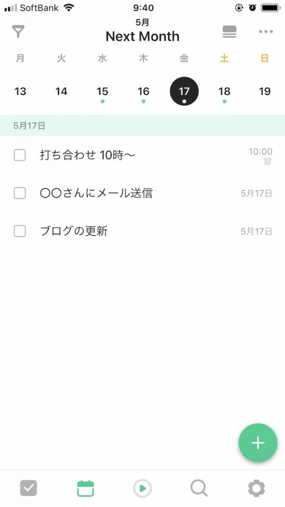
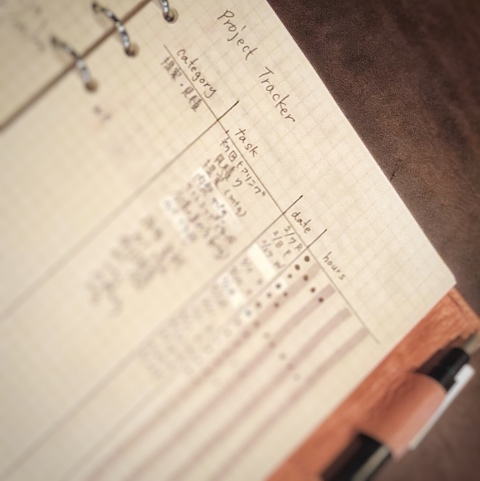
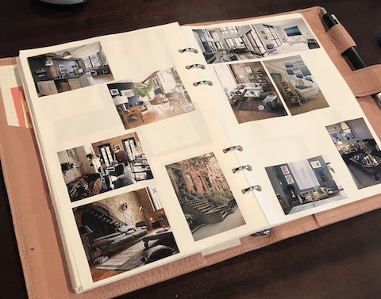
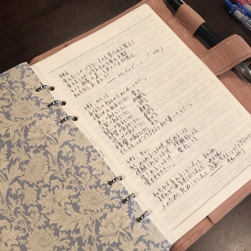
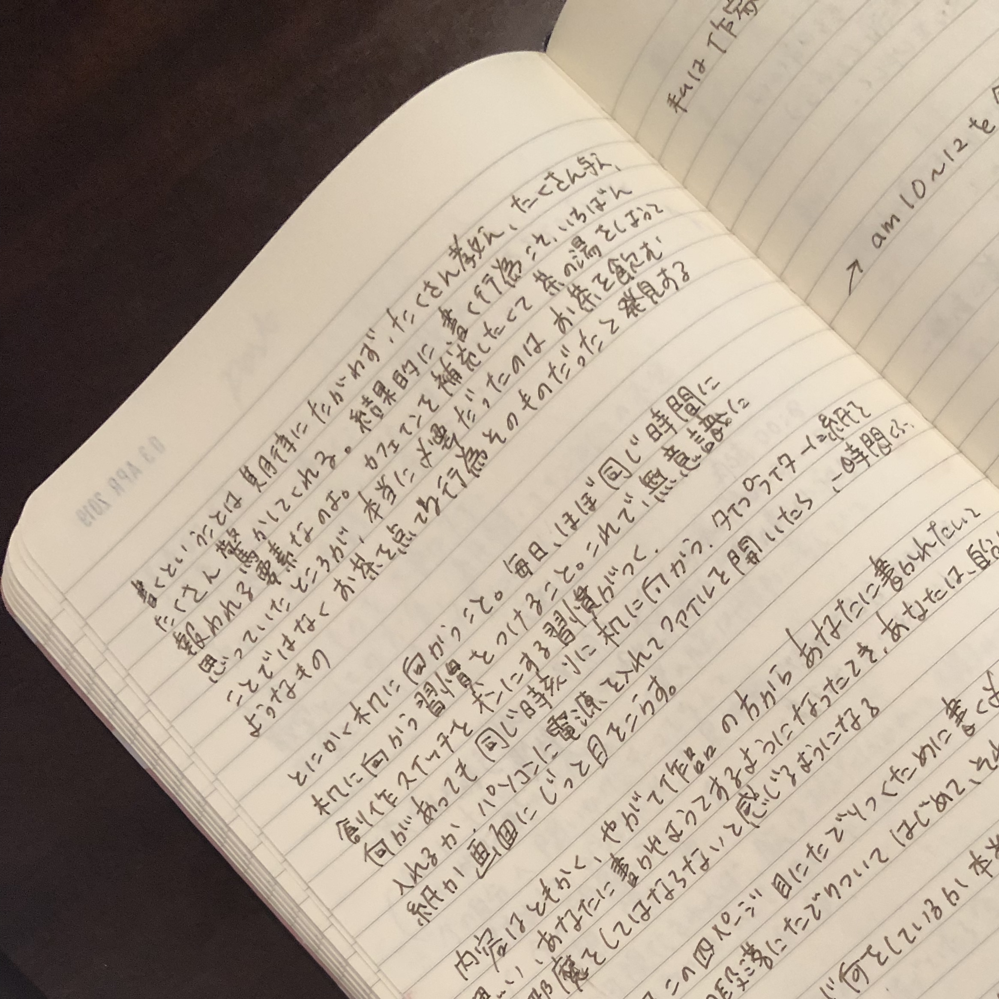
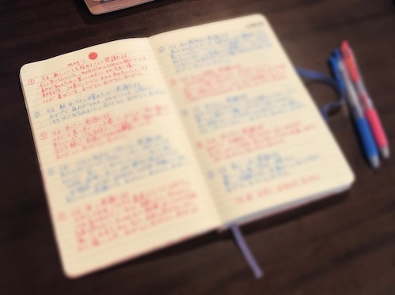

2019年は、システム手帳とA5ノート併用でいくことにしました。 システム手帳は数ヶ月〜1年以上、将来など先の長期的なスケジュールを管理するために使っています。 A5ノートは毎日のログを取るために使っています。

##システム手帳で年間の流れを見通す

 システム手帳は1年を通して使う情報を入れています。

* 月間スケジュール
* プロジェクトトラッカー
* 願いごとリスト
* お守り言葉

### ①月間スケジュール

 システム手帳には、かわいい月間スケジュールってないんですよね。 私は、フェリシモの付録でついてたスケジュールを分解して、穴空けパンチして、リフィルにしました♪

Todo管理アプリのTickTack

予定もTodoと同じように入れておいて、スマホだけ見れば予定調整できるようにしています。

### ②プロジェクトトラッカー

お仕事のスケジュール、作業の進捗、かかった時間を記録しています。これは、私自身がフリーランスとして活動する中で、安く値付けしてしまう問題があったから。 この作業ボリュームに対して、見積もりで出した価格が妥当なのかな？とか、お客様の満足に繋がってるのかな？とあとで、振り返るためにようにつけてます。

### ③願いごとリスト

夢が叶ったものにはスタンプやシールで飾ってお祝い。 実はけっこう自分が望んだことって叶ってるじゃんって思ったり。 ねがいごとカタログを眺めながら、好きなこと、心が踊ること、やりたいことを発掘して、自分の好きな世界観とか行きたい方向を思い描くヒントにしています

### ➃お守り言葉

人生の中で大切にしたい指針や、読むと元気がもらえる言葉を載せています。 私は平和の祈りや逆説の十ヶ条を挟んでますね。

### 【余談】マステで仕切りをデコ

 ウィリアムモリスのマステを買ったので、間の仕切りにしています！ A5の紙の両面にマステを貼って、システム手帳用の穴空けパンチで穴を開けて完成。

![マステで作った間仕切り] (20190425_06_masteb.jpg)

手触りもいいし、見た目も綺麗でお気に入り(*´ω｀*)

##【A5ノートには日々の記録を綴る】

 A5ノートは毎日開いて、1ヶ月に一冊使い切るようなペースです。

* 日記(考えたこと感じたこと)
* 本やブログで気になった文章をメモ
* 感謝ワーク

### ①日記のページ

 今日、思い浮かんだこと、感じたことを書いています。 頭がごちゃごちゃしたときには、問題を箇条書きにして、マインドマップ的に整理したり。 めっちゃムカつくー！😡とか落ち込んだ😖時には、ただ気持ちをノートに書き出しています。 もともと、私は嫌なことを我慢してしまうことが多くて、我慢した先に爆発することが多かったのですが、我慢を溜め込まなくなったかも。もちろん不快な感情は出てくるけど、書き出すと、何が嫌なのか自分で認識できます。何日も同じことを引きずってる時は、聞き上手さんに話を聞いてもらったり、どうやったら抜けられるかなと対策を考えたりできます。

### ②本やブログで気になった文章をメモ

本やブログを読んでいて、気になった文章を写経のようにメモります。

ノートは見開きで使っています。左側には、文章をそのまま書き写して、右側にはそこから自分が共感したこと、気づいたことなどを書いていきます。 移動中などノートを開けないときは、とりあえず気になった文章をスマホで写メって、あとで時間のある時にノートに書き写します。 いろんな文章をスクラップブッキングしていくと、ノートの中でメモった情報がリンクしていきます。 何回も似たようなことが書いてると、あ、自分にとって大事なことなんだなと気づいたりもする。

目標を掲げてがむしゃらになって、しんどくなった時に、**「今を楽しむ！ 」「数字は結果ではあるが、目的ではない。」**というようなフレーズが何度かメモった時がありました。

未来の成果ばかり追いかけて、過程そのもの楽しみを忘れていたと手帳にかきながら、ハッとしたのでした。

また、①と②を行き来すると、自分の興味があること、考えてることへのヒントがこのノートに詰まってるので、あとで、「あの時メモった文章と繋がるかも？」とひらめいたりします。

### ③感謝のワーク

ロンダ・バーンさんの「[ザ・マジック](https://amzn.to/2VpNIWq)」を読んでから、続けている習慣です。

簡単にいうと、10個の感謝を書くワークです。 今日の予定にありがとう。 出会う人にありがとう。 何かしてもらったことがあったらありがとう。 嬉しいことがあったらありがとう。 何もなければ身の回りにあるものにありがとう。(お水がある、お風呂に入れる、とかね）

はじめは機械的にやってたのですが、続けるうちに楽しくなってきました。このワークをやると気持ちが整うので、毎朝やることで、心地よく1日を始められるようになりました。

## 2019年の手帳のポイント

### 出来事よりも思いや考えを残す

今まではスケジュール管理って、予定やTODOの記録を目的にやってたんですね。そうすると、1年が終わって振り返った時に、それなりに忙しく過ごしたはずなのに、何があったのか思い出せない。

ただTODOをこなしただけのスケジュールが味気ないなぁと思ったのです。 2019年は、その時々の自分をもっと思い出せるように、思ったこと考えたことも記録しておこうと思いました。 月間スケジュールには、その月に大切にしたいことを書いて、どんな気持ちで取り組んでいたのか思い出すきっかけにしています。
例えば 今月はどうなったら楽しいかを考えてやってみる♡ 今月は好きなことをどんどんやってみる♪ また、嬉しいことがあった時には、隙間のマスにひとこと感想を入れたりするようにしました。 A5ノートへの毎日の日記も〇〇ちゃんとお茶した以上！で終わらせるのではなくて、

**どんな話をしたの？**
**それで、私はどう思ったの？(どう感じたの？)**
**なんで、そう思ったの？(そう感じたの？)** と、自分の気持ちを表現するようにしました。 自分の変化も見えるし、日々をちゃんと味わってるような感覚があります😁

### TODOは1日3つに絞る

森岡毅さんの「USJを劇的に変えたたった１つのやり方」という本の中で、こんな方法が紹介されています。

1日でやるべきことを片手を見ながら考える。

五本の指の中で、まず1番長い中指は、最も大事なことで100%のエネルギーを注ぐもの。
次に長い指の2本(人差し指、薬指)にあたるものを選び、これらは80%の力で取り組む。 残りの2本はやったことにする！他の人任せる！などして、上位３つのことに注力する。

3つを超えたら、何か捨てる必要があるぞと思いながら、予定を立てると、大事なことだけ、無理なく終わらせられるようになり、1日に余裕が持てるようになりました。

### 未来のストーリーを描く
これは実験的にやってるのですが、未来なりたい姿を想像して、そこに至るストーリーを妄想して、言葉にしています。 ざっくりいうと未来日記です。

私、目標を立てるのが嫌い。やりたいと思ったことが、だんだんやるべきになってしまうように感じてしまうから。 夢を描いても、計画したり目標設定してしまうと、なんか望みのために進むことがTODOになってしまう。そうすると楽しさやワクワク感が損なわれてしまう気がするんですよ。

> 戦略をストーリーとして考え、組み立てるということは、創造的で楽しい仕事です。
> それなのに難しい目標設定を与えられ、眉間にしわを寄せて戦略を考える人がなんと多いことか。戦略は嫌々考えるものではありません。自分で面白がれるからこそ努力でき、努力が持続するのです。
> ー 楠木 建「ストーリーと競争戦略」

夢も望みを描いて、未来の叶った姿を想像するのは楽しい。 同じように、夢が叶までのストーリーを自分が楽しめるような物語として描く。そうすると、日々のプロセスも俄然やる気が出てくる感じがするのです。 ま

## １年を味わいつくす手帳に。

長々と書いてきましたが、私にとって、手帳とノートは人生を味わうためのパートナー。 私の脳内をまるっと可視化したり、 気持ちをまるっと受け止めてくれたり、 未来への道しるべになったり、 ほんと、なくてはならない存在。 自分に合うようにカスタマイズしつつ、手帳を楽しみます。