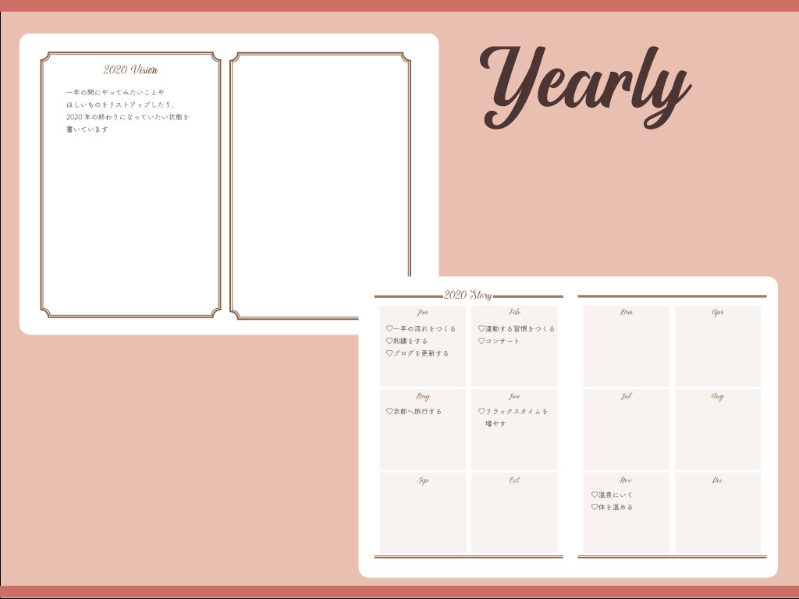
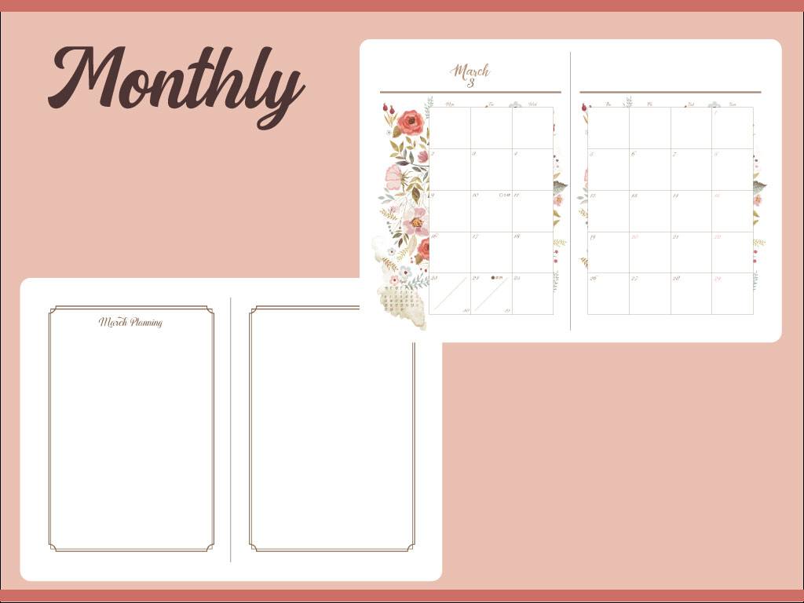
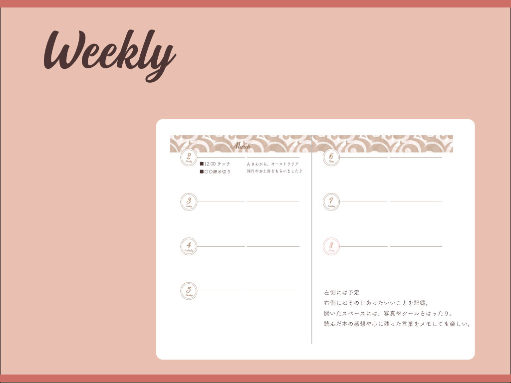
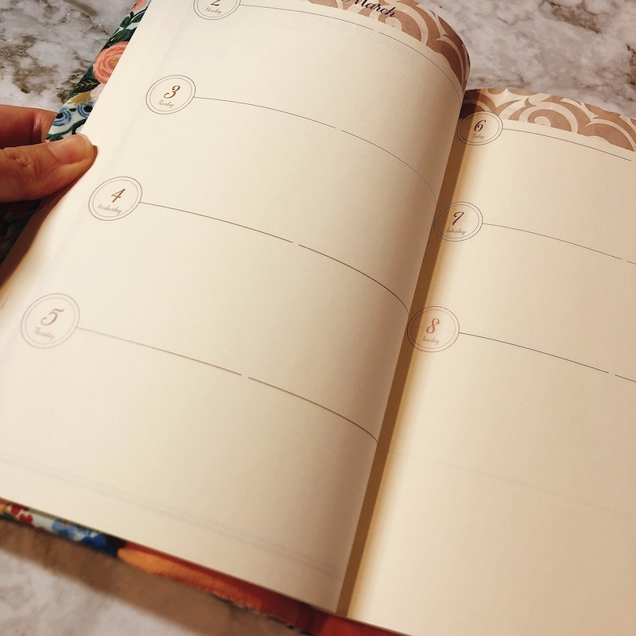
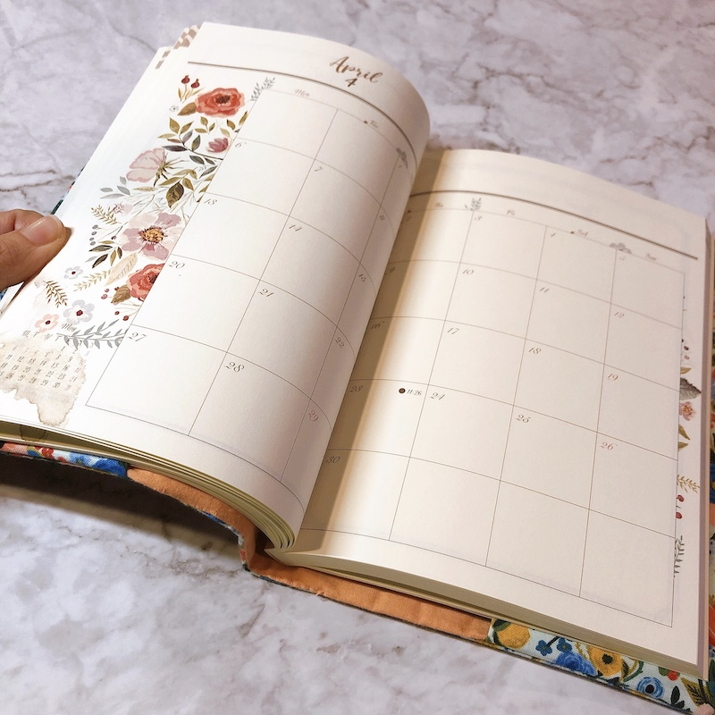
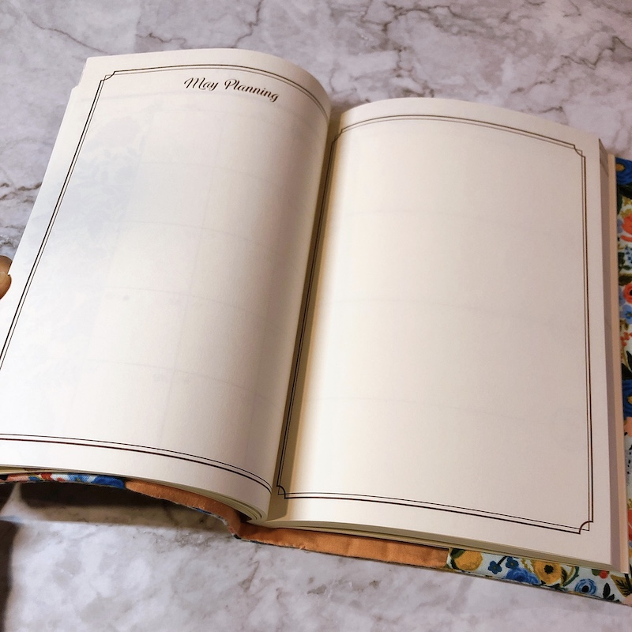
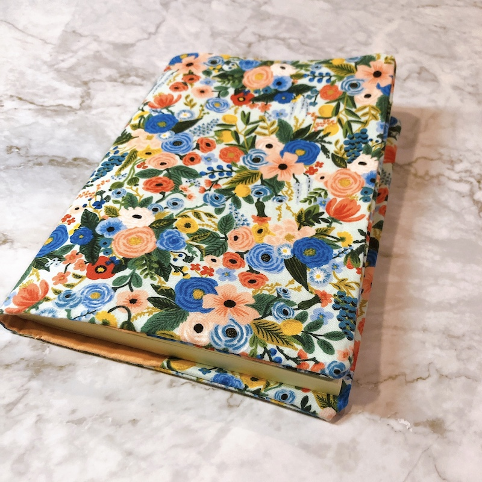
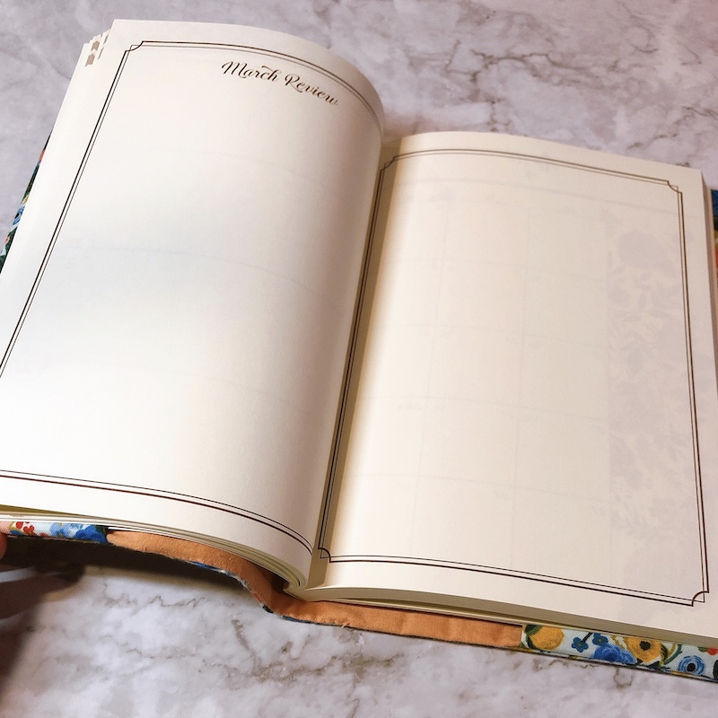

新しい年が始まりましたね。
今年を共に過ごす相棒、2020年の手帳を自作しました。

市販のものは、フリーページが少なかったり、使わないないページがあったりと、帯に短し、襷に長し。ちょうどいい手帳がない。それなら、自分好みのものを作ってみようと思ったのです。

年を重ねるにつれて、書く内容が変わってきました。
前は予定やTODOが並んでいたんだけれど、近頃は日記やらそのときにふと思った気持ちを書くことが増えてきたのです。

不思議と、そうやって気持ちにまつわることを綴ったほうが、充実感を抱きやすい。一年を終えた後に、こんなに楽しいことあったなぁ、私あのとき頑張ってたなぁと、その時の幸せに立ち戻れるように感じられます。

### YEARLY

年の初めに、一年の願い事を書くためのページを入れて、 一年が終わった後、こんな状態になったらいいなという展望を書いています。

そしてyear storyのページも。
この月にはこんなことができたらいいな、こんなことを意識したいことをメモ。
あとは占いをみて、この月はラッキー🤞というメッセージも書いてみたり。

春に種を撒いて、夏に成長して、秋に収穫、冬に成熟させるように、そんな一年の流れを書いていきます。

### MONTHLY

カレンダーと共に、 月の始まりにはvisionのページ、月の終わりにはreviewのページを用意しています。

Visionは、想像を膨らませて、予定をたてるページ。こんな月になったらいいな、月末にはこんな状態になってたらいいな、という未来予測を書いていています。

毎月の終わり、reviewページには、その月の思い出を書きます。こんなことができたなぁ、こんなものが手に入ったなぁと、書き連ねておく。あとでみた時に思い出しやすいし、もう一度楽しい気分にひたることができます。

### WEEKLY

20代は時間を無駄なく使うことに一生懸命で、数十分の合間に、どんな作業を行うかを手帳に記録していました。
ですが、ここ数年は時間軸を手帳に書く機会がめっきり減りました。

左側は、予定やTODOなどのスケジュールを書きます。多くしすぎないのがポイント。
1日の中で取り組みたいと思ったこと３つくらいがちょうどいいのです。

そして右側には日記を綴ります。こんなことがあって嬉しかったなぁ。 幸せだなぁ。良いこと、できたことを書いていきます。

 欄が空いた時は、写真をシールで貼ったり。
 何をしてたかを思い出せるように。

## できあがりはこんな感じに

製本直送.comという一冊から製本してくれるサービスを使って製本してもらいました。

色が黄色味があり、アンティークっぽい感じに。花柄の手帳カバーも作ってみました😊

素敵な年になりますように。

