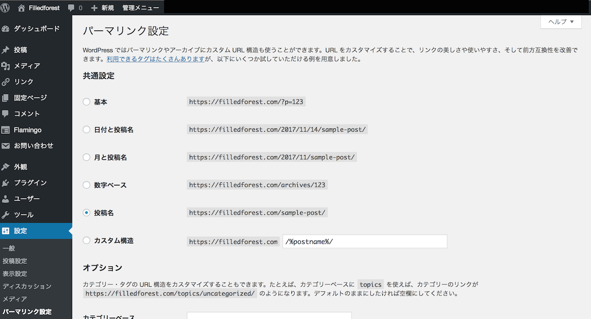
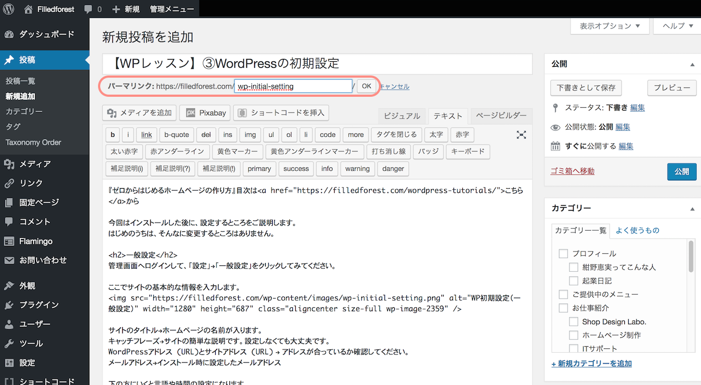
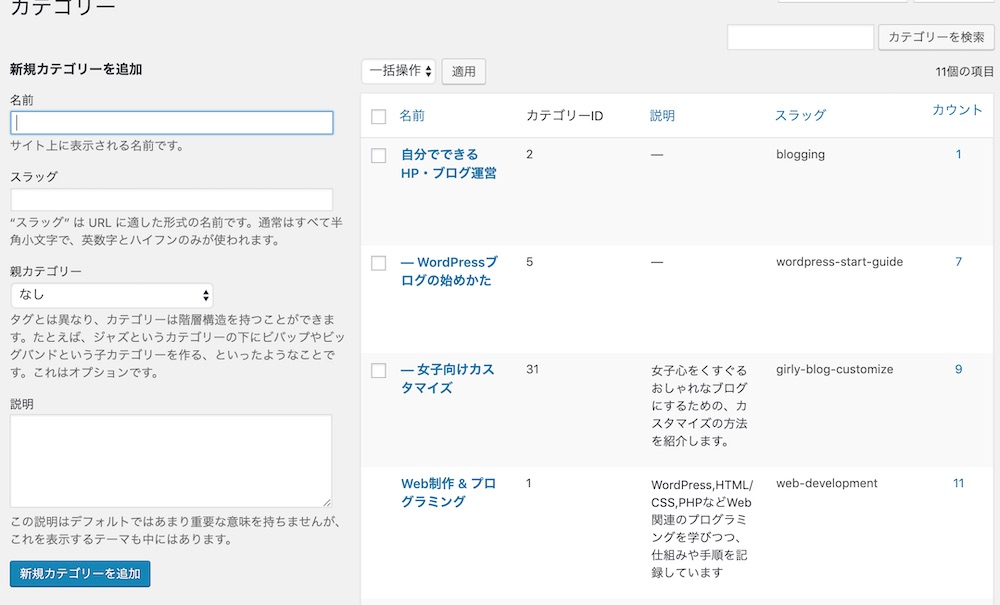

SEOを気にしてブログ運営をしていく方に知っておいていただきたいのが「パーマリンク」です。
WordPressでのパーマリンクの設定方法とポイントをご紹介します。

* パーマリンクって何？
* スラッグって何？
* パーマリンクってどう設定するの？

## パーマリンクって何？

パーマリンクとは、**各ページやブログ投稿それぞれのURL**のことです。

WordPressの初期設定では、記事のURLは「https://0forest.com/?p=123」になります。
これだと、なんの記事かよくわからないですよね。

ですが、この記事のアドレスバーを見ていただくと、「https://0forest.com/**about-permlink**/」になっていますね。

**permlink**の部分は、私が記事を投稿する時に設定しています。

Googleのガイドラインにも、URLはシンプルかつ人に分かるようなものに設定することが望ましいとされています。なので数字よりも、投稿の内容が分かるようにURLを設定するのが望ましいです。

パーマリンクの由来
パーマリンク（permlink）は「perm：永久・恒久的」な、「link:リンク」という意味です。ずっと変わらないURLだよということですね。
一度設定したら、変更しないように注意してくださいね。

## パーマリンクの設定

WordPressを最初に立ち上げた時に、パーマリンクの付け方を決めます。

管理画面のサイドバーから設定＞パーマリンク設定をクリックします。

おすすめの設定は「数字ベース」か「投稿名」です。どちらか好みの方にチェックを入れて、「変更を保存」ボタンを押してください。

数字ベースだと記事のURLが「https://○○○.com/記事ID/」になります。

「投稿名」にチェックを入れるとパーマリンクは「https://0forest.com/**投稿名**/」になります。

または、カスタム構造にチェックを入れて「**/blog/%postname%/**」としてもいいです。
その場合、「https://0forest.com/blog/投稿名」となります。

## 記事を書く時には

タイトル下にパーマリンクを入れる欄があります。この入力欄に記事の内容を簡単に示す単語を入れましょう。

投稿名だと記事のURLが「https://○○○.com/記事名/」になります。
デフォルトだと、日本語の記事タイトルがそのままURLに入ってしまいます。URLは英語の方がおすすめですので、投稿するときに、英語のURLに書き換えましょう。

スラッグを設定するポイント
パーマリンク（URL）の最後の文字列を「スラッグ」とよんでいます。

この記事の「https://0forest.com/about-permlink/」の「about-permlink」です。

①日本語ではなくて英語で書く 「inunokoto」「犬のこと」→「about-dog」
②複数の単語を使う時は間に「-(ハイフン)」を入れる。 「aboutdog」→「about-dog」
③シンプルに美しく 簡潔に短めのスラッグをつけると、記事URLも美しく分かりやすくなります。 固定ページにも同じようにスラッグを設定する欄があります。

### カテゴリーやタグにもスラッグを設定する

カテゴリーやタグについてもスラッグを設定します。
このスラッグはカテゴリーの記事一覧、スラッグの記事一覧の時のURLで使われます。

投稿＞カテゴリーの設定画面で、カテゴリーのスラッグを設定しましょう。

投稿＞タグ画面でも、各タグについてスラッグを設定できます。

### 注意点！パーマリンクは一度決めたら変更しないでね

パーマリンクは一度設定したら変えないようにしましょう。

記事のURLが変わってしまうとデメリットしかないのです…😖

* 過去のURLでブックマークしていたり、シェアされたいたときに、ユーザーさんがその記事へアクセスできなくなってしまう
* googleなどの検索エンジンから、別の記事だと認識されて、検索順位などの評価がリセットされてしまう
 私は、ブログをはじめたときにパーマリンクを「/category/投稿名」となるように設定していたのですが、後からカテゴリの構成を変えた時に、URLが大きく変わってしまうという失敗をしました^^;

## パーマリンクのまとめ

* パーマリンクは各ページや記事のURLのこと。
* 設定画面のパーマリンク設定から基本のパーマリンクのつけ方が決められます。
* 投稿する際に、URLの最後に入れる文字列（スラッグ）を設定できます。
* シンプルな英語で入力してみてね。 一度設定したら変えないことが大事！

