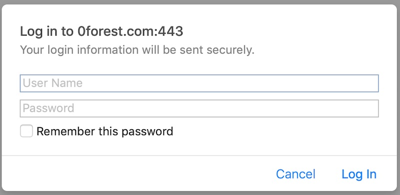
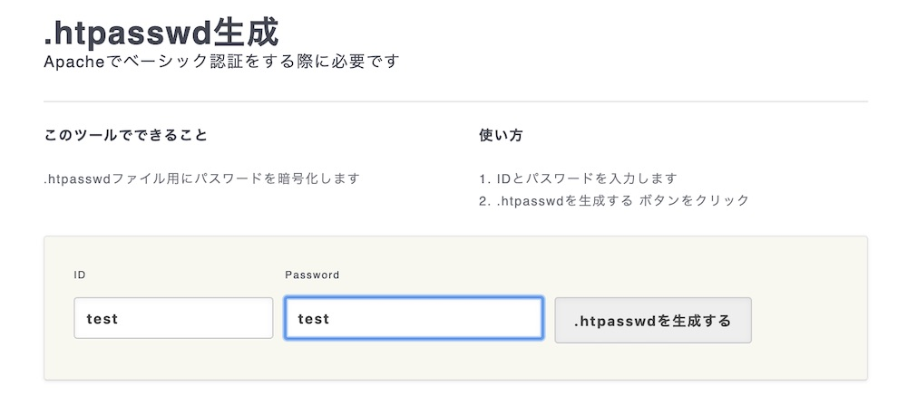
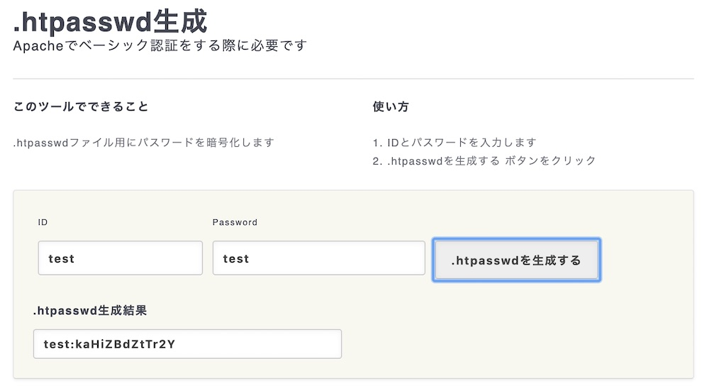
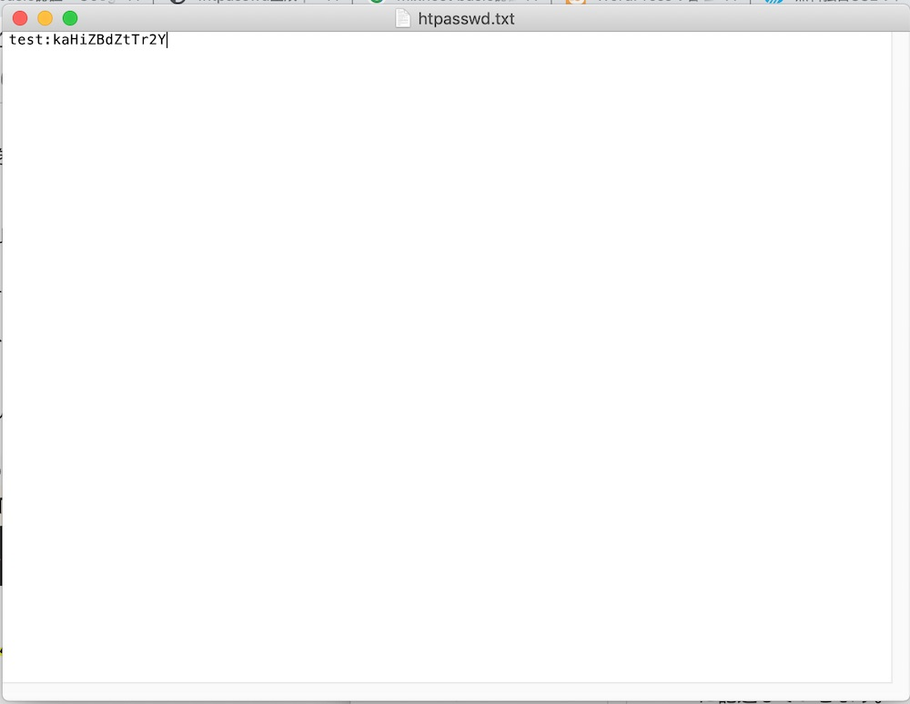
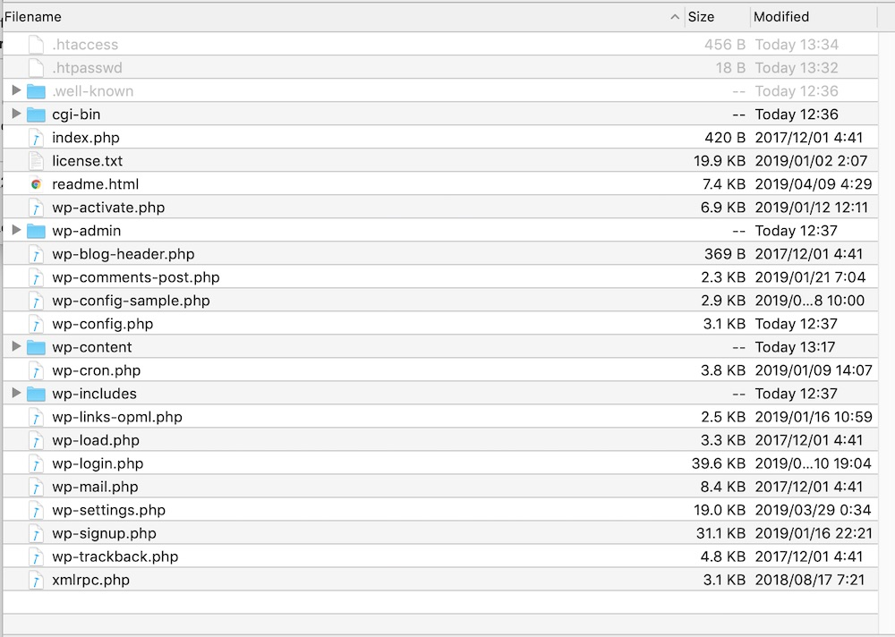
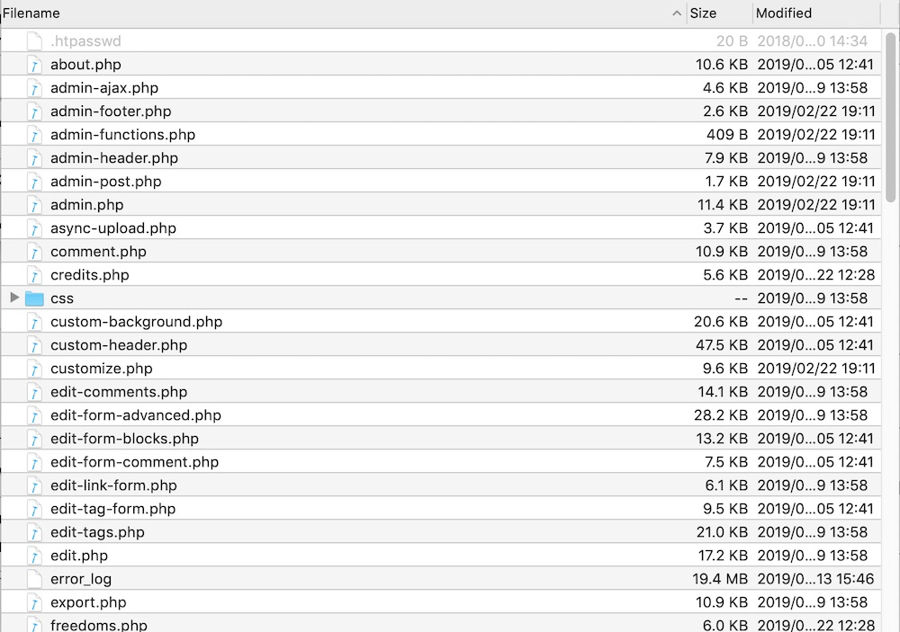
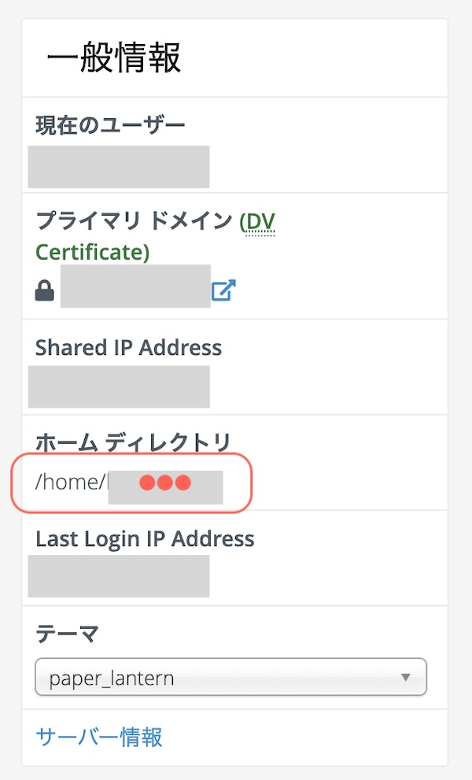

Basic認証とはIDとパスワードを知っている人だけがサイトへのアクセスできるようにする仕組みのこと。

Basic認証がかかっているサイトにアクセスすると、こんなポップアップ画面が出てきます。


このBasic認証を使って、WordPressサイトにも簡易的にパスワード設定することができます。

【Basic認証の用途】
* 公開前のサイトにパスワードをかける
* 管理画面にパスワードをかける
* 秘密のサイト／ページにパスワードをかける（購入者様限定のダウンロードページなど）

この記事ではWordPressのサイト全体と管理画面にパスワードをかける方法を紹介していきます。
いっつも忘れちゃうので、自分の備忘のために、まとめておきました😀

## .htpasswdの設定

Basic認証を設定するには、「.htaccess」「.htpasswd」という２つの隠しファイルを作って、サーバー上のサイトのディレクトリに置きます。

.htpasswdはIDとパスワードを記述したファイルです。
.htaccessはBasic認証の設定とパスワードファイル（.htpasswd）の場所を指定するためのファイルです。

### パスワードを作る

 まずはIDをパスワードを決めます。
パスワードはそのままだと、すぐにわかってしまうので、暗号化します。

パスワード生成サイトにアクセスします。

パスワード生成サイト
 * [.htpasswd生成 | ベーシック認証用のパスワードを一発作成 | すぐに使える便利なWEBツール | Tech-Unlimited](https://tech-unlimited.com/makehtpasswd.html)
 * [.htaccess ファイルを簡単作成「.htaccess Editor」](http://www.htaccesseditor.com/#a_basic)
 * [htpasswdファイル生成(作成)](http://www.luft.co.jp/cgi/htpasswd.php)

今回は一番上を例にしています。

お好みのIDとパスワードを設定します。



.htpasswdを生成するボタンを押すと生成結果にコードが出てきます。


### htpasswd.txtを作る
生成したコード（ここでは「test:kaHiZBdZtTr2Y」）をテキストファイルの本文にコピペします。

ユーザー名→test
パスワード→kaHiZBdZtTr2Y



このときファイル名は「htpasswd.txt」で保存します。

なお、各IDについてパスワードを設定できます。行ごとにIDとPASSの組み合わせを記述します。

### .htpasswdをWebサーバーにアップロードする

Webサーバーにアクセスして、WordPressをインストールしたディレクトリを開きます。

サイト全体に認証をかけたい場合は、 WordPressをインストールしたディレクトリの直下に.htpaswdファイルを置きます。



管理画面に認証をかけたい場合は「wp-admin」の直下に「htpasswd.txt」をアップロードします。

 ファイル名変更（Rename）します。

「htpasswd.txt」から拡張子「.txt」を外して、最初に「.」を足して「.htpasswd」にします。

これでパスワードの設定は完了。

## .htaccessを作成する

### .htaccessの記載内容

.htaccessに記述する内容を準備します。
テキストエディタなどでメモをしておいてください。

サイト全体に設定する場合
```
AuthUserFile /home/●●●/public\_html/0forest.com/.htpasswd AuthName “Please enter your ID and password” AuthType Basic require valid-user 管理画面に設定する場合

<Files wp-login.php> AuthUserFile /home/●●●/public\_html/0forest.com/wp-admin/.htpasswd AuthName "Please enter your ID and password" AuthType Basic AuthGroupFile /dev/null require valid-user </Files>
```

設置するサーバーの環境によって、設定が変わります。

●●●の部分は、サーバーのホームディレクトリになります。
0forest.comはWordPressインストールしたフォルダ名に。



Mixhostでホームディレクトリを確認するには、Cパネルにログインして右側の一般情報欄にホームディレクトリのURLがあります。


AuthType 認証方式の設定「Basic」と書きます
AuthName 認証時に表示される文章を記述
AuthUserFile ホームディレクトリから.htpasswdの置き場所をフルパスで記述
require valid-user（全てのユーザー）に対して設定

### .htaccessをサーバーにアップロードする

サーバーを操作する前に「.htaccess」のバックアップをとっておきましょう。（間違った操作をすると真っ白になって胃しまうので。）

.htaccessを置く場所は、WordPressをインストールしたディレクトリ配下です。


すでに.htaccessファイルがある場合は、上のコードを追記します。

.htaccessファイルがない場合は新しく「.htaccess」を作成します。
テキストファイル「htaccess.txt」に上記コードを記述して、アップロードしてから、ファイル名を「.htaccess」に変更するとやりやすいです。


実際に、IDとパスが設定できているか確認してみてくださいね。

うまく動かない時は、以下を間違えてることがほとんどですのでチェックしてみてください。

* ファイル名（.htaccess、.htpasswd）
* .htaccessとhtpasswdファイルの置き場所
* .htaccess内のAuthUserFileで記述したパス


以上、ベーシック認証のやり方でした。
