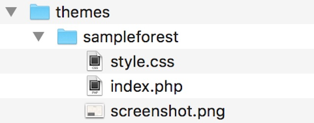
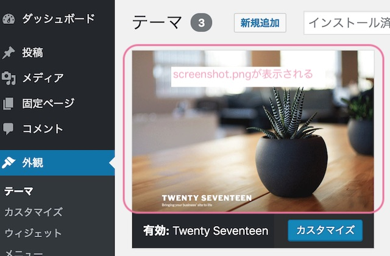
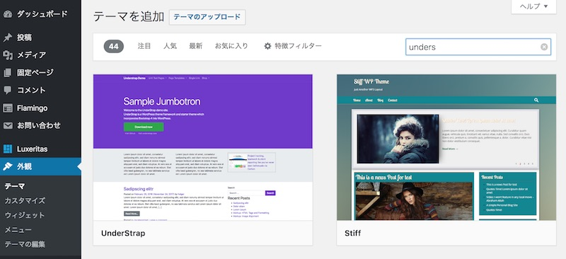
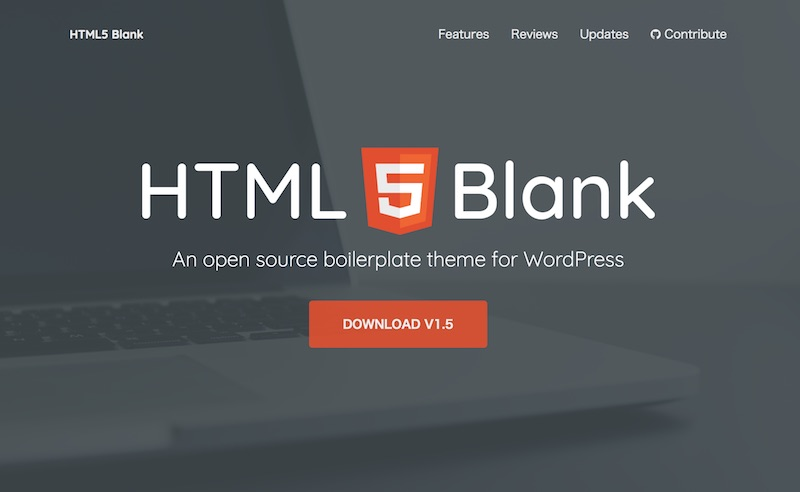

ゼロからテーマを用意するのは大変。 ブランクテーマには、基本のテンプレートが揃っているので、作り始めをスピードアップしてくれます。 お客様からテーマ作成を依頼された時に、私はよくブランクテーマを使います。 この記事では、テーマの骨組みの作り方とブランクテーマをご紹介します。

## WordPressテーマに必要な3つのファイル

ブランクテーマを使う前に、まずは基本のWordPressテーマの骨組みを紹介します。

テーマに必要なファイルはこの３つです。
 * style.css
 * index.php
 * screenshot.png

フォルダにこの３つのファイルをいれます。 フォルダ名はテーマ名がわかるようにしてあげてください。



### style.css

テーマの情報をstyle.cssに書くことで、WordPressがテーマを認識してくれます。 サンプルとして以下のように書きましょう。
```
/*
Theme Name: SampleForest
Theme URI: https://0forest.com
Author: Emi
Author URI: https://0forest.com
Description: This is my original theme Version: 1.0
*/
```

ご自身の作りたいテーマの内容に変更してくださいね。
Theme Name：テーマの名前
Theme URI：テーマの配布元のURL
Author：製作者の名前
Author：製作者のURL Description:テーマの説明

#### index.php


 「index.php」にはなんでもいいのですが、
 ```markup
  <html>
    <head>
        <title><?php bloginfo('name'); ?></title>
    </head>
    <body> 空のWordPressテーマ。 </body>
</html>
```

`<?php bloginfo('name'); ?>` でブログのタイトルが表示されます。


### screenshot.jpg
WordPressの管理画面からテーマのイメージとして表示される画像です。 テーマのスクリーンショットの画像やイメージ画像を入れます。 サイズは横880px×縦660pxが推奨。




## 初めての方は、ブランクテーマを使う

一から骨組み用にファイルを作るのは不便ですよね。
実は世の中にはブランクテーマ（デザインなどの装飾がされてない、カスタマイズ前提の骨組みだけのテーマ）が配布されています。ブランクテーマをベースにカスタマイズをすると早いですよ。

### ブランクテーマとは？

ブランクテーマとは、一言でいうと空のテーマ。 装飾などが一切されていない、基本のテンプレートファイルがセットになっています。 デザインを変更したり、必要な機能を追加すればテーマができあがります。 私もテーマ開発に必要なファイル構成やWordPress用の関数の書き方はブランクテーマを紐解くことで学びました。 プログラムを０から書くより簡単だし、時間も短縮になりますよ。


私がよく使うのはこの２つ。


[understrap](https://understrap.com/)


[html5blank](http://html5blank.com/)

この記事では、WordPressのテーマの骨組みと、おすすめブランクテーマについて紹介しました。 テーマ作成の参考にしてくださいませ。
