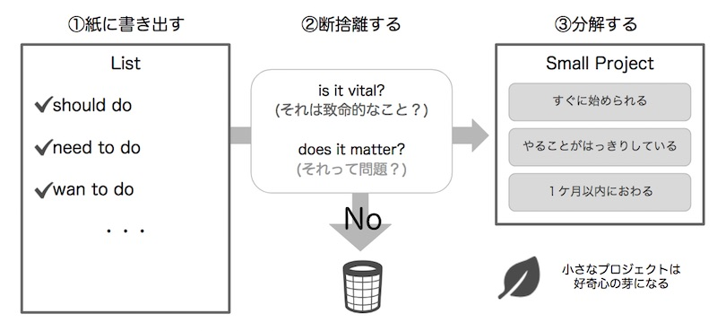

いろいろな手帳術のアイデアが世の中にはあるけれど、 レットジャーナルの基本はその名の通り「・（中点：バレット）」が並んだシンプルさ。

バレットジャーナル 考案者のTEDトークを見ていて、そのコンセプトには「断捨離（＝大切なものを選ぶ）」に通じるものがあるなと思いました。

## 大切なものに意識を向ける〜バレットジャーナル考案者のTEDトーク〜

 [バレットジャーナル の考案者Rydar CarollさんのTEDトークを聞きました。](https://www.youtube.com/watch?v=ym6OYelD5fA)

Rydarさんのメッセージは「**自分にとって本当に大切なものに集中してね**」。
彼は、子供時代にADD（注意欠陥障害）で、いろんなことに意識が向いてしまい、１つのことに集中するのが難しかったそうです。
２５年かけて、自分にあったやり方を試行錯誤して、バレットジャーナルを編み出しました。 彼はどう大切なものに意識を向けていくのか、３つのステップでお話ししてくれていました。

* 頭の中にあるものを書き出して考えるスペースを作る
* 本当に大事なもの以外は断捨離する
* 明確で１ヶ月以内に終わる小さなプロジェクトに分解する

バレットジャーナル って、単なるログの手法じゃなかったんですね。
断捨離の思想の上に成り立ってたんだ。。。 私は意識が発散しがちで、洗濯機に洗濯物を入れてる途中で、思い出して、メールを一本書き始めたりします。 他のことで目の前を忙しくさせて、本当に大事なことを後回しにしちゃう。 すると、自分が一歩一歩進んでいる感覚がなかったり、１日の充実感を感じられなかったりするんですよね。

## エッセンシャル思考も同じことを言ってた

「[エッセンシャル思考](https://www.amazon.co.jp/dp/B00QQKCV6E/ref=dp-kindle-redirect?_encoding=UTF8&btkr=1)」のメッセージも同じ！
エッセンシャル思考は「**重要なものだけ選び、他は捨てましょう**」がコンセプト。
重要なものはめったにない。
あなたにとって重要なものを選びましょう。（そうでないものは捨てましょう） あなたの限られた時間とエネルギーを、もっと大切なことに注ぎましょう。

本では、大事なことをどう見極めるか、具体的な手法が話されています。

何かを選ぶと、同時に何かを捨てることになる。 何を捨てるかを考えることは、本当は何が大事か見極めることに同じ。 自分の中で取捨選択することにエネルギーと時間をかけましょう。

## 手帳・ノート術を続けるために私が断捨離したこと

 私も断捨離のコンセプトにならって、バレットジャーナルを書く上で自分にとって余計なものを削ぎ落してあげることに。

* おしゃれなイラストは飾りはなくていい

 イラストが描けたり、文字を飾るの本当に憧れるんですけどね。 SNSのバレットジャーナル写真はほんと目の保養。 でも、私は華美な装飾をページにいれると難しいし、続かないので、シンプルでいいやと思います。

* ページ番号や目次はつけない
バレットジャーナルではページ番号をふって、索引を用意します。
私の場合、１冊終わったら、あとで見返したいページだけスマホ撮影してEvernoteに入れるので、ノート上で検索しないんですよね。

* アイコンは３つに絞る

Indexを毎回見返すのも面倒なので、よく使っていて、覚えられるものだけに絞りました。笑。

◯：ToDoや予定

“：本や人の話。インプットしたこと

・：その他メモ

* Todoやイベントは優先順位を３つに絞る

ToDoリストやその日をやることををただ並べるのはやめました。 その日の予定を消化して１日がすぎるだけになっちゃうので。 「その日大事なことTOP3」と色付けして、その日のハイライトを分かるようになりました。 おかげで、タスクやスケジュール管理はシンプルに。 創造的な時間のためにノートを使えるようになりました。 その日に何を知って、考えて、感じたかを自分の言葉で大切に記録したい。 あとで振り返って、自分の成長を感じられるし、そのときの感覚を思い出せるようなノートにしようと思います。

## Less is more
> It’s only by saying no that you can concentrate on the things hat are really important. （その他にNoということだけが、本当に大事なことに集中させてくれる。） — Steve Jobs.

バレットジャーナルの嬉しいところは、書き方が簡単で、好きなところだけ取り入れられる自由度の高さだと思います。 自分なりのシンプルなやり方に的を絞って、ノートを楽しんで続けてくださいね。
