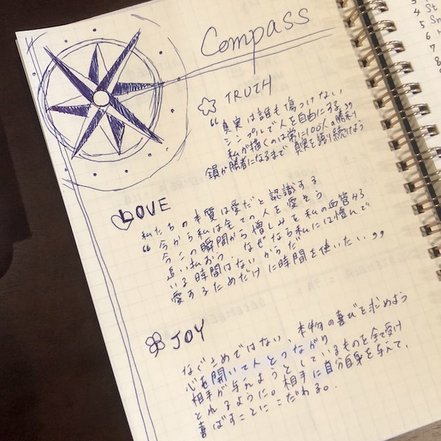
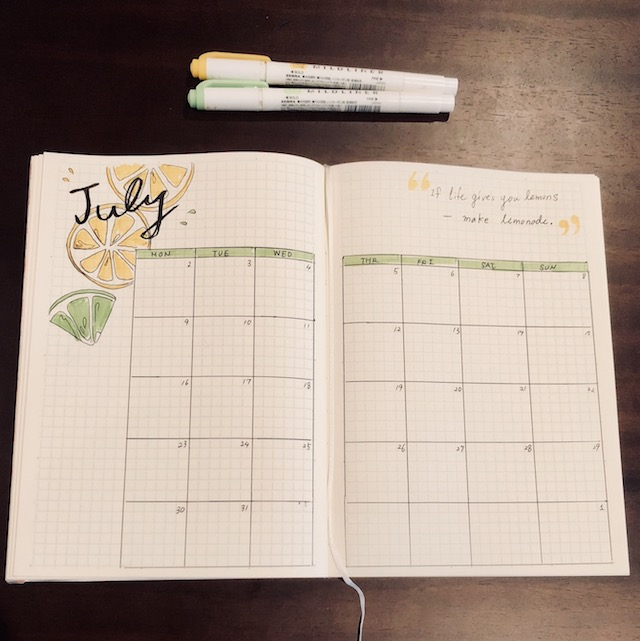
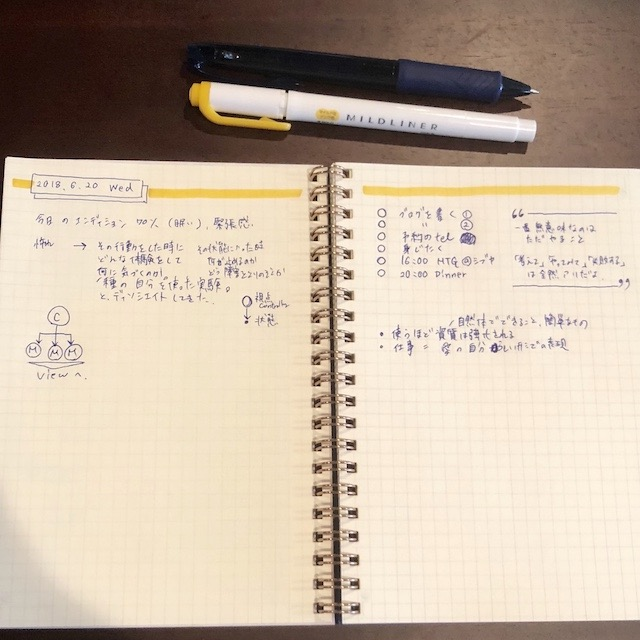
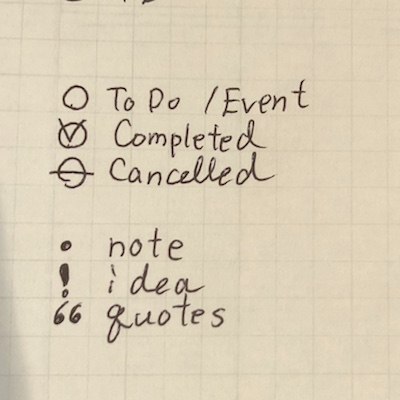
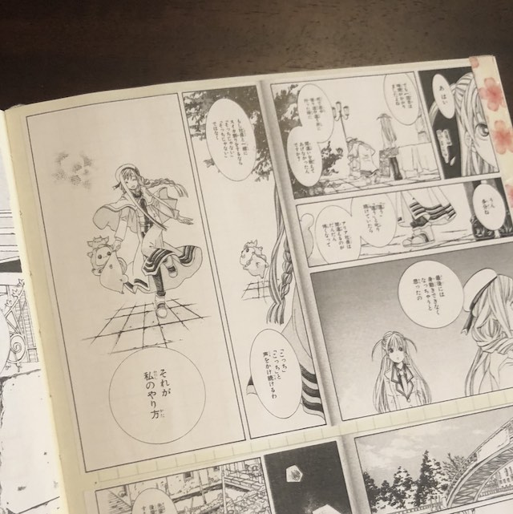

最近、少しずつ知名度が出てきた、バレットジャーナル。 興味はあるけど、どうやって使ったらいいの？ そんな方のために、私流のバレットジャーナルの使い方を紹介します。

私はもともと手帳が大好き。
はじめはネットに転がっている Moleskingの絵日記や、ほぼ日手帳のページ、 海外のArt Journalを写真を眺めてはニヤニヤしていました。
細かいイラストを描いたり、綺麗な文字も書けないけれど、シンプルなバレットジャーナルなら、私にもできそう！

## Bullet Journal（バレットジャーナル）とは？

 バレットジャーナルのバレットとは箇条書きの「・」の意味。 海外のデザイナーRyder Carrollさんが 子供時代に学習障害を持っていたことをきっかけに考案したという手帳術です。 箇条書きと記号のみを使った管理術は、シンプルで使いやすく、自分流にカスタマイズできるのがメリット。 飽き性の私でも、現在、２年続いています。

### バレットジャーナルを使ってよかったこと

①決断が早くなった あれもこれもやらなきゃ！って迷ってしまうのを洗い出せるので、今、何にフォーカスするのか、優先順位を決めやすい。

②脱：手帳難民 ぴったり自分の用途に合う手帳ってなかなか見つからなかったりしませんか？
個人的には、日本のノートは機能が多すぎて、使いこなせないんですよね。 ウィークリーでは余白が足りなかったり、デイリーだと毎日かかなかったりして一長一短だなぁと思います。 バレットジャーナルは必要な分だけ書けるのが楽。無駄がないです。

③他のノート術との相性がいい。
世の中にはいろんなノートの書き方、手帳術、管理方法がありますよね。 バレットジャーナルなら、どのページに、何を、どんな風に書くのか自由自在。 他のノートの書き方と併用できます。 私は、スマートノート、マインドマップというノート術と一緒に使っています。
愛用者さんは、睡眠ログ、習慣トラッカーなどのページを入れてる人もいますね。 一つの書き方を試して、数日でやっぱ、や〜めたって変えられます。 毎月セットアップを組み替えたりして、自分に合うようにカスタマイズしてるみたいです。 一言で言うと、好きなノート一冊あれば良い。わけです。

④クリエイティブになれる

pinterestで海外のバレットジャーナルのアイデアがたくさん紹介されています。 中にはおしゃれなノートの書き方を動画で紹介されていたりするので、 他の人のアイデアを簡単に取り入れやすいです。 よかったら、[bullet journal]とか[bujo]で調べてみてくださいね。

### バレットジャーナルの始め方

必要なものは好きなノートとペン。 やり方は簡単３ステップです。

* ノートの中で使うアイコンを決める
* ３種類の予定（年、月、日）のページを用意する
* アイコンに従って、イベントやtodoを記録する
  えっ？説明が雑？？ では、詳しい使い方はBullet jornal本家の動画をどうぞ。

  [[How to Bullet Journal - YouTube](https://www.youtube.com/watch?v=fm15cmYU0IM)]

## 私はこんな風に使っています

### Compass 〜指針となるページ〜

新しくノートを開いたら、最初に書くページ。 どういう人でありたいか、人生で大切にしたいことを書いています。

### Future Log

（前のノートを捨ててしまい、写真がなくてごめんなさい。。。 また新しく作った時に追記します。＾＾；）

①向こう３年くらいの過ごし方（野望）を書く ロングスパンの予定はその通りにならなくてもいいので、ゆるーく。 そのうち人生の中継地点として、立ち寄ろう。くらいの心持ちで書いています。

### Monthly Log
毎月のおわりに、次の月の月間スケジュールを作ります。

その月のモチーフとテーマカラーを決めていて、７月はレモン&ライムで黄色と緑色にしてみた。

### Daily Log

毎日書いていくページ。１日見開きでページを使います。

### 番外編：見たら元気が出るページ

思いついた時に、見てて楽しくなるページを入れています。
例えば
 * グッときた文章を写経する
 * 人から褒めてもらったり、感謝してもらったメッセージをメモしていく
 * 将来こういうことできたら嬉しいな、という夢を書く
 * 好きな漫画のお気に入りのページを貼り付ける

## まとめ
 バレットジャーナルは、とってもシンプルなノート術。 自分の嗜好に合わせて、いかようにでもアレンジできちゃいます。 気軽にお試しくださいね。 そして、私は、いろんな使い方をしているノートを見ては、ムフフとしています(*´꒳`*)