記事を書く時に、他のホームページやブログの文章を一部紹介したいことって、けっこうありませんか？ ただ、ブログテンプレートに使われているオリジナルの味気なかったりする。

コピペで使えるCSSのサンプルを５つ用意しました。

ブログやWordPressで引用符（blockquote）デザインを変える方法をご紹介します。

HTMLとCSSのコピペで使えるので、ぜひご活用ください。

## 引用文の基本〜読者にわかるようなデザインにする〜

Webで文章を引用をする際には著作権のルール上、他の分と区別して、「これが引用文だよ」っとわかりやすくために表現する必要があります。 お使いのブログエディターの「”（引用符マーク）」ボタンを探してみてくださいね。

### 【HTML】blockquoteとciteの書き方

`<blockquote>`というタグを使います。
タグで囲んだ文章は引用・転載文だと、読者にも検索ロボットにも伝えることができます。

```markup
<blockquote cite="引用元URL">
    <p>引用文</p>
    <cite>引用：<a href="引用元URL">引用元の記事タイトル</a></cite>
</blockquote>
```

## WordPressで引用デザインを変える方法

ここではCocoon（親テーマCocoon, 子テーマCocoon childを使用）を例に説明しますね。

外観＞テーマ編集にいきます。

CSSのコードはstyle.cssに書かれていることがおおいです。 （テーマによって、どのCSSファイルに書かれているか変わることがあるので確認してみてください。）

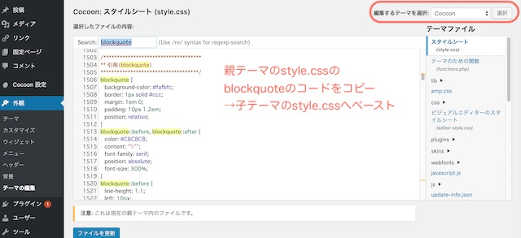

一式をコピーして、子テーマのstyle.cssにコードを貼り付けます。

このコードを書き換えればOK！！

### 引用符にFont Awesome（Webフォント）を使う方法

今回のデザインでは、引用符「“」と「”」にWebフォントのFontAwsomeを使っています。 Webフォントを使うと機種によって文字の表示がブレずに、引用符のマークが綺麗に表示できます。 FontAwsomeを使う場合は、

以下のように`<head>~</head>`内に、FontAwsomeの読み込みコードを貼り付けてください。

```markup
<head>
    <link href="https://maxcdn.bootstrapcdn.com/font-awesome/4.7.0/css/font-awesome.min.css" rel="stylesheet">
</head>
```

### Webフォントなしで引用符の記号を使う場合

Webフォントを使わずに引用符の記号を使うこともできます。
その場合はコードの以下の２行を

```css
font-family:'FontAwesome';
content:'\f10d';
```

↓に変更してください。（「\f10d」は、「“」のことです）

```css
content:'“';
```

また、このコードの以下の２行も同じように

```css
font-family:'FontAwesome';
content:'\f10e';
```

↓に変更してください。（\f10eは、「”」を示しています。）

```css
content:'”';
```


※Webフォントに適したサイズや余白に設定しているので、文字を変えた場合は表示がずれてしまうと思います。
padding（枠内の余白）やfont-size（文字の大きさ）を調整してくださいね。

## 引用(blockquote)のCSSデザインサンプル

引用文のCSSデザインを紹介していきます。 中の文章はいろんな名言を使っていますが、どれもこちらのHTMLをベースにしています。

```markup:title=HTML
<blockquote>
    <p>引用文</p>
    <cite>引用：引用元の記事タイトル</cite>
</blockquote>
```

### 左にラインと引用符をいれる

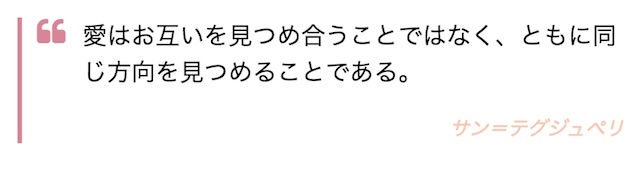

```css:title=CSS
blockquote{
    position:relative;
    border-left:3px solid #DA8596;
    padding-left:10px;
}
blockquote:before{
    position:absolute;
    font-family:'FontAwesome';
    content:'\f10d';
    font-size: 20px;
    color:#DA8596;
}
blockquote p{
    position:relative;
    padding-left:30px;
}
blockquote cite{
    display: block;
    font-size:0.8rem;
    color:#F8C8B2;
    text-align:right;
}
```

### 左に２本ライン

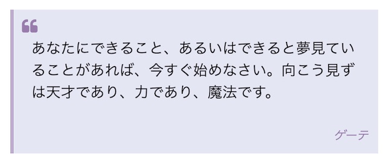

```css:title=CSS
blockquote{
    position:relative;
    border-left:3px double #997bad;
    padding-left:10px;
    background:#e5e6f4;
}
blockquote:before{
    position:absolute;
    font-family:'FontAwesome';
    content:'\f10d';
    font-size: 18px;
    color:#997bad;
    padding-top:10px;
}
blockquote p{
    position:relative;
    padding: 30px 10px 0px;
}
blockquote cite{
    display: block;
    font-size:0.8rem;
    color:#997bad;
    text-align:right;
    padding:10px;
}
```

### ボックスの左上と右下に引用符をつける

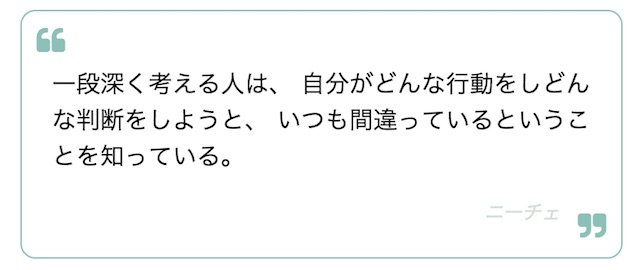

```css:title=CSS
blockquote{
    position:relative;
    border:1px solid #8BC0B8;
    border-radius:10px;
    padding:20px;
}
blockquote:before{
    position:absolute;
    font-family:'FontAwesome';
    content:'\f10d';
    font-size: 20px;
    color:#8BC0B8;
    top:10px;
    left:10px;
}
blockquote:after{
    position:absolute;
    font-family:'FontAwesome';
    content:'\f10e';
    font-size: 20px;
    color:#8BC0B8;
    right:10px;
    bottom:10px;
}
blockquote cite {
    display: block;
    font-size: 0.8rem;
    text-align: right;
    color: #D4DED7;
    padding-right:20px;
}
```

### 左右のラインと、左上と右下に引用符

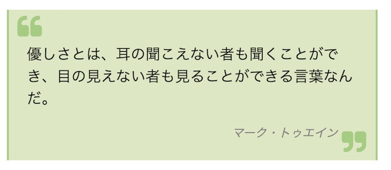

```css:title=CSS
blockquote{
    position:relative;
    border-left:2px solid #A5CC80;
    border-right:2px solid #A5CC80;
    padding:20px;
    background:#DDE8C2;
}
blockquote:before{
    position:absolute;
    font-family:'FontAwesome';
    content:'\f10d';
    font-size: 28px;
    color:#A5CC80;
    top:5px;
    left:10px;
}
blockquote:after{
    position:absolute;
    font-family:'FontAwesome';
    content:'\f10e';
    font-size: 28px;
    color:#A5CC80;
    right:10px;
    bottom:5px;
}
blockquote cite {
    display: block;
    font-size: 0.8rem;
    text-align: right;
    color: #808080;
    padding-right:20px;
}
```

### 上下のラインに引用符をつける

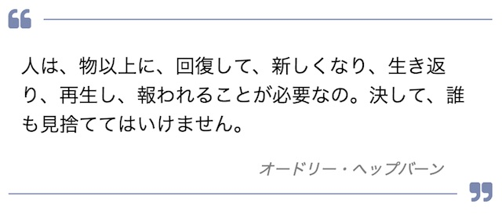

```css:title=CSS
blockquote{
    position:relative;
    border-top:1px solid #7A87B0;
    border-bottom:1px solid #7A87B0;
    padding:10px;
}
blockquote:before{
    position:absolute;
    background-color:#FFFFFF;
    color:#7A87B0;
    font-family:'FontAwesome';
    content:'\f10d';
    line-height:1;
    text-align:center;
    top:-20px;
    left:-10px;
    padding:10px;
    font-size:20px;
}
blockquote:after{
    position:absolute;
    right:-10px;
    bottom:-20px;
    background-color:#FFFFFF;
    padding:10px;
    color:#7A87B0;
    font-family:'FontAwesome';
    content:'\f10e';
    line-height:1;
    text-align:center;
    font-size:20px;
}
blockquote cite {
    display: block;
    padding-right:30px;
    font-size: 0.8rem;
    text-align: right;
    color: #808080;
}
```

### 引用符を丸で囲む

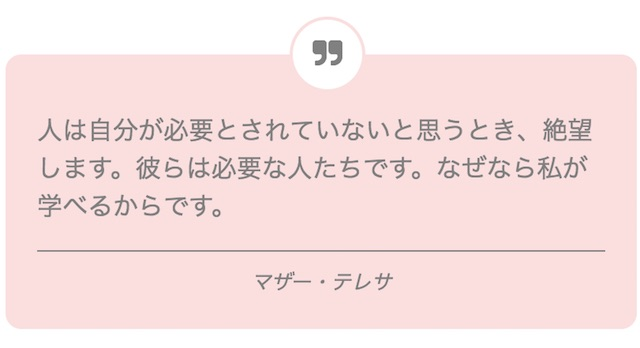

```css:title=CSS
blockquote{
    position:relative;
    background:#FBDFDF;
    border-radius:10px;
    padding:20px;
}
blockquote:before{
    position:absolute;
    left:45%;
    top:-24px;
    background-color:#FFFFFF;
    color:#808080;
    border:2px solid #FBDFDF;
    box-sizing:border-box;
    font-family:'FontAwesome';
    content:'\f10e';
    line-height:1;
    padding-top:12px;
    text-align:center;
    width:48px;
    height:48px;
    font-size:20px;
    border-radius:24px;
}
blockquote p {
    color:#808080
}
blockquote cite {
    display: block;
    border-top:1px solid #808080;
    padding-top:10px;
    font-size: 0.8rem;
    text-align:center;
    color: #808080;
}
```

### 四角い枠と丸い引用符

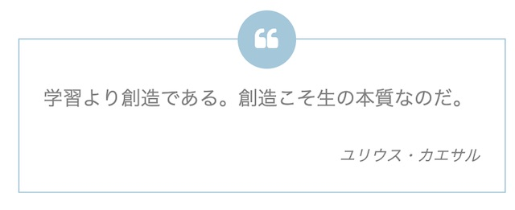

```css:title=CSS
blockquote{
    position:relative;
    border:1px solid #a3c7db;
    background:#FFFFF;
    padding:20px;
}
blockquote:before{
    position:absolute;
    left:45%;
    top:-24px;
    background-color:#a3c7db;
    color:#FFFFFF;
    border:2px solid #a3c7db;
    box-sizing:border-box;
    font-family:'FontAwesome';
    content:'\f10d';
    line-height:1;
    padding-top:12px;
    text-align:center;
    width:48px;
    height:48px;
    font-size:20px;
    border-radius:24px;
}
blockquote p {
    color:#808080
}
blockquote cite {
    display: block;
    padding-top:10px;
    font-size: 0.8rem;
    text-align:right;
    color: #808080;
}
```

### 上下のラインと中央に引用符をつける

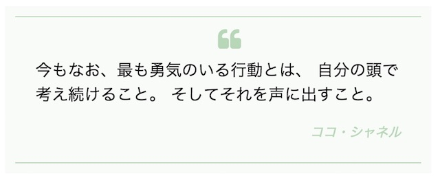

```css:title=CSS
blockquote {
    position: relative;
    background-color: #f9fbf9;
    border-top: 1px solid #B7D7B7;
    border-bottom: 1px solid #B7D7B7;
    box-shadow: 0 0 0 10px #f9fbf9;
    padding: 20px;
}
blockquote p {
    margin-top: 20px;
}
blockquote p::before {
    font-family:'FontAwesome';
    content:'\f10d';
    font-size: 24px;
    color: #B7D7B7;
    position: absolute;
    top: 10px; left: 50%;
}
blockquote cite {
    display: block;
    font-size: 0.8rem;
    text-align: right;
    color: #B7D7B7;
}
```

### 左上に引用符を重ねる

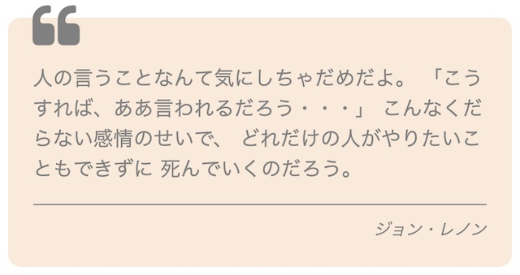

```css:title=CSS
blockquote{
    position:relative;
    background:#F9eada;
    border-radius:10px;
    padding:20px;
}
blockquote:before{
    position:absolute;
    left:5%;
    top:-24px;
    color:#808080;
    box-sizing:border-box;
    font-family:'FontAwesome';
    content:'\f10d';
    line-height:1;
    padding-top:12px;
    text-align:left;
    font-size:40px;
}
blockquote p {
    color:#808080
}
blockquote cite {
    display: block;
    border-top:1px solid #808080;
    padding-top:10px;
    font-size: 0.8rem;
    text-align: right;
    color: #808080;
}
```

### 左上と右下に引用符を重ねる

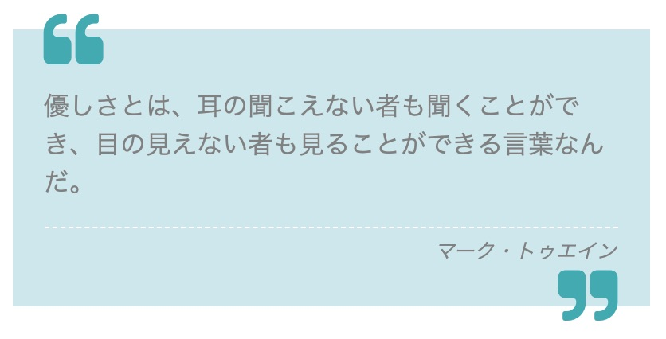

```css:title=CSS
blockquote{
    position:relative;
    background:#CDE7EE;
    padding:20px;
}
blockquote:before{
    position:absolute;
    left:5%;
    top:-24px;
    color:#3CAAB1;
    box-sizing:border-box;
    font-family:'FontAwesome';
    content:'\f10d';
    line-height:1;
    padding-top:12px;
    text-align:left;
    font-size:40px;
}
blockquote p {
    color:#808080
}
blockquote cite {
    display: block;
    border-top:1px dashed #FFFFFF;
    padding-top:5px;
    padding-bottom:5px;
    font-size: 0.8rem;
    text-align: right;
    color: #808080;
}
blockquote:after{
    position:absolute;
    right:5%;
    bottom:-25px;
    color:#3CAAB1;
    box-sizing:border-box;
    font-family:'FontAwesome';
    content:'\f10e';
    line-height:1;
    padding-bottom:10px;
    text-align:left;
    font-size:40px;
}
```

## まとめ

 最後に、CodePenでサンプルを掲載します。 複数のデザインを掲載するために、`.sample1`〜`.sample10`とクラス名を分けて設定しています。 HTMLのコードを貼り付けるときは`<div class="sample1">`と`</div>`は省いてOKです。
 同様に、CSSのコードも`.sample1`〜`.sample5`のクラス名は除いて使ってください。


 See the Pen [blockquote sample](https://codepen.io/filledforest/pen/ZMoQOY/) by Emi ([@filledforest](https://codepen.io/filledforest)) on [CodePen](https://codepen.io).