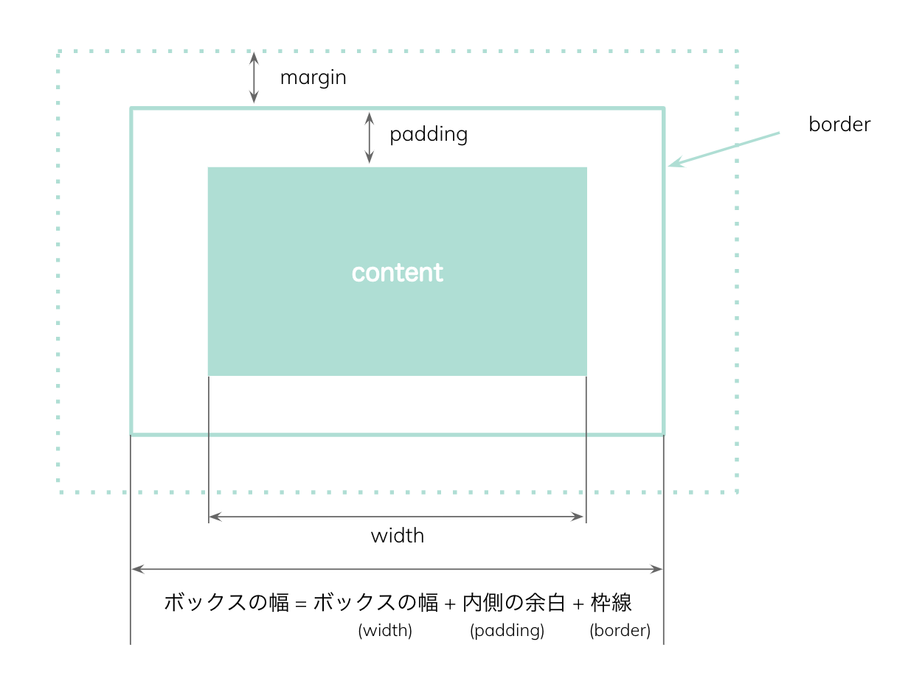

CSSプロパティのBox-sizingの説明です。
Box-sizingはdivやpなどのボックスサイズの計算方法を指定してくれる。

## ボックス幅の計算方法



デフォルトのcontent-boxだと、
ボックスの幅=コンテンツ幅（width)+内側の余白(padding)+枠線の太さ(border)となる。
高さの計算も同様にコンテンツ高さ（height)+内側の余白(padding)+枠線の太さ(border)。

## Box-sizingのプロパティ

```css
box-sizing: content-box; /* 初期値 */
box-sizing: border-box;

```

content-boxだと、paddingとborderをボックスの幅・高さに含めない。

border-boxだと、paddingとborderをボックスの幅・高さに含める。

border-boxを使うと、ボックスのwidthやheightを%指定したが、paddingやborderが足されたことで、親要素からはみ出すのを防ぐことができる。


レスポンシブ なサイトを作る場合には、あらかじめ全部の要素にborder-boxを指定しておくとやりやすい。

```css
*, *:before, *:after {
  -webkit-box-sizing: border-box;
  box-sizing: border-box
}
```
