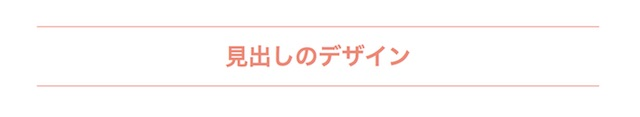
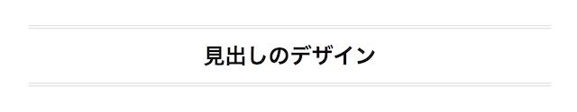
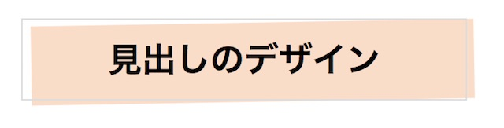

CSSのコピペだけで反映できる、簡単な見出しデザインを用意しました。
フォントのサイズや色はご自由に変更ください。

## 見出しデザインを設定するには

この記事で紹介するデザインを使う時には、HTMLに見出しタグ(h2)を入れてください。

```markup
<h2>見出しのデザイン</h2>
```

見出しタグは記事以外にも使われている場合があります。 もし余計な場所も装飾されてしまうようでしたら、
CSSのh2{の前に、article h2{や.post h2{と記事用のクラスをつけてください。

## シンプルなデザイン
### 上下に線を引く

シンプルですが、とても使いやすいデザインです。



文字と線の色を揃えるのもかわいいですよ。

```markup
h2{
    margin:30px;
    padding:12px;
    color:#F08972;
    text-align:center;
    border-top:1px solid #F08972;
    border-bottom:1px solid #F08972;
}
```

### 二重の線を引く



```markup
h2{
    margin:30px;
    padding:12px;
    text-align:center;
    border-top:4px double #DDD;
    border-bottom:4px double #DDD;
}
```

### 左右に線を引く


```markup
h2{
    text-align:center;
}
h2:before,
h2:after {
    content:"";
    display:inline-block;
    width:120px; height:1px;
    margin:0 10px;
    background-color: #DDD;
    vertical-align: middle;
}
```

marginを大きくすると、タイトルと線の間がもっと広げることもできます。
widthで線の長さを調整できます。

### 線の太さを変える


```markup
h2 {
    position: relative;
    padding: 12px;
    text-align:center;
}
h2:before,
h2:after {
    position: absolute;
    left: 0;
    content: '';
    width: 100%;
    height: 6px;
    box-sizing:
    border-box;
}
h2:before {
    top: 0;
    border-top: 1px solid #ddd;
    border-bottom: 2px solid #ddd;
}
h2:after {
    bottom: 0;
    border-top: 2px solid #ddd;
    border-bottom: 1px solid #ddd;
}
```

### 背景の色を変える


```markup
h2 {
    position: relative;
    text-align:center;
    color:#FFF;
    padding: 10px;
    background-color: #8BC0B8;
    box-shadow: 0px 0px 0px 6px #8BC0B8;
    border-top: 1px solid #fff;
    border-bottom: 1px solid #fff;
}
```

### ちょっとずらしてみる




```markup
h2 {
    position:relative;
    margin:10px;
    display:inline-block;
    padding:10px 60px;
    border:1px solid #DDD;
    background:none;
}
h2:after {
    position: absolute;
    top:2px;
    left:6px;
    content:"";
    height:100%;
    width:100%;
    z-index:-999;
    -webkit-transform: rotate(-1deg);
    -moz-transform: rotate(-1deg);
    background:#FBDDC8;
}
```


### ストライプ


```markup
h2{
    position: relative;
    text-align:center;
    padding: 10px;
    color:#474342;
    background: -webkit-repeating-linear-gradient(-45deg, #EFC4C0, #EFC4C0 6px,#F6DED4 6px, #F6DED4 12px);
    background: repeating-linear-gradient(-45deg, #FBDDC8, #FBDDC8 6px,#F6BCAC 6px, #F6BCAC 12px);
}
```

### ストライプの下線をひく


```markup
h2 {
    position: relative;
    padding: 10px;
}
h2:after {
    content: "";
    position: absolute;
    left: 0;
    bottom: 0;
    width: 100%;
    height: 6px;
    background: repeating-linear-gradient(-30deg, #82C5CA, #82C5CA 4px, #C1E2E4 4px, #C1E2E4 8px);
}
```
