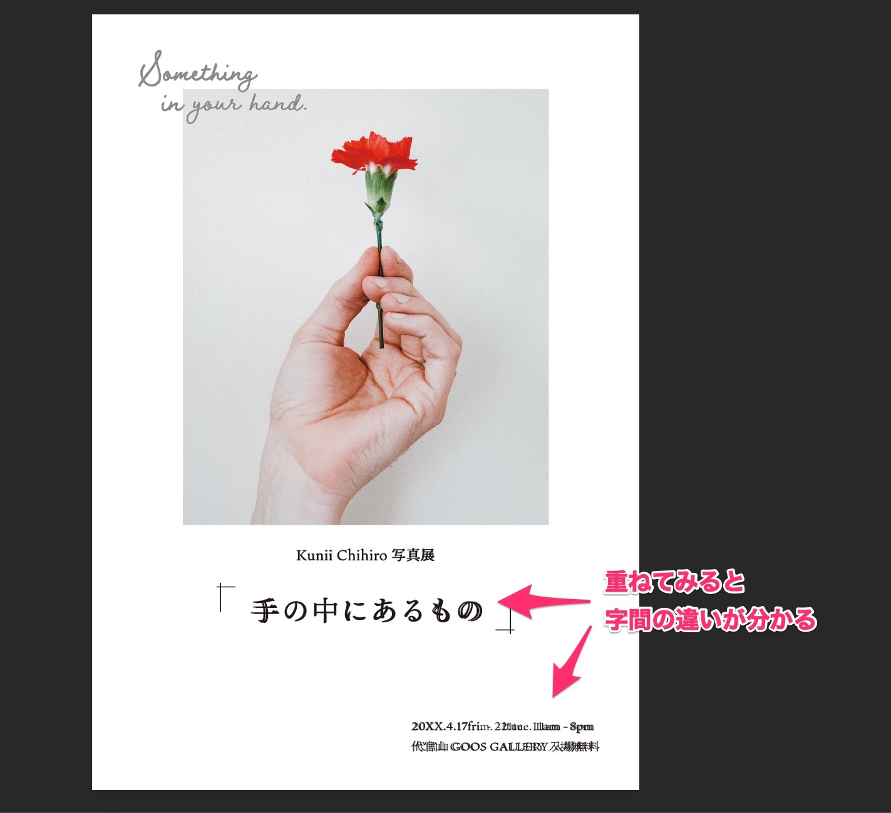
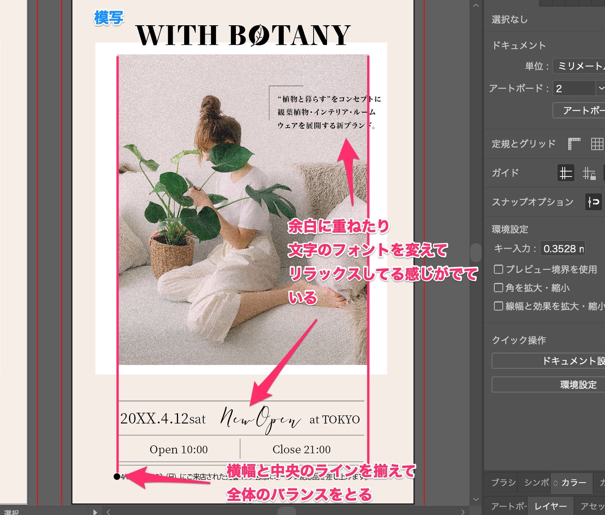

「<a href="https://amzn.to/34u9ts6" target="_blank" rel="nofollow">トレース＆模写で学ぶ　デザインのドリル</a>」を使って、デザイントレースの練習した記録です。

## Lesson 1〜6 構成を学ぶ

まずは、パーツのレイアウト、揃え方を学びます。

### 演習１：写真展のチラシ

* 字間を広めに開けると、文字を強調できる
* 読ませたい文字とその他の文字で差をつけるために、フォントサイズの大小、色の濃淡をはっきりつける。

### 演習２：名刺

* 意味のあるグループごとに隙間を開けている
* 住所や電話は、左寄せにして文頭を揃えて、読みやすく。

### 演習３：クリスマスキャンペーン広告

* Happy Chirstmasなど、メインの文字は思い切って大きく。
* 「ファミリーモール」に対して、「の」は小さく、文字の優先順位を明確にする
* 同様に、「日付」に対して「曜日」は小さい

### 演習４：ウェディング広告

* 文字の並びと写真の人物の位置がバランス良くなるように、写真を切り抜く
* 写真に文字を重ねて動きを出す
* 黄土色もゴールドっぽく見えて高級感が出る。

### 演習５：ドーナツ商品紹介

* 商品の色を主体に、対比させる。
* ドーナツの円を生かした丸みのある配置が素敵。
* 円を欠けたり、線を点線にするのに苦戦

### 演習６：DM

* 写真と文字の横幅、中央は揃えて全体のバランスをとる（模写したやつは、ちょっとずれてる）
* 全て整列させるのではなく、右にずらして文章を重ねたり、フォントを手書きっぽくして、リラックスした感じがでている。
* 写真の上下／左右の余白が違うのも、アートっぽい感じがする。

＞＞　続き：
