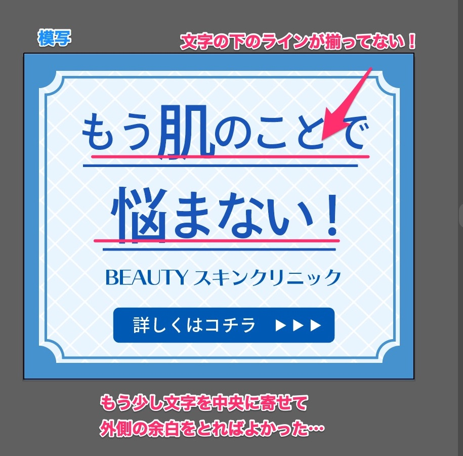
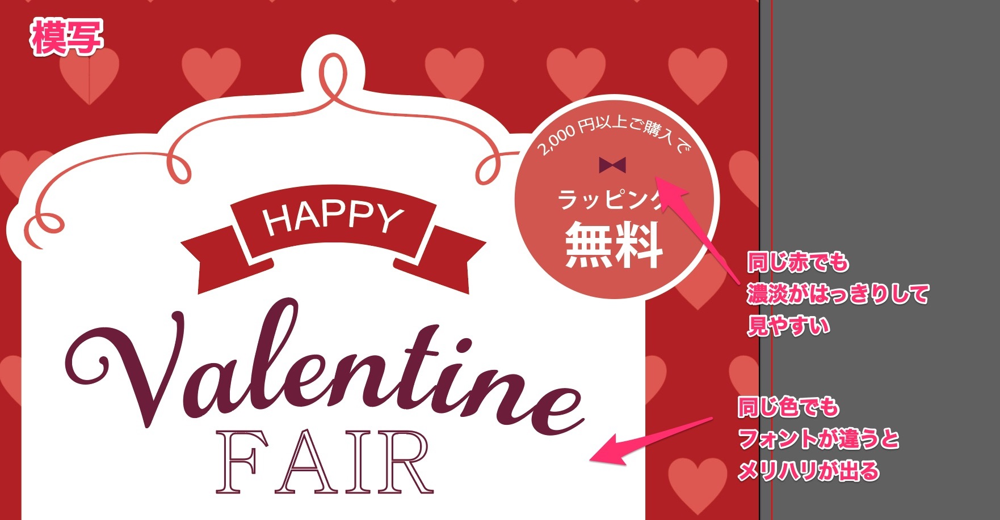
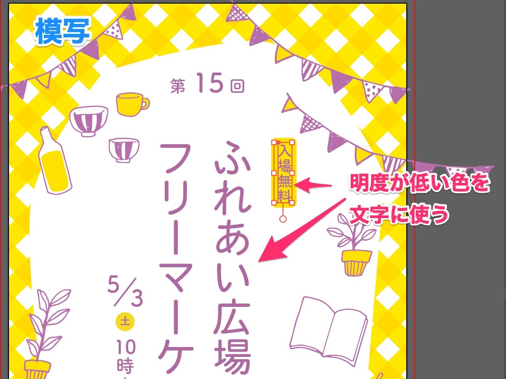

「<a href="https://amzn.to/34u9ts6" target="_blank" rel="nofollow">トレース＆模写で学ぶ　デザインのドリル</a>」を使って、デザイントレースの練習した記録です。

## Lesson 7〜11 配色

配色をテーマにした演習です。

色に関しては、どの色を使っているか本に書かれているので、迷わなかったです。

でも、自分で同じような配色を作れるかというとまた別問題・・・。

### ７：美容クリニックバナー

メモしてて気づきましたが、模写したやつは文字のベースラインが下に揃っていない…。

* 青で清潔感や誠実さを表現（背景のタイルっぽいのも洗面所のようで清潔感がある）
* 同じ青系でも、文字は明度や彩度を変えて目立たせている。
* 「肌」や「悩」など、文字を大きくして印象付けている。

これのやり方を忘れて、調べました。

Illustratorのダイレクトツールで角をクリックすると、角を丸くできます。

最初は角丸になっていて、上↑と下↓で、かどの形を切り替えられます。

コーナーの点をダブルクリックしてもオプションが出てきます。

また、ダイレクト選択ツール選択時に、上のツールバーに「コーナー（ライブコーナー）」の項目があるので、そこでも形や角の丸み（px）を調整できます。

### ８：バレンタイン広告

* 同じ赤でも濃度を変えて、コントラストをつける
* フォントを明確に変えるとメリハリがつく

このふにゃっとした線、どうやってつくるんだろ。

円にそわせるのが難しい

### ９：フリマ広告

* 黄色×紫でインパクトがある組み合わせ！
* 濃い方（紫）を文字に使う

今回のハイライトは、文字のベースラインの、数字の向きの揃え方を学びました。

これとか

これとか

どちらも、文字パネルの右上のメニューバー＞文字揃え＞欧文ベースラインで揃います。

## 配色の練習

次は、二色を使ってイメージを表現する演習です。

### １０：季節限定キャンペーン

### １１：メガネショップカード

やってみると

* 釣り合う二色を選ぶのが難しい
* いつも似た色をばかり選んでしまう

いいなぁと思った色合いをストックしておくことが大事だなと思いました。
