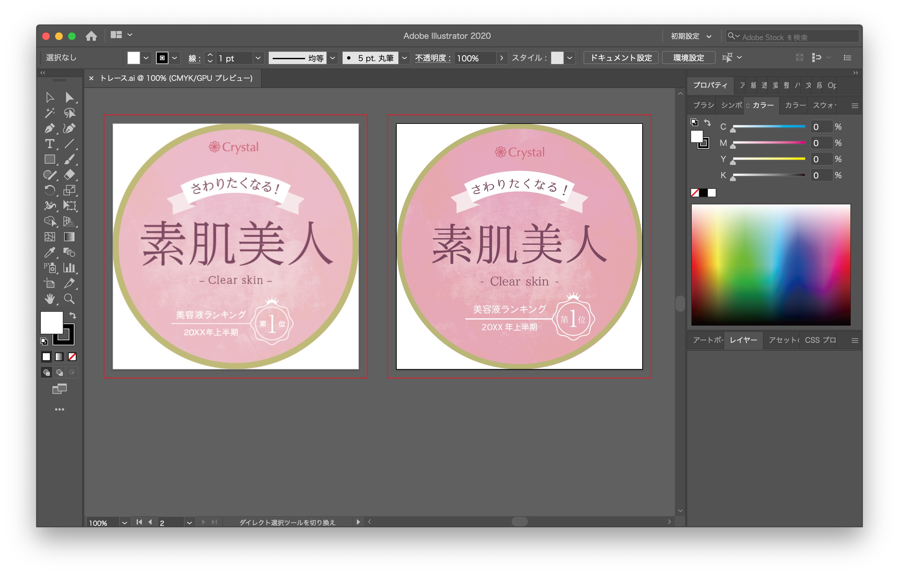
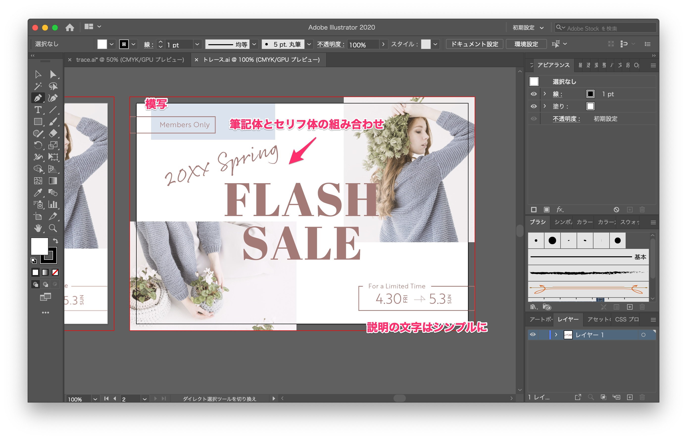
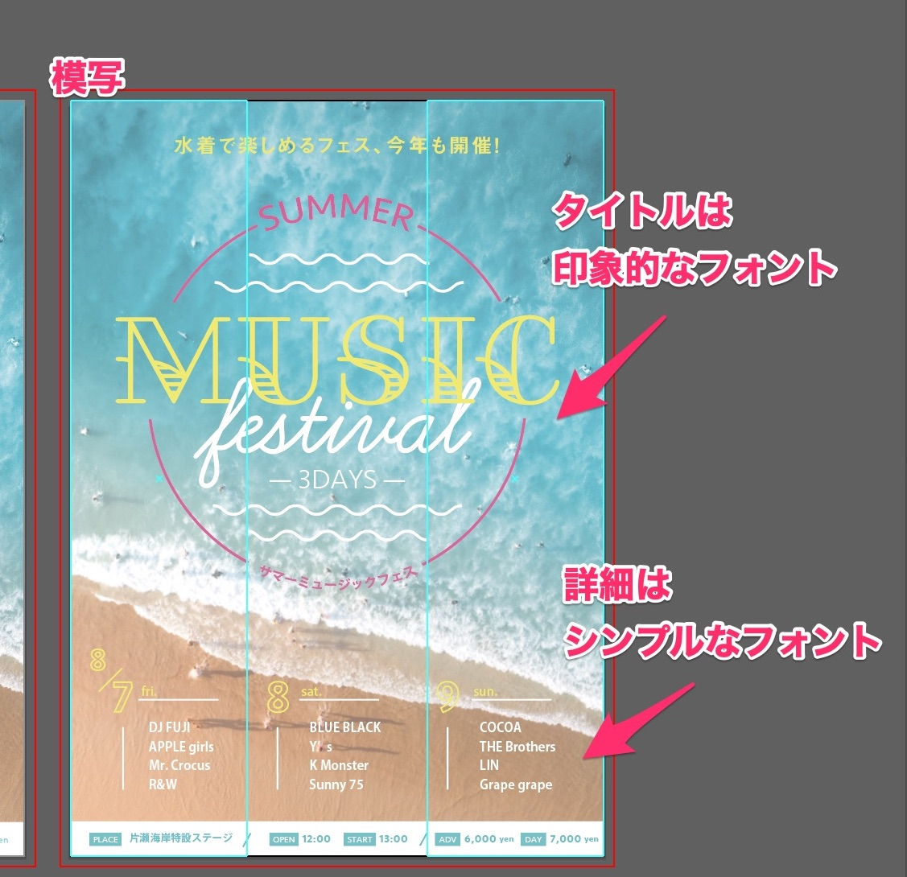
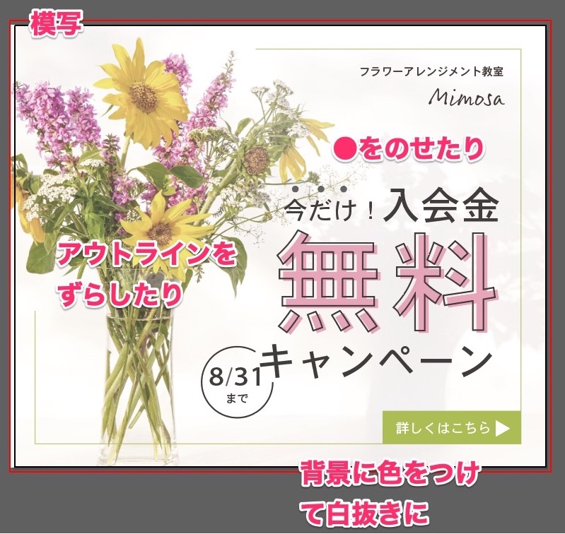
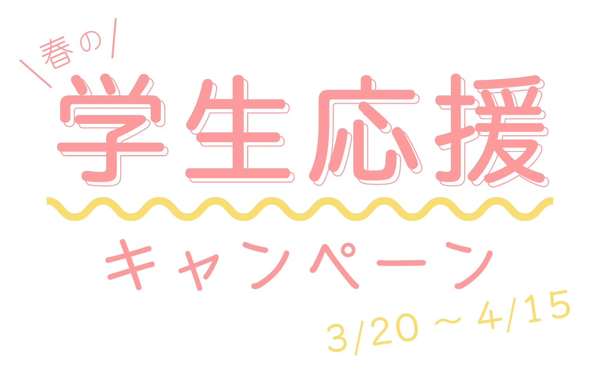
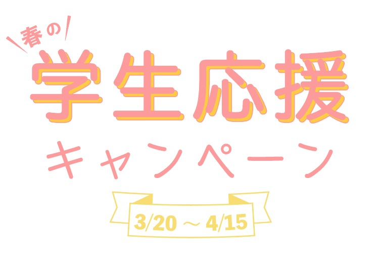
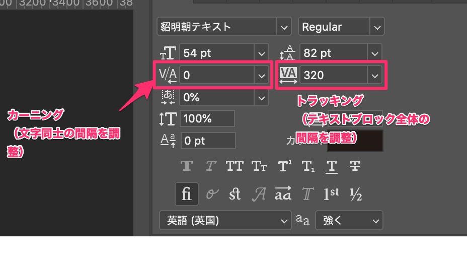
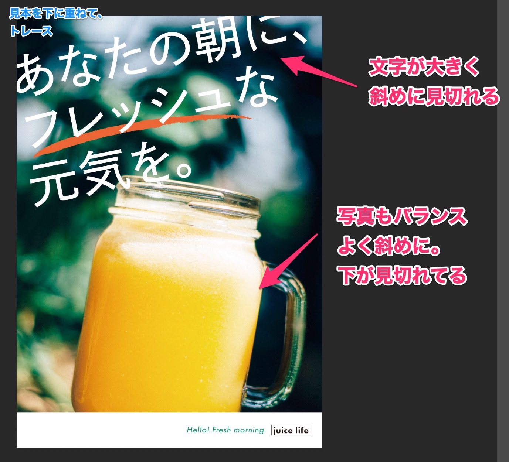
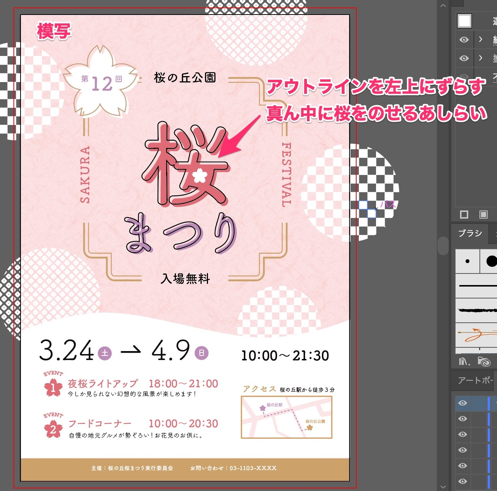
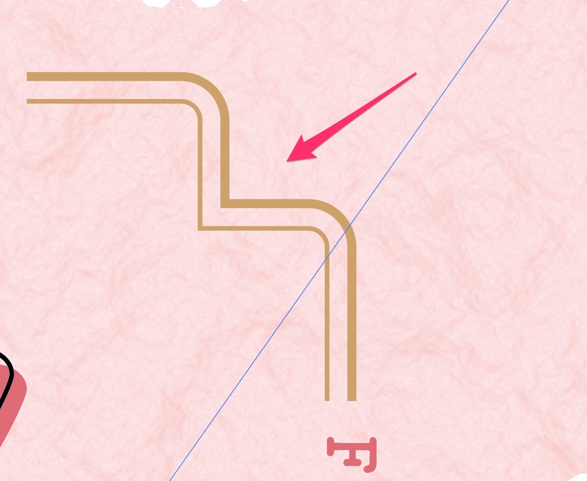

「<a href="https://amzn.to/34u9ts6" target="_blank" rel="nofollow">トレース＆模写で学ぶ　デザインのドリル</a>」を使って、デザイントレースの練習した記録です。

## Lesson 12〜17　文字

フォントで印象がどのように変わるのかを学びます。

### 1２スキンケア店頭POP

* 細めの明朝体だと、女性らしく
* 丸ゴシックだと、親やすい印象

### １３セールの告知

【フォントを使うときのポイント】
* だいたい２種類のフォントを使う（メインの題字とサブ情報で使い分け）
* 重めのフォントと軽めのフォントでメリハリをつける

### １４イベントのチラシ

* 見せるフォントと読ませるフォントの使い分け

### １５キャンペーンのバナー

* 文字だけでも、変化をつけると華やかに

### １６高級レストランロゴの作成

続いてお題の文字をフォントで、ロゴにする演習です。

* 大人のカップルがワインを楽しむイメージでワインレッドをチョイス。
* ワインのボトルのように、
* セリフ体で高級感を演出

### １７学生向けキャンペーンのロゴ

* 春なのでピンクを選択。
* 学生の活気が現れるように、サブカラーに黄色を選択、また丸ゴシックで親近感を出す。
* 優先順位の高い順に文字サイズを変えてみる。

色は春っぽさが出ているけれど、なんだか寂しい💦
特にキャンペーンと日付のところは飾ることができていないでそのまま文字だけになっています…。

本で紹介されていた作例には
* 斜めにして勢いを出す
* 桜の花びらをフォントに取り入れて、春らしさを伝える
などと、工夫が凝らされていました。

* 一番見せたい「学生応援」は、二色使う
* 日付のところを目立たせるため、強めのフォントにして飾る。
* 「春の」のまわりは線→三角にして、メガホンぽくする。

少しは良くなったかな？

「学生応援キャンペーン」で画像検索してみると、
桜を使っていたり、応援のイメージでメガホンを使っている。

作る前に、どういったデザインがあるのか、参考となるデザインをいっぱいみておくのも大事だと思いました。

### １８パン屋のポスター

続いての演習は、字間に着目。

ここで、「なんで、字間を調整する必要があるの？」という疑問が。

日本語のフォントは、正方形にハマるように作られているので、文字同士の間隔がそろわない。

ひらがなやカタカナは漢字に比べて空きが広く、漢字が詰まって見えます。

PhotoshopやIllustratorの文字パネルにある「トラッキング」と「カーニング」を学びました。

* カーニング：文字同士の間隔を設定
* トラッキング：選択したテキストや、テキストブロック全体の文字間隔を調整

また、カーニングには、「メトリクス」「オプティカル」という設定があります。

メトリクス：
欧文フォントに含まれる、ペアカーニング（Wa,WAなどの特定の組み合わせ空き）の情報を使う。
日本語フォントには基本的にペアカーニング情報がない。

オプティカル：
文字の形状に応じて文字間隔を調整する。

文字間の調整は、調整したい文字を選択し、altと矢印←／→で20ずつ調整できます。

### １９飲料メーカーのポスター

* 文字を斜めに見切れさせて、躍動感を出す。
* 文字は右斜め上に、写真は右斜め下に角度を傾けてバランスよく

### ２０桜祭りの広告
文字を主役にしたデザイン。
めっちゃ時間がかかった…！！

大変だったのがこれ。

【作り方メモ】

角丸の長方形を作る

　→　コピぺして90度回転させる

　→　パスファインダーで結合

これで＋の形をした図形ができます。

同じものを作ってオブジェクト＞オフセットで小さくする。

文字と重なる右分を消すには

　→　アンカーポイントを追加

　→ ダイレクト選択ツールでパスを消す
