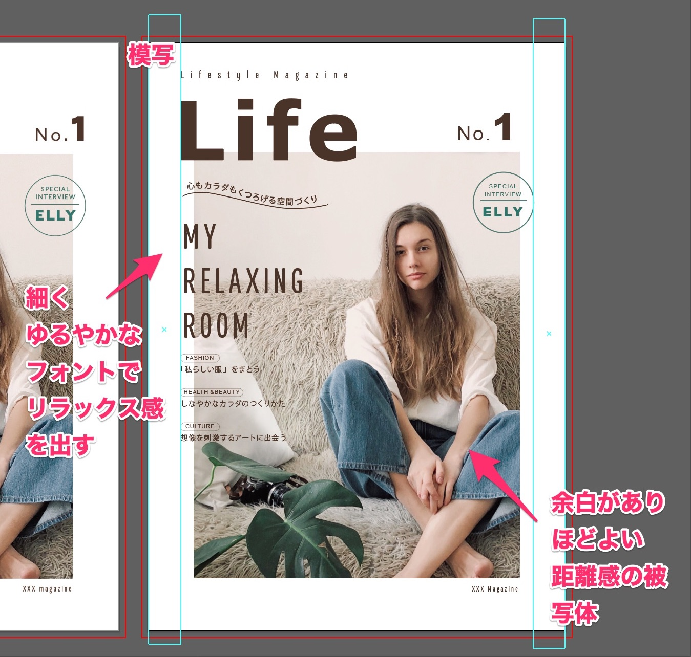
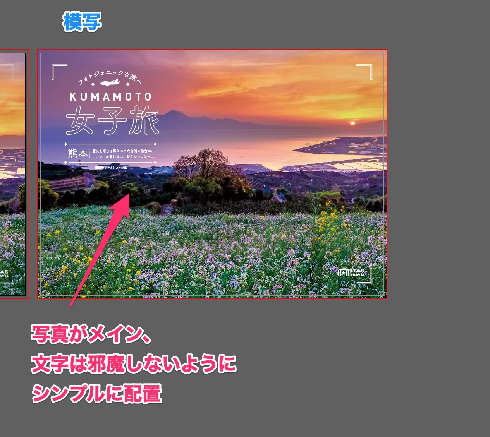
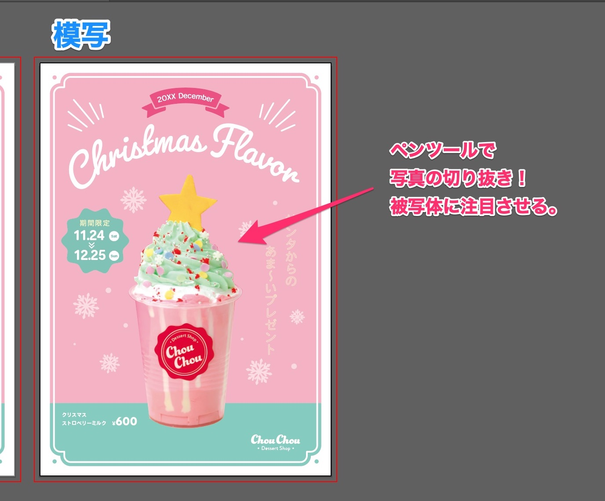
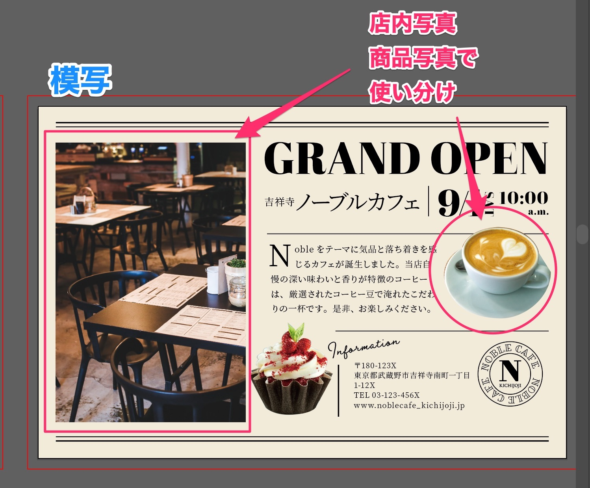
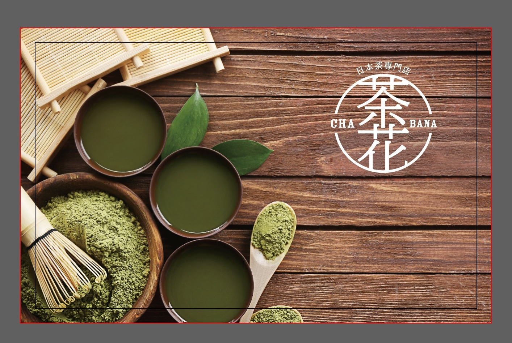
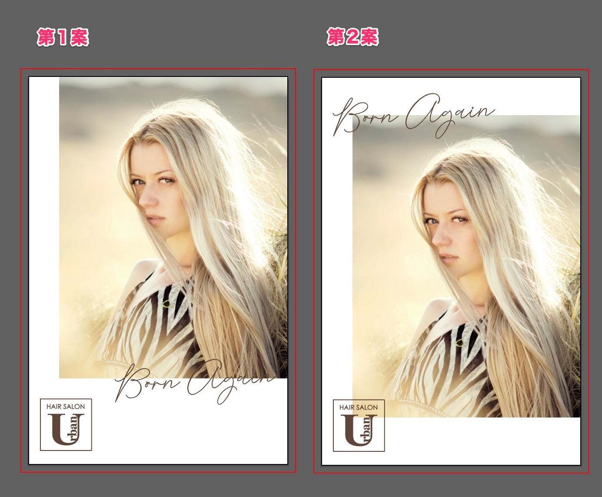

「<a href="https://amzn.to/34u9ts6" target="_blank" rel="nofollow">トレース＆模写で学ぶ　デザインのドリル</a>」を使って、デザイントレースの練習した記録です。

## 写真の効果的な使い方

### Lesson 21 フリーマガジンの表紙

* 写真のトリミングは、被写体の配置をバランスよく
* 写真の色（茶、緑）を文字色に使う
* 細く、ゆるやかな文字でリラックス感を演出

### Lesson22 旅行代理店のポスター

* 写真を全面に配置させて迫力が出る
* 文字は白で、写真の邪魔をさせない

### Lesson23 スイーツ店のチラシ

* 写真を切り抜くと背景の情報がなくなり、商品に注目がいく。
* 商品に合わせた色とフォント。
* 飾りで周りを華やかに。

### Lesson24 カフェ新規開店のDM

* 店内写真は四角、商品は切り抜きと、目的に応じて使い分け。
* 整頓させると上品な印象を与えることができる
* 商品やInformationをずらして配置させることで抜け感がでる。

### Lesson25 ショップカード
商品とロゴを組み合わせてショップカードを作ってみました。

* 左半分は商品を主体に、右上にロゴ配置させてバランスよく
* 写真を邪魔せず、しっかりとロゴが見えるように白をチョイス。

作ってみるとロゴはもう少し小さくてもよかったかも？

### Lesson26 ヘアサロンのDM

写真、ロゴ、キャッチコピーでチラシを作ります。

* 作ってみて、よく考えずに写真とフォントを並べた感じになってしまった…。

