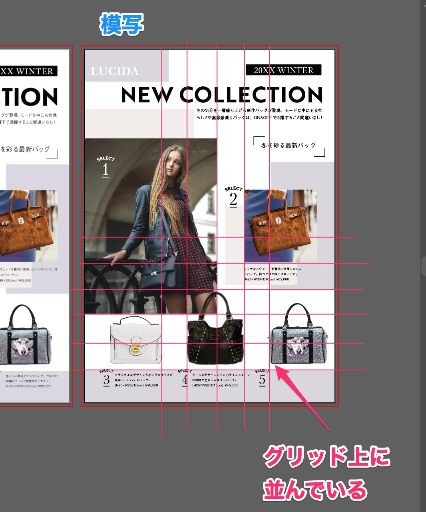
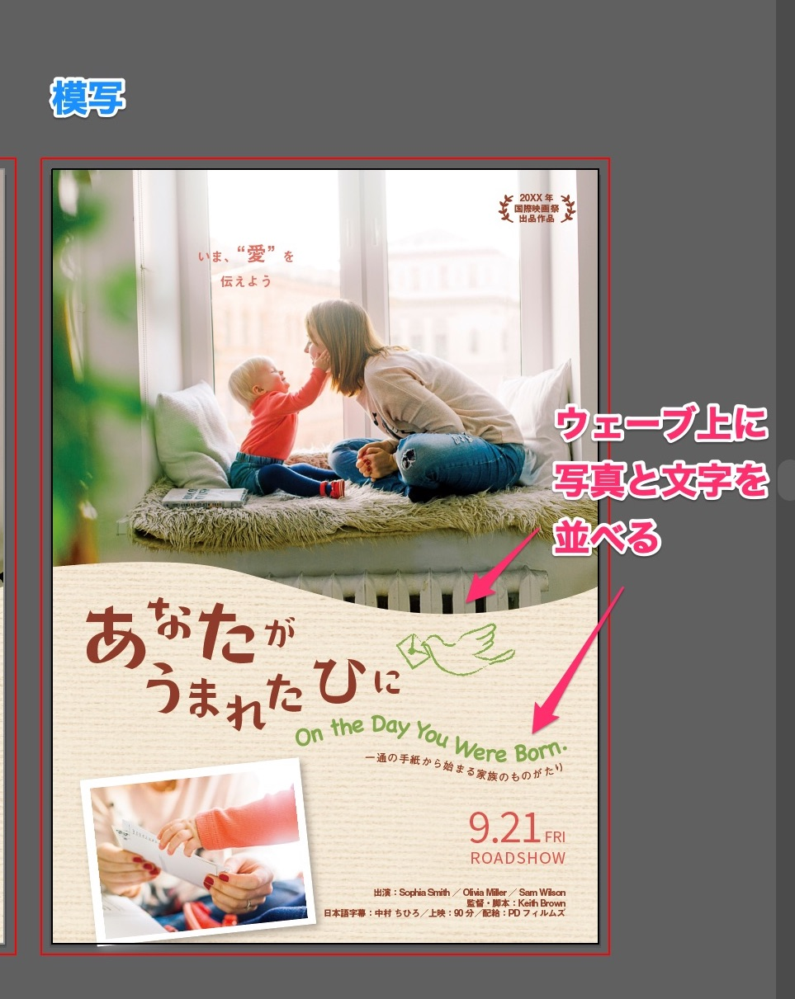
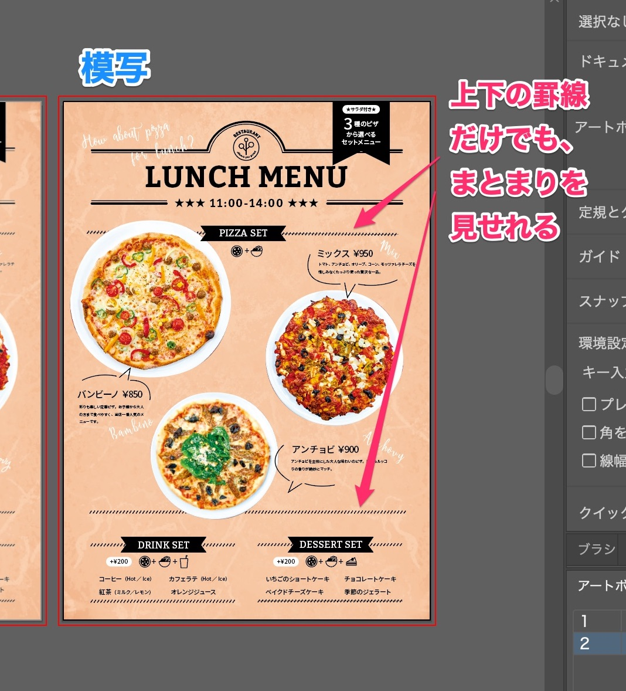
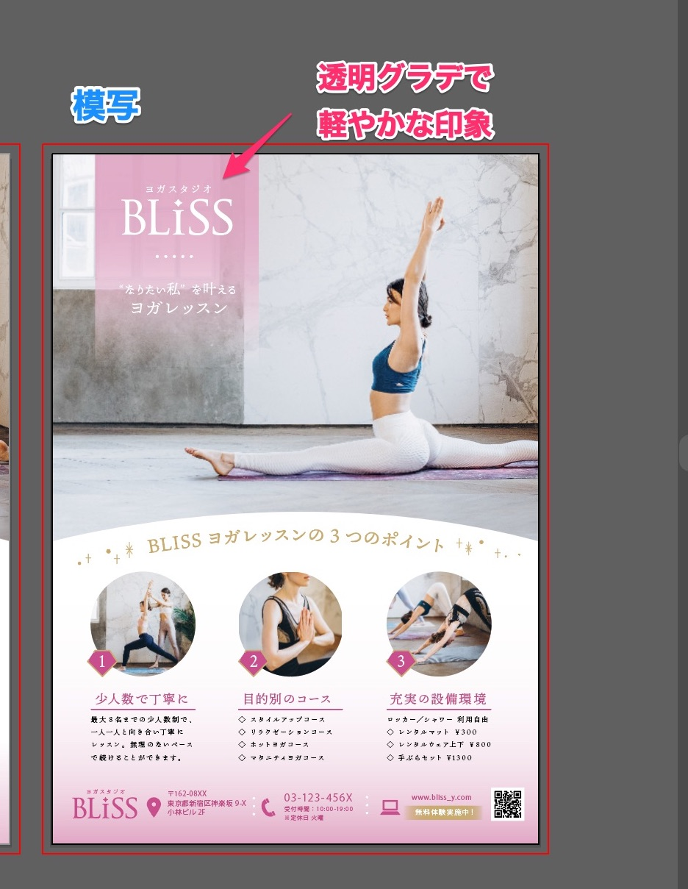

「<a href="https://amzn.to/34u9ts6" target="_blank" rel="nofollow">トレース＆模写で学ぶ　デザインのドリル</a>」を使って、デザイントレースの練習した記録です。

## 写真の効果的な使い方

### Lesson 27 雑誌の特集記事

学んだこと／気づいたこと

* 模写中は気づかなかったけれど、グリッドでレイアウトをしているので、まとまりがよく見える

### Lesson28 映画のチラシ

学んだこと／気づいたこと

* 読ませたい文字は大きくしている。
* 写真を波に切り抜い当たり、文字を波にすることで、柔らかい印象。
* 波線の文字の書き方を学んだ

### Lesson29 レストランのメニュー

学んだこと／気づいたこと

* 三角形に大、中、小と、商品を並べるのがバランス良い
* 斜めの罫線の線を作り方がわかった！

### Lesson30 ヨガ教室のチラシ

学んだこと／気づいたこと

* 透明なグラデーションで上品かつ軽やかな印象を与えられる。
* 同じ形の写真も引きだったり、寄ってたり、変えるとことでメリハリがある
* グラデーションをかける方法を学んだ！
