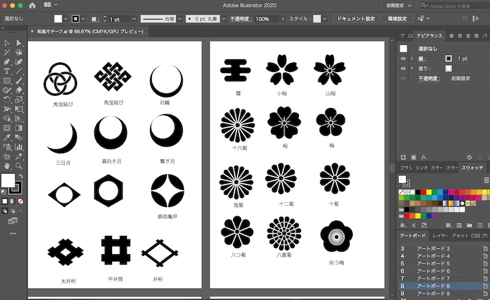

2020年3月の振り返りです。

## 今月の振り返り

これからもっとITの裾野が広がる。
かつて、コンピューターが一般の人にも使えるようになったように。
ホームページが個人でも簡単に作れるようになったように。
個人の小さなニーズに合わせて、サービスやアプリが、手軽に生まれるような予感がします。

外出自粛の今の時間をスキルアップにあてたいと思います。

### 【プログラミング編】PHPを学ぶ

せっかく家にいる時間が増えたので、JavaScriptとPHPを書いています。

PHPもRubyもWebアプリケーションに使う言語なので、ホームページよりもできることの幅が広がるんですよね。

<a href="//af.moshimo.com/af/c/click?a_id=742757&p_id=56&pc_id=56&pl_id=637&s_v=b5Rz2P0601xu&url=http%3A%2F%2Fbooks.rakuten.co.jp%2Frb%2F14651781%2F" target="_blank" rel="nofollow" >気づけばプロ並みPHP 改訂版ーーゼロから作れる人になる！</a>
posted with <a href="https://yomereba.com" rel="nofollow" target="_blank">ヨメレバ</a>

谷藤賢一/徳丸 浩（協力） リックテレコム 2017年02月18日頃    

<a href="//af.moshimo.com/af/c/click?a_id=742757&p_id=56&pc_id=56&pl_id=637&s_v=b5Rz2P0601xu&url=http%3A%2F%2Fbooks.rakuten.co.jp%2Frb%2F14651781%2F" target="_blank" rel="nofollow" >楽天ブックス</a>

<a href="https://www.amazon.co.jp/exec/obidos/asin/4865940650/filledfores07-22/" target="_blank" rel="nofollow" >Amazon</a>

<a href="https://www.amazon.co.jp/gp/search?keywords=%E6%B0%97%E3%81%A5%E3%81%91%E3%81%B0%E3%83%97%E3%83%AD%E4%B8%A6%E3%81%BFPHP%20%E6%94%B9%E8%A8%82%E7%89%88%E3%83%BC%E3%83%BC%E3%82%BC%E3%83%AD%E3%81%8B%E3%82%89%E4%BD%9C%E3%82%8C%E3%82%8B%E4%BA%BA%E3%81%AB%E3%81%AA%E3%82%8B%EF%BC%81&__mk_ja_JP=%83J%83%5E%83J%83i&url=node%3D2275256051&tag=filledfores07-22" target="_blank" rel="nofollow" >Kindle</a>

<a href="//af.moshimo.com/af/c/click?a_id=1082680&p_id=932&pc_id=1188&pl_id=12456&s_v=b5Rz2P0601xu&url=http%3A%2F%2F7net.omni7.jp%2Fsearch%2F%3FsearchKeywordFlg%3D1%26keyword%3D9784865940657" target="_blank" rel="nofollow" >7net</a>

<a href="//ck.jp.ap.valuecommerce.com/servlet/referral?sid=3390948&pid=885314885&vc_url=http%3A%2F%2Fhonto.jp%2Fnetstore%2Fsearch_021_104865940650.html%3Fsrchf%3D1%26srchGnrNm%3D1&vcptn=kaereba" target="_blank" rel="nofollow" >honto</a>
         
<a href="//ck.jp.ap.valuecommerce.com/servlet/referral?sid=3390948&pid=886623503&vc_url=http%3A%2F%2Fwww.kinokuniya.co.jp%2Ff%2Fdsg-01-9784865940657&vcptn=kaereba" target="_blank" rel="nofollow" >紀伊國屋書店</a>
                

この本は、ECサイトを作りながらPHP＋データベースを学ぶというコンセプト。

作りながら学ぶ方が実地的なスキルがつくので好きです。

第２章まで読み進めたのですが、分かりやすいです。

### 【デザイン編】イラレでアイコンを作る

Webサイトを作っていると、ロゴやメインビジュアル、飾り枠、アイコンなどでWeb素材を使うことがあります。

これまでは、Canvaのテンプレートでアイキャッチを作るぐらいでした。

それで、もっといろんなものが作れるようになりたいと思いつ、Photoshop/Illustratorのツールの操作を学びました。

使ったのは井上のきあさんのIllustrator ジャパンメソッド。

<a href="//af.moshimo.com/af/c/click?a_id=742757&p_id=56&pc_id=56&pl_id=637&s_v=b5Rz2P0601xu&url=http%3A%2F%2Fbooks.rakuten.co.jp%2Frb%2F13454208%2F" target="_blank" rel="nofollow" >Illustratorジャパンメソッド</a>
posted with <a href="https://yomereba.com" rel="nofollow" target="_blank">ヨメレバ</a>

井上のきあ エムディエヌコーポレーション 2015年11月    

<a href="//af.moshimo.com/af/c/click?a_id=742757&p_id=56&pc_id=56&pl_id=637&s_v=b5Rz2P0601xu&url=http%3A%2F%2Fbooks.rakuten.co.jp%2Frb%2F13454208%2F" target="_blank" rel="nofollow" >楽天ブックス</a>

<a href="https://www.amazon.co.jp/exec/obidos/asin/4844365460/filledfores07-22/" target="_blank" rel="nofollow" >Amazon</a>

<a href="https://www.amazon.co.jp/gp/search?keywords=Illustrator%E3%82%B8%E3%83%A3%E3%83%91%E3%83%B3%E3%83%A1%E3%82%BD%E3%83%83%E3%83%89&__mk_ja_JP=%83J%83%5E%83J%83i&url=node%3D2275256051&tag=filledfores07-22" target="_blank" rel="nofollow" >Kindle</a>

<a href="//af.moshimo.com/af/c/click?a_id=1082680&p_id=932&pc_id=1188&pl_id=12456&s_v=b5Rz2P0601xu&url=http%3A%2F%2F7net.omni7.jp%2Fsearch%2F%3FsearchKeywordFlg%3D1%26keyword%3D9784844365464" target="_blank" rel="nofollow" >7net</a>

<a href="//ck.jp.ap.valuecommerce.com/servlet/referral?sid=3390948&pid=885314885&vc_url=http%3A%2F%2Fhonto.jp%2Fnetstore%2Fsearch_021_104844365460.html%3Fsrchf%3D1%26srchGnrNm%3D1&vcptn=kaereba" target="_blank" rel="nofollow" >honto</a>
            
<a href="//ck.jp.ap.valuecommerce.com/servlet/referral?sid=3390948&pid=886623503&vc_url=http%3A%2F%2Fwww.kinokuniya.co.jp%2Ff%2Fdsg-01-9784844365464&vcptn=kaereba" target="_blank" rel="nofollow" >紀伊國屋書店</a>
          
<a href="//ck.jp.ap.valuecommerce.com/servlet/referral?sid=3390948&pid=886623490&vc_url=https%3A%2F%2Febookjapan.yahoo.co.jp%2Fbooks%2F491413%2FA002030188%3Fdealerid%3D30064%26utm_source%3Dasp%26utm_medium%3Dmedi%26utm_campaign%3Drate_yome&vcptn=kaereba" target="_blank" rel="nofollow" >ebookjapan</a>
      

和風アイコンを作りながら、イラレ の使い方を学ぶというコンセプト。

作者はデザインツールを使い始める時にヘルプを全て読み込むらしい。すごい。

## 来月取り組みたいこと

### PHPを学ぶ

PHPの本はさくっと読み終えつつ、学んだことを次に再利用できるように準備しようと思います。

具体的には

* PHPの本の通りに、Webアプリを作ってみる

* JavaScirptやCSSを入れて見た目よく動きをつける

* PHPでプログラムを組むときのテンプレート（骨組み）、スニペット（よく使うプログラムの断片）を揃える

### 学習記録の発信

学習記録をこまめに発信したいです。

これまでは、作り終わった後で、できたものを紹介したり、作成手順を書き残してきました。

そうすると、手を動かしてから、外に見せるまでにタムラグができてしまう・・・。

内容を忘れてしまったり、公開できないまま、お蔵入りしていったり。

その都度、分かったこと、わからなかったこと、プロセス自体を記録していきたいです。