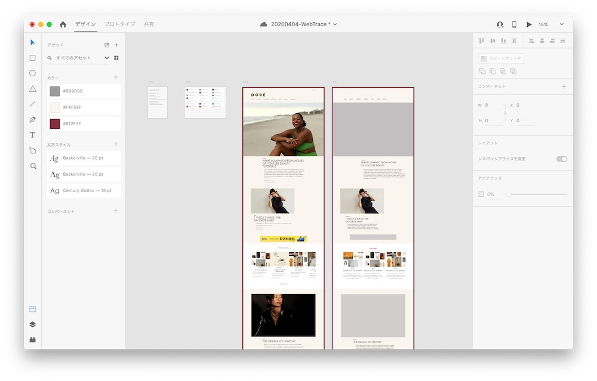
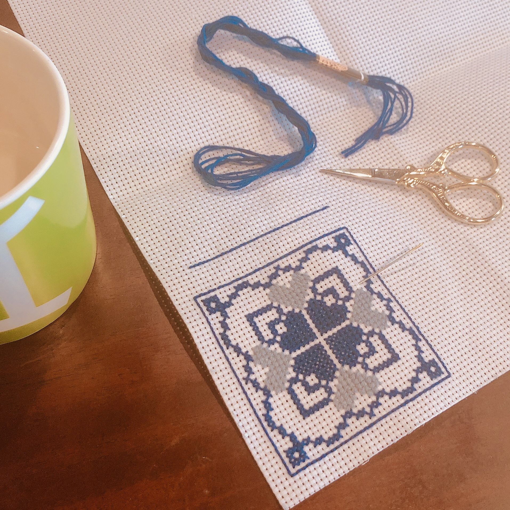

2020年4月の振り返りです。

お仕事や人と会う約束がなくなって、ゆったりと自分のペースで過ごせる時間が増えました。

## 今月の振り返り

### 【プログラミング編】新しい言語にたくさん触れた

先月に引き続きPHPの本を読みつつ、ショッピングサイトを作ってみました。

Progateをはじめたら、結構楽しくて、他の言語にも手を出してみました。

* Ruby on Rails
* PHP
* React
* Node.js
* Python

Progateは説明が分かりやすいし、ソースコード を書きながら基礎文法に慣れていけるので、手っ取り早い。

専門書を開いたり、ネットでいちいち調べなくても、プログラミングをはじめられるなんて、便利な世の中になったなぁと思います。

書きながら、ちょっとしたメモアプリを動かすのは楽しかった＾＾

* [【はじめてのNode.js】環境構築からプログラムを動かす手順をていねいに解説！](https://0forest.com/start-node-js/)

* [Node.js+ExpressでMySQLに接続して一覧表示する(Mac)](https://0forest.com/node-js-mysql/)

### 【デザイン編】好きなブログをトレース

### デザイン力がほしい

Twitterで独学からデザイナーデビューをしている方々を発見して、その成長過程をブログで読ませてもらいました。

【インスパイアされた記事】

* [デザイン上達への道！「バナー模写」を始めます](https://fuyuna.net/banner-trace-start)

* [バナートレースからデザイントレースへ。50個トレースしてわかったこと＆Tips](https://mito-lab.com/design-trace-50/)

独学デザイナーさんたちがまず実践されていることは、主にこの３つ。

* 本からデザインの原則を学ぶ

* 良いデザインをたくさんみる

* バナーやWebデザインをトレース（模写）する

「こんな風にスキルアップしているんだ！」と勇気をもらい、私もブログのトレースを５本やってみました。

やり方

 1. 好きなブログのスクリーンショットを撮る
 2. XDアートボードに貼り付ける
 3. ガイドラインをひく
 4. [MiMic](https://tourdexd.com/plugin/mimic/)で、色やフォントを調べる。
 5. 各パーツや位置を見比べながら配置してみる

 

 なんとなく、色の配色、書体が分かるようになってきたかも？

### 【番外編】空いた時間に刺繍ちくちく

## 来月の取り組み

５月もStay Homeが続きそうなので、のんびり好きなものを作りながら過ごしていく予定です。

動くものを作って、プログラムなど公開できたらいいなと思ってます。

Gutenbergに合わせたWordPressテーマ、
プラグイン 、Webアプリケーション、作りたいものはいろいろ🤔

機能はもちろん、デザイン、見た目も大事だよなぁ。それからセキュリティも…。

プログラムを公開して運用するにはサーバーも必要（調べてみると、herokuというサービスを使えばいけそう？）

ほんとWebって幅広い知識が必要ですね。
