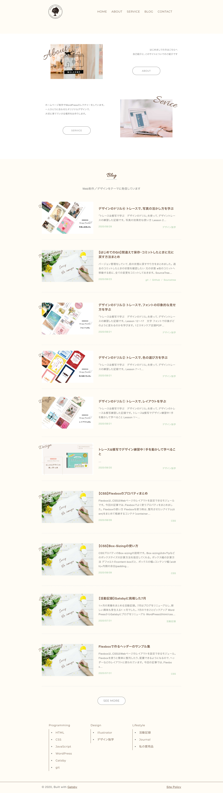

1ヶ月の活動をまとめる活動記録。

8月は、自分で手を動かしてやってみることで、発見があったり、もっとこうしたらいいかも！といアイデアが湧く１ヶ月でした。

## 8月の活動ピックアップ

### Gatsbyブログを育てる

Gatsbyを使い始めたのは先月。

【主にカスタマイズした箇所】

①　アイキャッチをつけて、ブログ一覧を見て楽しめるようにした。

②　aboutやserviceページを掲載

③　ページを素早く探せるように、ナビゲーションや、ブログカテゴリーを掲載した。

「ナビゲーションメニューの作り方が分からない」
「画像が思うように表示されない」と戸惑うこともしばしば。

できるところからコツコツ整えています。

やっていくと「OGP整えたいなぁ」とか、
「ポートフォリオを充実させたいなぁ」とか、さらなる改善ポイントも出てきて、
ますますカスタマイズが楽しくなってきました。

また、プログラム管理にGitHubを使いはじめましたが、操作に慣れてきたのでやり方をまとめました。

    Gitの記事

* [初心者のためのgitとSourcetreeのはじめ方](/install-sourcetree/)

* [【初心者向け】GitHubのインストールとプロジェクトでの使い方](/git-install/)

* [【gitでバージョン管理】ブランチの使い方とSourcetreeでの操作](/git-branch/)

* [【はじめてのGit】間違えて保存・コミットしたときに元に戻す方法まとめ](/git-rebase/)

* [ GitHub/gistからWordPressにソースコードを埋め込む方法まとめ](/github-gist-wordpress/)

### トレース＆模写でデザイン練習

デザインのスキルアップのため、「<a href="https://amzn.to/34u9ts6" target="_blank" rel="nofollow">トレース＆模写で学ぶ　デザインのドリル</a>」を使って、デザイントレース＆模写をしていました。

<a href="//af.moshimo.com/af/c/click?a_id=742757&p_id=56&pc_id=56&pl_id=637&s_v=b5Rz2P0601xu&url=http%3A%2F%2Fbooks.rakuten.co.jp%2Frb%2F16312596%2F" target="_blank" rel="nofollow" >トレース＆模写で学ぶ　デザインのドリル</a>
posted with <a href="https://yomereba.com" rel="nofollow" target="_blank">ヨメレバ</a>

Power Design Inc. ソシム 2020年06月22日頃    

<a href="//af.moshimo.com/af/c/click?a_id=742757&p_id=56&pc_id=56&pl_id=637&s_v=b5Rz2P0601xu&url=http%3A%2F%2Fbooks.rakuten.co.jp%2Frb%2F16312596%2F" target="_blank" rel="nofollow" >楽天ブックス</a>

<a href="https://www.amazon.co.jp/exec/obidos/asin/4802612575/filledfores07-22/" target="_blank" rel="nofollow" >Amazon</a>

<a href="https://www.amazon.co.jp/gp/search?keywords=%E3%83%88%E3%83%AC%E3%83%BC%E3%82%B9%EF%BC%86%E6%A8%A1%E5%86%99%E3%81%A7%E5%AD%A6%E3%81%B6%E3%80%80%E3%83%87%E3%82%B6%E3%82%A4%E3%83%B3%E3%81%AE%E3%83%89%E3%83%AA%E3%83%AB&__mk_ja_JP=%83J%83%5E%83J%83i&url=node%3D2275256051&tag=filledfores07-22" target="_blank" rel="nofollow" >Kindle</a>

<a href="//af.moshimo.com/af/c/click?a_id=1082680&p_id=932&pc_id=1188&pl_id=12456&s_v=b5Rz2P0601xu&url=http%3A%2F%2F7net.omni7.jp%2Fsearch%2F%3FsearchKeywordFlg%3D1%26keyword%3D9784802612579" target="_blank" rel="nofollow" >7net</a>

<a href="//ck.jp.ap.valuecommerce.com/servlet/referral?sid=3390948&pid=885314885&vc_url=http%3A%2F%2Fhonto.jp%2Fnetstore%2Fsearch_021_104802612575.html%3Fsrchf%3D1%26srchGnrNm%3D1&vcptn=kaereba" target="_blank" rel="nofollow" >honto</a>
         
<a href="//ck.jp.ap.valuecommerce.com/servlet/referral?sid=3390948&pid=886623503&vc_url=http%3A%2F%2Fwww.kinokuniya.co.jp%2Ff%2Fdsg-01-9784802612579&vcptn=kaereba" target="_blank" rel="nofollow" >紀伊國屋書店</a>
              

    トレース＆模写の記事

* [デザインのドリル① トレースで、レイアウトを学ぶ](/design-trace-01/)

* [デザインのドリル② トレースで、色の選び方を学ぶ](/design-trace-02/)

* [デザインのドリル③ トレースで、フォントの印象的な見せ方を学ぶ](/design-trace-03/)

* [デザインのドリル④ トレースで、写真の活かし方を学ぶ](/design-trace-04/)

３０個のチラシやバナーを真似ることで自分でも成長を実感できました。

✔︎ PhotoshopやIllustratorの具体的な使い方が分かるようになった。画像をみてソフトのどのツールを使えば再現できるかイメージできるようになった。

✔︎ なぜ、その配置にしたのか、フォントにしたのか、デザインの意図を考えるようになった。

✔︎ 効果的な見せ方のコツが分かってきた。

自分が美しいと思えるものを作れるのも楽しい♪

### 活動内容をSNSで発信をはじめる

ずっと、放置していたSNSを整備しました。

まずは、平日は１日１つどこかのSNSに発信するようにして、アウトプットに慣れていくことに。

どういう使い分けたらいいかわからなかったので、まずはそれぞれ目的を決めて運用していくことにしました。

<a href="https://www.instagram.com/emmieworks/" target="_blank" rel="noopener noreferrer">Instagram</a>は、制作物や制作過程を見せる場所に。自分が見ていてテンションがある美術館にしたいなと思います。

* <a href="https://twitter.com/EmiMoment" target="_blank" rel="noopener noreferrer">Twitter</a>はふだんの活動内容や学びを記録する場所に。

* <a href="https://www.pinterest.jp/0forest/" target="_blank" rel="noopener noreferrer">Pinterest</a>はWebデザインやロゴ、ブログのアイキャッチをのせて、自分の制作物をまとめる場所に。
