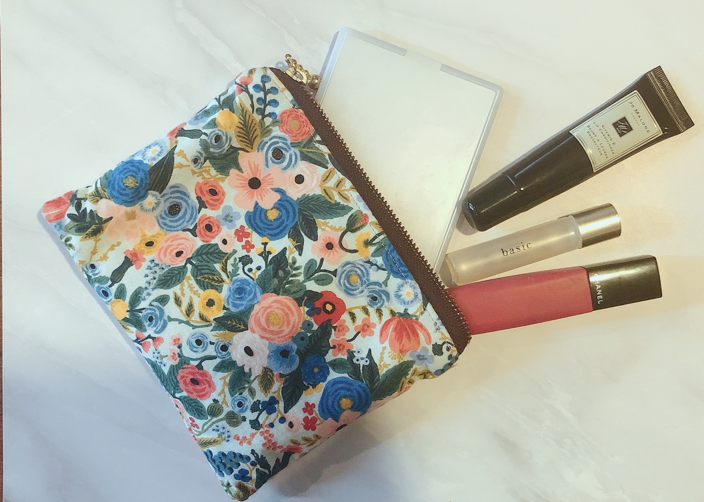
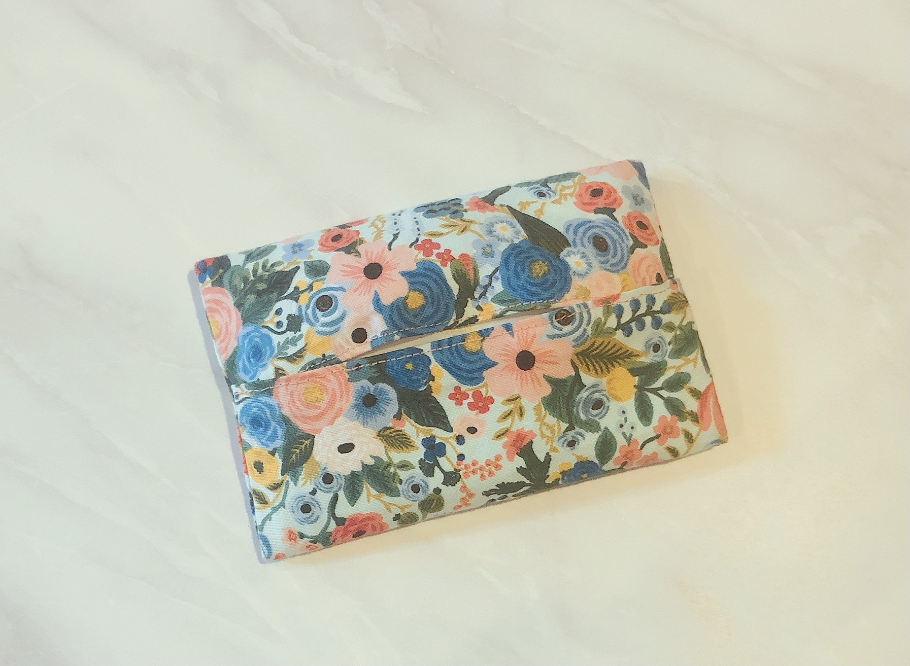
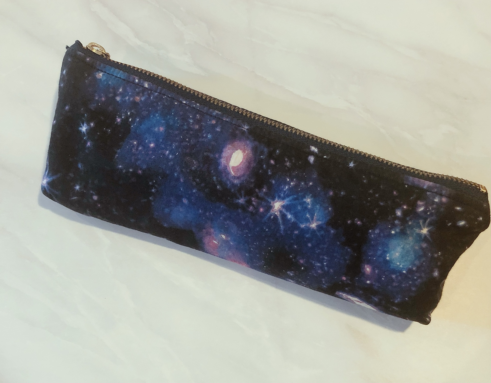
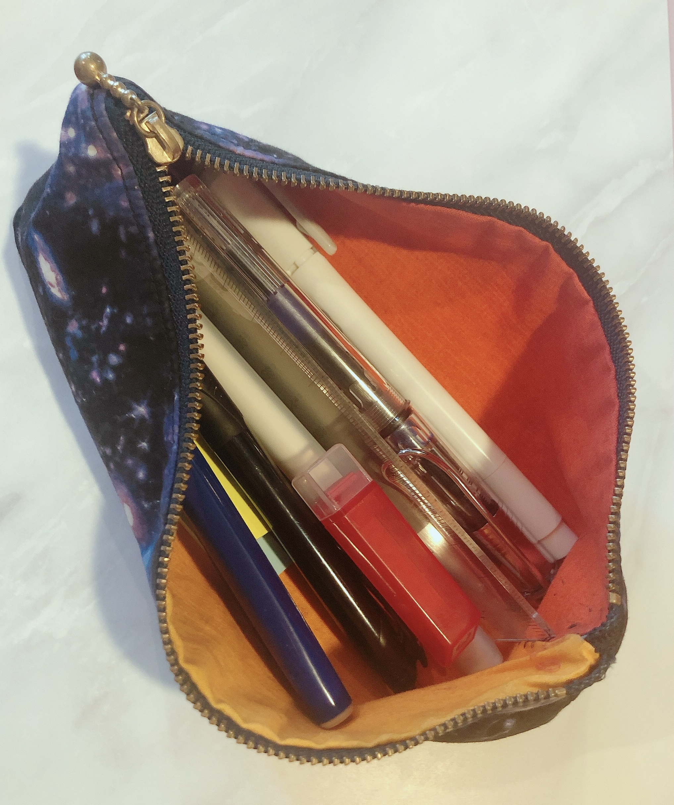
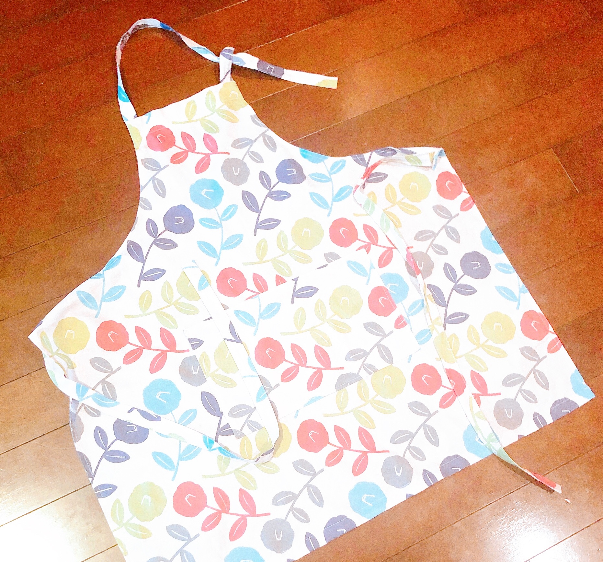
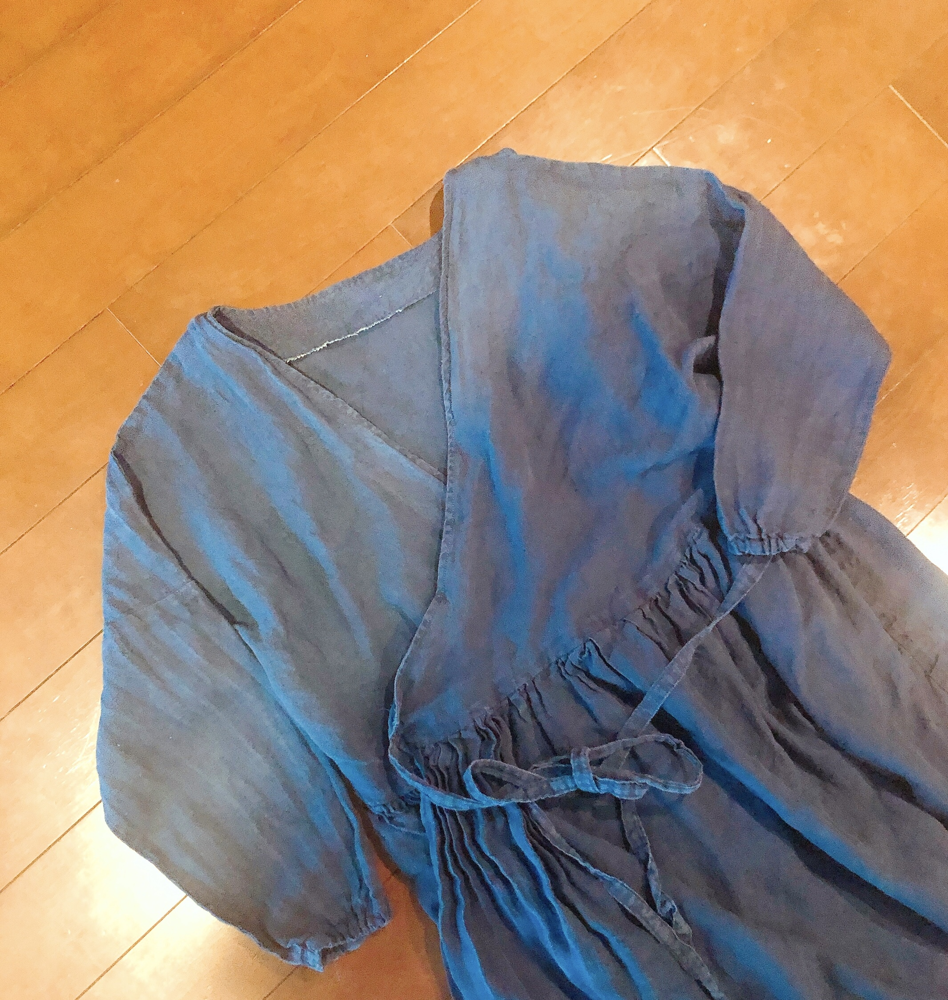

こんにちは。

コロナのおこもり中に、ミシンを買いました。

今年、いそしんでた手芸で作ったものたちを紹介します。

花柄の布が可愛くて、ポーチを作成。

同じ柄で、ティッシュケースも作りました。

宇宙柄のペンケース

中はオレンジのグラデーション。

家でゆっくり料理する時間も増えたのでエプロンも作った。

そして、カシュクールエプロン。

着ると、作務衣みたいに見えるけど、
部屋で着るには楽ちん。
