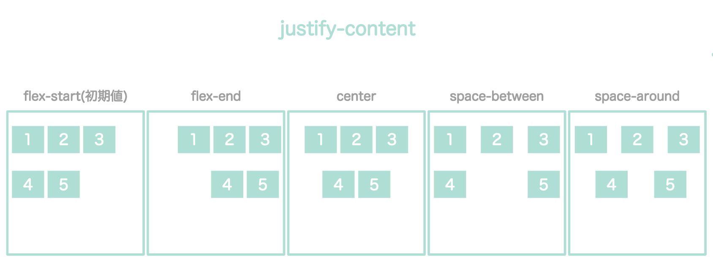
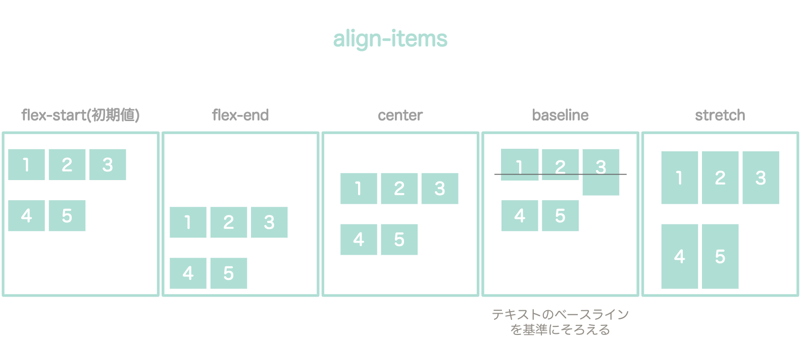
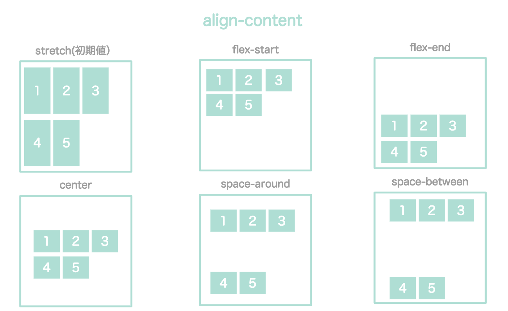
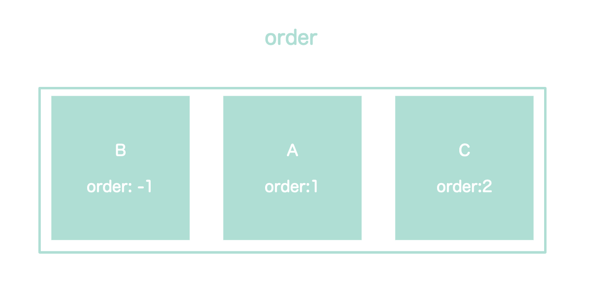
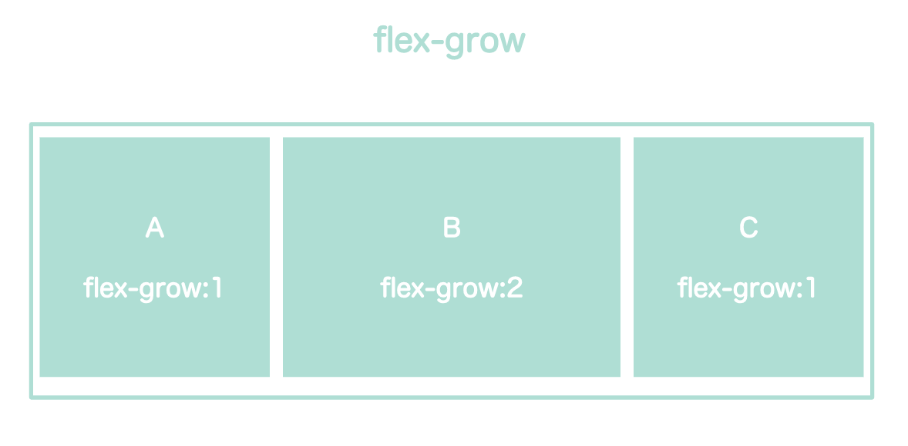
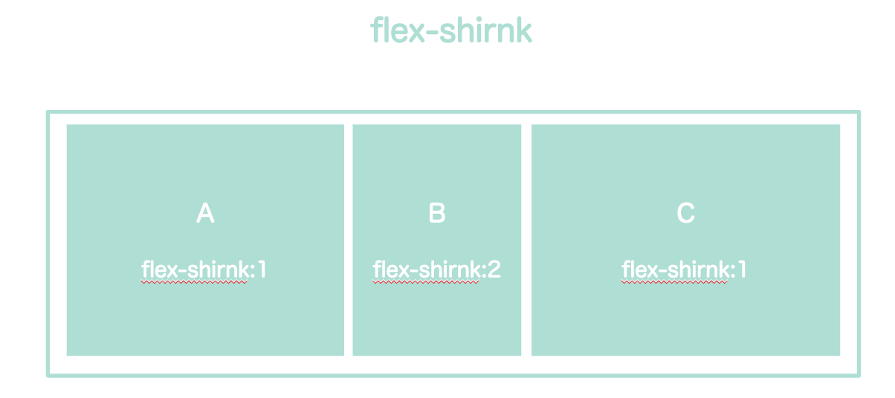
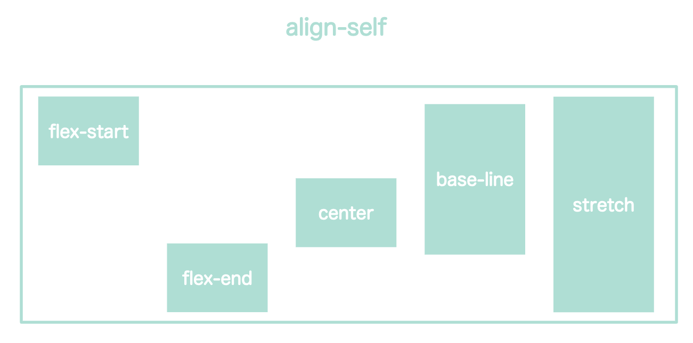

Flexboxは、CSSはWebページのレイアウトを設定できるモジュールです。

今回の記事では、Flexboxでよく使うプロパティをまとめました。

## Flexboxの使い方


Flexboxを使う時は、整列させたいアイテム(item)をまとめて格納するコンテナ（conteiner)を用意します。

```html
<div class="container">
  <div class="itemA">A</div>
  <div class="itemB">B</div>
  <div class="itemC">C</div>
</div>
```

`display: flex;`を親要素（container）に設定します。

```css
.container{
    display: flex;
    /* IE11をサポートする場合は以下の２行も記述する */
    display: -webkit-box;
    display: -ms-flexbox;
}
```

これで、子要素(item)が横並びになります。


## Flexbox：親要素に設定するプロパティ

Flexboxにはいろいろなプロパティが用意されており、アイテムの並べ方を調整できます。

【親要素に設定するプロパティ】

| プロパティ | 説明 |
| ---- | ---- |
| **flex-direction** | 縦並びか横並びか |
| **flex-wrap** | １行にするか折り返すか |
| **justify-content** | 水平方向の配置 |
| **align-items** | 垂直方向の配置 |
| **align-content** | 複数行の時の垂直方向の配置 |


### flex-dircetion：縦並びか横並びか

```css
.container {
  flex-direction: row;
}
```

| プロパティ | 説明 |
| ---- | ---- |
| row(初期値) | 横（左から右）に配置 |
| column | 縦（上から下）に配置 |
| row-reverse | 横（右から左）に配置 |
| column-reverse | 縦（下から上）に配置 |


### flex-wrap：折り返し

子要素を１行にまとめるか、子要素を複数行に並べるかの設定です。

```css
.container {
  display: flex;
  flex-wrap: wrap;
}
```

| プロパティ | 説明 |
| ---- | ---- |
| nowrap(初期値) | 折り返しなし。１行に収まるように縮小されて、並ぶ。 |
| wrap | 複数行に折り返す。上から下に並べる。 |
| wrap-reverse | 複数行に折り返す。下から上に並べる。 |


`flex-flow`を使うと、`flex-direction`と`flex-wrap`を一括設定できます。（初期値は`row nowrap`）

```css
.container {
  display: flex;
  flex-flow: row wrap;
}
```

### justify-content：水平方向の配置

水平方向の空きスペースを、どう子要素に振り分けるかの設定です。

```css
.container {
  display: flex;
  justify-content: center;
}
```
| プロパティ | 説明 |
| ---- | ---- |
| flex-start（初期値） | 左揃え（flex-directionが縦の場合は上揃え） |
| flex-end | 右揃え（flex-directionが縦の場合は下揃え） |
| center | 中央揃え |
| space-between | 均等間隔（両端に余白なし） |
| space-around | 均等間隔（両端に余白あり） |



### align-items：垂直方向の配置

垂直方向の空きスペースを、どう子要素に振り分けるかの設定です。

```css
.container {
  display: flex;
  align-items: center;
}
```

| プロパティ | 説明 |
| ---- | ---- |
| flex-start（初期値） | 上揃え（flex-directionが縦の場合は左揃え） |
| flex-end | 下揃え（flex-directionが縦の場合は右揃え） |
| center | 中央揃え |
| baseline | ベースラインに合わせる |
| stretch | 子要素の高さに合わせて伸ばす |



### align-content：複数行の時の垂直方向の配置

```css
.container {
  display: flex;
  align-content: center;
}
```

| プロパティ | 説明 |
| ---- | ---- |
| stretch（初期値） | 高さに合わせて伸ばす |
| flex-start | 上揃え |
| flex-end | 下揃え |
| center | 中央揃え |
| space-around | 均等配置（上下の余白なし） |
| space-between | 均等配置（上下の余白あり） |



## 子要素に設定するプロパティ

【子要素に設定するプロパティ】

| プロパティ | 説明 |
| ---- | ---- |
| **order** | 子要素の並び順 |
| **flex-grow** | 子要素の伸び率 |
| **flex-shrink** | 子要素の縮み率 |
| **flex-basis** | 子要素の幅の値を指定 |
| **flex** | flex-grow、flex-shrink、flex-basisの一括設定 |
| **align-self** | 子要素の垂直方向の配置 |

### order：子要素の並び順

```css
.itemA { order: 2;}
.itemB { order: -1;}
.itemC { order: 1;}
```
デフォルトは0。マイナスを含む数値を設定できる。



### flex-grow：子要素の伸び率

```css
.itemB { flex-grow: 2;}
```

コンテナにスペースが余っているとき、子要素をどれくらい伸ばすか指定する。
デフォルトは0。プラスの数値を設定できる。



### flex-shrink：子要素の縮み率

```css
.itemB { flex-shrink: 2;}
```

コンテナにスペースがなくて、はみ出す時に、子要素をどれくらい縮めるか指定する。
デフォルトは1。プラスの数値を設定できる。



### align-self：子要素の垂直方向の配置

```css
.itemA { flex-basis: 200px;}
.itemB { flex-basis: 20%}
```

コンテナにスペースがなくて、はみ出す時に、子要素をどれくらい縮めるか指定する。
デフォルトはauto。パーセントやピクセル値を設定できる。


### flex: flex-grow、flex-shrink、flex-basisの一括設定

```css
.itemA { flex: 0 1 30%; }
```

初期値は0 1 auto


### align-self：子要素の垂直方向の配置

```css
.itemA { align-self: center;}
```

| プロパティ | 説明 |
| ---- | ---- |
| auto（初期値） | 親要素align-itemsを継承 |
| flex-start | 上揃え|
| flex-end | 下揃え |
| center | 中央揃え |
| baseline | ベースラインに合わせる |
| stretch | 子要素の高さに合わせて伸ばす |

親要素にスペースがある場合に、子要素を垂直方向にどう整列させるかを設定する。
親要素のalign-itemsよりも、align-selfの方が優先される。



## Flexboxサンプル

* [Flexboxを使ったヘッダーサンプル](/flexbox-header/)

## 参考記事

* <a href="https://www.webcreatorbox.com/tech/css-flexbox-cheat-sheet" target="_blank" rel="noopener noreferrer">日本語対応！CSS Flexboxのチートシートを作ったので配布します！</a>

* <a href="https://coliss.com/articles/build-websites/operation/css/css3-flexbox-properties-by-scotch.html" target="_blank" rel="noopener noreferrer">CSS Flexbox の基礎知識と使い方をやさしく解説</a>
