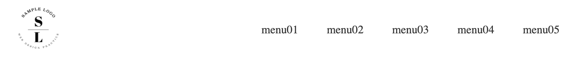

Flexboxは、CSSはWebページのレイアウトを設定できるモジュール。

Flexboxを使うと簡単に整列したり、配置できるようになるので、ヘッダーなどのレイアウトに使われています。



今回の記事では、Flexboxを使ったヘッダーの作り方を紹介します。

## よくあるヘッダーレイアウトをFlexboxで作る

### 左にロゴ、右にメニューがあるヘッダーレイアウト


<iframe height="400" style="width: 100%;" scrolling="no" title="flexboxで作るヘッダーB" src="https://codepen.io/filledforest/embed/KKVYaZg?height=400&theme-id=light&default-tab=html,result" frameborder="no" allowtransparency="true" allowfullscreen="true">
  See the Pen <a href='https://codepen.io/filledforest/pen/KKVYaZg'>flexboxで作るヘッダーB</a> by Emi
  (<a href='https://codepen.io/filledforest'>@filledforest</a>) on <a href='https://codepen.io'>CodePen</a>.
</iframe>

【解説】

一部だけ右寄せさせたい場合、右に寄せる要素（今回だとnav）に、`margin-left:auto`を設定します。

```css
nav {
  margin-left: auto;
}
```

私は、このmarginの挙動が理解できなかったのですが、子要素のmarginにautoを設定すると、空いたスペース分marginを広げるようです。

今回の場合は、navの左の空きスペースを埋めるようにmarginが拡張されるので、navは右側に押し出されます。


逆に、ロゴの方に`margin-right:auto`を設定すると、ロゴが左に移動します。

`margin:auto`は上下中央の配置になります。

【解説記事】

* <a href="https://coliss.com/articles/build-websites/operation/css/css-flexbox-and-auto-margins.html" target="_blank" rel="noopener noreferrer">CSS Flexboxとmargin: auto;の自動マージンがどのように相互作用するか、両端揃え・右寄せの実装テクニック</a>


### 真ん中にロゴ、左右にメニューがあるヘッダーレイアウト


<iframe height="400" style="width: 100%;" scrolling="no" title="flexboxで作るヘッダーA" src="https://codepen.io/filledforest/embed/KKVYavM?height=400&theme-id=light&default-tab=html,result" frameborder="no" allowtransparency="true" allowfullscreen="true">
  See the Pen <a href='https://codepen.io/filledforest/pen/KKVYavM'>flexboxで作るヘッダーA</a> by Emi
  (<a href='https://codepen.io/filledforest'>@filledforest</a>) on <a href='https://codepen.io'>CodePen</a>.
</iframe>


【解説】

```css
.logo{
    margin: 0 auto;
}
```

これで、ロゴを真ん中に配置するようにしています。

### 上にロゴ、下にメニューがあるヘッダーレイアウト


<iframe height="400" style="width: 100%;" scrolling="no" title="flexboxで作るヘッダーC" src="https://codepen.io/filledforest/embed/bGEJgLd?height=400&theme-id=light&default-tab=html,result" frameborder="no" allowtransparency="true" allowfullscreen="true">
  See the Pen <a href='https://codepen.io/filledforest/pen/bGEJgLd'>flexboxで作るヘッダーC</a> by Emi
  (<a href='https://codepen.io/filledforest'>@filledforest</a>) on <a href='https://codepen.io'>CodePen</a>.
</iframe>

【解説】


```css
.header {
  display: flex;
  align-items: center;
  flex-direction: column;
}
```

ロゴとメニューは縦に並べたいので、`flex-direction: column`と設定しています。
