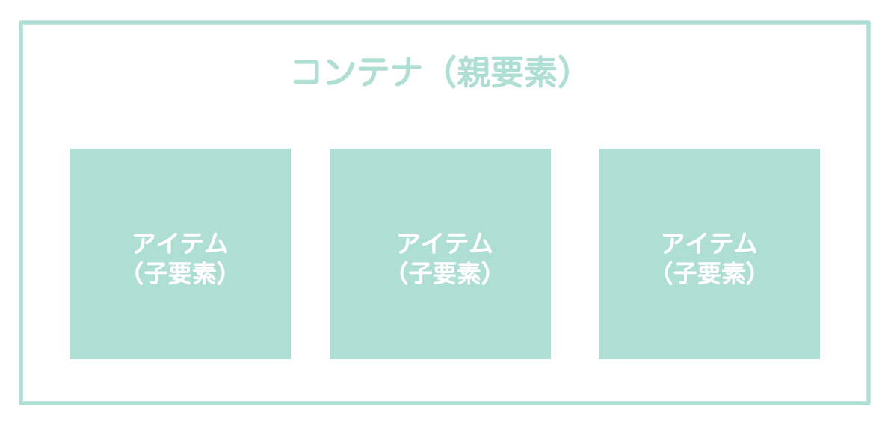
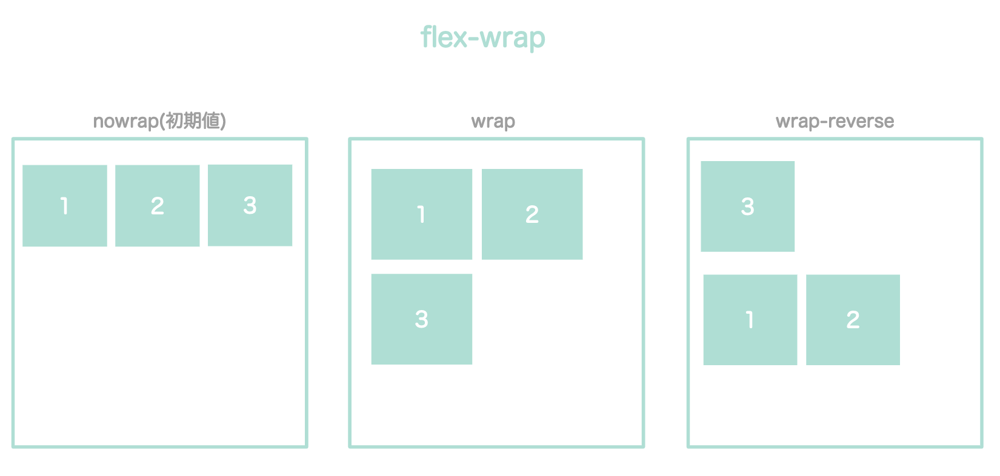
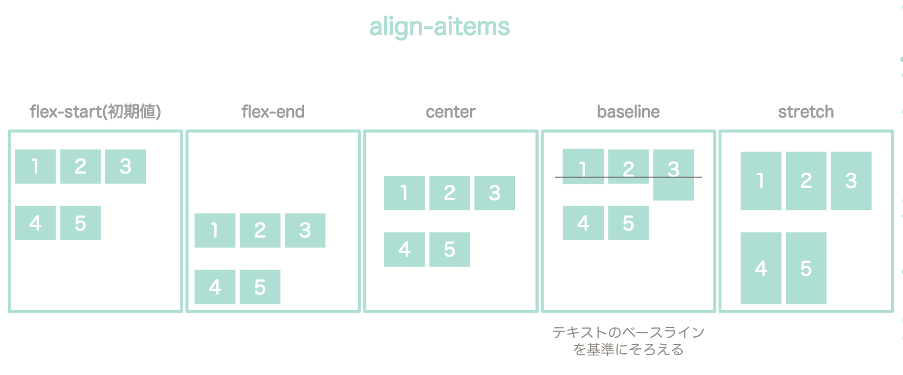
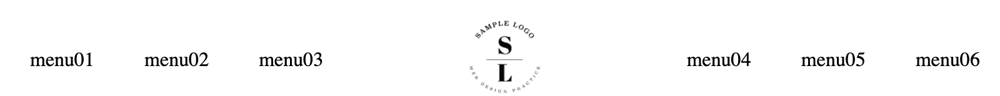
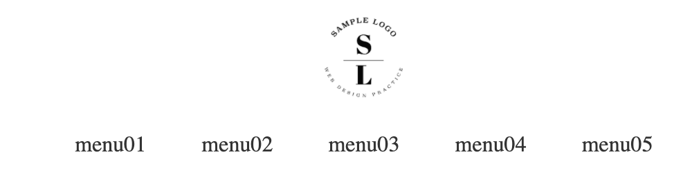

Flexboxは、CSSはWebページのレイアウトを設定できるモジュール。

Flexboxを使うと簡単に整列したり、配置できるようになるので、ヘッダーなどのレイアウトに使われています。


今回の記事では、Flexboxでよく使うプロパティの解説と、Flexboxを使ったヘッダーの作り方を紹介します。

## Flexboxの使い方



Flexboxを使う時は、整列させたいアイテム(item)をまとめて格納するコンテナ（conteiner)を用意します。


```html
<div class="container">
  <div class="item"></div>
  <div class="item"></div>
  <div class="item"></div>
</div>
```

`display: flex;`を親要素（container）に設定します。

```css
.container{
    display: flex;
    /* IE11をサポートする場合は以下の２行も記述 */
    display: -webkit-box;
    display: -ms-flexbox;
}
```

これで、子要素(item)が横並びになります。


## Flexboxでよく使うプロパティ

Flexboxにはいろいろなプロパティが用意されており、アイテムの並べ方を調整できます。

| プロパティ | 説明 |
| ---- | ---- |
| **flex-direction** | 縦並びか横並びか |
| **flex-wrap** | １行にするか折り返すか |
| **justify-content** | 水平方向の配置 |
| **align-items** | 垂直方向の配置 |

いずれも、親要素に設定します。

### flex-dircetion

```css
.container {
  flex-direction: row;
}
```

| プロパティ | 説明 |
| ---- | ---- |
| row(初期値) | 横（左から右）に配置 |
| column | 縦（上から下）に配置 |
| row-reverse | 横（右から左）に配置 |
| column-reverse | 縦（下から上）に配置 |


### flex-wrap：折り返し

子要素を１行にまとめるか、子要素を複数行に並べるかの設定です。

```css
.container {
  display: flex;
  flex-wrap: wrap;
}
```

| プロパティ | 説明 |
| ---- | ---- |
| nowrap(初期値) | 折り返しなし。１行に収まるように縮小されて、並ぶ。 |
| wrap | 複数行に折り返す。上から下に並べる。 |
| wrap-reverse | 複数行に折り返す。下から上に並べる。 |



また、`flex-flow`を使うと、`flex-direction`と`flex-wrap`を一括設定できます。（初期値は`row nowrap`）

```css
.container {
  display: flex;
  flex-flow: row wrap;
}
```

### justify-content：水平方向の配置

水平方向の空きスペースを、どう子要素に振り分けるかの設定です。

```css
.container {
  display: flex;
  justify-content: center;
}
```
| プロパティ | 説明 |
| ---- | ---- |
| flex-start（初期値） | 左揃え（flex-directionが縦の場合は上揃え） |
| flex-end | 右揃え（flex-directionが縦の場合は下揃え） |
| center | 中央揃え |
| space-between | 均等間隔（両端に余白なし） |
| space-around | 均等間隔（両端に余白あり） |


### align-items：垂直方向の配置

垂直方向の空きスペースを、どう子要素に振り分けるかの設定です。

```css
.container {
  display: flex;
  align-items: center;
}
```

| プロパティ | 説明 |
| ---- | ---- |
| flex-start（初期値） | 上揃え（flex-directionが縦の場合は左揃え） |
| flex-end | 下揃え（flex-directionが縦の場合は右揃え） |
| center | 中央揃え |
| baseline | ベースラインに合わせる |
| stretch | 子要素の高さに合わせて伸ばす |




【詳しい解説記事】

* <a href="https://web-designer.cman.jp/css_ref/abc_list/flexbox/" target="_blank" rel="noopener noreferrer">flexboxの機能一覧</a>

* <a href="https://coliss.com/articles/build-websites/operation/css/css3-flexbox-properties-by-scotch.html" target="_blank" rel="noopener noreferrer">CSS Flexbox の基礎知識と使い方をやさしく解説</a>

* <a href="https://www.webcreatorbox.com/tech/css-flexbox-cheat-sheet" target="_blank" rel="noopener noreferrer">日本語対応！CSS Flexboxのチートシートを作ったので配布します！</a>

## よくあるヘッダーレイアウトをFlexboxで作る

### 左にロゴ、右にメニューがあるヘッダーレイアウト


<iframe height="400" style="width: 100%;" scrolling="no" title="flexboxで作るヘッダーB" src="https://codepen.io/filledforest/embed/KKVYaZg?height=400&theme-id=light&default-tab=html,result" frameborder="no" allowtransparency="true" allowfullscreen="true">
  See the Pen <a href='https://codepen.io/filledforest/pen/KKVYaZg'>flexboxで作るヘッダーB</a> by Emi
  (<a href='https://codepen.io/filledforest'>@filledforest</a>) on <a href='https://codepen.io'>CodePen</a>.
</iframe>

【解説】

一部だけ右寄せさせたい場合、右に寄せる要素（今回だとnav）に、`margin-left:auto`を設定します。

```css
nav {
  margin-left: auto;
}
```

私は、このmarginの挙動が理解できなかったのですが、子要素のmarginにautoを設定すると、空いたスペース分marginを広げるようです。

今回の場合は、navの左の空きスペースを埋めるようにmarginが拡張されるので、navは右側に押し出されます。


逆に、ロゴの方に`margin-right:auto`を設定すると、ロゴが左に移動します。

`margin:auto`は上下中央の配置になります。

【解説記事】

* <a href="https://coliss.com/articles/build-websites/operation/css/css-flexbox-and-auto-margins.html" target="_blank" rel="noopener noreferrer">CSS Flexboxとmargin: auto;の自動マージンがどのように相互作用するか、両端揃え・右寄せの実装テクニック</a>


### 真ん中にロゴ、左右にメニューがあるヘッダーレイアウト



<iframe height="400" style="width: 100%;" scrolling="no" title="flexboxで作るヘッダーA" src="https://codepen.io/filledforest/embed/KKVYavM?height=400&theme-id=light&default-tab=html,result" frameborder="no" allowtransparency="true" allowfullscreen="true">
  See the Pen <a href='https://codepen.io/filledforest/pen/KKVYavM'>flexboxで作るヘッダーA</a> by Emi
  (<a href='https://codepen.io/filledforest'>@filledforest</a>) on <a href='https://codepen.io'>CodePen</a>.
</iframe>


【解説】

```css
.logo{
    margin: 0 auto;
}
```

これで、ロゴを真ん中に配置するようにしています。

### 上にロゴ、下にメニューがあるヘッダーレイアウト



<iframe height="400" style="width: 100%;" scrolling="no" title="flexboxで作るヘッダーC" src="https://codepen.io/filledforest/embed/bGEJgLd?height=400&theme-id=light&default-tab=html,result" frameborder="no" allowtransparency="true" allowfullscreen="true">
  See the Pen <a href='https://codepen.io/filledforest/pen/bGEJgLd'>flexboxで作るヘッダーC</a> by Emi
  (<a href='https://codepen.io/filledforest'>@filledforest</a>) on <a href='https://codepen.io'>CodePen</a>.
</iframe>

【解説】


```css
.header {
  display: flex;
  align-items: center;
  flex-direction: column;
}
```

ロゴとメニューは縦に並べたいので、`flex-direction: column`と設定しています。
