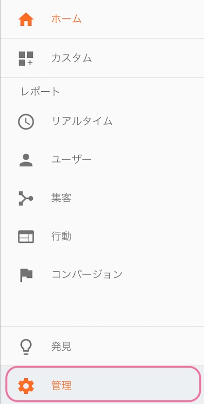
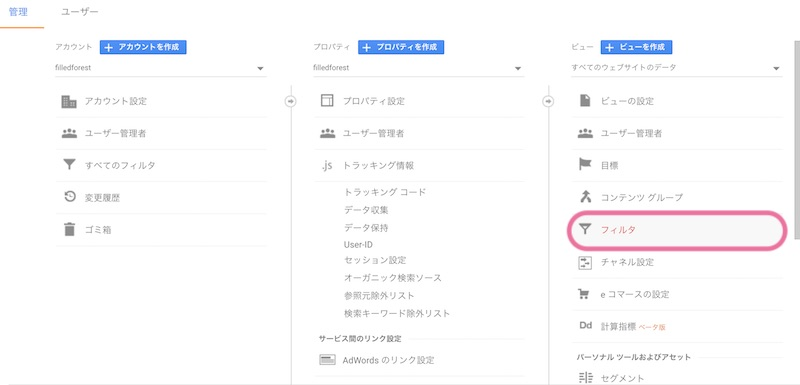
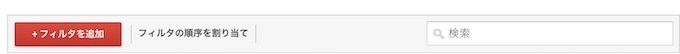
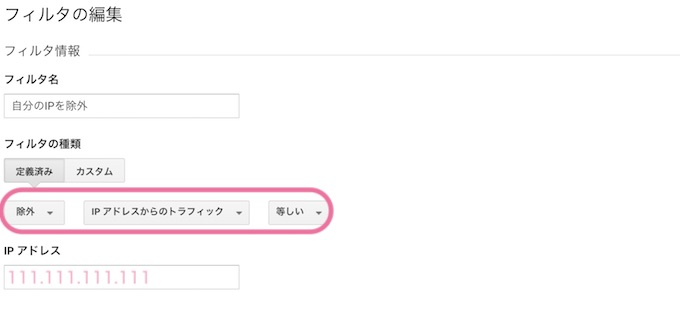
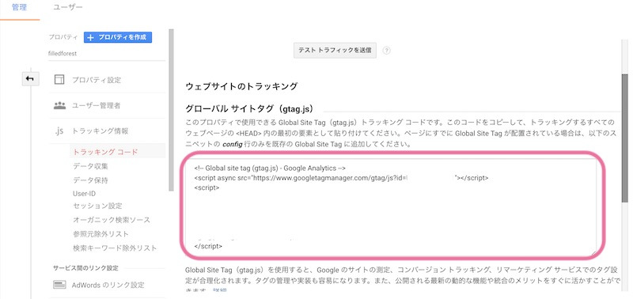

Google Analyticsでアクセスの集計をされている方は、自分がホームページを見た分は入れたくないですよね。 更新などでホームページをこまめにひらくこともありますし。 正確な数値をチェックできるよう、自分のアクセスを集計から除外する方法を設定しましょう。

## 方法１：自分のIPアドレスを除外する

 こちらはよく紹介されている方法です。 IPアドレスはインターネットにつながっているPCの住所のこと。 IPアドレスで自分が使っているPCからのアクセスを特定できるんですね。 実際に設定してみましょう。


Google Analyticsを開いて、左のメニューバーから管理画面にいきます。



フィルタにIPアドレスを編集します。






おうちのインターネット環境や、よくつかっているwifiをONにして設定してくださいね。 なお、外出時のカフェなど、他のネットワークを使っているときは、IPが変わってしまいます。 このあと、自分のホームページを開いた状態で、google analyticsの「リアルタイム」→「概要」を確認してみます。
これで、自分の見ている分が入っていなければオッケー。


ただし、この方法ですと、ネットワーク機器を再起動させたりすると、IPが変わることがありますので、確認して再設定する必要がでてきます。

## 方法２：ログインしているときは集計されないようにする

私は方法１で運営していたのですが、最近①でIP除外しているのにGA見てるとなんだか数値がおかしい。 どうやら記事を更新するとき時の下書きプレビューが集計されているみたい。自作自演の水増し結果になっている。笑。 前とIPアドレスが変わったのかも？

毎回、確認して変更するのは面倒なので、こちらのやり方に変更しました。

グーグルタグを入れる場所`<head>~</head>`の間にコードを入れます。

```markup
<?php if( !is\_user\_logged\_in() ) : ?>
    <!-- ここにGoogle AnalyticsやGoogleタグマネージャーのトラッキングコードを入れる -->
<?php endif; ?>
```

`!is\_user\_logged\_in`という条件を入れることで、ログイン時にはGoogle Analytics集計に入らないようになります。

トラッキングコードは「管理」＞「プロパティ」＞トラッキング情報からトラッキングコードの情報のページを開きます。 グローバル サイトタグの枠内のコードをそのままコピペすればオッケー。




## まとめ

自分のアクセスは集計から外して、正確な数値でアクセス解析しましょう。 すでに集計された過去のデータは変更できないので、導入してはじめに設定しておくのがオススメです。
