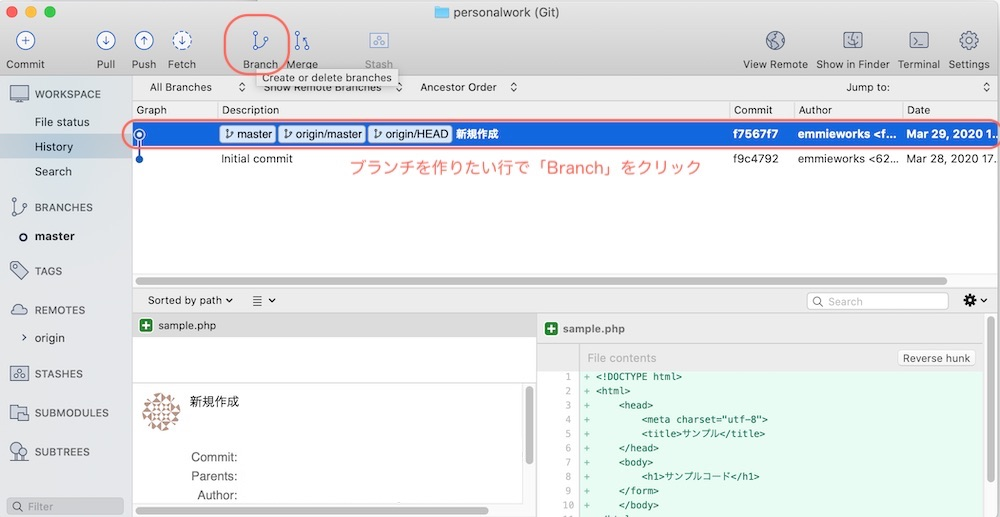
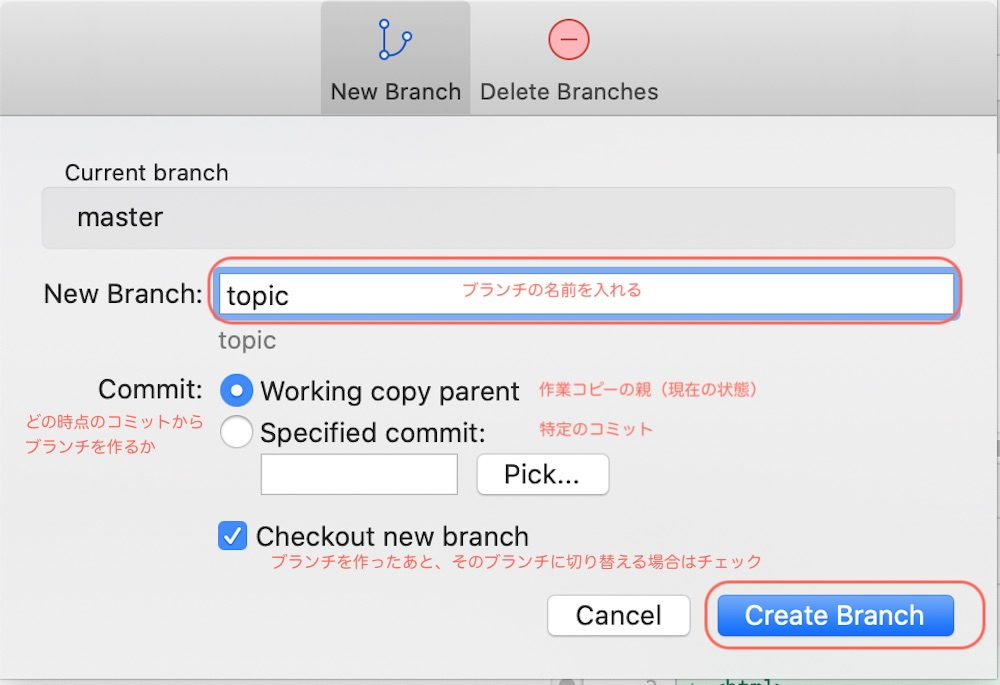
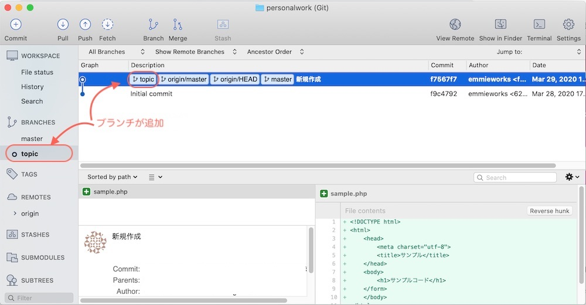
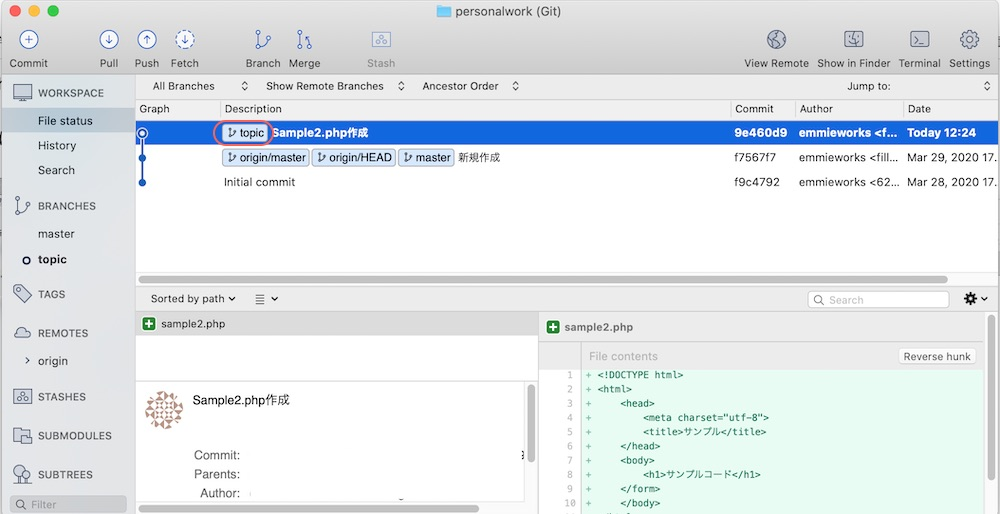
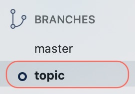
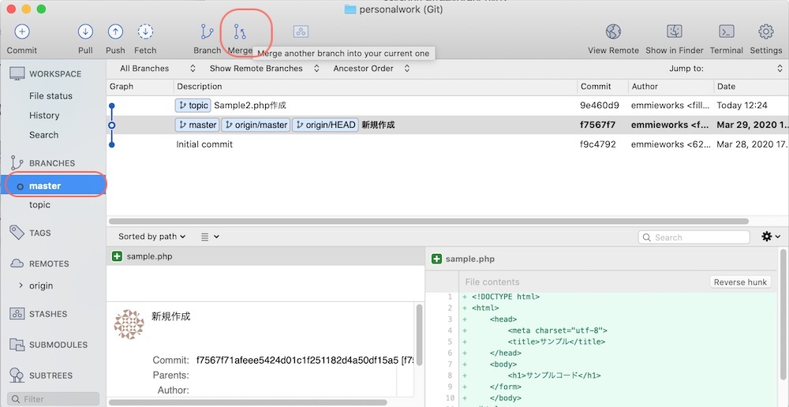
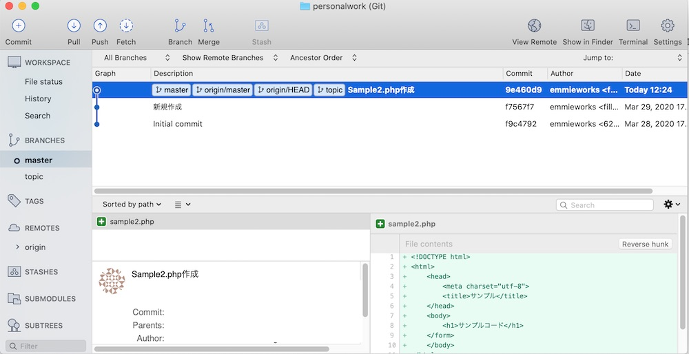
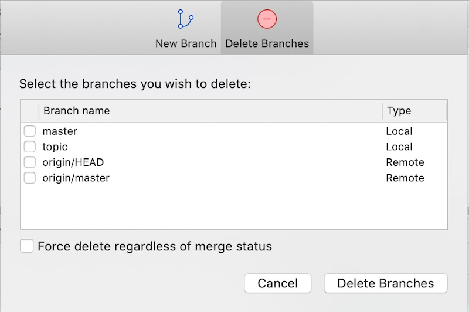

 バージョン管理では変更履歴を分けて管理できます。（「ブランチ」といいます。）

 知っておくと便利！実際どう使うの？🤔を解説します。

* バージョン管理でのブランチって何？
* 個人開発をするときの、ブランチの使い方
* Sourcetreeを使ったブランチの作成、切替え、マージ方法

gitでバージョン管理を使っている方はやってみてください。

## gitで使うブランチとは？

**「ブランチ」とは変更履歴を分けて管理すること**です。

ブランチ＝branch（枝）で、木の幹から枝が派生するイメージ。

ゲームのシナリオ分岐をイメージしてもらうと分かりやすいかも。
AとBのどちらを仲間にするかの選択があって、Aを選んだけど、Bを仲間にしたときのエピソードを見たいときにセーブ分けますよね？

Gitでは、本筋のセーブをmasterブランチと呼んでいます。
master ブランチは**納品用、完成品バージョン**として使います。

ブランチの使い方

* 開発したいとき→開発ようにブランチを分ける。完成したら、masterに合流。
* 完成品に追加の機能をつけたいときに→追加機能用のブランチを分ける。
* このやり方でうまくいくか度試すとき→ブランチを分けて試しで作ってみて、うまくいかなかったらブランチごと捨てる。

## ブランチの使い方

Sourcetreeを使って、実際にやってみましょう。

まず最初にコミットをすると「master」というブランチが作られます。
そのままだと、その後のコミットも、「master」に履歴が追加されていきます。

### ブランチを分ける

分岐を作りたい箇所を選択して、上部の「branch」をクリックします。

ブランチの名前を入力して「Create Branch」を押す

新しいブランチ「topic」ができました。

このあとコミットしていくと、topicブランチにバージョン履歴がたまっていきます。

### ブランチを切り替える

ブランチはダブルクリックすると、切り替えることができます。

○がついているのが選択中のブランチ

### masterブランチに統合する

masterブランチにtopicを統合します。（masterにtopicを吸収させるイメージ。）

まずはブランチを切り替えます。masterの方をダブルクリックすると、masterに切り替わります。

そして、ここで「merge(マージ）」をクリックします。

 マージさせるコミットを選択します。

マージができると、masterとtopicが同じ箇所に印がつきます

## ブランチの削除
masterを選択した状態で、上部の「Branch」を選択します。
「Delete Branch」を選んで先ほど作成した「topic」をチェックを入れて、「Delete Branches」とするとブランチを削除できます。

## ブランチのまとめ

* ブランチとは＝バージョン履歴を分けること
* Source Treeでのブランチの作成、切り替え、マージ、削除方法
の紹介でした！

