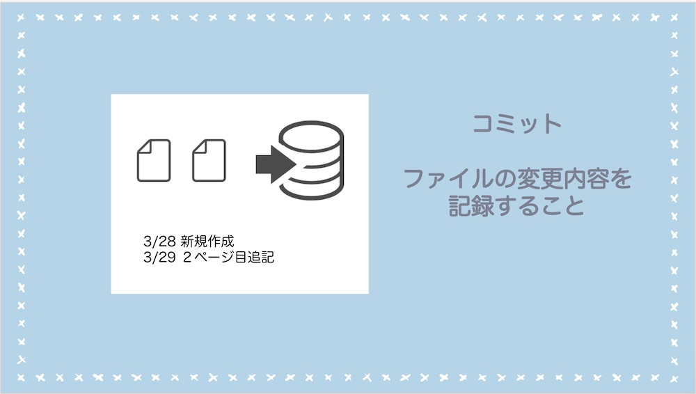
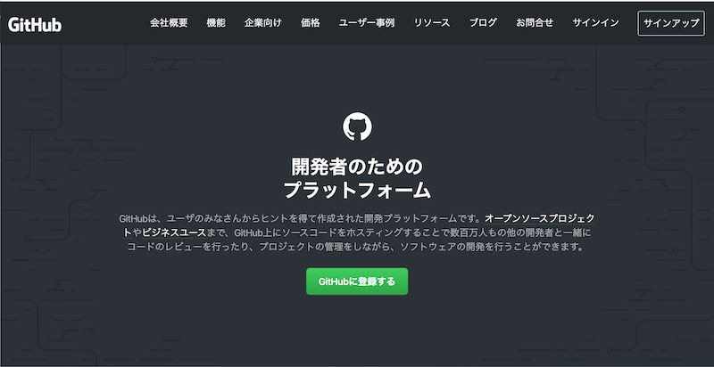
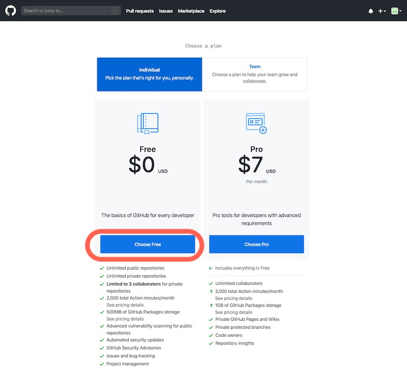
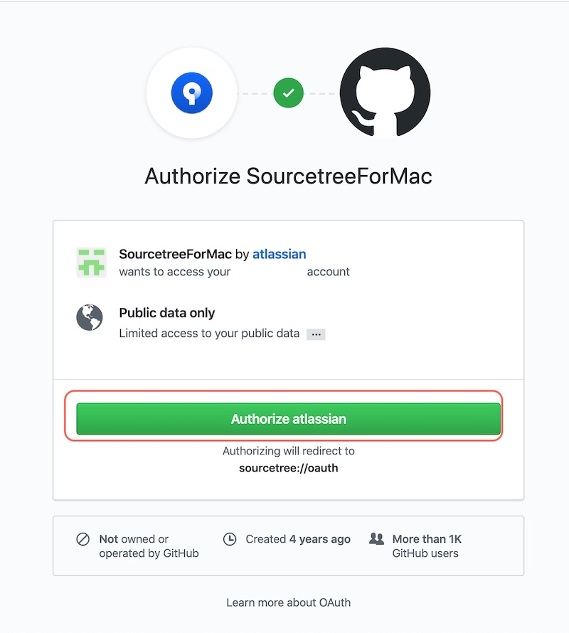
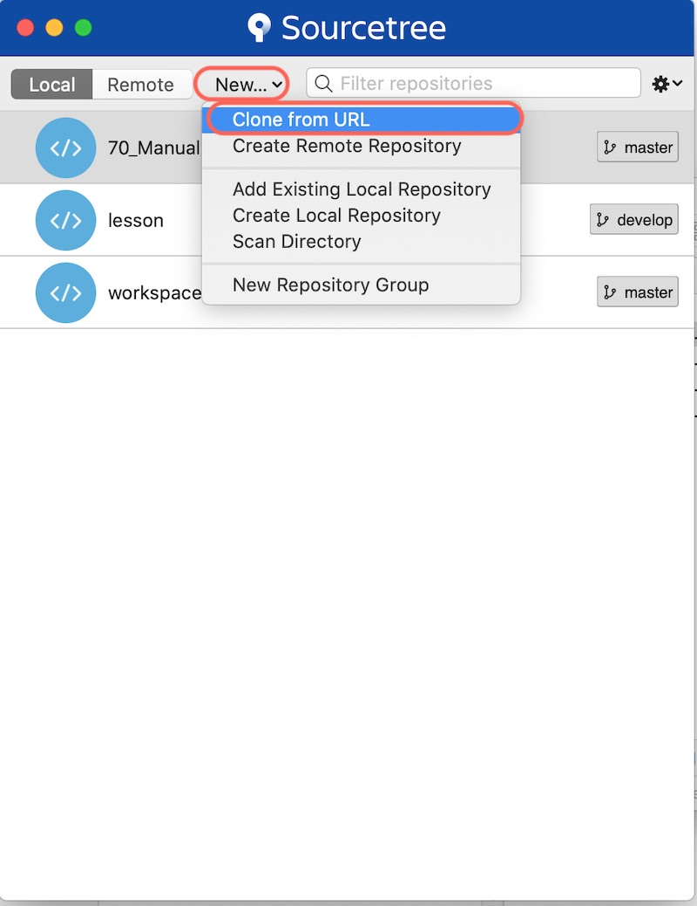
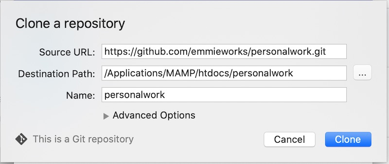
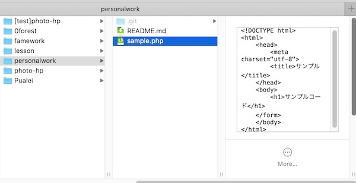
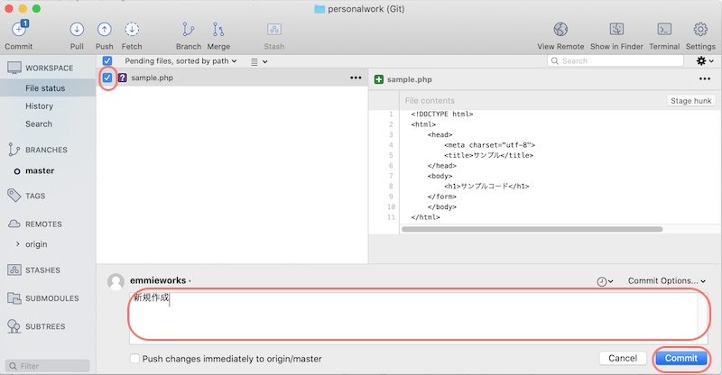
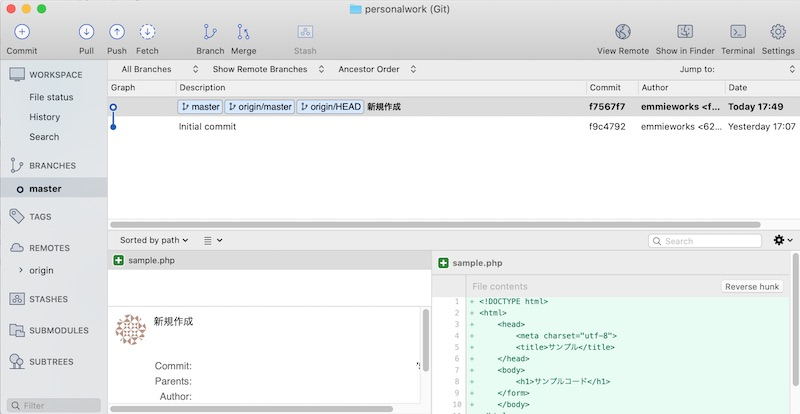

プログラミングではよく使われるバージョン管理。

慣れるまで大変だけど、使えるようになるとめっちゃ便利！です。

今回は、はじめてgitを使うための手順と基本を解説しました。

## gitとは？バージョン管理のメリット

gitは、ファイルのバージョン管理システムです。

バージョン管理とはゲームでいう**セーブポイント**。

ゲーム中のセーブポイントのように、作業ごとにその時点の状態を保存しておいて、後から元の状態に戻すことができます。

<div style="position:relative;border:1px solid #91c294;border-radius:6px;padding:25px 30px;margin:30px;font-size:0.9rem;">
  <span style="position:absolute; top: -12px;left: 10px;padding: 5px 20px;background-color: #91c294;border-radius:4px;color:#fff;line-height: 1em;font-size:0.9rem;">
    バージョン管理はこんな時に便利
  </span>
- コードやファイルの変更を記録できる<br />
- プログラムを書く時の作業やバグの振り返り<br />
- テキストファイル（小説やブログ記事）の下書き、編集、校閲の履歴をたどる
</div>

gitを使うことで、

* 提案書_20200115.txt
* 提案書_20200116.txt

というように、同じファイルを分けて管理する必要がなくなります。

## バージョン管理に必要なもの

主に３つのツールを使います。

①git

②GitHub

③Sourcetree

### Git

### GitHub
GitHubはgitを用いたオンラインサービスです。
gitはローカル環境（自分のPC上のみ）ですが、GitHubはweb上でソースコードや変更履歴を共有できるようになります。

GitHubを使うメリット

* 複数人でプログラムを分担して開発できる
* 他の端末でソースコードや変更履歴を共有できる
* 他サービスと連携して、ホームページやアプリを公開できる

なお、GitHubにはプライベート機能があり、アップしたファイルの公開／非公開を自分で選ぶことができます。

### SourceTree

SourcetreeはGUIでGitを簡単に操作するためのツールです。

gitを使う際、ターミナルからコマンドで打ち込む必要があります。

Sourcetreeを使うと、画面でファイルの変更履歴を見れたり、直接操作できるので、コマンドになれていない初心者にも使いやすいです。


## 覚えておきたいgitの基本用語４つ

バージョン管理で使う用語がいくつかありますが、まずこれだけ覚えればとりあえず使い始めることができます。

【バージョン管理でよくつかう用語】

| 用語 | 説明 |
| ---- | ---- |
| リポジトリ | 変更履歴の保管場所 |
| コミット| ファイルの変更を記録する|
| プッシュ| クラウド上にデータを送る|
| プル| クラウド上からデータをもらう|

順に説明していきます。

### リポジトリ

リポジトリ　＝ データの変更履歴を保管する場所


リポジトリは変更履歴を保管する場所です。

リポジトリには２種類あります。

* 自分のPC上：ローカルリポジトリ

* インターネット上：リモートリポジトリ


### コミット

コミット　＝ ファイルの変更履歴をリポジトリに保存すること



ただファイルを保存しただけでは、変更履歴は記録されません。

セーブポイントとして保存したいところ（作業が一段落したところで）、自分で作業内容を入力して記録します。

この変更内容の記録のことをコミットといいます。

### プルとプッシュ


プル ＝ リモートリポジトリの内容をローカルリポジトリに反映すること

プッシュ ＝ ローカルリポジトリの内容をリモートリポジトリに反映すること


【バージョン管理でよくつかう用語】

| 用語 | 説明 |
| ---- | ---- |
| リポジトリ | 変更履歴の保管場所。<br />リモートレポジトリ（Web上）とローカルレポジトリ(自分のPC上)がある。 |
| コミット | ファイルの変更をリポジトリに記録する |
| プッシュ | ローカルレポジトリ(自分のPC上)からリモートレポジトリ（Web上）にデータを送る |
| プル | リモートレポジトリ（Web上）からローカルレポジトリ(自分のPC上)にデータをもらう |

## Git、GitHub、SoureTreeのはじめかた【Mac編】

### gitを導入する

ターミナルを起動して、以下のコマンドを入力します。

```
git --version
```

確認画面が表示されて「コマンドライン・デベロッパー・ツール」をインストールするかどうか聞かれますので、インストールを行います。


```
git --version
```
これで、バージョンが表示されれば、ターミナルよりgitが使えるようになります。


### GitHubを導入する

<a href="https://github.co.jp/" target="_blank" rel="noopener noreferrer">GitHubの公式サイト</a>



ID,メールアドレス,パスワードを入力して、次に進みます。


プランは「個人（Free）」を選びます。



メールが届くので、メールで本人確認を行い、登録完了させます。


### SourcetreeにGitHubを連携する

<a href="https://www.Sourcetreeapp.com/" target="_blank" rel="noopener noreferrer">Sourcetreeの公式サイト</a>

Downloadボタンを押して、SourceTreeをインストールします。

Soucetreeを開いたら、GitHubのアカウントをSourcetreeに追加します。


アカウント追加ボタンを押します。


Webブラウザが立ち上がって、GitHubとの連携画面が表示されます。

「Authorize atlassian」をクリックします。



これで、アカウントが追加されました。


## 基本の使い方

### 新しくプロジェクトをはじめるとき

#### 1.新規リポジトリ作成

プロジェクトの始めに、GitHubでレポジトリ（変更履歴を管理する場所）を作ります。


レポジトリの作成が完了したところ。


右に共有用のURLが出てくるので`https://github〜〜`のURLをコピーします。

#### 2. クローン

続いて、GitHub上のリモートリポジトリの内容を丸ごとローカルのPCにコピーします。

※この作業をクローン（clone）と呼びます。

Sourcetree上部の「New」から「Clone from URL」をえらびます。



リモートレポジトリの情報を入力します。



* Source URL：先ほどGitHubでコピーしたURL

* Destination Path：自分のPC内の作業フォルダ

入力したら、Cloneを押します。


これで、新しくプロジェクトを始める設定は完了です。

プロジェクトフォルダの中に「.git」という隠しフォルダが追加されています。


### ふだんの作業でやること

#### 1. プル：リモートリポジトリからデータを同期させる（チームで開発しているときのみ）

複数人で、同じプログラムを編集している場合には、

自分が作業に入る前に、ローカルPC上のデータをリモート上データと同期させます。

個人の場合は、自分以外にファイルを更新しないので、この作業は飛ばしてOKです。

SourceTreeの「Pull(プル)」ボタンを押します。


#### 2.ファイルを更新する

プログラムなどを編集します。
試しに、sample.phpを作成して入れてみました。



すると、Sourcetree上では変更されたファイルが表示されます。


#### 3. コミットする

 作業が終わったら、コミットをします。（作業単位にコミットが基本）

ファイルにチェックを入れます。
複数ファイルをまとめて選ぶこともできます。




作業内容をメッセージ欄を入れて、コミットボタンを押します。


#### 4. プッシュ：ローカルの変更内容をリモートリポジトリへアップロードする

作業が終わったら、PC上の内容をネット上に反映します。

Pullボタンを押します。


OKを押します。


完了すると、origin/masterが一番上の行に移動します。



#### まとめ


## こんなときどうする？

### ターミナル上で操作するときのgitコマンド

| 用語 | コマンド | 補足 |
| ---- | ---- | ---- |
| 新規リポジトリ作成 | git init |  |
| リモートからのクローン| git clone https://github.com/XXXX/XXXXXX.git | |
| ファイルインデックスに追加| git add ファイル名 | git add -Aで全ファイル追加 |
| コミット | git commit -m "コミットメッセージ" | |
| プル | git pull | |
| プッシュ | git push origin master | リモートリポジトリoriginのmasterブランチにプッシュするという意味|

### バージョン管理したくないファイル

.gitignoreにバージョン管理しないファイルを追記します。

```
# ファイル名を指定
file.txt

# ディレクトリを指定
directory/

# テキストファイルを除外
*.txt
```

### 直前のコミットを修正したい

コミットメッセージの修正には、`git commit --amend`を使います。

```
$ git add -A
$ git commit -m "間違えたコミットメッセージ"
$ git commit --amend -m "正しいコミットメッセージ"
```

また、コミットし忘れたファイルを直前のコミットに追加することもできます。

```
$ git add A.txt
$ git commit -m "AとBの修正"
```

ファイルAとBの修正なのに、Aのみコミットしてしまった場合、以下のように対処します。
```
$ git add B
$ git commit --amend --no-edit
```

### 以前のコミット状態に戻る
SourceTreeのコミットの一覧から、戻りたいコミットの行をダブルクリックします。

選択したコミットの行に「HEAD」のマークがつきます。

HEADは現在のリポジトリの状態をしめしています。

### 作業前の状態にもどしたい

コミット前であれば、変更内容を破棄して、ファイルを作業前の状態に戻すことができます。

SourceTree上で、コミット前のファイルを選択し、右クリック＞破棄をクリックします。


### 間違った内容でコミットをしてしまった場合

間違えたコミットを捨てるときには`git reset`を使います。

SourceTree上では、
取り消したいコミットの一つ手前で右クリックし「現在のブランチをこのコミットまでリセット」をクリックします。
ダイアログでモードを選択します。

resetには３つのモードがあります。
| モード | HEADの位置 | インデックス<br />（git addされたファイルの状態） | ワーキングツリー<br />（ローカルリポジトリの状態） |
| ---- | ---- | ---- | ---- |
| Soft | 変更する | 変更しない | 変更しない |
| Mix | 変更する | 変更する | 変更しない |
| Hard | 変更する | 変更する | 変更する |


A: 変更前
↓　ファイルを保存
B: ワーキングツリー
↓　git add
C: インデックス
↓　git commit
D:ローカルリポジトリ

* Soft：コミットだけなかったことにする（D→Cに戻る）
* Mix：インデックスの状態をリセット、作業コピーはそのまま残る（D→Bに戻る）
* Hard：指定したコミットを完全になかったことにする（D→Aに戻る）

【作業例】間違えた内容でコミットしちゃったとき
```
$ git commit -m "間違った作業内容でコミットしちゃった"
$ git reset --soft HEAD@{1}
<< 作業内容を修正 >>
<< 修正したファイルをgit add >>
$ git add ...
<< コミットやり直し >>
$ git commit -m "正しいコミット"
```

* `HEAD^`：直前のコミット。`HEAD^^`は２個前のコミット。
* `@^`：直前のコミット。`@^^`は２個前のコミット。
* `HEAD~`：直前のコミット。`HEAD~~`は２個前のコミット。
* `HEAD@{n}` ：n個前のコミットを意味する。


【作業例】直前のコミットをまるっと消したい
```
git reset --hard HEAD^
```

【作業例】コミット後の作業内容をまるっと消したい
```
git reset --hard HEAD
```

### ブランチの使い方
* [【Git】ブランチの使い方とSourceTreeでの操作方法](/git-branch/)

以上、バージョン管理の基本についてご紹介でした。