バージョン管理をしていて、前の状態に戻すやり方をまとめました。

## 過去のコミットしたときの状態を確認したい

元の状態


※他のコミットへ移動する前に、全ての変更をコミットしておきます。

SourceTreeのコミットの一覧から、戻りたいコミットの行をダブルクリックします。
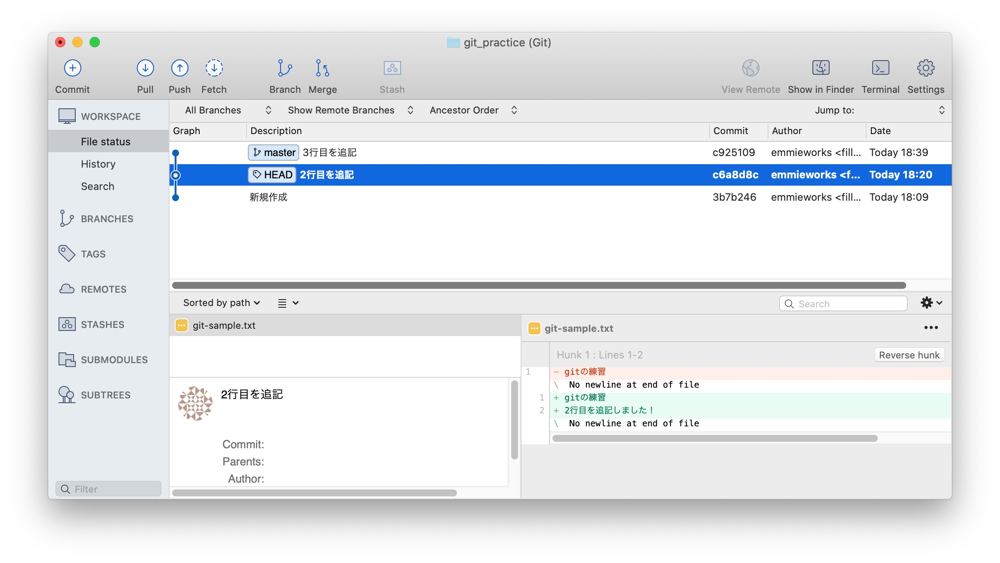

選択したコミットの行に「HEAD」のマークがつきます。
HEADは現在のリポジトリの状態をしめしています。

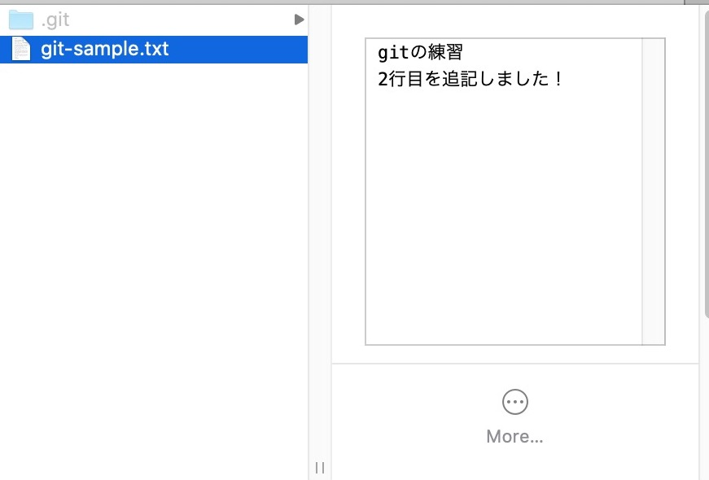

Sourcetreeの最新行（一番上の行）をダブルクリックすると元に戻ります。

## コミットする前：作業前の状態にもどしたい

間違えてファイルを編集、保存してしまったとき

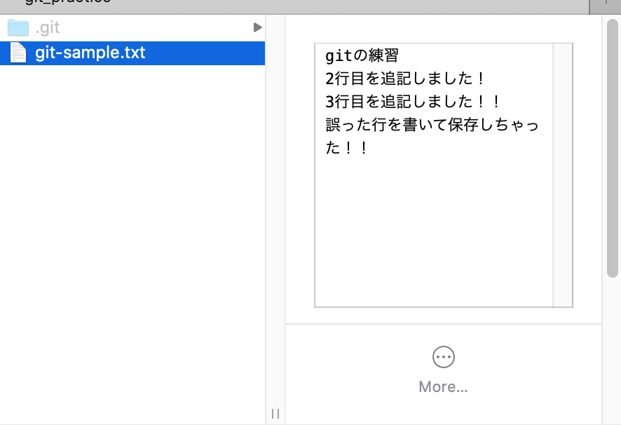

コミット前であれば、変更内容を破棄して、ファイルを作業前の状態に戻すことができます。

SourceTree上で、コミット前のファイルを選択し、右クリック＞破棄をクリックします。

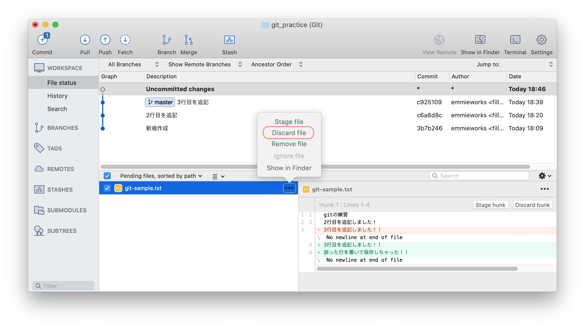

sourcetree上で変更内容が破棄されます。


Finderでも編集前の状態に戻っています。
[ファイルの状態](ss-git-01.jpg)

## コミットした後：コミットメッセージを修正したい

続いて、コミットメッセージを修正する場合です。

誤ったコミットメッセージでコミットしてしまいました。

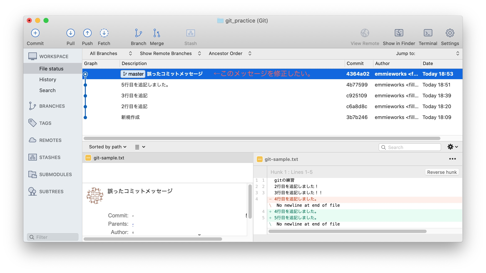

修正したい行の１行下で右クリックを押して「CommitAの子を対話形式でリベース‥」を選択します。

「メッセージを編集するボタンを押します。
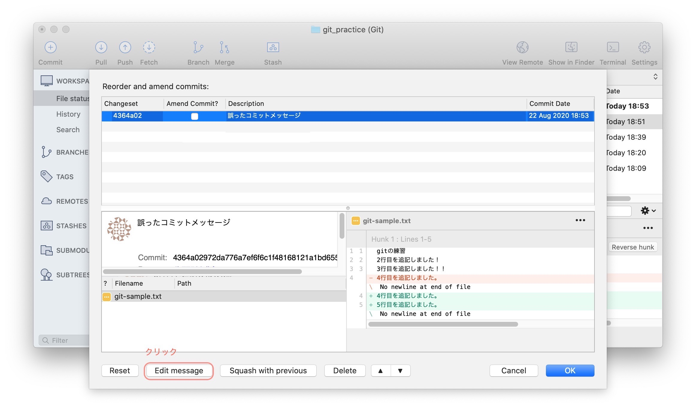

メッセージを修正してOKを押します
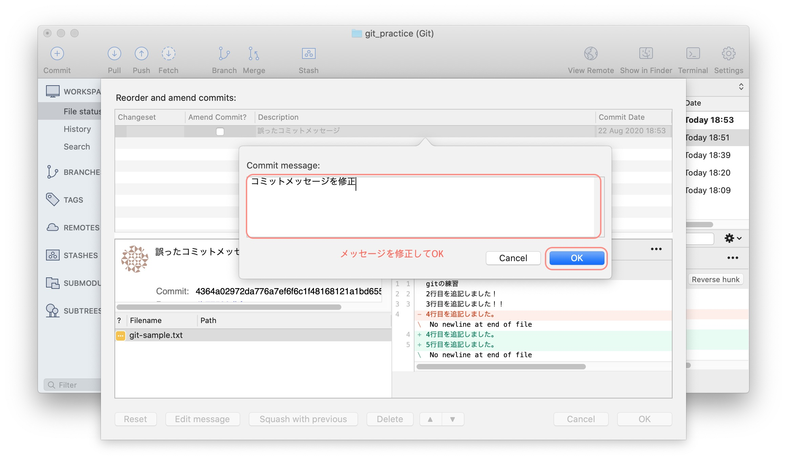

OKボタンを押します。
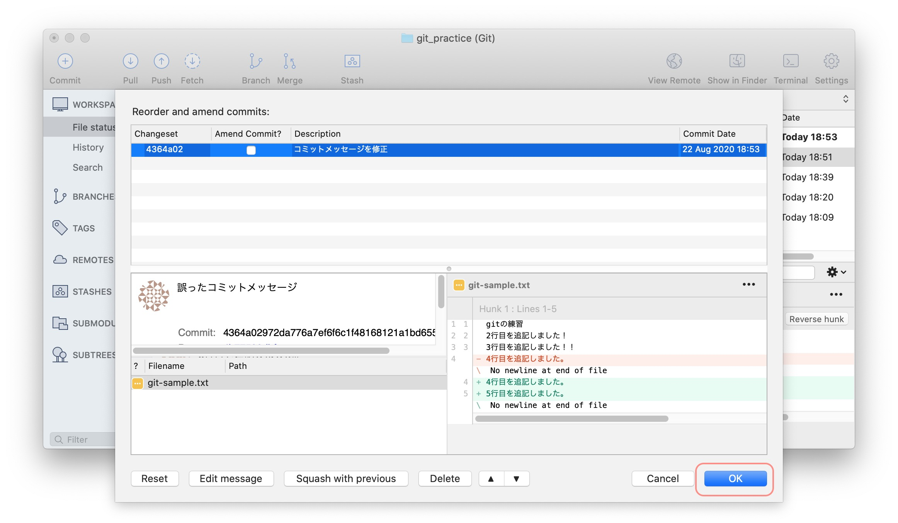

### コマンドで修正する場合

直前のコミットの修正には、`git commit --amend`を使います。
```
$ git add -A
$ git commit -m "間違えたコミットメッセージ"
$ git commit --amend -m "正しいコミットメッセージ"
```

また、コミットし忘れたファイルを追加することもできます。

例）ファイルAとBの修正なのに、Aのみコミットしてしまった場合

```
$ git add A.txt
$ git commit -m "AとBの修正"
$ git add B
$ git commit --amend --no-edit
```

## コミットした後：コミットを取り消したい

間違えたコミットを取り消す時には、取り消したいコミットの一つ手前で右クリックし「現在のブランチをこのコミットまでリセット」をクリックします。

元のファイル
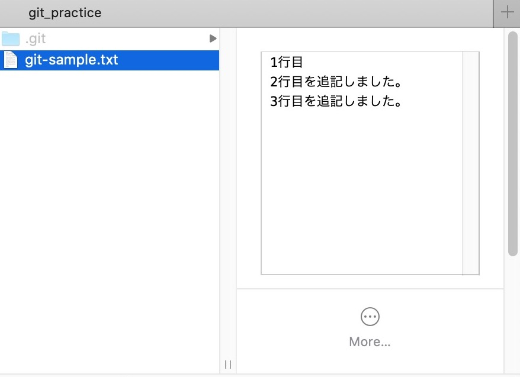

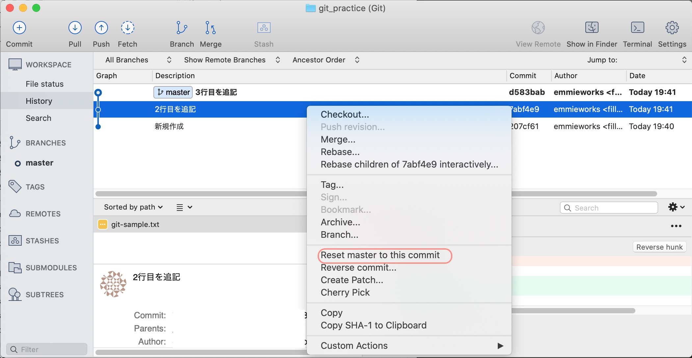

モードを選択します。

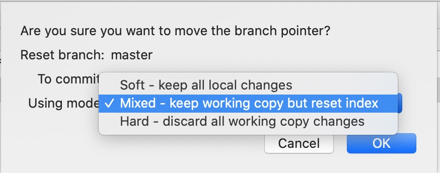

resetには３つのモードがあります。

| モード | HEADの位置 | インデックス<br />（git addされたファイルの状態） | ワーキングツリー<br />（ローカルリポジトリの状態） |
| ---- | ---- | ---- | ---- |
| Soft | 変更する | 変更しない | 変更しない |
| Mix | 変更する | 変更する | 変更しない |
| Hard | 変更する | 変更する | 変更する |

ファイルがコミットされるまでの流れ
A: 変更前
↓　ファイルを保存
B: ワーキングツリー
↓　ファイルをステージング（git add）
C: インデックス
↓　コミット（git commit）
D:ローカルリポジトリ

* Soft：コミットだけなかったことにする（D→Cに戻る）
* Mix：インデックスの状態をリセット、作業コピーはそのまま残る（D→Bに戻る）
* Hard：指定したコミットを完全になかったことにする（D→Aに戻る）

Softにした場合、コミット前にもどり、ファイルの編集内容は残っています。
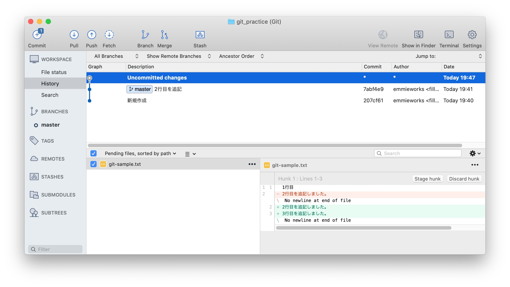


Hardにした場合、ファイルの編集内容も破棄されています。
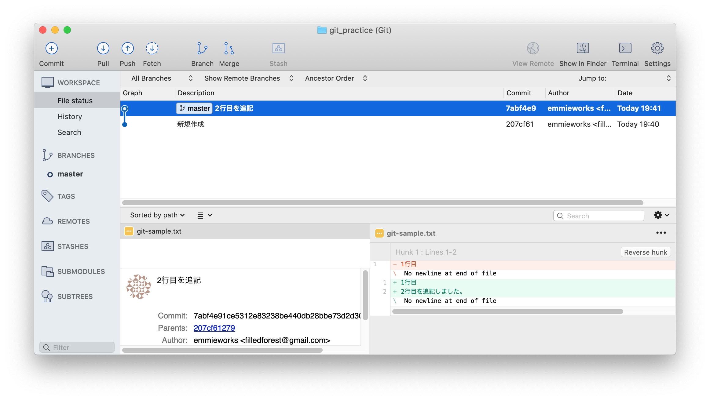


### コマンドで修正する場合

間違えたコミットを捨てるときには`git reset`を使います。

【作業例】間違えた内容でコミットしちゃったとき
```
$ git commit -m "間違った作業内容でコミットしちゃった"
$ git reset --soft HEAD@{1}
<< 作業内容を修正 >>
<< 修正したファイルをgit add >>
$ git add ...
<< コミットやり直し >>
$ git commit -m "正しいコミット"
```

* `HEAD^`：直前のコミット。`HEAD^^`は２個前のコミット。
* `@^`：直前のコミット。`@^^`は２個前のコミット。
* `HEAD~`：直前のコミット。`HEAD~~`は２個前のコミット。
* `HEAD@{n}` ：n個前のコミットを意味する。

<div class="related-posts">
    <span>バージョン管理のはじめかた</span>

1. [gitとSourcetreeをインストールして、バージョン管理をはじめる](/install-sourcetree/)
2. [GitHubインストールと普段のプロジェクトでの使い方](/git-install/)
3. 間違えて保存・コミットしたときに元に戻す方法まとめ（この記事）
4. [【gitでバージョン管理】ブランチを使って、履歴を分ける方法](/git-branch/)
5. [GitHubでソースコードをブログに載せる方法まとめ](/github-gist-wordpress/)

</div>