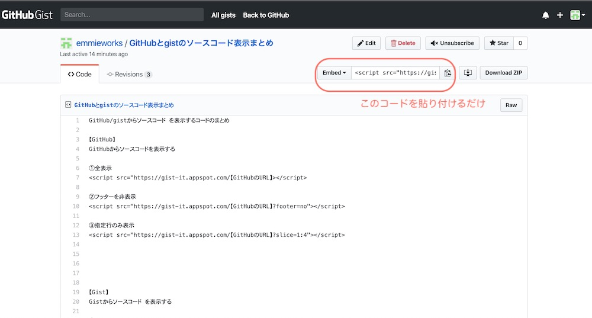

GitHub/GistからWordPressにコードを表示するための手順をまとめて掲載します♪

## GitHubからソースコードを表示する

GitHubのレポジトリにあるプログラムをブログに掲載するときはscriptコードを貼り付けます。

①基本

```markup
<script src="https://gist-it.appspot.com/github/【GitHubのURL】"></script>
```

例えば、URLが

```markup
https://github.com/emmieworks/python\_sample/blob/master/livedoor\_image\_downloader/01\_img\_download.py
```

であれば

【GitHubのURL】は

```markup
emmieworks/python\_sample/blob/master/livedoor\_image\_downloader/01\_img\_download.py
```

となります。


②フッターを非表示（デフォルト：表示）

```markup
<script src="https://gist-it.appspot.com/github/【GitHubのURL】?footer=no"></script>
```

③指定行のみ表示（デフォルト：表示）

```markup
<script src="https://gist-it.appspot.com/github/【GitHubのURL】?slice=1:4"></script>
```

## Gistからソースコードを表示する
GistはGitHubが提供している機能で、簡単にコードの一部や説明を登録して、ブログに貼り付けることができるようになります。

手順は簡単で、Gistの共有スクリプトを投稿画面に貼り付ければOK!（ブロックはカスタムHTMLを使います。）



[Gistの埋め込み方](https://lifool.com/gist/)

①基本

```markup
<script src="https://gist-it.appspot.com/github/【GitHubのURL】?slice=1:4"></script>
```

②指定したファイルのみを表示（デフォルト：表示）

```markup
<script src="https://gist-it.appspot.com/github/【GitHubのURL】?slice=1:4"></script>
```

## gist-embed.jsを使ってソースコードの表示を調整する

ある特定のファイルや特定行を表示したり、行のハイライトをするためには、gist-embed.jsを使用します。

### 事前準備

[gist-embed.jsの配布元はこちら](https://github.com/bvanderhoof/gist-embed)。

git-embededを使うには、functions.phpでgist-embeded.jsを読み込みます。

### gist-embedの使い方

①基本

```markup
<code data-gist-id="【gistID】”></code>
```

②指定したファイルのみ表示

```markup
<code data-gist-id="【gistID】" data-gist-file=“【ファイル名】”></code>
```

data-gist-fileでファイル名が指定できます。

③指定行のみ表示

```markup
<code data-gist-id="【gistID】” data-gist-line="5-8"></code>
```

data-gist-lineで指定した行のみ表示できます。
この場合は、５〜８行目のみ表示されます。

④指定行をハイライト

```markup
<code data-gist-id="【gistID】" data-gist-highlight-line="6-7"></code>
```

data-gist-highlight-lineで行をハイライトにできます
行は、1-3,5-8のようにカンマ区切りで複数指定可能。

この場合は、6行目と7行目に色がつきます。

⑤フッターを非表示にする（デフォルト：表示）

```markup
<code data-gist-id="【gistID】" data-gist-hide-footer="true"></code>
```

data-gist-hide-footer="true"でフッターを非表示にできます。

⑥行番号を非表示にする（デフォルト：表示）

```markup
<code data-gist-id="【gistID】"  data-gist-hide-line-numbers="true"></code>
```

data-gist-hide-line-numbers="true"で行番号を非表示にできます。

```markup
<code data-gist-id="93750c6914b598bc90d6ad7d3050cffc" data-gist-file="00_start-node-project.txt" data-gist-line="12"></code>
```

複数組み合わせて表示できます。

### git-embeded指定できるクラスまとめ

data-gist-file 指定したファイルのみ表示する

data-gist-line 指定行のみ表示する

data-gist-highlight-line 指定行をハイライトする

data-gist-hide-footer フッターを非表示にする（デフォルト：表示）

data-gist-hide-line-numbers 行番号を非表示にする（デフォルト：表示）

これで、簡単にソースコード を公開できますね。