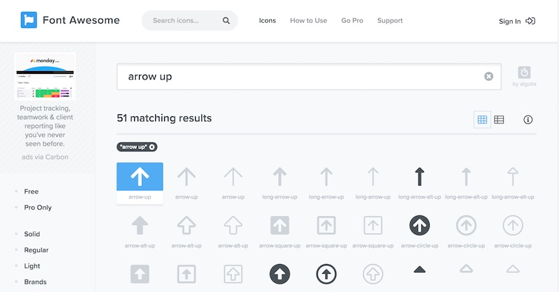
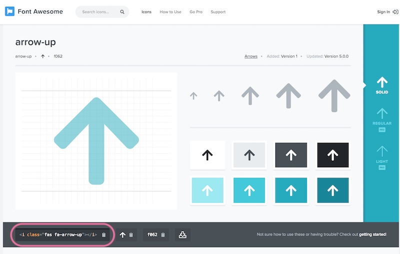
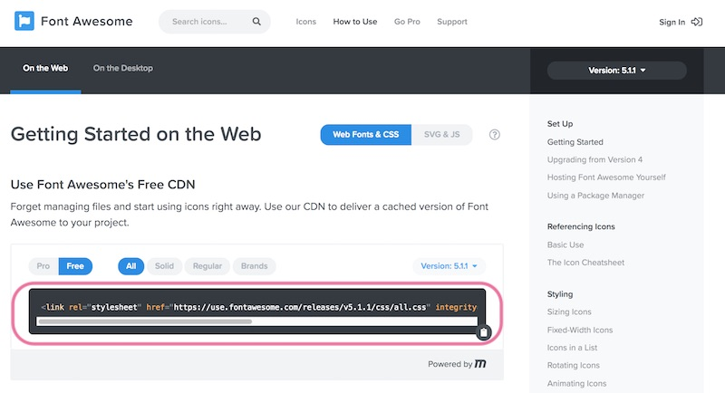
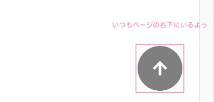
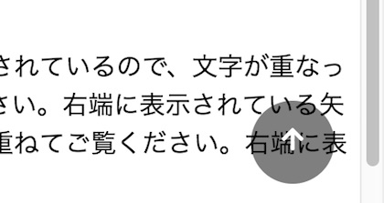

## ホームページにするーっと上へ戻るボタンをつけましょう。

ホームページをスクロールしていると、出てくる矢印ボタン。 クリックすると、するーっと一番上まで戻ってくれて、見る人にも親切ですね。 今回はWordPressのホームページに、ページトップ戻るボタンを作ってみましょう。


なお、トップへ戻るボタンはプラグインもたくさん用意されているので、「やってみたいけど難しそうだな」って人は、<a href="https://wordpress.org/plugins/scroll-back-to-top/" target="_blank" rel="noopener noreferrer">プラグイン</a>を使ってもいいかもしれません。

## 事前準備：子テーマを用意する
WordPressテーマのカスタマイズをするときは、[子テーマを使ってくださいね](/wp-child-theme/)。 今回のフォルダ構成はこんな感じ。（親テーマによって変わるかもだけど。）
```
テーマフォルダ
┗ footer.php ← ページ内にボタンを配置する
┗ head.php ← jsファイルを読み込む
┗ style.css ← ボタンのデザインを設定する
┗ js
    ┗ main.js ← トップへ戻るボタンの動きを書く
```

## ボタンを配置する

WordPressのテーマの多くは、footer.phpに</body>が書かれています。

親テーマからfooter.phpをコピーしてきて、footer.phpファイルを作ります。


</body>の上にコードを追記してください。

```markup
<div class="gotop">
    <a class="js-gotop">
        <i class="fas fa-arrow-up"></i>
    </a>
</div>
</body>
```

`<i class="fas fa-arrow-up"></i>`は、Webアイコンを使って矢印を表示させています。
「↑」や「▲」や「TOP」など、文字をそのまま使ってオッケーです。

### 補足：矢印にWebアイコンを使うには

今回は、FontAwsomeというWebアイコンを使っています。 WordPressの時は、テーマ自体にFontAwsomeが使われていることもありますので、ご使用のテーマをご確認くださいませ。
まず、<head>内にFontAwsome用のCSSを読み込むコードを貼り付けます。

```markup
<head>
    <link rel="stylesheet" href="https://use.fontawesome.com/releases/v5.1.1/css/all.css" integrity="sha384-O8whS3fhG2OnA5Kas0Y9l3cfpmYjapjI0E4theH4iuMD+pLhbf6JI0jIMfYcK3yZ" crossorigin="anonymous">
</head>
```

このコードは[Font Awesomeの使い方](https://fontawesome.com/how-to-use/on-the-web/setup/getting-started?using=web-fonts-with-css)から持ってきてください。








## CSSで矢印をデザインする

style.cssに以下のコードを追記していってください。

### ボタンの表示位置



```markup:title=style.css
.gotop {
    display: none; /* ①はじめは非表示にする */
    position: fixed; /* ②固定表示 */
    right: 16px; /* ②右から16px */
    bottom: 16px; /* ②下から16px *
    z-index: 9999; /* ②重ね順は一番上に */
}
```

①は初期設定です。 ページを開いたときは、矢印を表示させたくないので、`display:none`で非表示にします。

あとで、javascriptで、表示/非表示を切り替えます。

②は表示させる位置の設定です。右下に固定で表示させます。

### ボタンの装飾



```markup:title=style.css
.gotop a {
    display: block;
    width: 32px; /* ③矢印の幅 */
    height: 32px; /* ③矢印の高さ */
    leign-height:32px; /* ③矢印の文字大きさ */
    padding: 8px; /* ③円の余白 */
    text-align: center; /* ③矢印は中央に表示する */
    cursor: pointer; /* ④矢印にマウスが乗ったらカーソルにする */
    background: rgba(0, 0, 0, 0.5); /* ⑥背景を透過グレーに*/
    color: #fff; /* ⑥文字を白にする */
    -webkit-border-radius: 30px; /* ⑦角を丸くする */
    -moz-border-radius: 30px; /* ⑦角を丸くする */
    -ms-border-radius: 30px; /* ⑦角を丸くする */
    border-radius: 30px; /* ⑦角を丸くする */
}
```

③矢印の大きさ、表示位置を調整しています

④矢印マウスオーバー

⑥矢印の背景、文字色を設定しています。ここで透過しておくと、コンテンツに矢印が重なった時にも邪魔しません。

⑦矢印の形を円にしています。


### マウスオーバーしたときの動き


 マウスオーバーするとふわっと薄くなります。

```markup:title=style.css
.gotop a:hover,
.gotop a:active,
.gotop a:focus {
    opacity: 0.85; /* ⑧マウスが乗った時に背景色を薄くする */
    -webkit-transition: 0.5s; /* ⑨ふわっと薄くする */
    -o-transition: 0.5s; /* ⑨ふわっと薄くする */
    transition: 0.5s; /* ⑨ふわっと薄くする */
}
```

## JSでアニメーションをつける

### <head>でjsファイルを読み込む

 新たに作成するjsファイルを読み込むコードを追記しましょう。

```markup
<head>
    <script src="<?php echo get\_stylesheet\_directory\_uri(); ?>/js/script.js"></script>
    <?php wp\_head(); ?>
</head>
```

ちなみに、今回のコードはjQueryを使います。 WordPressではすでにJqueryが読み込まれているので新たに読む必要はありません。

### jsファイルにコードを書く

main.jsに以下のコードをかきます。
```markup:title=main.js
jQuery(function(){
// ①スクロールした時に、矢印を表示/非表示させる処理
    jQuery(window).scroll(
    function(){
        // ①-1 ページ最初からスクロールした位置を取得
        var pos = jQuery(window).scrollTop();
        if(pos > 600){
            // ①-2 ページの一番上から600px以上スクロールしたら、.gototopの要素をゆっくり表示する
            jQuery('.gotop').fadeIn('slow');
        }else{
            // ①-3 それ以外のとき、.gototopの要素をゆっくり非表示にする
            jQuery('.gotop').fadeOut('slow');
        }
    });

    // ②矢印のリンクボタンをクリックしたら上に戻る処理
    jQuery('.js-gotop').click(function(){
    jQuery('body,html').animate({ // ページトップへ移動する
        scrollTop: 0 // ②-1 body,html要素の一番上まで動く
        }, 500); // ②-2 上へ戻るまでの時間（500ミリ秒=0.5秒）
    });
});
```

①スクロールした時の処理と②リンクをクリックしたときの処理の２つ用意します。

①スクロールした時に矢印の表示/非表示を切り替えます

`$(window).scroll`：ウィンドウがスクロールした時に行う

`[A].scrollTop`：要素A（今回はウィンドウ全体）のスクロールした位置をピクセルで取得します。

`if(pos > 600)`：スクロールした位置によって表示するか、非表示するか、処理を切り替えます。 スマホの縦幅がだいたい500〜700pxなので、だいたい一画面分くらいスクロールしたら表示させるようにしています。

`[A].fadeIn()`：要素Aをフェードイン 今回は、要素Aは<div class=“gotop”>の.gotopになっています。

`[A].fadeOut()`：要素Aをフェードアウトさせます。スクロールで上に戻ったときに矢印を消します。

`fadeIn()`と`fadeOut()`の内には、表示する速度として、slow、normal、fast、数値(ミリ秒）を設定できます。


②矢印をクリックしたときにするする〜っと上に戻ります。

`[A].animate({動かす位置}, スピード);`

body,html要素（＝ホームページ全体）について、スクロールバーの上の位置を0へ（＝一番上）に動かします。

## まとめ
<iframe height="265" style="width: 100%;" scrolling="no" title="ページトップへ戻る" src="https://codepen.io/filledforest/embed/gjLdqz?height=265&theme-id=light&default-tab=css,result" frameborder="no" allowtransparency="true" allowfullscreen="true">
  See the Pen <a href='https://codepen.io/filledforest/pen/gjLdqz'>ページトップへ戻る</a> by Emi
  (<a href='https://codepen.io/filledforest'>@filledforest</a>) on <a href='https://codepen.io'>CodePen</a>.
</iframe>
  ※注意：CodePenのJavaScriptコード「＄」のところ、WordPressでは「jQuery」に置き換えて使います。
