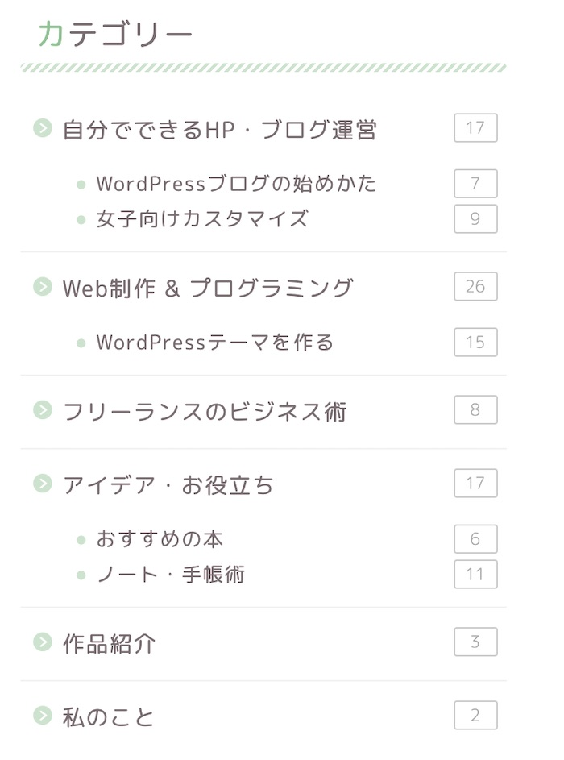
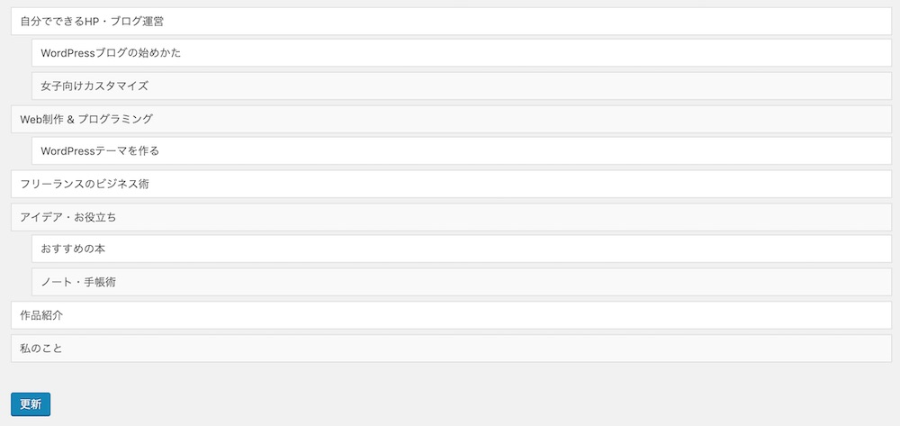

私は、WordPressを始めた時に分からなかったことの一つに「カテゴリー」と「タグ」の違いがあります。

* カテゴリーとタグの違いは何？
* タグってどういう風に使うの？
* カテゴリーの順番や設定を変えたい時はどうするの？

## カテゴリーとタグはこうやって使い分ける

カテゴリーもタグも記事同士をまとめたり、分類する機能です。
同じカテゴリ、同じタグ同士の記事は、一覧で表示できるので、記事同士のつながりがうまれて、記事を探しやすくなります。

カテゴリ
* 記事のテーマ、ジャンル分けに使う。
* 基本１記事に１カテゴリ。 設定しなくてもOK。
* 階層 親子階層がもてる。（日本→関東→東京みたいな感じで、３階層作れます。）
* 投稿する際に必ず設定が必要。

カテゴリーは記事を分類するための箱。同じカテゴリーの記事を関連記事として表示させたり、パンくずリストなどサイトの中の記事の位置を示すのに使われます。

カテゴリーをみると、ブログのジャンルを知ることができますね。

タグ
* 階層なし。それぞれのタグは独立している
* 記事の内容、キーワードを入れる
* 設定しなくてもOK

## カテゴリー、タグの設定

### カテゴリーの設定方法

新規投稿する際に、右側にカテゴリー欄があります。 好きなカテゴリーにチェックを入れればOK。 また、「新規カテゴリーを追加」ボタンから、カテゴリーを入力することもできます。

名前、スラッグ、親カテゴリーを設定して「新規カテゴリーを追加」で、カテゴリーを登録できます。

右にすでに登録したカテゴリーとそこに紐づく記事数（カウント）が表になっています。すでに登録されたカテゴリーの名前を変えたり、親カテゴリーの設定後から編集もできます。

スラッグとは

カテゴリーやタグの設定欄に、スラッグの欄があります。 「スラッグ」はURLの一部に使われる文字列のこと。

例えば、WordPressというカテゴリーに属する記事の一覧を表示する時、以下のようなURLでアクセスできます。

https://●●●.com/category/wordpress

この最後の「wordpress」がスラッグです。
URLに使われるので、日本語（全角）ではなく、英語（半角英数）で設定するようにしましょう。
カテゴリーの内容を端的に表す単語を設定すると良いです。

### タグの設定方法

新規投稿する際に、右側にタグ欄があります。 そこにタグを入力すればOK。

名前とスラッグを入力して新規追加ボタンを押せば登録完了です。 右側にすでに登録されたタグが並んでいるので、後から名前やスラッグを編集できます。

## カテゴリーの順番を変えるには「Category Order and Taxonomy Terms Order」を使おう

あと、カテゴリーを設定するときに必ず悩むのがカテゴリーの並び順。
デフォルトでは、WordPressのカテゴリーの順番て50音順になってるんですよね。

でも、意味のある順番に変えたいときもありますよね。

そんな時は [Category Order and Taxonomy Terms Order](https://netaone.com/wp/category-order-and-taxonomy-terms-order/) を使います。

このプラグインを導入すると、管理画面のサイドバーの投稿の中に「Taxonomy Order」というメニューが追加されます。

 カテゴリーの順番を入れ替えれるようになります。

