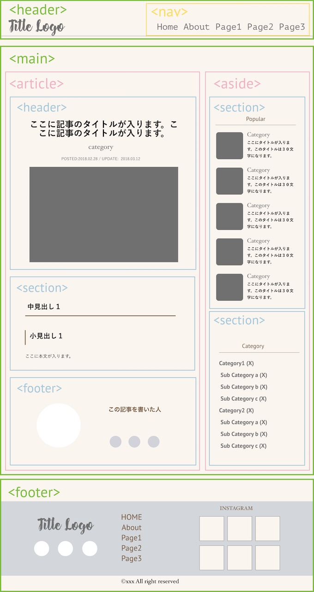

ホームページのコーディングをしていて、よくまようこと。 検索エンジンから評価されやすいページの構造ってどう書くの？ タグを適切に記述した綺麗なソースコードにしたい。 どうやってdiv、section、articleを使い分けるの？ ホームページに使われる主なタグの正しい使い方を知りたい。 私も書いてて迷うことが多々あるので、これを機にまとめてみます。

## 適切な文書構造はなぜ大事？

**メンテナンスしやすい美しいページになる**
ページの構造を適切に示すと、HTMLソースの内容が分かりやすくなります。 運営する人にとっては、簡潔にかかれたソースは読みやすく、メンテナンスしやすくなります。

**検索エンジンにも好かれるページになる**

検索エンジンにとってのメリットは、ページの内容を評価しやすくなります。 ページの構造がわかりにくかったり、ソースコードが間違って、ホームページを巡回しきれないことがあるようです。 すると、検索結果でも上位表示されず、なかなかユーザーの目にとまらなくなってしまいます。 コンテンツの質も大事ですが、それを支えるプログラムの質も大事なんですね

## ホームページのHTML構造
### 記事ページの枠組み


### ページの枠組みを示すタグ

* header：タイトルロゴ、サイトの説明などが入る
* main：ページ内の主要コンテンツを入れる
* aside：サイドバーやウィジットなど、補足的な情報が入る
* footer：ナビゲーションメニュー、コピーライトが入る
* nav:ナビゲーションメニュー

### 補助的にrole属性を使う

上記のタグと同じような役割としてrole属性があります。 role属性をつけることで、そのパーツの役割を伝えることもできます。

* role =“banner” ページのヘッダ部分。
* role=“main” メインコンテンツ
* role=“navigation” ナビゲーション
* role =“complementary” サイドバーなどの補足情報
* role =“contentinfo” コピーライトやプライバシーポリシーなどページ情報
* role =“search” 検索フォーム

いろんなソースを見ると
<header role="banner">のようにhtml5タグと併用している場合と、
<div id="main" role="main">のように、divのタグに属性をつけている場合があるようです。

<header>自体にヘッダーとしての意味づけがあるのに、そこにroleで同じ役割を明示するってダブってない？と疑問におもったり。そのうち整理されるのだろうか。

### sectionとarticleとdivの違い

いずれもコンテンツを構成する「箱」として使われます

**sectionは１小節**
sectionはコンテンツの１小節に使います。
ホームページでは文章構造の基本は「見出し＋本文」。
見出しと本文の１ブロックが作れる場合には、sectionで囲みます。


```markup
<section>
    <h4>関連記事</h4>
    関連記事のリスト
</section>
```

articleは独立したコンテンツ

その部分を切り出して別のページにしても、１つのページとして成り立つか？（独立したコンテンツになっているか？）が見分けるポイント。
```markup
<article>
    <h1>記事のタイトル</h1>
    <h2>見出し１</h2>
    本文
    <h2>中見出し２</h2>
    本文
</article>
```

**divはただの箱**
sectionでもarticleでもないけれど、ひとまとめにして扱いたい時に使います。CSSとかの装飾用とか。

## 記事ページのHTMLテンプレート
```markup
<!DOCTYPE html>
<html lang="ja">
    <head>
        <meta charset="utf-8">
        <title>記事タイトル | サイトタイトル</title>
        <meta name="description" content="記事の概要">
    </head>
    <body>
        <header>
            <p>タイトル（ロゴなど）</p>
            <nav>グローバルナビゲーション</nav>
        </header>
        <!-- mainコンテンツ -->
        <main>
            <article>
                <header>
                    <h1>記事タイトル</h1>
                    <p>投稿日時</p>
                    <p>カテゴリー</p>
                </header>
                <section>
                    <h2>中見出し</h2>
                    <p>文章</p>
                    <h3>小見出し</h3>
                    <p>文章</p>
                    <h3>小見出し</h3>
                    <p>文章</p>
                </section>
                <footer>
                    <p>SNSシェアボタン、投稿者のプロフィールなど</p>
                </footer>
            </article>
            <!-- sidebar -->
            <aside>
                <section>
                    <h4>新着記事一覧</h4>
                    <ul>
                        <li>記事1</li>
                        <li>記事2</li>
                        <li>記事3</li>
                        <li>記事4</li>
                        <li>記事5</li>
                    </ul>
                </section>
                <section>
                    <h4>カテゴリ一覧</h4>
                    <ul>
                        <li>カテゴリー1</li>
                        <li>カテゴリー2</li>
                        <li>カテゴリー3</li>
                    </ul>
                </section>
            </aside>
        </main>
        <!-- footer -->
        <footer>
            <p>グローバルメニュー、コピーライト、SNSリンクなど</p>
        </footer>
    </body>
</html>
```