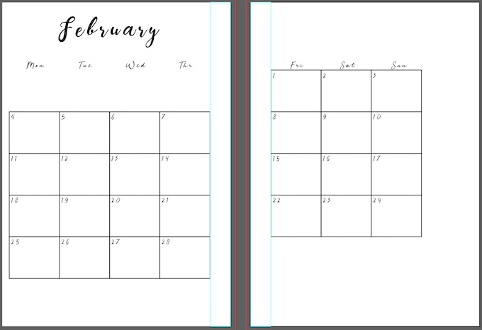
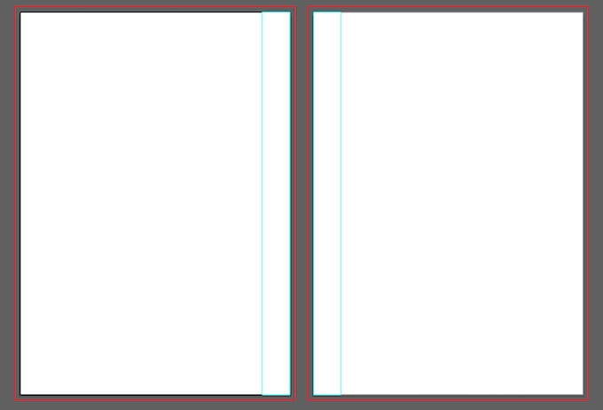
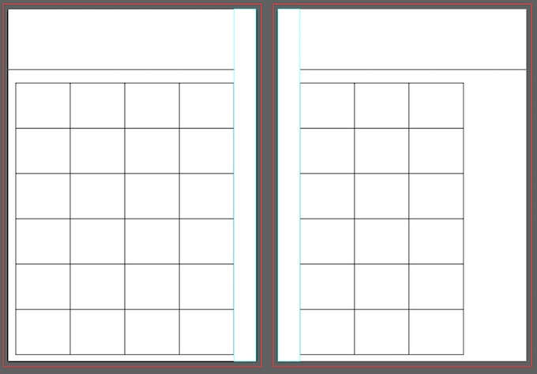
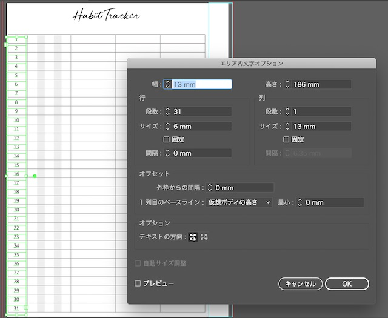

イラストレーター、ずっとマスターしたいと思いながら、「難しそう」「デザインセンスないしなぁ」と手を出せずにいました。 実際に自分で使うものを作りながら、ちょっとずつレベルアップしていきたいと思います！

今回は月間スケジュールを作ってみます

## 月間スケジュールの作り方
A5サイズのアートボードを２つ用意します。

システム手帳のリフィルには、穴あけスペースを確保するために、はじから1.5cmくらいあけていきます。（水色の長方形の部分） 動かしたくない場合は、メニューの表示＞ガイド＞ガイドを作成とすると、場所が固定されます。

### 手順1. カレンダーの枠を作る

月間カレンダー用の枠用に長方形のオブジェクトを作ります。 オブジェクト＞パス＞グリッドに分割します。

### 手順2. 日付を入れる

今度は日付を入れます。 先ほど作ったグリッドと１段目と同じ大きさの長方形オブジェクトを作ります。

このオブジェクトに、文字ツール＞エリア内文字を入れていきます。

とりあえず１行分だけ。

## コンビニプリント用にPDF保存する

我が家にはプリンターがないので、コンビニプリントしたく、PDFファイルにします。 ファイル＞別名で保存でPDF形式で保存できます。

## 番外編：習慣トラッカーも作ってみた
 感想

 実際に作ってみると、地味にいろんな機能を知ることができました！
 * 「グリッドの分割」で長方形オブジェクトを等幅／等高さの枠に分割できる
 * 「エリア内文字オプション」で、文章を表のように構成できる
 * スレッドテキストで、表同士の文章をつなげることができる この調子でオリジナル手帳リフィルを作るのも面白そう♪

