イラストレーターを使ってアイキャッチを作りました。
自分の学びのために、作業手順を書き残しておきます＾＾

## 今回作るもの

今回はこんなアイキャッチを作ってみました。

 ここでイラストレータの使い方で学んだスキルはこの３つ。

 * 斜めのストライプを作る
 * 画像を好きな形に切り抜く
 * リボンを作る

## 斜めのストライプを背景にする

イラストレーターで新しいファイルを開きます。 私は16:9の比率で作ってみます。

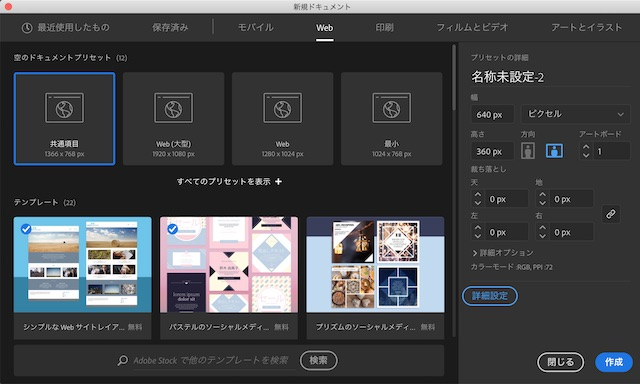

まず背景のストライプを作ります。

長方形を横に２個並べます。

横20px×縦40px

一つ長方形を作ったら、option＋ドラッグでスライドさせると、その画像のコピーして移動できます。

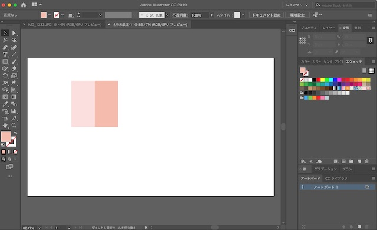

並べた長方形をグループ化して、スォッチフォルダにドロップします。

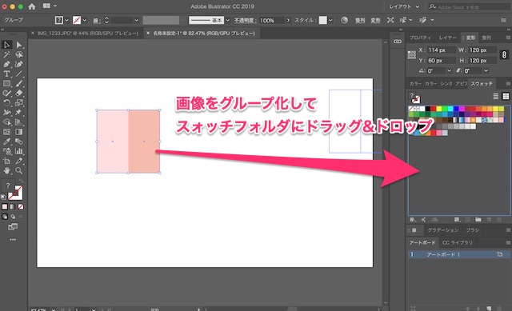

背景をおおう長方形オブジェクトを作り、背景色にスォッチのストライプを選びます。

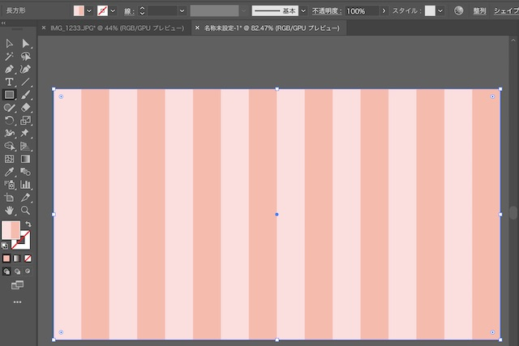

あれ？ちょっと太くなってしまった…。

細めのストライプにするために、横10px×横40pxの長方形を４つ並べることに。

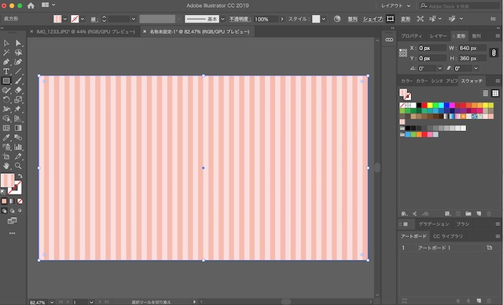

今度はストライプを斜めにします。
長方形を選択したまま、メニューのオブジェクト>変形からウィンドウを開いて、角度を入れます。

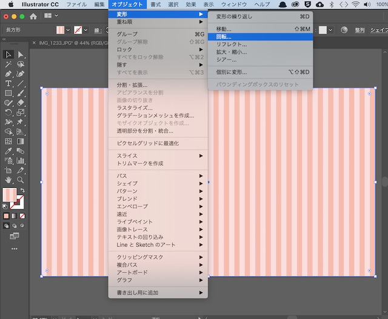

この時パターンの変形にチェックを入れます。
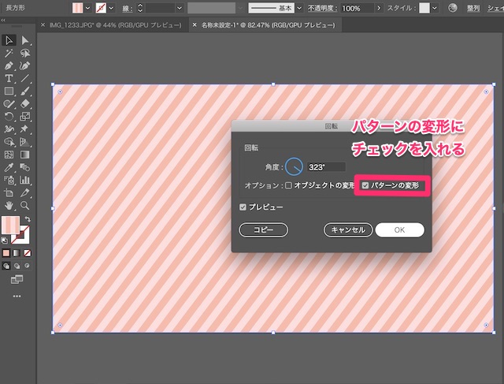

その上に、角丸の長方形を作りました。
長方形を作った後、ダイレクト選択ツールで四隅のぽちっとなっている◎を中心へドラッグすると角丸になります。

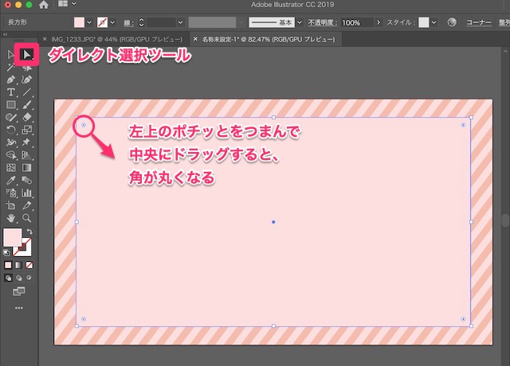

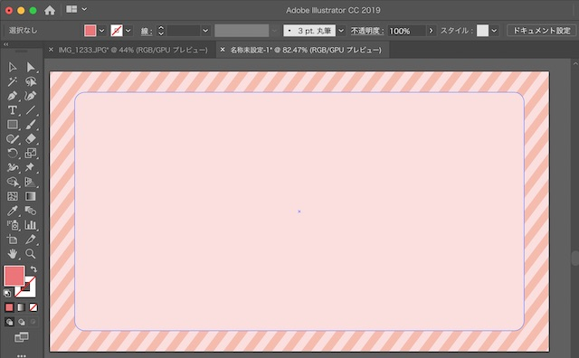

これで土台が完成。

## 画像を好きな形に切り抜く

メニュー>ファイル＞配置を選び、挿入したい写真を選びます。
そして、写真の上からペンツールか鉛筆ツールで切り抜きたい部分を縁どります。 ※ミスったらダイレクト選択ツールで頂点を調整できます。

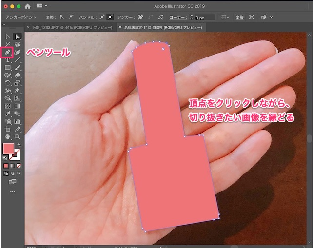

縁取ったオブジェクトと写真を両方選択して、オブジェクト＞クリッピングマスク＞作成を選択します。

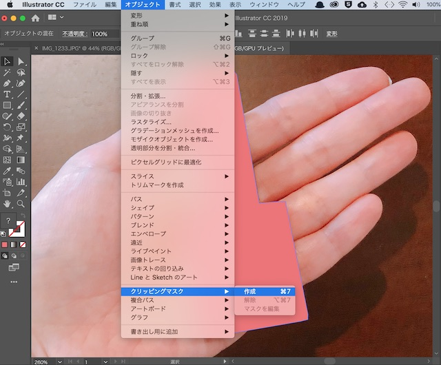

切り抜いた…！

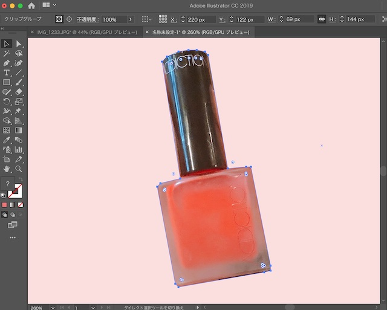

がんばったわりに、ちょっとダサい＾＾；

参考記事(https://udemy.benesse.co.jp/design/illustrator/illustrator-cutout.html)

## リボンを作る

[こちらの記事](https://cultureacademia.jp/illustrator/402/)にならってリボンを作っていきます！

長方形を３つ重ねます。
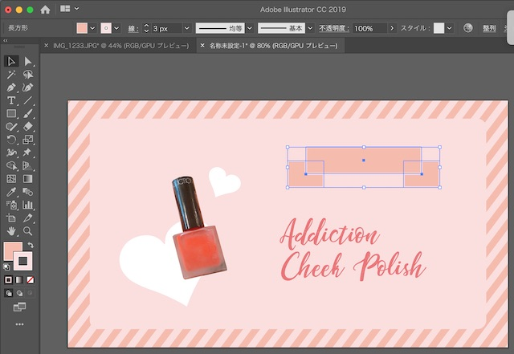

影っぽく、長方形のオブジェクトに、3pxの境界線を入れて、周りをふちどっています。

ペンツールで頂点をつけて、長方形の辺の中央をクリックすると頂点が追加できます。
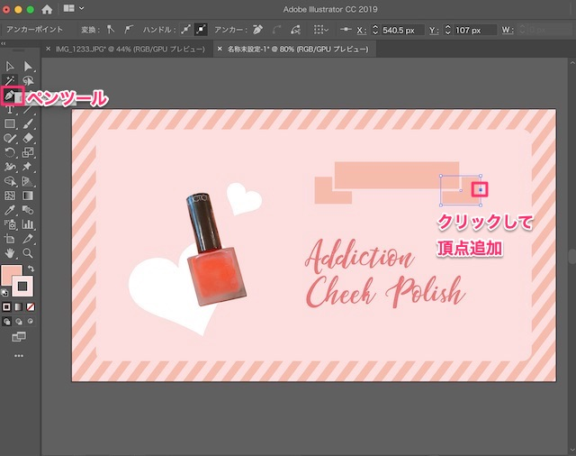

ダイレクト選択ツールで、頂点を選んで、中央にドラッグすると凹みができます
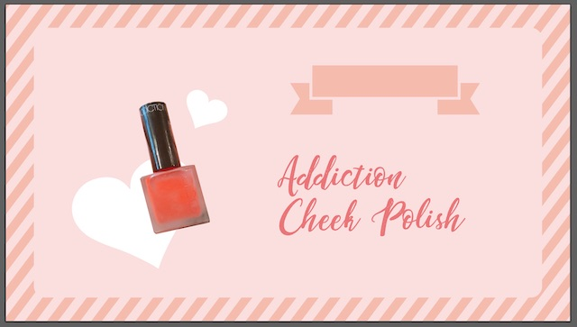

オブジェクト＞エンベロープ＞ワープの設定
円弧の設定で30%くらい上に丸めます。
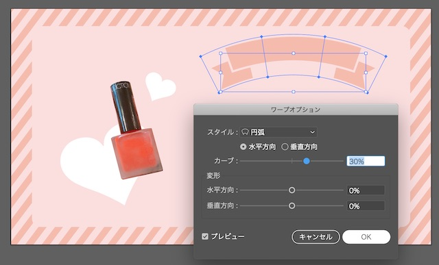

直す時は、オブジェクト＞エンベロープ＞解除で。

リボンを複製する
オブジェクト＞分割・調整で分解する
ダイレクト選択ツールでカーブだけ残す
パス上文字ツールを使う
→孤に沿った文字ができるようなのですが、
やってみると、「パスに沿って、テキストを作成する」には複合パスでもマスクでもないパスをクリックしてください」とエラーになり失敗。

結局、文字も、テキストを同じように、円弧の設定をしています。

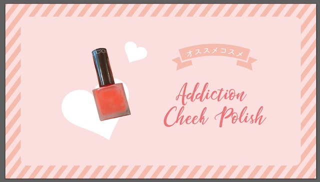

あとは文字を入れて、できあがり〜。

## 斜めストライプとリボンでかわいいデザインになる

同じやり方でこのアイキャッチも作ってみました。

斜めストライプとリボンってかわいい組み合わせですよね。

女子っぽいデザインをお好みの方はぜひお試しくださいませ。
