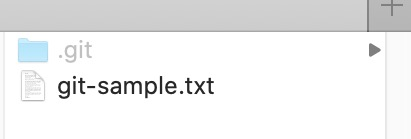
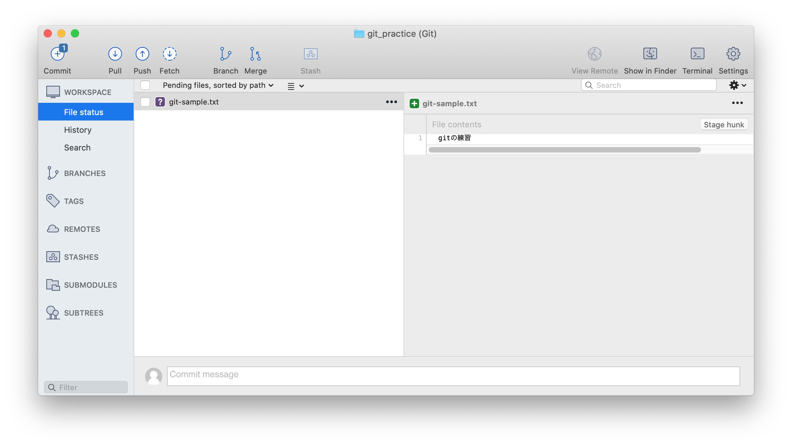
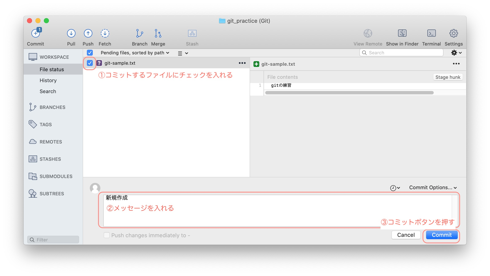
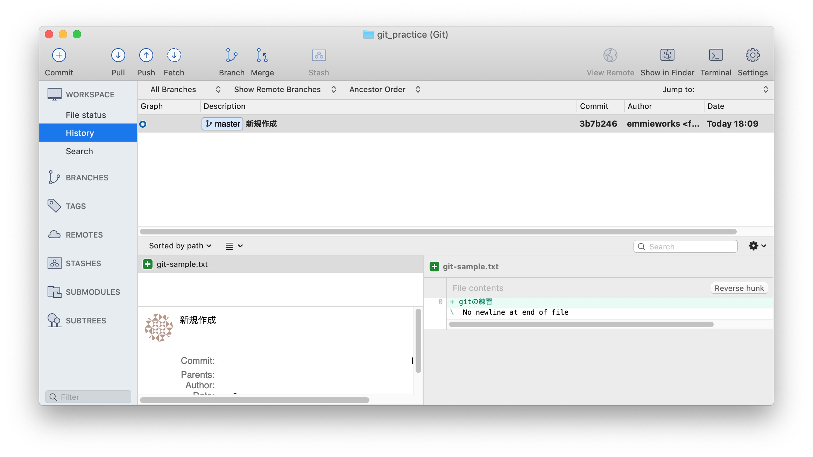
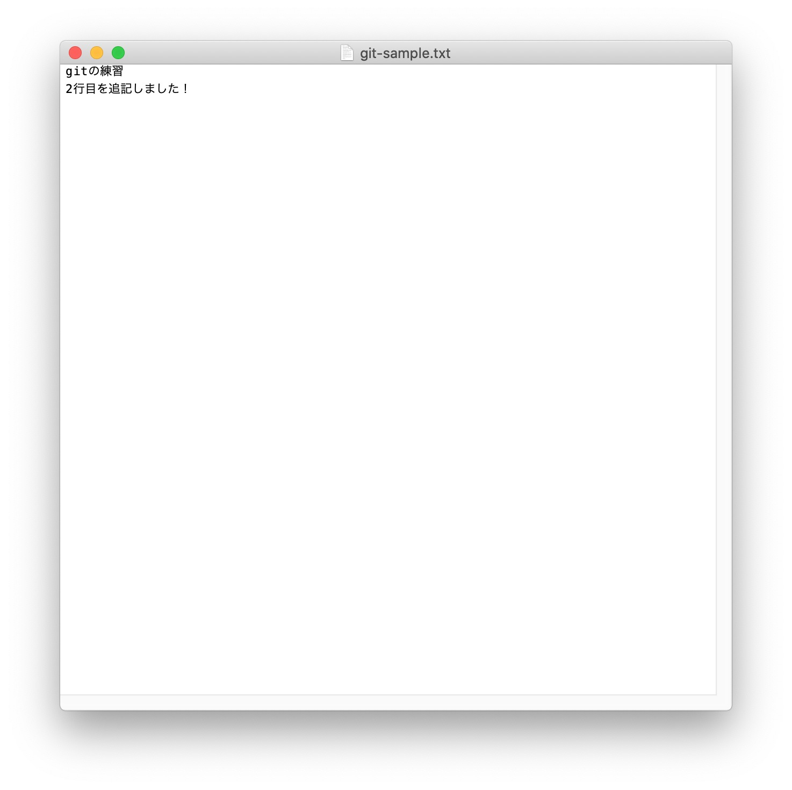
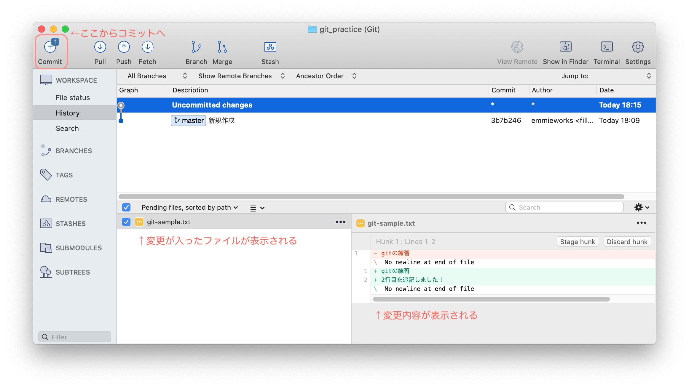

「**バージョン管理**」ってご存知ですか。

プログラマーにはよく使われているものですが、
ファイルの更新履歴を残しておいて、
「いつ、どう編集したか」を確認したり、
いざというとき前の状態に戻せるツールです。

* ファイル保存しちゃったけど、昨日の状態に戻したい…

* ファイルを更新したい。でも、元の状態も使うかもしれないから、ファイルを複製しとこう…

こんな悩みも、バージョン管理があれば解決できます。

私もプログラム開発のため、バージョン管理を使いはじめました。

最初は、用語が分からなかったり、戸惑うこともありましたが、少しずつ使い方に慣れてきました。

プログラマーはもちろん、ファイルを効率的に管理したい人たちにもおすすめなので、今回はバージョン管理をはじめる方法を紹介します。

<div class="border-box">

<span>こんな方にオススメです。</span>

* WEBデザイナーやプログラマーで、htmlやCSSをバージョン管理したい人
* ブログ記事など、文章の編集・校閲履歴を残したい人
* ファイルのバックアップを残したい人

</div>

なお、今回は個人で使う機能に絞って紹介しています。

チームで使うときには、同じ箇所を編集してしまった時の対応や、変更箇所のレビュー依頼などができますが、その説明は割愛します。

<div class="related-posts">
    <span>バージョン管理の基本</span>

1. gitとSourcetreeをインストールして、バージョン管理をはじめる（この記事）
2. [GitHubの導入からプロジェクトでの基本の使い方](/git-install/)
3. [間違えて保存・コミットしたときに元に戻す方法まとめ](/git-rebase/)
4. [【gitでバージョン管理】ブランチを使って、履歴を分ける方法](/git-branch/)
5. [GitHubでソースコードをブログに載せる方法まとめ](/github-gist-wordpress/)

</div>

## バージョン管理のメリット

gitは、ファイルのバージョン管理システムです。

バージョン管理とはゲームでいう**セーブポイント**。

ゲーム中のセーブポイントのように、作業ごとにその時点の状態を保存しておいて、後から元の状態に戻すことができます。

<div class="title-box">
  <span>
    バージョン管理でできること
  </span>

- ファイルを「誰が」「いつ」「どんな修正を加えたか」を記録に残せる

- 誤って修正した場合に、前に遡ってファイルの状態を戻すことができる

- 複数人で同じファイルを共有、更新ができる
</div>


バージョン管理は、こんな時に使われます

- プログラム(HTML、CSSなど）の更新作業

- テキストファイル（小説やブログ記事など）の下書き、編集、校閲作業

- ExcelやPowerpointなどの共有ファイルの履歴管理


バージョン管理システムを使うと、

* 提案書_20200115.txt
* 提案書_20200116.txt

とか

* 提案書_〇〇修正版.xls
* 提案書_〇〇修正版_追記.xls

とか

ファイルを分けてバックアップを残す必要がなくなります！

テキストファイルだと編集履歴を行単位で確認できるのですが、
プログラムに限らずExcelやPowerpointなどいろんなファイルでも使えます。

## バージョン管理のツール（gitとSourcetree）

### git

gitは、**ファイルの変更を記録してくれるバージョン管理システム**です。

gitを入れると、自分のPC上にファイルの変更履歴を保管するための場所が用意されて、バージョン管理のための機能が使えるようになります。

Git（バージョン管理）の概念を詳しく学ぶには<a href="https://backlog.com/ja/git-tutorial/" target="_blank" rel="noopener noreferrer">サルでも分かるバージョン管理入門</a>をどうぞ。

### Sourcetree

SourcetreeはGUIでGitを操作するためのソフトです。

gitを使う際、ターミナルからコマンドでファイルを操作する必要があって、ややこしいです。

Sourcetreeを使うと、画面上でファイルの変更をみれたり、直感的に操作できるので、コマンドになれていない初心者にも使いやすいです。


## GitとSourcetreeのはじめ方

ここからは、Macユーザー向けの解説になります。

Windowsで使いたい方：<a href="https://proengineer.internous.co.jp/content/columnfeature/6983" target="_blank" rel="noopener noreferrer">Sourcetreeのダウンロードとインストール方法 | サービス | プロエンジニア</a>

### gitをインストールする

ターミナルから以下のように入力します

ターミナルを起動して、以下のコマンドを入力します。

```
$ git --version
```

このように、バージョンの表記が出てきたら、OKです。

```
$ git --version git version 2.24.1 (Apple Git-126)
```

Xcodeをインストールして、ライセンスに同意していない場合は以下のように入力して、管理者パスワードを入れます。

```
$ sudo git --version Password:
```

これで、gitを使う準備ができました。

### Sourcetreeをインストール

<a href="https://www.sourcetreeapp.com/" target="_blank" rel="noopener noreferrer">SourceTree</a>のサイトから、アプリケーションをダウンロードして、インストールします。


## Sourcetreeでファイルをバージョン管理する

まずは、バージョン管理したいフォルダを設定します。

右クリック＞NEWを選びます。


「Create Local Repository(新規ローカルリポジトリを作成)」を選びます


バージョン管理するフォルダの場所と名前を設定します。


Createを押すと設定完了。


gitで管理する場所を「リポジトリ」と呼びます。

Finderでフォルダをみると、「.git」という隠しフォルダがあります。
ここに変更された内容が記録されていきます。


Sourcetreeの画面上で新しく追加したリポジトリをダブルクリックすると、こんな画面が開きます。


これで、初期準備準備完了です。

<div class="title-box">
    <span>バージョン管理したくないファイルはどうするの？</span>

「.gitignore」というテキストファイルを作って、バージョン管理しないファイルを追記します。

```
# 除外するファイル名を指定
file.txt

# 除外するディレクトリを指定
directory/

# テキストファイルを除外
*.txt
```
</div>


## git基本の使い方〜コミットで変更を記録する〜

ここから、具体的な使い方をみていきます。

まずは、先ほど作ったディレクトリにファイルを置いてみましょう。



Sourcetree画面上にファイルがでてきます。



そこで、メッセージ欄に「新規作成」とメッセージをいれて、コミットボタンを押します。

コミットとは **「コミット」とは変更履歴を記録することです。**
自分で作業が終わったときに、コミットボタンを押して、「何を変更したか」メッセージを残すことができます。



コミットが終わった後、Historyを選ぶと、ファイルの変更履歴が見れます。

ファイルが保存されるごとに勝手に変更履歴が追加されないので、注意くださいませ。



続いて、ファイルを編集してみましょう。

１行追記して、保存します。



すると、Sourcetreeの画面では変更があったファイルが表示されます。


左上のコミットマークを押すと、コミット画面に写ります。

ファイルにチェックを入れて、メッセージを入れて、コミットします。

)

編集履歴が追記されています。


## まとめ

* git＝ファイルのバージョン管理ツール
* SourceTreeで視覚的に編集履歴が見える
* コミットすると、ファイルの変更を記録する

何度も更新が入るファイルは、バージョン管理しちゃった方が作業が楽になるかもしれませんね。

個人のPC上で作業する分には、gitとsourcetreeでOKですが、さらにGitHubというツールを使うと、Web上でプログラムを公開したり、複数の開発者と協力してプロジェクトを進めることができます。

続き＞＞＞ [GitHubのインストールと使い方](/git-install/)