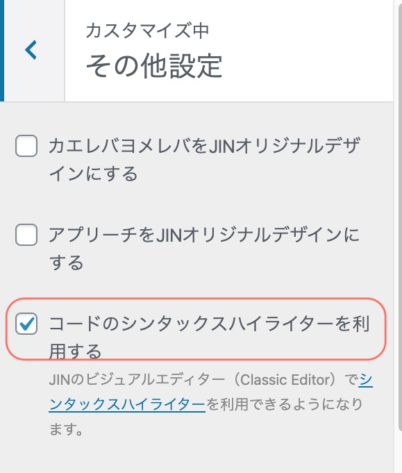
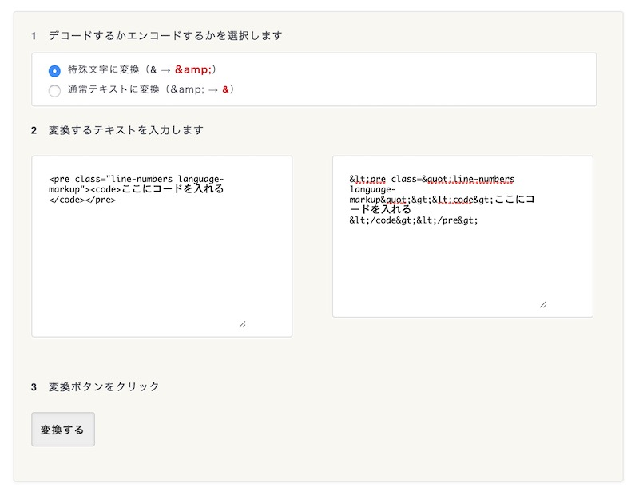
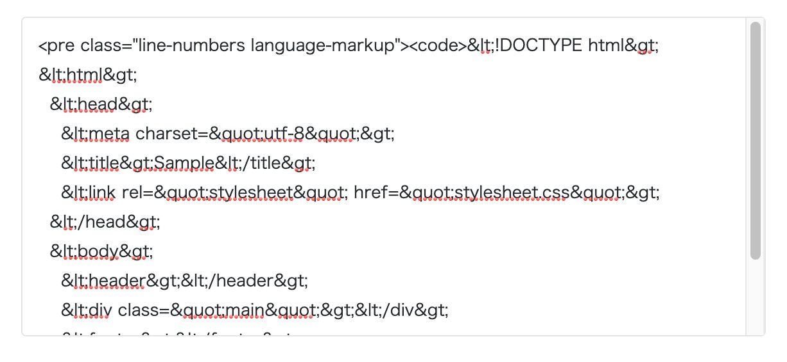
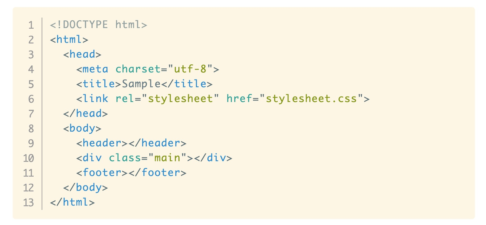
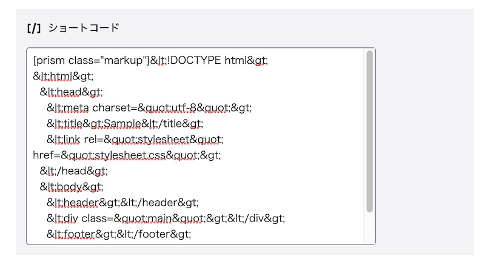

私はブログにソースコードを表示させているのですが、
こんな風に、きれいに表示させたいですよね。

```markup
<!DOCTYPE html>
<html>
  <head>
    <meta charset="utf-8">
    <title>Sample</title>
    <link rel="stylesheet" href="stylesheet.css">
  </head>
  <body>
    <header></header>
    <div class="main"></div>
    <footer></footer>
  </body>
</html>
```

## JINのシンタックスハイライター機能をGutenbergでも使う

WordPressテーマJINには[シンタックスハイライター機能](https://jin-theme.com/manual/syntaxhighlighter/)がついています。

> ワードプレスの管理画面から、「カスタマイズ」 > 「その他設定」と進み、「コードのシンタックスハイライターを利用する」にチェックをいれてください。
>
> JINテーマ搭載の「シンタックスハイライター機能」を使う方法[http://[https://jin-theme.com/manual/syntaxhighlighter/]

準備として、この機能をONにしておきましょう。



以前のビジュアルエディターには、コードを挿入するボタンがありましたが、Gutenbergではブロックエディターに変わったので、ボタンがありません。

ブロックエディター でも、
①カスタムHTMLブロックを作る
②preタグcodeタグを入れる
③コードを記述する
という手順で、シンタックスハイライター機能を使えます。


①カスタムHTMLブロックを作る


ブロックエディターで「カスタムHTML」を入れる 注意点として、コードというブロックではなく、**カスタムHTMLのブロック**を使います。


② preタグとcodeタグを入れる

このように入力します。
```markup
<pre class="line-numbers language-markup">
    <code>ここにコードを入れる</code>
</pre>
```

classの「language-〇〇」は、プログラミング言語を表しています。〇〇にプログラミング言語の名前を入れると、色をつけてくれます。

JIN対応のプログラミング言語
* HTML/CSS
* javascript
* python
* php
* scss
* sass

【入力例】
PHPを使うときは「language-php」

ただし、HTMLとCSSは「langugage-markup」

また、HTMLで使われる特殊文字（＜、＞、＆）は[コードに変換して](https://tech-unlimited.com/escape.html)から入力しましょう。



これで、シンタックスハイライターで表示されるようになります。



ブロックエディター



プレビュー

## シンタックスハイライターでHTMLを表示

ただ、preとかcodeのタグをいちいちコピペして、するの面倒ですよね。

ショートコードを使うと、ブロックエディターでも早く入力できるようになります。

### 改造①ショートコードを作って、ソースコード入力を便利に

子テーマjin-childのfunctions.phpに以下の行を追記します。

```php:title=functions.php
// functions.php
// PRISM用ショートコード。ユーザーが入力した属性をクラス名として出力
function prism_func( $atts, $content = null ) {
extract( shortcode_atts( array(
'class' =&gt; 'no-class',
), $atts ) );
return '
<pre class="line-numbers"><code class="language-' . esc_attr($class) . '">' . $content . '</code></pre>
';
}
add_shortcode('prism', 'prism_func');
```

ショートコードの作り方はこの記事を参考にしました。
[【WordPress】ショートコードの囲み型を作成](https://webdesignday.jp/inspiration/wordpress/4641/)

記事を書くときには、
```php
[prism class="php"]ここにコードを記述[/prism]
```
でショートコードが使えるようになります。




classには、使用中のプログラミング言語を入れます。

プログラミング言語→classの入れ方
HTML/CSS    →markup
JavaScript  →javascript（jsでもOK）
PHP         →PHP
python      →python(pyでもOK)
sass        →sass
scss        →scss


## ハイライトしたいプログラミング言語を増やすには？

私はプログラミング言語を右上に表示させたいのと、対応を言語を増やしたかったので、prismから新しくjsファイルとcssファイルをとってきました。（以下のURLでアクセスすると、私が使っている機能にチェックが入っています。）

[Prismで使うCSSとJSファイルをダウンロード](https://prismjs.com/download.html#themes=prism-solarizedlight&languages=markup+css+clike+javascript+git+go+json+markdown+markup-templating+php+plsql+python+jsx+ruby+sass+scss+sql&plugins=line-numbers+show-language+keep-markup+toolbar+copy-to-clipboard)

使いたい言語と機能をチェックを入れて、ページ下部の「Download JS」「Download CSS」をそれぞれクリックします。

「Download JS」を押すとprism.js、「Download CS」prism.cssがダウンロードできます。

これを子テーマjin-childのフォルダに入れます。

続いて、親テーマjinから「footer.php」をコピーして、子テーマ用の「footer.php」を作成します。

＜／html＞の下の部分でPrismのJavascriptとCSSを読み込んでいます。（220行〜221行目）

```php:title=footer.php
</body>
</html>
<?php if( ! get_option('jin_code_highlighter') == null ) : ?>
<script src="<?php echo get_template_directory_uri() . '/js/prism.js' ?>"></script>
<link href="<?php echo get_template_directory_uri() . '/css/prism.css' ?>" rel="stylesheet" />
<?php endif; ?>
```

```php:title=footer.php
<script src="<?php echo get_stylesheet_directory_uri() . 'prism.js' ?>"></script>
<link href="<?php echo get_stylesheet_directory_uri() . 'prism.css' ?>" rel="stylesheet" />
```

jin-childに

* prism.css
* prism.js
* footer.php

3点をアップロード。

プログラミング言語→classの入れ方
Git     →git
Go      →go
JSON    →json
Markdown→markdown
Ruby    →ruby
React   →react
Ruby    →ruby
SQL     →sql
以上、JIN搭載のシンタックスハイライター機能を強化する方法の紹介でした。

[【prism.js】ブログ記事にソースコードをきれいに表示する方法](/dispaly-code-on-blog/)

