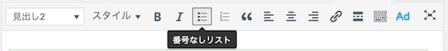
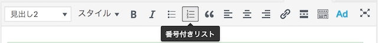
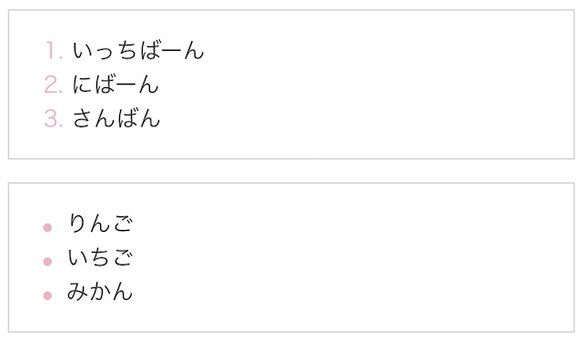
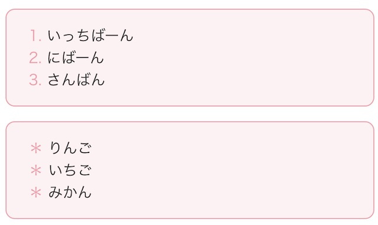
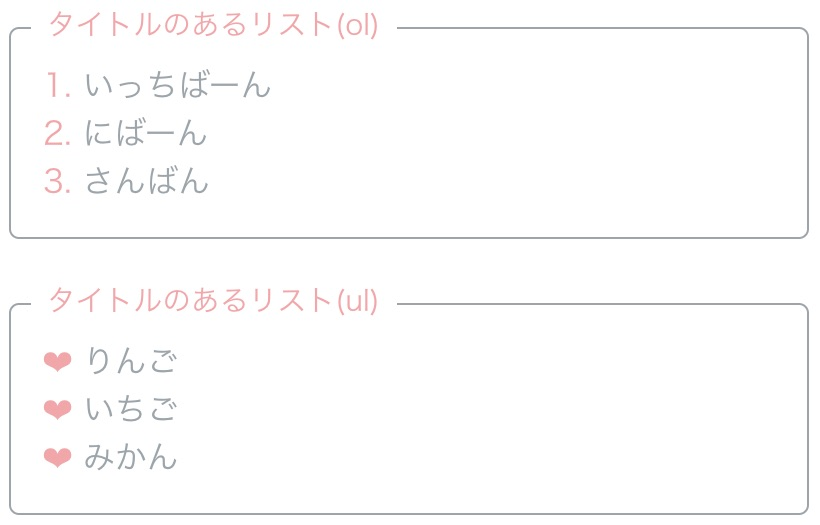
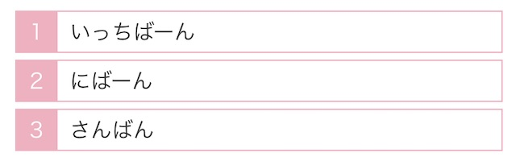
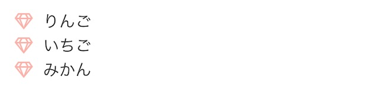

ブログ記事を書いていると頻繁に登場するのが、箇条書き。 項目を並べたり、まとめるのに便利で、わたしもよく使います😄 今回は、CSSコピペでできる、おしゃれなリストのデザインをご紹介します。

## リストのHTMLの書き方


リストには「番号付き」と「番号なし」の2種類あります。

番号なしリスト

* いちご
* りんご
* みかん

番号付きリスト

1. いっちばーん
2. にばーん
3. さんばん


【ビジュアルエディタのボタン】
このアイコンが目印です。







リストを作るときは、文字で「1. 」「2.」と打ったり、「・（中点）」を使うよりも、
HTMLタグを使ってあげるのが望ましいです。

HTMLは`<li>`タグを`<ol>`または`<ul>`で囲むような書き方になります。

【番号なしリスト】

```markup:title=HTML
<ul>
    <li>りんご</li>
    <li>いちご</li>
    <li>みかん</li>
</ul>
```

【番号付きリスト】

```markup:title=HTML
<ol>
    <li>いっちばーん</li>
    <li>にばん</li>
    <li>さんばん</li>
</ol>
```

この後のサンプルはこのHTMLコードを元にデザインしていきます。


## おしゃれなリストのデザインCSS１０選

### ①丸い枠のリスト



【番号なしリストのCSS】

```css:title=CSS
ul{
    margin: 1rem 0; /* 枠の外の余白 */
    padding: 1rem 1.5rem; /* 枠の中から文字までの余白 */
    color:#AAA; /* 文字色 */
    border: solid 1px #D3D6Db; /* リストの周りに枠をつける */
    border-radius:10px; /* 枠の角を丸くする */
}
ul li{
    list-style:none; /* デフォルトのリストのスタイルはなしに */
}
ul li::before {
    content: '＊'; /* リストのスタイルを＊にします */
    color: #EEB1C0; /* リストのスタイルの色をピンクに */
    padding-right: 5px;/* リストの番号と文字の間に隙間をあける */
}
```

【番号付きリストのCSS】

```css:title=CSS
ol{
    margin: 1rem 0; /* 枠の隙間を開ける */
    padding: 1rem 1.5rem; /* 枠と中の文字との隙間 */
    border: solid 1px #D3D6DB; /* リストの周りに枠をつける */
    border-radius:10px; /* 枠の角を丸くする */
}
ol li{
    list-style-type: none;
    counter-increment: number; /* １行ごとに番号を増やす */
}
ol li::before {
    content: counter(number) "."; /* 番号の横に.を入れる */
    margin-right: 5px; /* リストの番号と文字の間に隙間をあける */
    color: #EEB1C0; /* リストのスタイルの色をピンクに */
}
```

＜枠線の設定＞
border:線のスタイル 枠線の太さ 色
border-radius:枠線の角（0pxだと四角くなります）
枠線なくすには`border:〜`の行と`border-radius:〜`の行を消してください。

### ②背景色のあるリスト



【番号なしリストのCSS】

```css:title=CSS
ul{
    margin: 1rem 0; /* 枠の外の隙間 */
    padding: 1rem 1.5rem; /* 枠の線から中の文字までの隙間 */
    color:#555; /* 文字色 */
    background:#FDF2F3; /* 背景色 */
    border: solid 1px #F198A4; /* 枠線 */
    border-radius:10px; /* 枠を丸く */
}
ul li{
    list-style:none; /* デフォルトのリストスタイルを消す */
}
ul li:before {
    content: '＊'; /* リストのスタイルを＊にします */
    color: #F198A4; /* リストのスタイルの色 */
    padding-right: 5px; /* リストの番号と文字の間に隙間をあける */
}
```

【番号付きリストのCSS】

```css:title=CSS
ol{
    margin: 1rem 0; /* 枠の外の隙間 */
    padding: 1rem 1.5rem; /* 枠の線から中の文字までの隙間 */
    color:#555; /* 文字色 */
    background:#FDF2F3; /* 背景色 */
    border: solid 1px #F198A4; /* 枠線 */
    border-radius:10px; /* 枠を丸く */
}
ol li{
    list-style-type: none;
    counter-increment: number;
}
ol li:before {
    content: counter(number) ".";
    margin-right: 5px; /* リストの番号と文字の間に隙間をあける */
    color: #F198A4; /* リストの色 */
}
```

### ③枠にタイトルをつけてもかわいいよ。



```markup:title=HTML
<div class="list3">
    <span class="title">タイトルのあるリスト(ol)</span>
    <ol>
        <li>いっちばーん</li>
        <li>にばーん</li>
        <li>さんばん</li>
    </ol>
</div>
<div class="list3">
    <span class="title">タイトルのあるリスト(ul)</span>
    <ul>
        <li>りんご</li>
        <li>いちご</li>
        <li>みかん</li>
    </ul>
</div>
```

【番号なしリストのCSS】

```css:title=CSS
.list3 {
    position: relative;
    margin: 2rem auto;
    border: solid 1px #9CA5AA;
    border-radius:5px;
}
.list3 .title{
    position: absolute;
    display: inline-block;
    top: -13px;
    left: 10px;
    padding: 0 0.5rem;
    background: #FFF;
    font-size:0.9rem;
    color: #F3A7A9;
}
.list3 ul{
    color:#9CA5AA;
    padding:0px 1rem;
}
.list3 ul li{
    list-style: none;
}
.list3 ul li:before{
    color:#F3A7A9;
    content:"❤︎ "
}
```

【番号付きリストのCSS】

```css:title=CSS
.list3 ol{
    color:#9CA5AA;
    padding:0px 1rem;
    list-style-type: none;
    counter-reset:number;
}
.list3 ol li:before{
    color:#F3A7A9;
    content: counter(number)". ";
    counter-increment: number;
}
```

### ④リストをポストイットぽく。


【番号なしリストのCSS】

```css:title=CSS
ul{
    padding:0px 1rem;
    list-style: none;
}
ul li{
    background:#F9E9Df;
    color:#F3A7A9;
    border:1px dashed #F3A7A9;
    margin:3px 0px;
    padding:5px 10px;
}
ul li:before{
    color:#F3A7A9;
    content:"● ";
}
```

【番号付きリストのCSS】

```css:title=CSS
ol{
    padding:0px 1rem;
    list-style-type: none;
    counter-reset:number;
}
ol li{
    background:#F3A7A9;
    color:#FFFFFF;
    margin:3px 0px;
    padding:5px 10px;
}
ol li:before{
    color:#FFFFFF;
    content : "0" counter(number) " |";
    counter-increment: number;
    margin-right:10px;
}
```


### ⑤丸の番号リスト


【番号付きリストのCSS】

```css:title=CSS
ol{
    margin: 1rem 0;
    padding: 1rem;
    list-style-type: none;
    counter-reset:number;
}
ol li{
    color:#fe94af;
    margin:0 0 10px 0;
}
ol li:before{
    content : counter(number);
    counter-increment: number;
    color:#FFFFFF;
    width:30px;
    height:30px;
    padding:6px 8px;
    text-align:center;
    margin-right:5px;
    background:#fe94af;
    border-radius:50%;
}
```


### ⑥四角い枠のリスト



【番号付きリストのCSS】

```css:title=CSS
ol{
    margin: 1rem;
    padding: 0;
    list-style-type: none;
    counter-reset:number;
}
ol li{
    margin:5px 0px;
    position:relative;
    line-height:30px;
    border: 1px solid #EEB1C0;
    padding-left:40px;
}
ol li:before {
    counter-increment: number;
    content: counter(number);
    position: absolute;
    left:0;
    width:30px;
    height:30px;
    line-height:30px;
    margin-right:40px;
    text-align:center;
    color: #FFFFFF;
    background:#EEB1C0;
    border-right: 1px solid #EEB1C0;
}
```

### ⑦番号のフォントを変えると可愛いよ。


【番号付きリストのCSS】

```css:title=CSS
@import url('https://fonts.googleapis.com/css?family=Rochester');
ol{
    margin: 1rem 0;
    padding: 1rem 1.5rem;
    counter-reset:number;
    list-style-type: none;
}
ol li:before {
    font-family:'Rochester', cursive;
    font-size:20px;
    color: #139F6B;
    margin-right: 10px;
    counter-increment: number;
    content: counter(number) ".";
}
```
@importでgoogle fontをインストールして、 font-familyでフォントの名前を設定しています。


### ⑧間に線が入ったリスト


【番号なしリストのCSS】

```css:title=CSS
ul{
    margin:1rem;
    padding:0rem;
    list-style-type:none;
    border-radius:5px;
}
ul li{
    line-height:1.6;
    padding:6px 0;
    margin:5px 0px;
}
ul li:not(:last-child){
    border-bottom:1px dashed #5AA0D6;
    margin-bottom:0;
}
ul li:before{
    content:'◆';
    padding:10px;
    font-weight:900;
    color:#5AA0D6;
}
```


### ⑨アイコンを使ったリスト


Font Awesomeというウェブアイコンを使って、リストのスタイルを変えます。
<head>と</head>の間に以下のコードを入れてから、CSSを設定していってください。

```markup
<link rel="stylesheet" href="https://use.fontawesome.com/releases/v5.5.0/css/all.css" integrity="sha384-B4dIYHKNBt8Bc12p+WXckhzcICo0wtJAoU8YZTY5qE0Id1GSseTk6S+L3BlXeVIU" crossorigin="anonymous">
```

【リストのCSS】

```css:title=CSS
ul{
    margin:1rem;
    padding:0rem;
    list-style-type:none;
}
ul li{
    background:#FFFDE3;
    border:1px solid #FFDC00;
    border-radius:5px;
    line-height:2;
    margin:5px 0px;
}
ul li:before{
    font-family: "Font Awesome 5 Free";
    content:'\f521';
    padding:10px;
    font-weight:900;
    color:#FFDC00;
}
```

contentで設定されている「\f521」が、王冠マークの番号です。
この番号は以下のチートシートから好きなアイコンを選んでください。
[Cheatsheet | Font Awesome](https://fontawesome.com/cheatsheet?from=io)


### ⑩リストのスタイルをアイコンに変える



こちらも同じように、Font Awsomeを導入してからCSSを設定していきます。

```markup:title=HTML
<link rel="stylesheet" href="https://use.fontawesome.com/releases/v5.5.0/css/all.css" integrity="sha384-B4dIYHKNBt8Bc12p+WXckhzcICo0wtJAoU8YZTY5qE0Id1GSseTk6S+L3BlXeVIU" crossorigin="anonymous">
```

```css:title=CSS
ul{
    margin:1rem;
    padding:0rem;
    list-style:none;
}
ul li:before{
    font-family: "Font Awesome 5 Free";
    content:'\f3a5';
    padding:10px;
    font-weight:400;
    color:#FCB2A9;
}
```

## まとめ
最後にCodePenを貼っておきますね。 おしゃれなリストデザインでページを飾ってみてください。

<iframe height="265" style="width: 100%;" scrolling="no" title="リストのデザインCSSサンプル" src="https://codepen.io/filledforest/embed/VVQRVa?height=265&theme-id=light&default-tab=css,result" frameborder="no" allowtransparency="true" allowfullscreen="true">
  See the Pen <a href='https://codepen.io/filledforest/pen/VVQRVa'>リストのデザインCSSサンプル</a> by Emi
  (<a href='https://codepen.io/filledforest'>@filledforest</a>) on <a href='https://codepen.io'>CodePen</a>.
</iframe>
