オリジナルなバナー、アイキャッチを手軽に作りたい方にオススメ。
画像作成サービスCanvaと、写真ギャラリーunsplashを活用しておしゃれなバナーを作ります

## おしゃれな写真はUnsplashから

<a href="https://unsplash.com/" target="_blank" rel="noopener noreferrer">Unsplash</a>というサービスをご存知ですか？
高画質な写真を無料提供しているサイトです。

左上のバーに英語で検索ワード入れて、写真一覧から、気に入った写真にマウスをあわせて、ダウンロードするだけ。
加工もOKでUnsplashの写真を元にアイキャッチ画像やバナー作成します。

## 早速Canvaを使ってみる

今回使うのは<a href="https://www.canva.com/ja_jp/create/banners/" target="_blank" rel="noopener noreferrer">Canva</a>
というツールです。

無料で使えて、色々なレイアウトやパーツが揃ったサービスです。

まず、バナーのサイズを選びます。

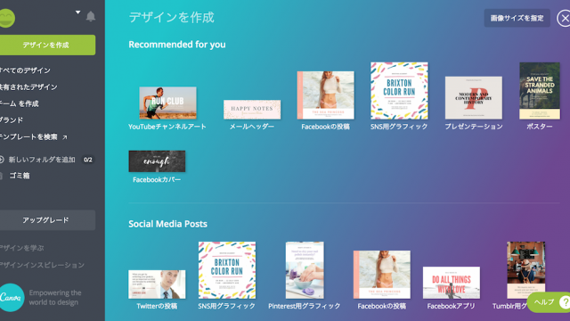

左のメニューからレイアウト見本を選びます。

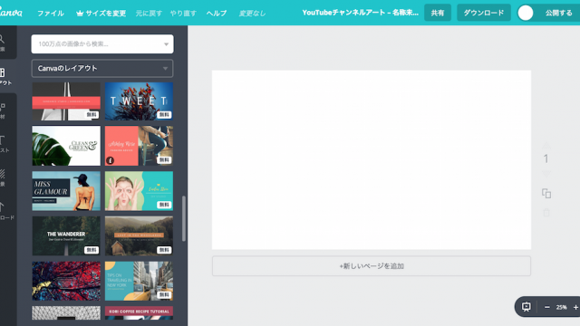

今回は左に文字、右に写真のレイアウト。
私、筆記体が好きなんですよね。

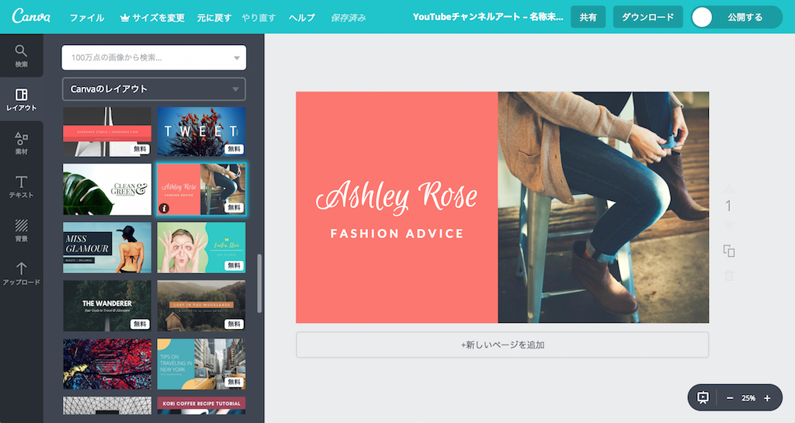

テキストを書き換えていきます。
日本語のフォントも色々入ってますよ♡

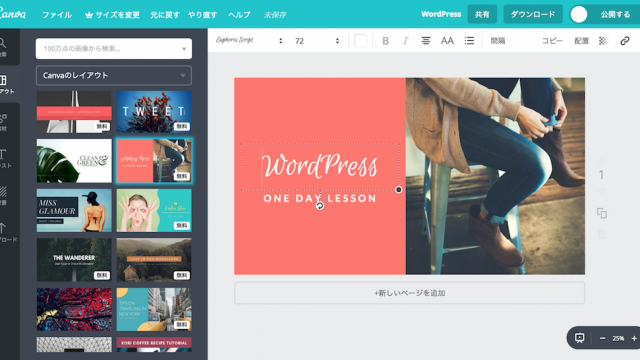

背景の色を変えて。。。

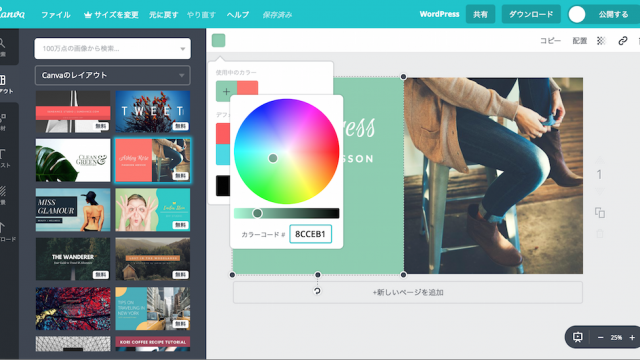

実は左側のメニューに図形とかいろんなパーツがあるんですよ。

今回は斜めのストライプをセットしようかと。
色は文字色に合わせて白に。

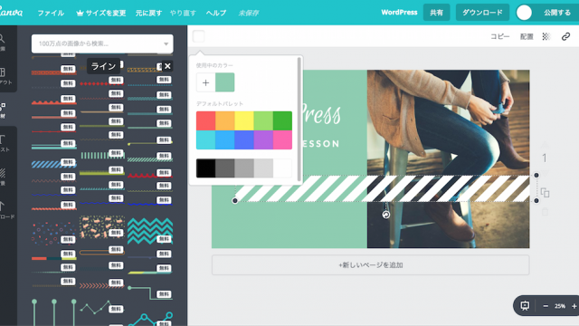

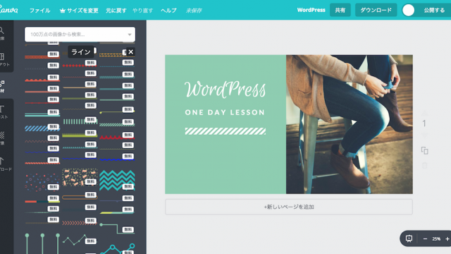

用意しておいた写真をウィンドウ内にドラッグ＆ドロップします。
アップロード後、元の画像の位置へアップした写真を持っていくと置き換わります。
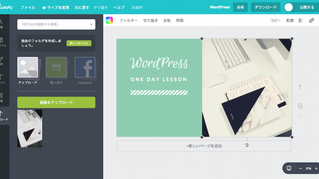

写真の色合いも調整できちゃったり。
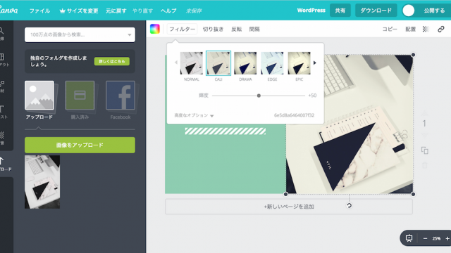

作り終えたら右上のダウンロードボタンを押すと保存できます。

あら、なんかおしゃれな文言が。
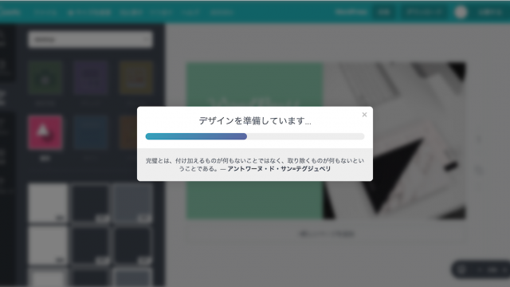

他にもこんなものを作ってみました。
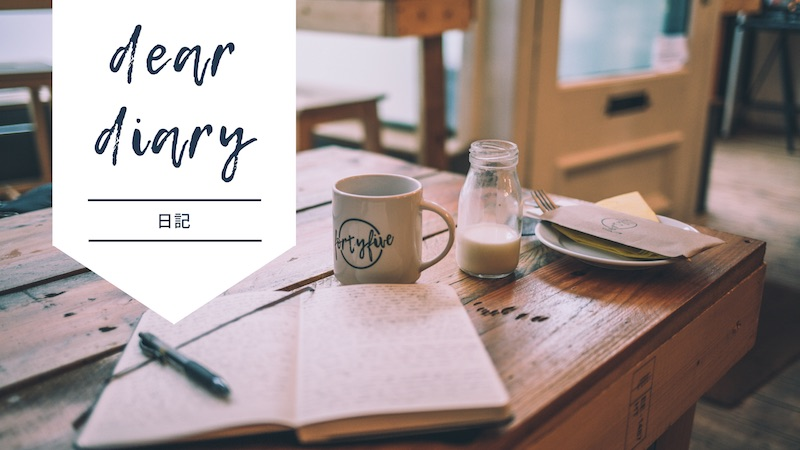