WordPressのテーマをごりごりカスタマイズ/開発したい方に。

追記：2020/3/22
この記事のやり方でも、ローカル環境を作れますが、「[Local By Flywheel](https://localwp.com/)」を使うともっと簡単に開発環境を用意できます。

## ローカル環境とは？

ローカル環境とは、ざっくりいうとPC内にWebサイトの置き場をつくること。

ふだん私たちがみているWebページは、インターネット上のスペースに、文章や画像などのファイルが配置されています。
全世界に接続されているので、ブラウザからURLを入力すると、誰でもアクセスできる状態になっています。

本番で見せるサイトをいきなりカスタマイズすると、もし不具合があって動かなくなったとき、みんながサイトを見れなくなってしまって大変です。

なので、本格的にWebサイトやサービスを開発をする人は、自分のPC内で、試験的にWebサイトを作ります。PC内の環境（ローカル環境）で開発、テストしたものを、最終的にインターネット上に公開するんですね。

今回はその環境を作る手順の説明です。

## MAMPで簡単にWordPressのローカル環境を作る

まずはMacに、MAMPをインストールします。

<a href="https://www.mamp.info/en/" target="_blank" rel="noopener noreferrer">MAMP & MAMP PRO</a>へ。

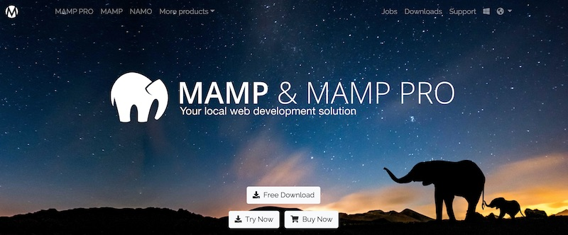

「Free Download」ボタンをクリックします。

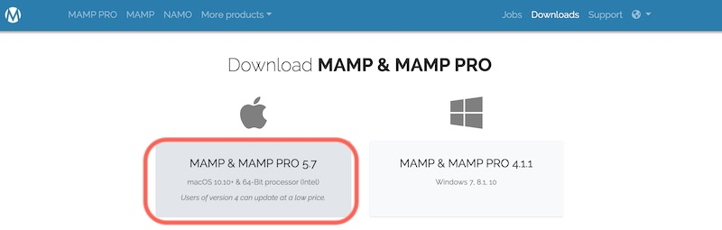

Mac用の「MAMP＆MAMP PRO 5.7」をダウンロード

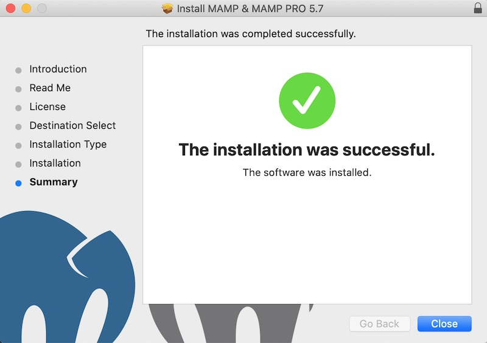

インストーラーを起動して、インストールを完了させます。

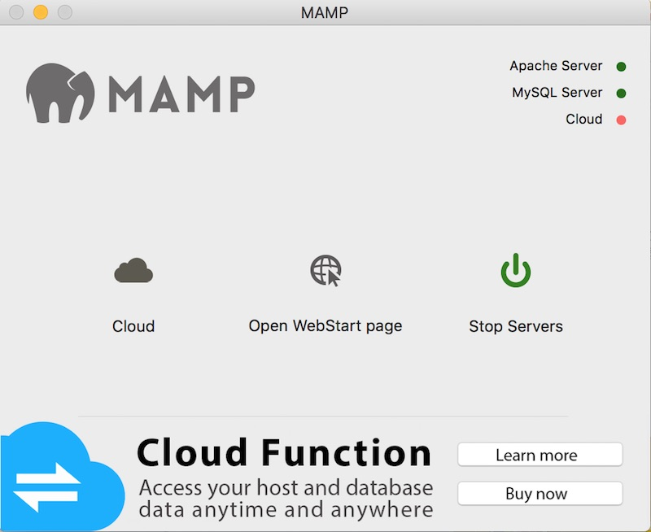

MAMPを起動します。

サーバーが起動できると`http://localhost:8888/MAMP/`が立ち上がり、スタートページが表示されます。

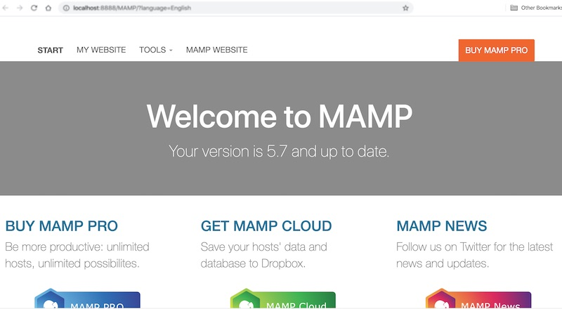

ちなみに、私は今回MAMPは再インストールだったせいか、サーバーを起動しようとすると「Port 8888 is in use for other softwares〜」的な文章が出てきました。

その際はアクティビティモニタから、「mysqld」と「httpd」を検索して、終了させると、無事起動できました。

## WordPressをインストールする
### WordPressのファイル一式をダウンロードする

<a href="https://ja.wordpress.org/" target="_blank" rel="noopener noreferrer">WordPressの公式サイト</a>から、ファイルをダウンロードします。

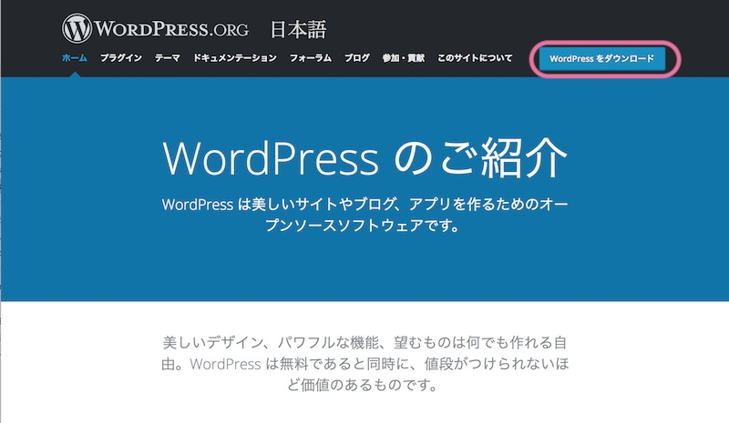 ダウンロードボタンをクリック。

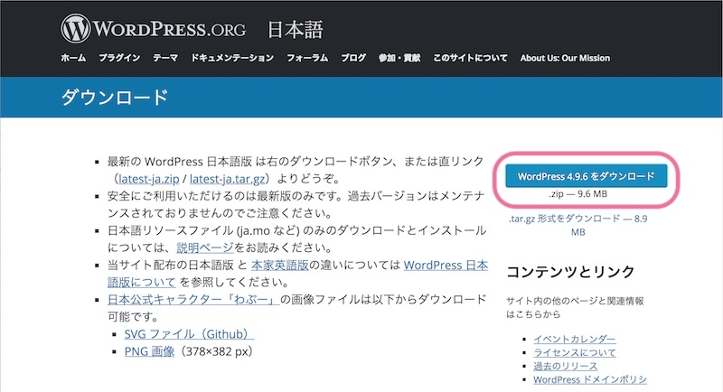

### MAMPのフォルダにデータ一式を配置する
ダウンロードしたZIPファイルを解凍します。

解凍したフォルダごと、/Applications/MAMP/htdocsに配置します。

/Applications/MAMP/htdocsに「index.html」や「index.php」をおくと、「http://localhost:8888/」をホームページとして表示されます。

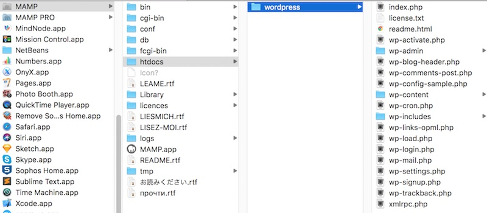

この画像だと、「htdocs/wordpress」にファイル一式を配置しているので、「http://localhost:8888/wordpress/」がWordPressサイトのアドレスになります。

### WordPress用のデータベースをつくる

`http://localhost:8888/MAMP/`にアクセスします。

phpMyAdminをクリックして、データベースの管理画面を開きます。

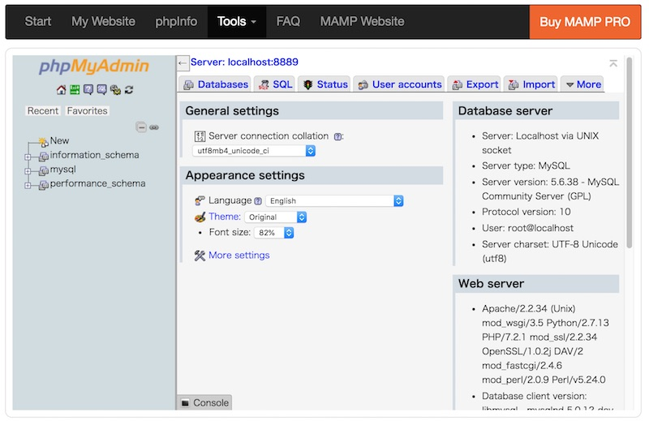

左側のNewをクリックします。

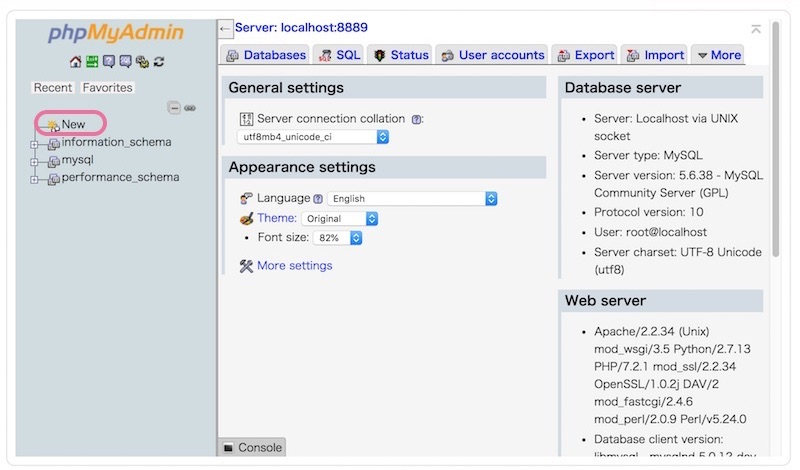

データベースを作成します。

データベースの名前に「wp-01」と入力して、「Create」をクリック

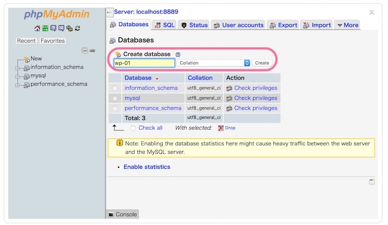

左側のリストに「wp-01」というデータベースが追加されていますね。これでOK。

### WordPressをインストールする

Webブラウザからhttp://localhost:8888/wordpress/にアクセスします。

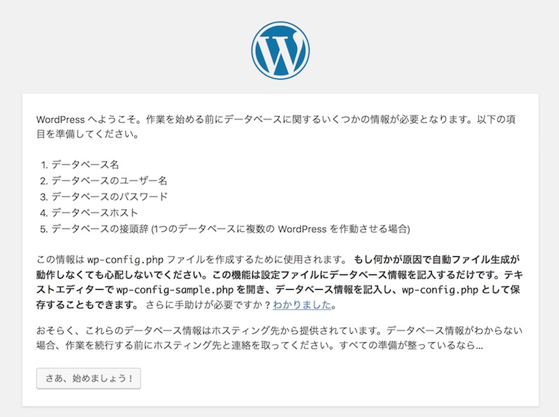

WordPressのセットアップ画面がでてきます。

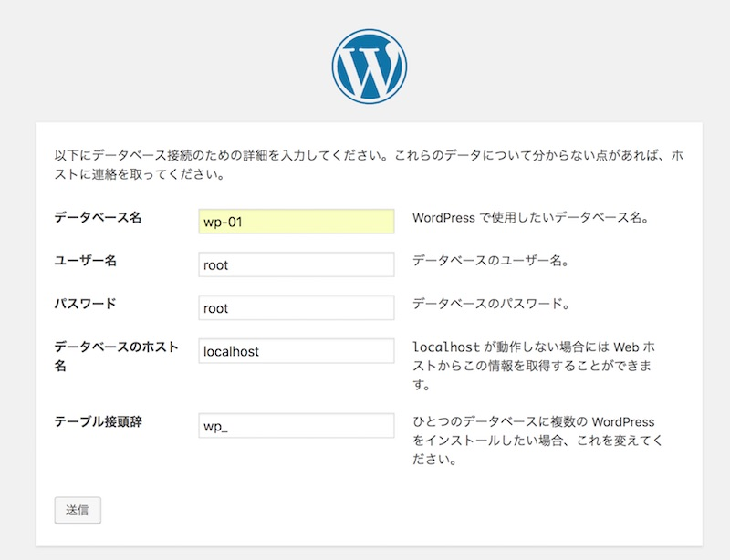

データベース名は、先ほどMAMPの管理画面で作成したデータベースの名前「wp-01」を入れます。
ユーザー名とパスワードには「root」をいれます。

入力ができたら「送信」ボタンをクリック！

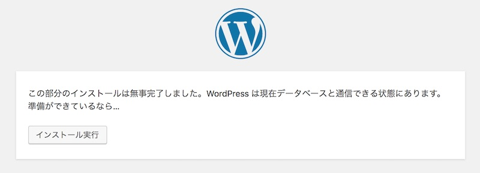

「インストール実行」をクリックします。

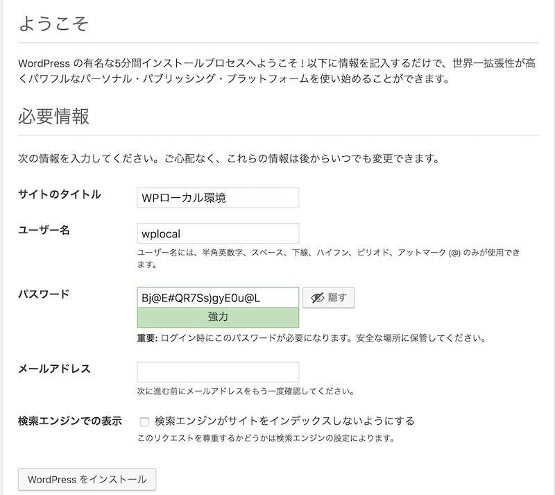

WordPressの初期設定画面になります。

タイトル、ユーザー名、パスワード、メールアドレスを入力したら「WordPressをインストール」ボタンをクリック

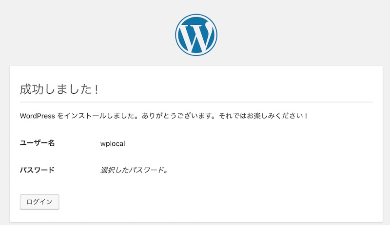

インストールが完了しました。

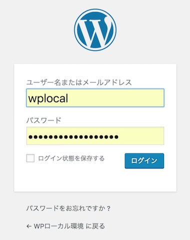 ログイン画面へ移ります〜。

先ほどいれたユーザー名とパスワードを入れてログインします。

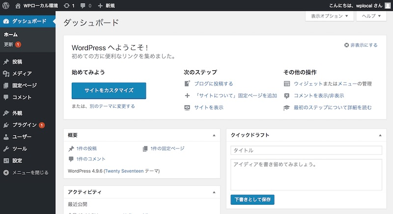

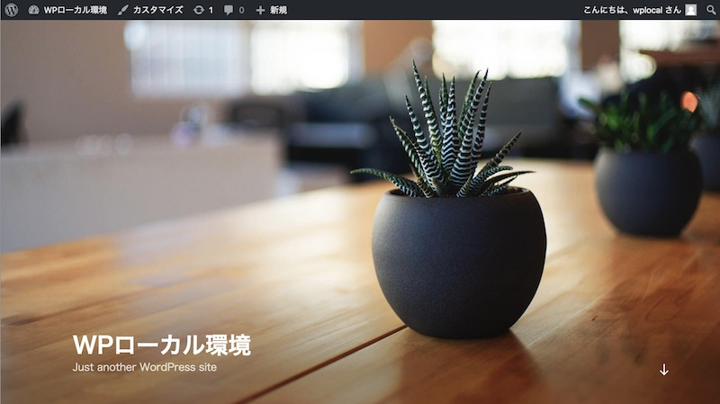

これで、初期設定が完了です。

あとは、htdocs以下のWordPressテーマファイルを更新していきます。