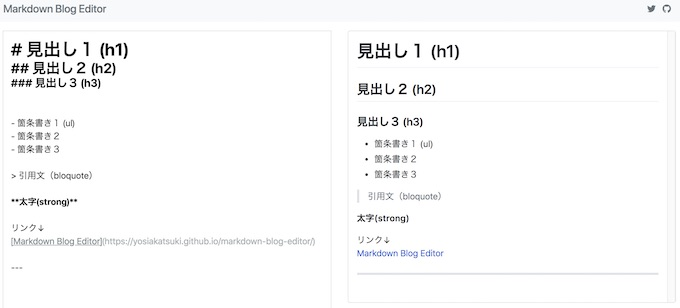
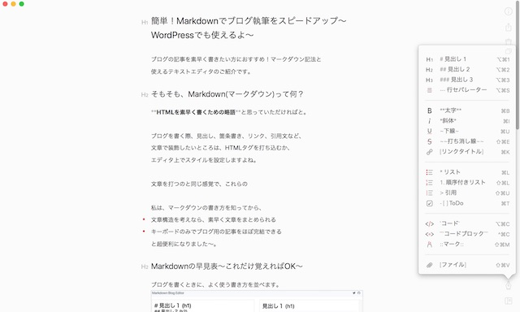

ブログの記事を素早く書きたい方におすすめ！な
Markdown（マークダウン）記法と使えるテキストエディタのご紹介です。

## そもそも、Markdown(マークダウン)って何？

HTMLを素早く書くための略語と思っていただければと。

ブログを書く際、見出し、箇条書き、リンク、引用文など、
文章で装飾したいところは、HTMLタグを打ち込むか、
エディタ上でスタイルを設定しますよね。

文章を打つのと同じ感覚で、これらの文章装飾ができちゃいます。

私は、マークダウンを知ってから、

* 文章構造を考えながら、文章をまとめられる
* キーボードのみでブログ用の記事をほぼ完結できる

と、重宝させてもらっています。

## Markdownの早見表〜これだけ覚えればOK〜

ブログを書くときに、よく使う記号を並べます。

* 見出し１ ：# + Space
* 見出し２ ：# + # + Space
* 箇条書き：- + Space
* 太字 ：* + * + Space
* 引用文 ：> + Space

見出しは#の数が増えると、見出し２、３という風になります。

左が書き方で、右がブラウザプレビューです。

<a href="https://yosiakatsuki.github.io/markdown-blog-editor/" target="_blank" rel="noopener noreferrer">Markdown Blog Editor</a>を使わせていただきました。

ブラウザ上でプレビューできて、HTML変換もできるって便利。

詳しい記載ルール：
<a href="https://qiita.com/tbpgr/items/989c6badefff69377da7" target="_blank" rel="noopener noreferrer">Markdown記法 サンプル集</a>

## Markdownにも対応おすすめテキストエディタ

### Bear（無料の高機能テキストエディタアプリ）

無料のアプリで、スマホ、PC対応です。

Bear - プライベートメモ

Shiny Frog Ltd.無料posted with<a href="https://mama-hack.com/app-reach/" title="アプリーチ" target="_blank" rel="nofollow">アプリーチ</a>

右下にマークダウンの書き方見本も出てくるのが便利。

 高機能かつ、シンプルで、すごく使いやすいです。

### Ulysses

Ulysses

Ulysses GmbH &amp; Co. KG無料posted with<a href="https://mama-hack.com/app-reach/" title="アプリーチ" target="_blank" rel="nofollow">アプリーチ</a>

UlyssesもMarkdown対応されたテキストエディタ。
ブログを書くときはもっぱらこちらを使っています。

## まとめ
マークダウンを覚えると、素早く、読みやすい文章を作成できるようになります。
おためしあれ。

