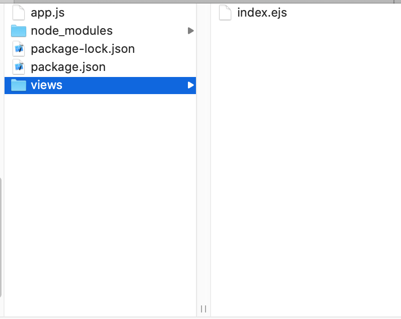
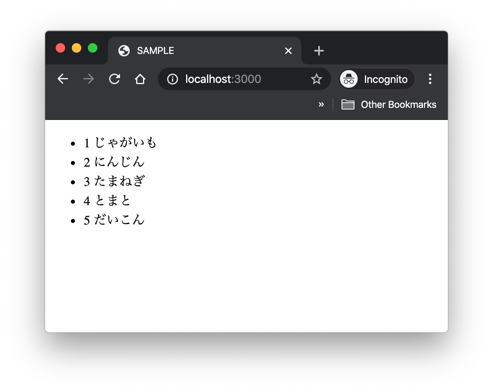

Node.jsの学びメモ。
Node.jsとMySQLを接続して、データベースを動かす方法を説明します。

* MacでのMySQLの導入方法
* Node.js(Express)からMySQLデータベースに接続するプログラム
* データベースから情報を取得して、表示するプログラム


前提

* Macでの操作になります
* Node.jsはインストール済み

## Node.js用のプロジェクトの作成

新しいフォルダを作成し、フォルダの中で、下記コマンドを順に実行します。

```
$npm init
```

設定はデフォルトのままで、entry point : (index.js)のところは、「app.js」にしました。（初期ファイルがapp.jsになります。）

Expressインストール

```
$npm install express --save
```

EJSのインストール
ejsを導入することで、HTMLにJavaScriptを埋め込めるようになります。

```
$npm install ejs
```

MySQLのインストール

```
$ npm install mySQL
```

##  MySQLデーターベースの作成

MySQLをインストールしていない場合はまずインストールします。
brew install mysql

MySQLサーバーを立ち上げます。

```sql
-- MySQLサーバースタート
mysql.server start
```

コンソールがmysql>となり、MySQLを操作できるようになります。

MySQLへログインします。

```sql
-- MySQLへログイン
mysql -uroot -p
```

ポート番号を確認します。

```sql
-- ポート番号の確認
show variables like 'port';
+---------------+-------+
| Variable_name | Value |
+---------------+-------+
| port          | 3306  |
+---------------+-------+
```

ここで出てきた、3306はあとでプログラムを書く時に、ポート番号として使います。

まずはプログラムで使う、データベースとテーブルを作成します。
テスト用のデータベース作成します。

```sql
-- データベースtest作成
create database test;
```

testにテーブルitemsを作成します。

```sql
-- テーブル作成
use test;
CREATE TABLE items(
     id INT(11) AUTO_INCREMENT NOT NULL,
     name VARCHAR(30) NOT NULL ,
     PRIMARY KEY (id));
```

作成したテーブル情報を確認します。

```sql
DESC items;
+-------+-------------+------+-----+---------+----------------+
| Field | Type        | Null | Key | Default | Extra          |
+-------+-------------+------+-----+---------+----------------+
| id    | int         | NO   | PRI | NULL    | auto_increment |
| name  | varchar(30) | NO   |     | NULL    |                |
+-------+-------------+------+-----+---------+----------------+
```

テーブルにデータを投入します。

これで、こんなテーブル(items)ができています。

```sql
-- データ投入
INSERT items(name) VALUES ('じゃがいも');
INSERT items(name) VALUES ('にんじん');
INSERT items(name) VALUES ('たまねぎ');
```

ユーザーを作り、ユーザー権限を付与します。

```sql
-- ユーザー作成、権限付与
create user 'root'@'localhost' identified with mysql_native_password by 'password';
GRANT ALL ON test.* TO 'root'@'localhost';
```

root →ユーザー名
password →パスワード
test → データベース名
をいれてください。

 MySQL8.0の場合、Node.jsのmysqlが新しいパスワードの認証形式に対応していないため、ユーザーの設定ができていないと、このような実行エラーがでてしまいます。

### Node.jsでMySQLへ接続するプログラム

app.jsに以下のようなコードを書きます。

```javascript:title=app.js
const express = require('express');
const mysql = require('mysql');
const app = express();

app.use(express.static('public'));

// データベース接続情報
const connection = mysql.createConnection({
  host: 'localhost',
  port: 3306,
  user: 'root',
  password: 'password',
  database: 'test'
});

// データベースに接続できたらコンソールにConnectedを表示
connection.connect(function(err) {
  if (err) throw err;
  console.log('Connected');
});

app.listen(3000);
```

データベース接続情報は各自の環境に変更ください

* port：先ほどMySQLで確認したポート番号3306を設定
* userアカウント名
* password：パスワード
* database:データベース名


### MySQLに接続できているか、プログラムを実行して確認

ターミナルでプログラムを実行します。

うまくいっているとターミナル上に「Connected」と表示されています。

```
$node app.js
```

確認できたら、Ctrl + cで終了。

## データベースの情報を取得して表示するNode.jsプログラム

続いて、テーブルからデータをSELECTして画面に表示するプログラム

projectフォルダ構造はこのようになっています。



まず、app.jsには以下のプログラムを書きます。

```javascript:title=app.js
const express = require('express');
const mysql = require('mysql');
const app = express();

// データベース接続情報
const connection = mysql.createConnection({
  host: 'localhost',
  port: 3306,
  user: 'root',
  password: 'root',
  database: 'list_app'
});

// テーブルitemsのデータを取得してindex.ejsで表示
app.get('/', (req, res) => {
  connection.query(
    'SELECT * FROM items',
    (error, results) => {
      res.render('index.ejs',{items:results});
    }
  );
});

app.listen(3000);
```

views/index.ejsで表示します。
```markup:title=views/index.ejs
<!DOCTYPE html>
<html>
  <head>
    <meta charset="utf-8">
    <title>SAMPLE</title>
  </head>
  <body>
      <ul>
        <% items.forEach((item) => { %>
          <li>
            <div>
              <span><%= item.id %></span>
              <span><%= item.name %></span>
            </div>
          </li>
        <% }) %>
      </ul>
  </body>
</html>
```

### Node.jsプログラムの実行結果

ターミナルでプログラムを実行します。
```
$node app.js
```

localhost:3000にアクセスするとデータベースの内容がリストで表示されています。（いろいろ操作してたら、とまととだいこんの行が増えてました😅）



 最後に、MySQLを終了するときは「exit」で。

 ```
 exit
 ```