## Google Search Consoleのデータをスプレッドシートで分析したい

Google Search Consoleは、Googleで検索されるキーワードや順位を確認できる無料ツールです。

画面上でも確認できますが、例えば、先月と今月で表示数や順位がどれくらい変わったの？といった月ごとの比較は面倒です。

定点観測のために、検索パフォーマンスをCSVに保存して、月別に比較したり、分析できた方が早いと思い、Pythonでプログラムを書いてみました。

余談ですが、Google Spreadsheetには Google Search Consoleの検索パフォーマンスを取り込むアドオンが提供されています。
プログラムは書かないけど、データだけほしい方は<a href="https://hitonote.jp/column/seo/435/" target="_blank" rel="noopener noreferrer">アドオン</a>の方が早いです。

CSVにはこれらの項目を表示します。

* ページ
* 検索クエリ
* クリック数
* 表示回数
* CTR
* 平均順位

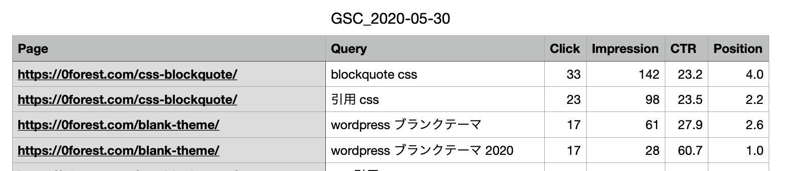

今回作るプログラム：
**Google Search Console APIに接続し、指定期間の検索パフォーマンスをCSVに出力する**

## Google Search Console APIの登録方法


### Google Cloud Platformに登録

まず、前提として、Googleアカウントを持っていて、Google Search Consoleにサイトが登録されている必要があります。

Google Search Console APIを使うのには、Google Cloud Platformへの登録が必要になります。

<a href="https://console.cloud.google.com/projectselector/iam-admin/iam?supportedpurview=project,organizationId,folder&orgonly=true&project&folder&organizationId" target="_blank" rel="noopener noreferrer">Google Cloud Platform</a>にアクセスします。

最初に開くと、利用規約への同意を求められます。
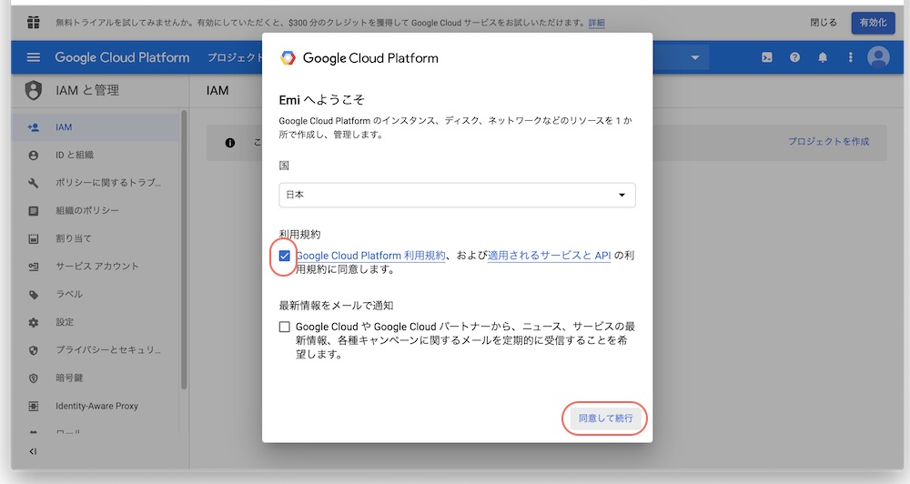

プロジェクト名を入れて、新しいプロジェクトを作成します。
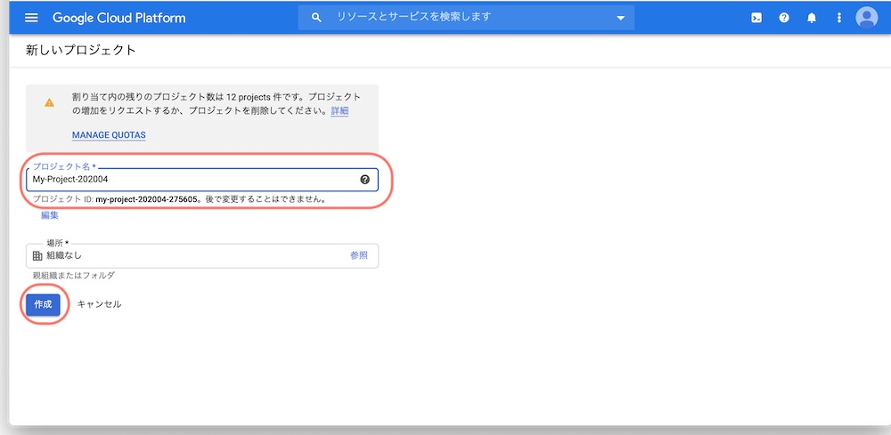

プロジェクトが作成できました。


### Google search consoleのAPIを登録

<a href="https://console.developers.google.com/flows/enableapi?apiid=webmasters&credential=client_key" target="_blank" rel="noopener noreferrer">Google search consoleのAPIを登録します</a>

先ほど作成したプロジェクトを選んで、続行を選択します。
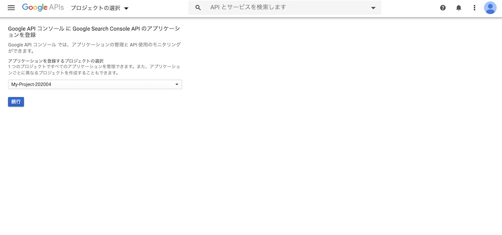

認証情報には進まなくてOKです。
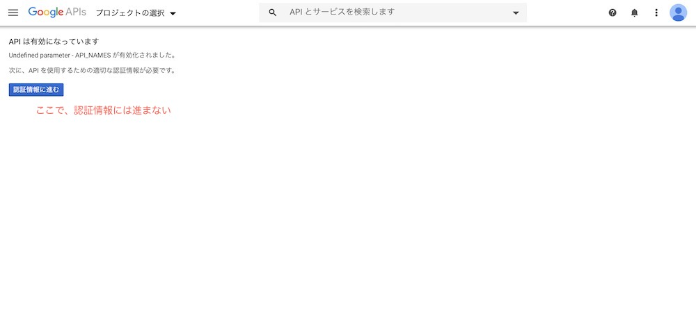

### サービスアカウントのJSONファイルをダウンロード

Google Cloud Platformの管理画面から、サービスアカウントを作成します
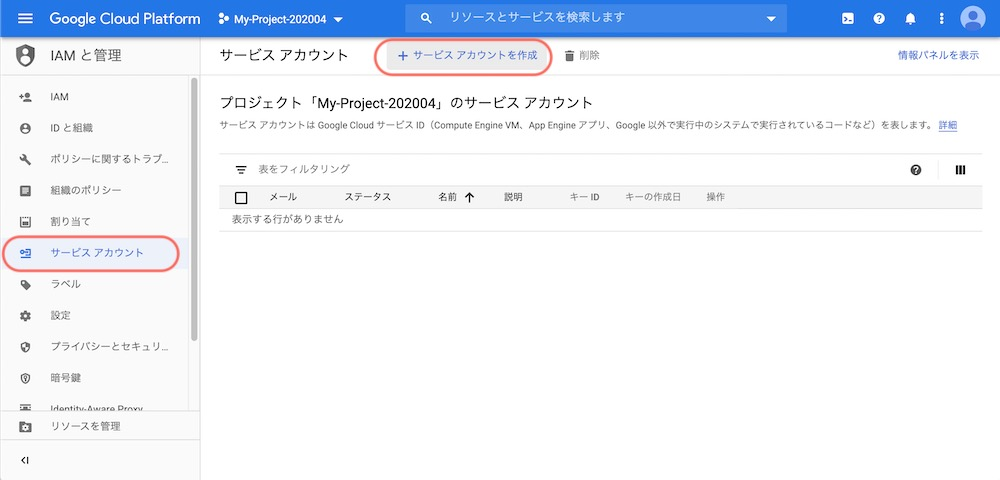

①サービスアカウントの詳細
サービスアカウント名、説明を入力します。

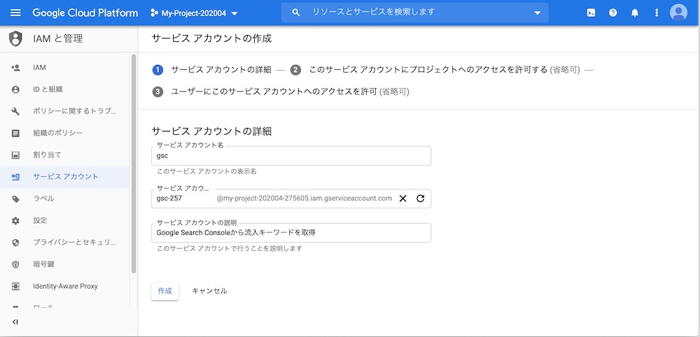

②このサービスアカウントにプロジェクトへのアクセスを許可する

そのまま続行をクリックします。

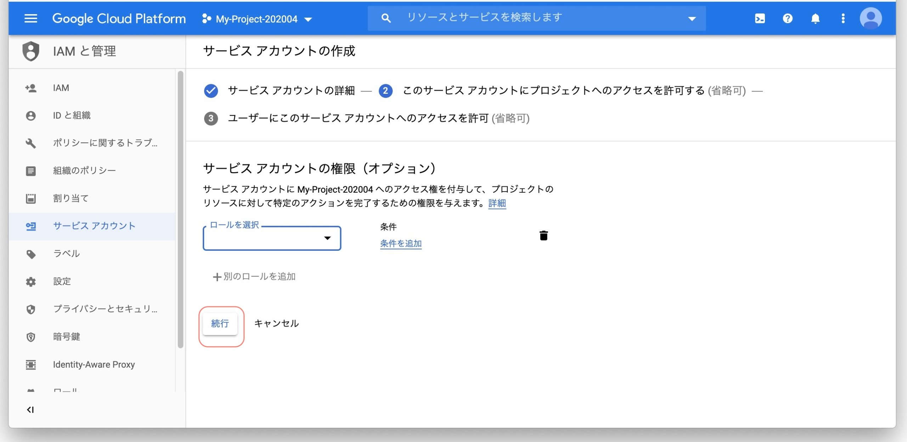

③ユーザーにこのサービスアカウントへのアクセスを許可

キーの作成をクリックします。

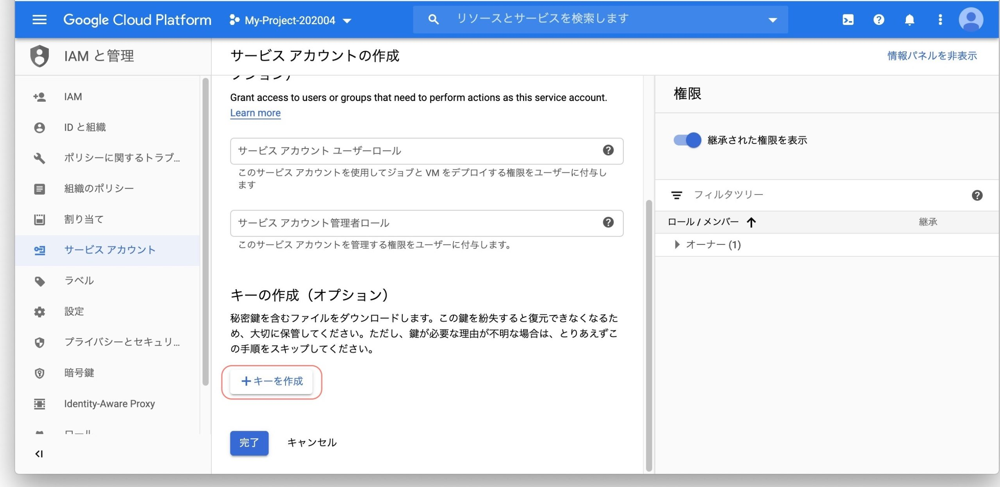

JSONファイルをダウンロードします。（このJSONファイルはあとでプログラムに使います）

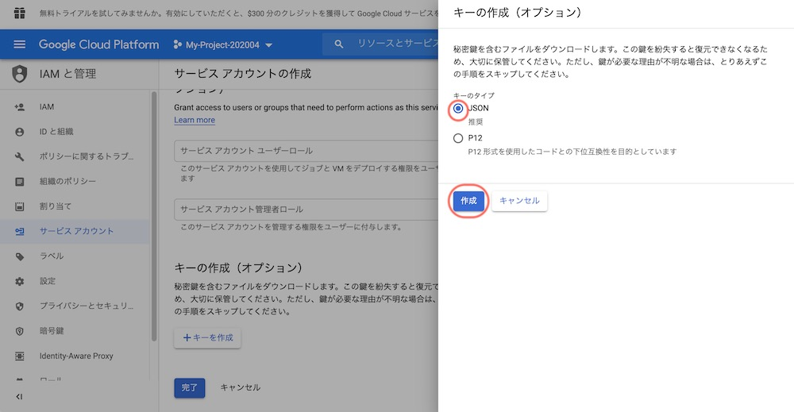

### Google Search Consoleにユーザーを追加

Google Search Consoleの管理画面へアクセスします。

設定＞ユーザー権限＞ユーザーを追加からサービスアカウントのメールアドレスをユーザーに追加します。

サービスアカウントのメールアドレスはここで確認

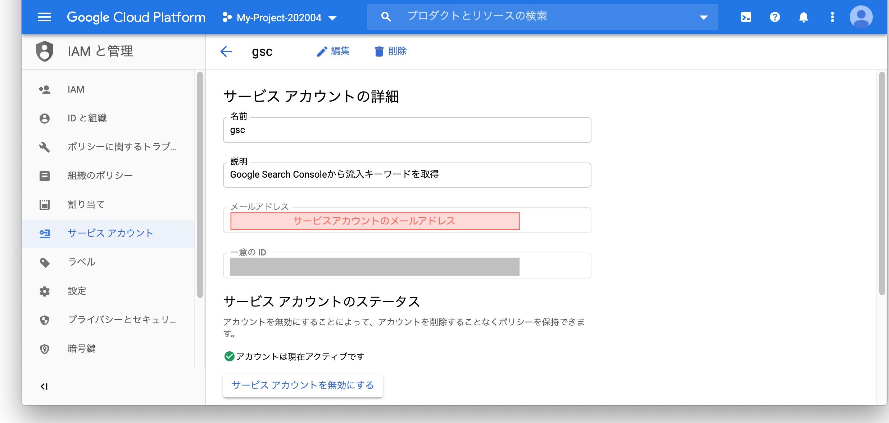

メールアドレスと権限を設定します。

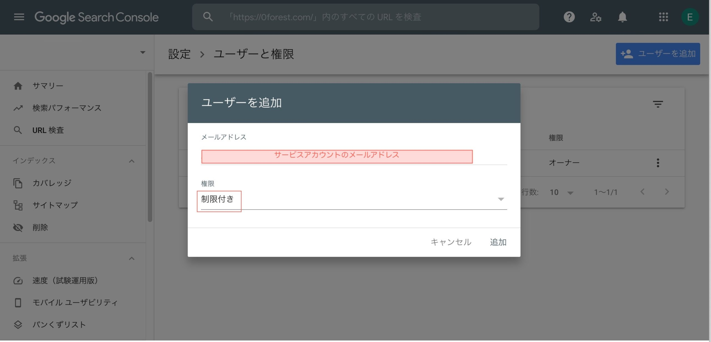

権限は「制限付き」を設定します。

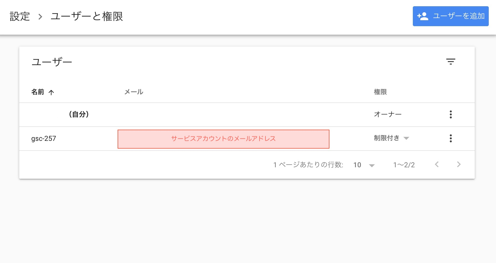 これで準備完了です。

## Google Search Console APIを使ったPythonプログラム

### 事前準備

まず、ライブラリをインストールしときます。

```
pip install --upgrade google-api-python-client
pip install oauth2client
```

### 検索パフォーマンスを出力するプログラム

先ほどダウンロードした、JSONファイルはプログラムのファイルと同じフォルダ内に置いておきます。

```
フォルダ
├─ script.py
└─ 〇〇〇.json
```

以下のコードを「script.py」というファイル名で保存します。
```python:title=script.py
import sys
import argparse
import pandas as pd

from googleapiclient.discovery import build
from oauth2client.service_account import ServiceAccountCredentials

SCOPES = ['https://www.googleapis.com/auth/webmasters.readonly']
JSON_PATH = './JSONファイルの名前'
TARGET_URL = 'サイトのURL'

argparser = argparse.ArgumentParser(add_help=False)
argparser.add_argument('start_date', type=str,
    help=('Start date of the requested date range in YYYY-MM-DD format.'))
argparser.add_argument('end_date', type=str,
    help=('End date of the requested date range in YYYY-MM-DD format.'))
args = argparser.parse_args()

def main(argv):

  print('取得WEBサイト:', TARGET_URL)
  print('取得開始日:', args.start_date)
  print('取得終了日:', args.end_date)

  request = {
    'startDate': args.start_date,
    'endDate': args.end_date,
    'dimensions': ['page','query'],
  }

  response = execute_request(TARGET_URL, request)
  print_table(response, args.end_date)

def execute_request(property_uri, request):
  credentials = ServiceAccountCredentials.from_json_keyfile_name(JSON_PATH, SCOPES)
  webmasters = build('webmasters', 'v3', credentials=credentials)

  return webmasters.searchanalytics().query(
    siteUrl=property_uri, body=request).execute()

def print_table(response,title):
  if 'rows' not in response:
    print('Empty response')
    return

  rows = response['rows']
  tbl = []

  for row in rows:
    v_page = row['keys'][0]
    v_query = row['keys'][1]
    v_imp = int(row['clicks'])
    v_clicks = int(row['impressions'])
    v_ctr = str(round((row['ctr'] * 100),1))
    v_pos = str(round(row['position'],1))
    tbl.append([ v_page, v_query, v_imp, v_clicks, v_ctr, v_pos])

  tbl_csv = pd.DataFrame(
    tbl,
    columns = [ 'Page', 'Query', 'Click', 'Impression', 'CTR', 'Position'])
  tbl_csv.to_csv('GSC_'+title+'.csv', index=False)

if __name__ == '__main__':
  main(sys.argv)
```


### プログラムの解説
requestのところで、どんなデータを取得するかを指定しています。

```python
  request = {
    'startDate': args.start_date,
    'endDate': args.end_date,
    'dimensions': ['page','query'],
  }

  response = execute_request(TARGET_URL, request)
  print_table(response, args.end_date)
```

startDate：開始日
endDate：終了日
dimensions：どのデータを取得するか

dimensionは今回はここではPageとQueryに対して、クリック数、CTR、表示数、順位を取得します。


他にもdateやdeviceなどを入れることができます。


また、rowLimit：行数を指定することもできます。

<a href="https://developers.google.com/webmaster-tools/search-console-api-original/v3/how-tos/search_analytics.html?hl=ja" target="_blank" rel="noopener noreferrer">Google Search Console API Reference</a>

### プログラムの実行

コマンドラインからプログラムを実行します

ターミナルで、プログラムが置いてある場所に移動します。

「python script.py 開始日 終了日」でプログラムを実行します。

python script.py '2020-05-01' '2020-05-31'

これで、2020/05/01〜2020/05/31の分データが「`GSC_2020-05-30.csv`」というCSVファイルに書き出されます。

