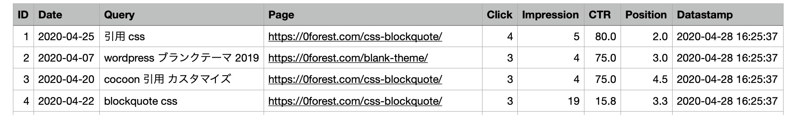
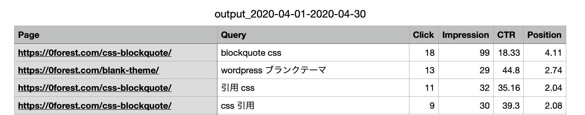

サーチコンソールのデータをDBに保存して、検索パフォーマンスを月別に比較したりできたらいいなと思ってPythonでプログラムを書くことに。

今回作るプログラム Google Search ConsoleからAPI経由で、日付ごとの検索パフォーマンスをMySQLデータベースに保存する

データベースを準備する
-----------

Google Search ConsoleからAPI経由で、日付ごとに下記データを取得します。

* ページ
* クエリ
* クリック数
* Impression
* CTR
* 掲載順位

テーブルにはこのようにデータが保存されます


SQLはこちら

```sql
-- DATABASE作成
CREATE DATABASE searchdata_db;
USE searchdata_db;

-- TABLE作成
CREATE TABLE log_daily_query (
  ID INT(11) NOT NULL AUTO INCREMENT,
  Date  DATE NOT NULL,
  Query VARCHAR(100) NOT NULL,
  Page VARCHAR(2000) NOT NULL,
  Clicks INT(11) DEFAULT NULL,
  Impressions INT(11) DEFAULT NULL,
  CTR FLOAT DEFAULT NULL,
  Position FLOAT DEFAULT NULL,
  Timestamp DATETIME NOT NULL,
  PRIMARY KEY (ID)
);
```

```sql
+-------------+---------------+------+-----+---------+----------------+
| Field       | Type          | Null | Key | Default | Extra          |
+-------------+---------------+------+-----+---------+----------------+
| ID          | int           | NO   | PRI | NULL    | auto_increment |
| Date        | date          | NO   |     | NULL    |                |
| Query       | varchar(100)  | NO   |     | NULL    |                |
| Page        | varchar(2000) | NO   |     | NULL    |                |
| Clicks      | int           | YES  |     | NULL    |                |
| Impressions | int           | YES  |     | NULL    |                |
| CTR         | float         | YES  |     | NULL    |                |
| Position    | float         | YES  |     | NULL    |                |
| Timestamp   | datetime      | NO   |     | NULL    |                |
+-------------+---------------+------+-----+---------+----------------+
```

## Google Search ConsoleのデータをDBに保存するプログラム

### 事前準備

[Google Search Console APIデータをCSV出力するプログラム](/python-google-search-console-api/)を参考に、Google Search Console APIに接続しデータを取得するプログラムを用意しておきます。

今回使うライブラリをインストールします。
```
pip install mysqlclient
```

参考記事
[MySQLの接続の仕方](/node-js-mysql/)

### Pythonプログラム

```python:title=gsc_to_db.py
import sys
import MySQLdb
import datetime

from googleapiclient.discovery import build
from oauth2client.service_account import ServiceAccountCredentials

SCOPES = ['https://www.googleapis.com/auth/webmasters.readonly']
JSON_PATH = './JSONファイルの名前'
TARGET_URL = 'サイトのURL'
DATABASE = 'searchdata_db' # データベース名
TABLE_NAME = 'log_daily_query' # テーブル名

def main(argv):

  connection = MySQLdb.connect(
      host = 'localhost',
      port = 3306,
      user = 'root',
      password = 'root',
      database = DATABASE,
  )
  cursor = connection.cursor()

  cursor.execute('select (max(date) + INTERVAL 1 DAY) as start_date from ' + TABLE_NAME)
  start_date_arr = cursor.fetchone()

  start_date = str(start_date_arr[0])
  if start_date == 'None':
    start_date = '2018-01-01'
  end_date = datetime.datetime.today().strftime("%Y-%m-%d")

  print('取得WEBサイト:', TARGET_URL)
  print('取得開始日:', start_date)
  print('取得終了日:', end_date)

  request = {
    'startDate': start_date,
    'endDate': end_date,
    'dimensions': ['date','query', 'page'],
  }

  response = execute_request(TARGET_URL, request)
  save_to_table(response, cursor, TABLE_NAME)

  cursor.close()
  connection.commit()
  connection.close()
  print(cursor.rowcount, "was inserted.")

def execute_request(property_uri, request):
  credentials = ServiceAccountCredentials.from_json_keyfile_name(JSON_PATH, SCOPES)
  webmasters = build('webmasters', 'v3', credentials=credentials)

  return webmasters.searchanalytics().query(siteUrl=property_uri, body=request).execute()

def save_to_table(response,cursor, table_name):
  if 'rows' not in response:
    print('Empty response')
    return

  rows = response['rows']
  insert_data = []
  time_stamp = datetime.datetime.today().strftime('%Y-%m-%d %H:%M:%S')

  for row in rows:
    insert_data.append([row['keys'][0],
      row['keys'][1],
      row['keys'][2],
      int(row['clicks']),
      int(row['impressions']),
      round(row['ctr']*100,1),
      round(row['position'],1),
      time_stamp])

  cursor.executemany('insert into ' + table_name + ' (Date, Query, Page, Clicks, Impressions, CTR, Position, Timestamp) values (%s,%s,%s,%s,%s,%s,%s,%s)',insert_data)

if __name__ == '__main__':
  main(sys.argv)
```
このコードを`gsc_to_db.py`というファイル名で保存します。

### プログラムの実行

ターミナルから、「python プログラム名」で実行します

```python
$ python 01_gsc_to_db.py
取得WEBサイト:
取得開始日: 2020-05-17
取得終了日: 2020-05-20
133 was inserted.
```

## DBからCSV出力するプログラム

集計期間を指定すると、期間内の検索パフォーマンスをCSVに出力します。

```python
import sys
import argparse
import MySQLdb
import pandas as pd
DATABASE = 'searchdata_db'　# データベース名

# コマンドラインの引数
# 第1引数：取得開始日
# 第2引数：取得終了日
argparser = argparse.ArgumentParser(add_help=False)
argparser.add_argument('start_date', type=str,
    help=('Start date of the requested date range in '
    'YYYY-MM-DD format.'))
argparser.add_argument('end_date', type=str,
    help=('End date of the requested date range in '
    'YYYY-MM-DD format.'))
args = argparser.parse_args()

def main(argv):

    connection = MySQLdb.connect(
        host = 'localhost',
        port = 3306,
        user = 'root',
        password = 'root',
        database = DATABASE,
    )
    cursor = connection.cursor()

    sql = "SELECT Page, Query, SUM(Clicks), SUM(Impressions), ROUND(AVG(CTR),2), ROUND(AVG(Position),2) FROM log_daily_query WHERE date BETWEEN '%s' AND '%s' GROUP BY Page,Query ORDER BY Page,Query, SUM(Clicks);" % (args.start_date,args.end_date)
    print(sql)
    cursor.execute(sql)

    rows = cursor.fetchall()

    output_csv = pd.DataFrame(
        rows,
        columns = ['Page', 'Query', 'Click', 'Impression', 'CTR', 'Position'])
    output_csv.to_csv('output_'+ args.start_date + '-' + args.end_date + '.csv', index=False)

    connection.commit()
    connection.close()

if __name__ == '__main__':
  main(sys.argv)
```

プログラムの実行

```
$ python 02_db_to_csv.py '2020-04-01' '2020-04-30'
SELECT Page, Query, SUM(Clicks), SUM(Impressions), ROUND(AVG(CTR),2), ROUND(AVG(Position),2) FROM log_daily_query WHERE date BETWEEN '2020-04-01' AND '2020-04-30' GROUP BY Page,Query ORDER BY Page,Query, SUM(Clicks);
```

出力されるCSV：
output_2020-04-01-2020-04-30.csv

