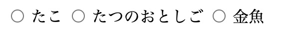
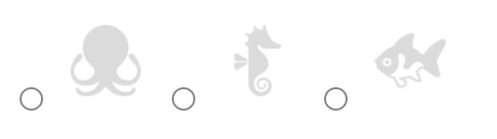

 HTMLとCSSで、お問い合わせフォームのラジオボタンやチェックボタンの代わりに画像選択にします。

   Before

 

  After
 

## HTMLとCSS

```markup:title=HTML
 <div>
  <input id="image_a" type="radio" value="image_a.jpg" name="image">
  <label for="image_a">
    
  </label>
  <input id="image_b" type="radio" value="image_b.jpg" name="image">
  <label for="image_b">
    
  </label>
  <input id="image_c" type="radio" value="image_c.jpg" name="image">
  <label for="image_c">
    
  </label>
</div>
 ```

```css:title=CSS
/* ラジオボタンの○を消す */
input[type="radio"] {
   display: none;
}

/* 画像の周りに隙間をあける */
label img {
  margin: 3px;
  padding: 5px;
}

/* 未選択の場合、色を薄くする */
input[type="radio"] + label img {
  opacity:0.2;
}
/* 選択済みの場合、色を濃くする */
input[type="radio"]:checked + label img {
  opacity:1;
}
```

## やり方

### ①label＋imgを足す


labelタグの中で画像を表示します。
labelタグのforはinputのidと揃えます。

```markup
<input id="image_a" type="radio" value="image_a.jpg" name="image">
<label for="image_a">
  
</label>
```

### ②CSSでラジオボタンを非表示

 

```css
input[type="radio"] {
  display: none;
}
```

### ③画像の選択／未選択で表示を変える


```css
input[type="radio"] + label img {
  opacity:0.2;
}
input[type="radio"]:checked + label img {
  opacity:1;
}
```

+セレクタは隣接した要素を指定することができます。
`input[type="radio"] + label`で、`input[type="radio"]`の直後にある`label`を指定しています。


`:checked`はラジオボタンの状態が選択済みのときに、適用されます。

## サンプルコード

<iframe height="265" style="width: 100%;" scrolling="no" title="ラジオボタンを画像で表示" src="https://codepen.io/filledforest/embed/abdNLrM?height=265&theme-id=light&default-tab=html,result" frameborder="no" allowtransparency="true" allowfullscreen="true">
  See the Pen <a href='https://codepen.io/filledforest/pen/abdNLrM'>ラジオボタンを画像で表示</a> by Emi
  (<a href='https://codepen.io/filledforest'>@filledforest</a>) on <a href='https://codepen.io'>CodePen</a>.
</iframe>
