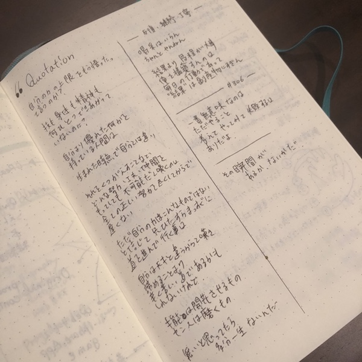
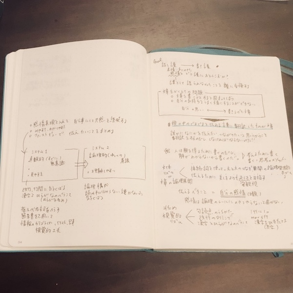
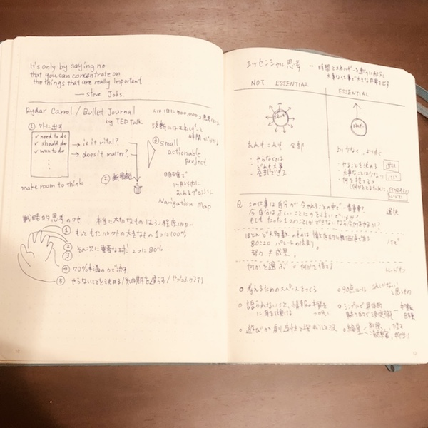

ただ読み流すだけでなく、本のエッセンスを自分のものにできる読書ノート。
私は本を読む時、よくノートにメモをとります。

## 気に入った本のみ読書ノートに書く

まず、一度はメモを取らずに読みます。
特に小説や自叙伝などは、メモを取っていると、ストーリーに没頭できなくなっちゃいます。
まずは純粋に本を楽しみます。概要や大筋を理解していきます。

全部読み終えて、自分にとっての価値があるかを見極めます。
いつかまた開きたいと思った本についてのみ、読書ノートに記録してます。

## 読書ノートのメリット

### 本を読んだ時の思い出をあとで見返せる

本の内容が全部、大切なものではありません。
本を読む目的によって、記録したい内容って変わりますよね。

ノートに書くことで、大事な情報を取捨選択できます。
要点を整理しておくことで、あとで本を読み直さなくても、自分にとって大事なところだけ素早く思い出せます。

また、本を読んだ時に感じたこと、考えたこともメモできるので、その時の自分に立ちかえれるなぁと思います。

### 本の理解が深まる

読書ノートは手書きがオススメです。
なぜかというと、書きながら、本の内容を自分の頭で整理することができるから。

文章で説明されていることを図解したり、「主張ー理由ー根拠」など文章構造を明確にしていくと、記憶に定着する感じがします。

### 自分の興味のある分野、方向性が見えてくる

私は読書ノートを作るよりも、バレットジャーナルの1ページとして、読書のページを入れちゃってます。

時間の流れ、自分の行動とともに読書を振り返ることができるからです。

ある月は、文章の書き方に関する本が多かったり、
また違う月は、お金に関する本が多かったりと、
そのタイミングで読んでいる本の分野が変わるんですね。

どんなジャンル、著者の本を読んでいるかを記録することで、その時の気分とか、興味の向かう先が見えてきます。また、本を読むことで、何をインプットして、どんな自分になりたいのか目指す方向性が見えてきます。

## 読書ノートの書き方

### 本を要約する

私は１冊１〜２ページ程度でまとめています。
だいたい長くても１時間程度でかけるボリューム出し、見返したときに要点が掴みやすいです。

ポイントはだいたいこの３つです。

* タイトル
* 本のメインメッセージ（太字になっている重要な箇所のみ抜粋）
* 自分で大事だなと思ったところ

主観を挟まずにそのまま本にある言葉を書き写すか要約することが多いです。

### 小説や漫画はグッときたシーンを記録する

ストーリーのある本は、要約するのもつまらないので、読んでて共感した言葉、かっこいいセリフを書いています。

テンションが上がるセリフを抜粋しています。

ちなみに、お気に入りのシーンを写メって、ノートに貼ったりもします。
見るたびに、何度も読んだ時の感動がよみがえります。

### ビジネス書、実用書は整理しながら読む

他のページの文章と矢印でつないだり、本の説明を図解したり、自分の頭で考えたことを記録しておきます。

### 読んだ時のインスピレーションを記録する

エッセンシャル思考を読んだ時のノートです。

右側には要約を書きます。
左側には、この本に関連する言葉や本の抜粋を記録しています。

例えばSteve Jobsのセリフはエッセンシャル思考に通じるなと思い、メモしてみました。

> 重要なことに集中する唯一の方法は「ノー」と言うことだ。
> -Steve Jobs

左ページには

* 本の内容を自分なりの言葉に変換する
* 本を読んで、アイデアやアクションをリストアップする
* 疑問・あとで調べたいことをメモする
 本のノートをふまえて、自分の思考が広がるような内容を書いていきます。

### 読書ノートは写真に撮って、Evernoteで検索する

私は、１冊のノートにスケジュール、メモ、読書ノートなどを一緒に書いています。

そのため、複数のノートに記録がまたがってしまい、読書の内容をあとから検索したり追いにくいのが難点。

なので、１冊ノートが終えた段階で、Evernoteにノートの写真を保存していっています。

手書きの内容もキーワード検索にひっかかるので、あとから本のタイトルや、メモの文言を調べるのに便利です

## まとめ

* 気に入った本についてのみノートを書く
* 本のサマリ、お気に入りの文章を記録してく
* 本にリンクする情報も同じページにまとめる
* Evernoteで電子保存

ノートで楽しい読書ライフを！
