WordPressのブログを作るための手順をまとめました。

「WordPressって、そもそもどういうものなの？」
「WordPressを使うためには何を知っていればOK？」
「具体的には何が必要？どうやって作るの？」

WordPressをこれからはじめる方のスタートガイドになれば嬉しいです。

WordPressでブログを始めるには大きく5つのステップです。

1. WordPressの基本
2. WordPressのインストール方法
3. WordPressの使い方
4. ブログのデザインを設定
5. ブログを育てる

## 1. Wordpressの基本

### WordPressとは？

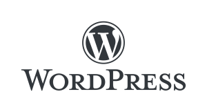

WordPressは**自分でホームページやブログが作れるソフトウェア**です。個人ブログはもちろんのこと、コーポレートサイト、オンラインショップ、オウンメディア、会員制サイトなど、用途に合わせたサイトを作ることができます。

### ブログサービスとの違いは？なぜWordPress？？

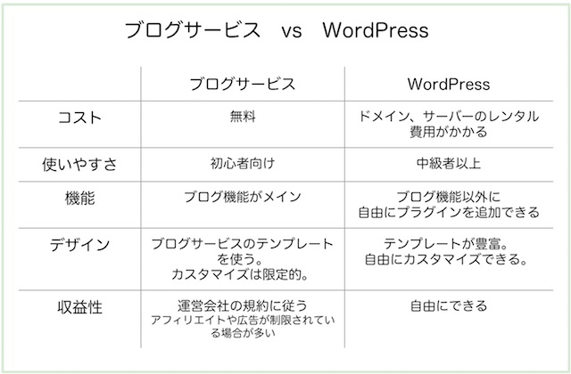

無料のブログサービスには、
・はてなブログ
・livedoorブログ
・Amebaブログ
・楽天ブログ
・FC2ブログ
があります。

ブログサービスは、記事を書いて、投稿することがメイン。
デザインやレイアウトはある程度決まっていたり、似たようなデザインが多いです。

WordPressは、ブログを書くことはもちろん、レイアウトを変えたり、いろんな機能を持たせることができます。

まだブログを書いたことがない人は、無料ブログから始めてみるのがおすすめ。記事の投稿に慣れてきて、もっとカスタマイズしたい！となったらWordPressをはじめましょう。

### 費用

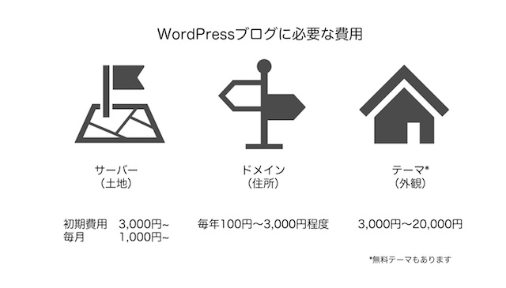

WordPressでブログを始めるために、必要なものは、サーバー（Web上の土地）とドメイン（URL）の２つです。

* サーバー ：初期費用 3,000円〜／月額1,000円〜
* ドメイン ：年額1,280円〜
費用は、初期費用：約3,000円、運営費用：約1,000円（毎月）です。

私が使っているのは

参考プログラム
* サーバー：<a href="https://px.a8.net/svt/ejp?a8mat=2ZLES6+5IUSTU+3JTE+61C2Q" rel="nofollow">MixHost</a>

* ドメイン：<a href="https://px.a8.net/svt/ejp?a8mat=2ZTSGZ+DJM182+348+1BQJAA" rel="nofollow">ムームードメイン─</a>

他にもサーバー
<a href="https://px.a8.net/svt/ejp?a8mat=2ZLES6+5OT4VM+CO4+6B70I" rel="nofollow">Xserver Business</a>
を使っている方も多いです。

デザインにこだわりたい人は、オプションでテーマ（3,000円-20,000円程度）を入れることができます。

* おすすめテーマ ：JIN、SWELL
WordPressには無料テーマがたくさんのデザインが用意されていますので、必ず購入する必要はありません。
ただ、有料のテーマはデザインが優れていたり、サイト運営に便利な機能が入っているので、本格的にWordPressを使う場合はテーマを購入する人も多いです。

## 2. WordPressのインストール方法

WordPressブログのセットアップに必要な作業は全部で５ステップ。

1. サーバーを借りる
2. ドメインの契約
3. ドメイン側にサーバー情報を設定する
4. サーバー側にドメインを設定する
5. WordPressをインストールする

### サーバー契約〜WordPressインストール

下記にサーバーごとに手順をまとめたので、参考にしてみてくださいね。

* [Mixhostを使ったWordpressブログ始め方](/start-wordpress-mixhost/)
* [エックスサーバーを使ったWordpressブログの始め方](/start-wordpress-xserver/)

### WordPressの初期設定

WordPressをインストールしたら、まずはこれだけ設定をしましょう。

1. 【一般設定】サイトの内容や説明、URLを設定する
2. 【ディスカッション設定】コメント受付を設定する
3. 【パーマリンク】パーマリンクを設定する

#### サイトの基本情報

外観＞一般設定をクリックします。

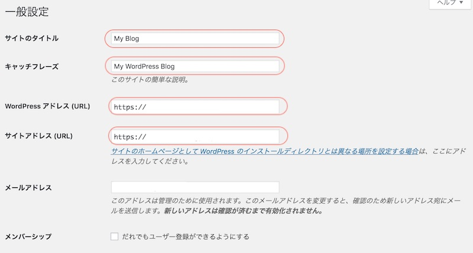【一般設定】 以下の項目を設定してください。

* サイトのタイトル → サイト名
* キャッチフレーズ → サイトの説明
* WordPressアドレス(URL) → WordPressをインストールした場所。SSL対応済の場合、「http://」→「https://」にする。
* サイトアドレス(URL) → サイトにアクセスするためのURL。SSL対応済の場合、「http://」→「https://」にする。
入力できたら、「変更を保存」ボタンをクリックします。

#### ディスカッション設定

設定＞ディスカッション画面

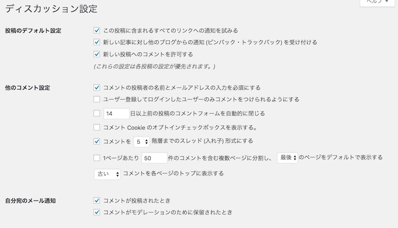【ディスカッション設定】
初期設定ではコメントを許可する設定になっています。
コメント機能を使う場合には、そのままでOKです。

コメントを受け付けない場合には、「新しい投稿へのコメントを許可する」のチェックを外します。

入力できたら、「変更を保存」ボタンをクリックします。

#### パーマリンクの設定

WordPressでは記事のURL（パーマリンク）を個別に設定できます。

* [WordPressのパーマリンク設定](/about-permlink/)

###  プラグインのインストール

* [このブログで利用しているWordPressプラグイン](/wordpress-plugin/)

## 3. WordPressの使い方

### 投稿と固定ページの使い分け

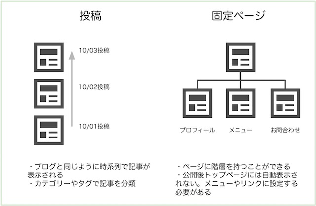 WordPressのコンテンツには投稿と、固定ページの２種類あります。

投稿の特徴
* 記事を公開すると、トップページに時系列で表示される
* [カテゴリやタグを設定して、記事を分類できる](/how-to-use-category-tag/)
* 日記、ブログ記事などこまめにアップデートして最新情報を掲載する記事におすすめ。

固定ページ特徴
* プロフィール、お問い合わせなどにおすすめ
* ページの親子関係を持つことができる
* 公開するだけでは、トップページに表示されない。メニューやサイドバーへの設定が必要。
* プロフィールページ、ホームページの説明ページ（サイトポリシー、サイトマップ、ランディングページにおすすめ

投稿と固定ページは管理画面でのメニューも別になります。

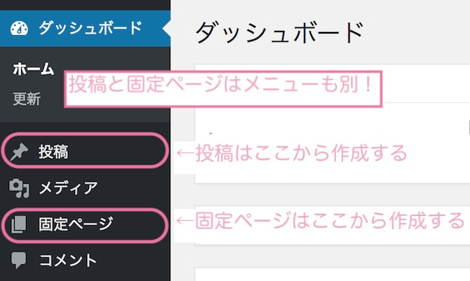

### グローバルメニュー

ホームページのメニューを設定することができます。

管理画面＞外観＞メニュー

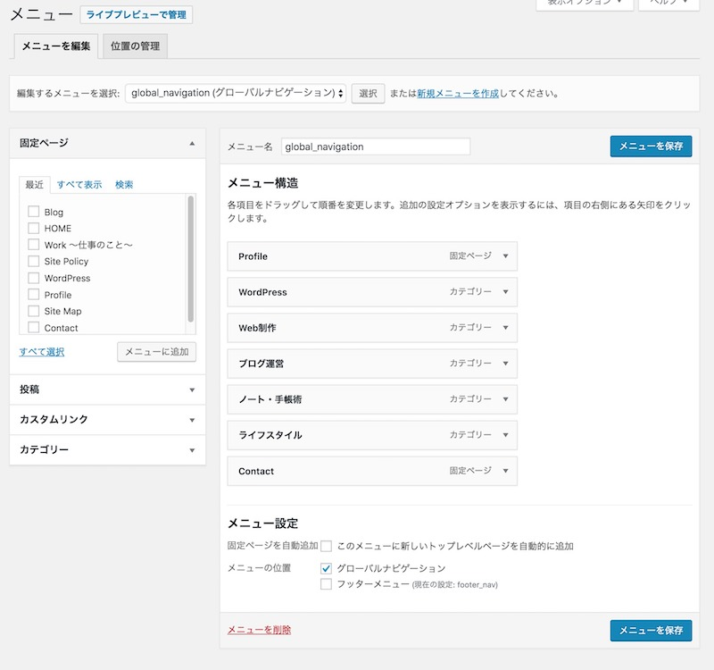

まず、左側の【固定ページ、投稿、カスタムリンク、カテゴリー】からメニューの載せたい項目を選んで、メニューに追加ボタンをクリックします。

右側の【メニュー構造】で、メニューの順番や、入れ替えます。
一段下げると、親子構造を作ることができます。

最後に、右下の【メニューの位置】にチェックを入れます。
設定できたら右下にある「メニューを保存」をクリックしましょう。

### ウィジット

ウィジットとは、テキストエリアやカテゴリー一覧などをブログの決まった場所で表示できる機能です。
例えば以下のように使われたりします。

* 記事の下に表示される広告、著者、お知らせ
* サイドバーのプロフィールやカテゴリー一覧、人気記事一覧
* フッターに表示するメニュー

管理画面＞外観＞ウィジット

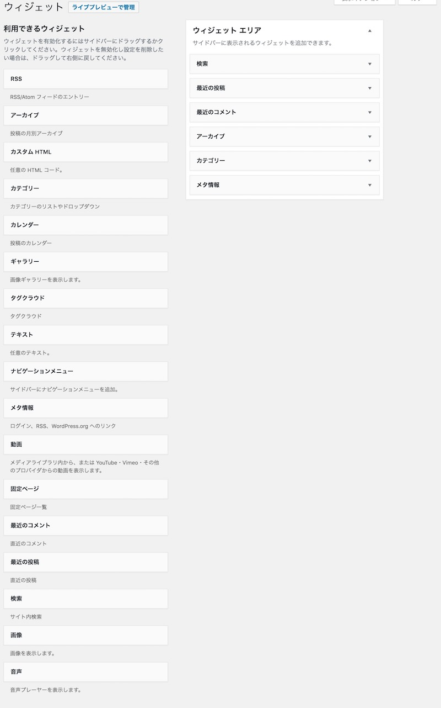ウィジット
左側にある項目を、右のウィジットエリアにドラッグすると設定できます。（保存ボタンは必要なしです）

## 4. ブログのデザイン設定

テーマは、WordPressのお洋服のようなもので、ホームページの見た目を変更できます。
テーマによっては、SNSボタンや人気記事一覧など便利機能が入っていたりします。
用途別にいろんなテーマが配布されていますのでのぞいてみてくださいね。

#### 有料テーマ？無料テーマどっちがいい？

本格的にWordPressでブログを作るのであれば、有料テーマを購入した方がいいと思います。

というのも、私は無料テーマを使っていたのですが、足りない機能を追加したり、細かいデザインを変えたりと、カスタマイズに時間がかかりました。肝心の記事の投稿にかける時間が減ってしまいました^^;

WordPressのプログラミングを学びたいなどの理由がなければ、有料テーマを買ったほうが、おしゃれなブログを早く作れます😄

### おすすめテーマ

【無料のおすすめWordPressテーマ】

* [ルクセリタス](https://thk.kanzae.net/wp/)
* [cocoon](https://cocoon.com/)
* [Xeory](https://xeory.jp/)
* [Edge](https://ja.wordpress.org/themes/edge/)

【有料のおすすめWordPressテーマ】

* [JIN](https://jin-theme.com/)
* [SWELL](https://swell-theme.com/)

### テーマのインストール

管理画面＞外観＞テーマ

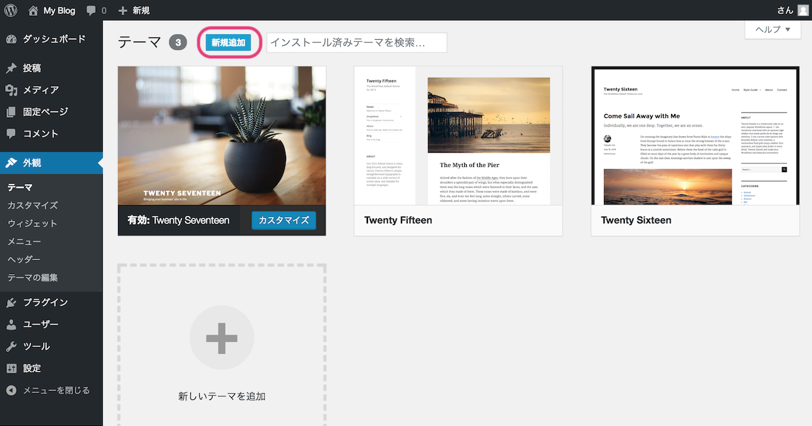 上の方にある新規追加をクリック。

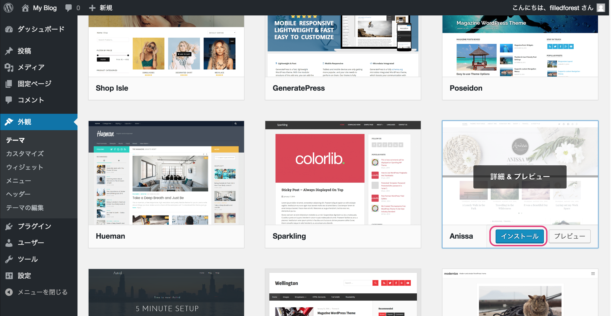 一覧からテーマを選んでインストールをクリック。
インストール後、テーマを有効にすると、デザインが反映されます。

### WordPressテーマのカスタマイズ

HTML/CSSの知識があれば、さらにブログを飾り付けることができます。

あわせて読みたい：

* [CSSで作れるシンプルな飾り枠デザイン](/css-frame/)
* [CSSで作れるかわいいブログ見出しのデザイン](/css-header/)
* [CSSでおしゃれに飾る！引用符のデザイン](/css-blockquote/)
* [子テーマを使って、WordPressテーマをカスタマイズする](/wp-child-theme/)
* [ウィジットエリアの追加方法](/wordpress-widget-area/)

## 5. ブログを育てる

### ブログ記事の作成

* [Markdownを知ってから、ブログ執筆がスピードアップ！](/markdown/)！
* [【Canva】もう手放せない。おしゃれバナーを無料でサクッと作る方法](/make-banner-easy/)

### 分析ツールの導入

Googleが無料のアクセス解析ツールを提供しています。

* Google Search Console
* Google Analytics

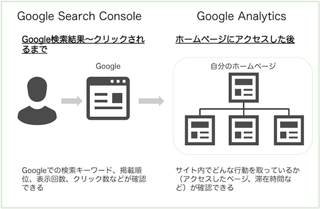 Google Search Consoleは、各記事がどのようなキーワードで検索されているか、Google検索結果の表示順位、どれくらいクリックされているかを確認できます。

Google Analyticsではブログ内のどんなページがよく見られているか、ブログ内でユーザーがどんな動きをしたかを見ていくことができます。

* [Google Analyticsで自分のアクセスを除く設定](/ga-ip-filter/)

### WordPressのセキュリティ対策

WordPressはユーザーが多い分、攻撃の対象にもなりやすいです。作ったブログを守る対策もいれておきましょう。

* [WordPressでやっておきたいセキュリティ対策](/wordpress-security/)

## （おまけ）ブログの引っ越し

* [WordPressブログのドメイン変更手順](/domain-change/)
* [LivedoorブログからWordPressへのお引っ越し手順](/move-livedoor-to-wordpress/)

以上、WordPressでのブログの作り方を説明してきました。
趣味を語るもよし。ビジネスの土台にもよし。
自分の世界観をWeb上に表現するためにブログを活用する方が増えたらいいなと願っています。

それでは、素敵なWordPressライフを✨

