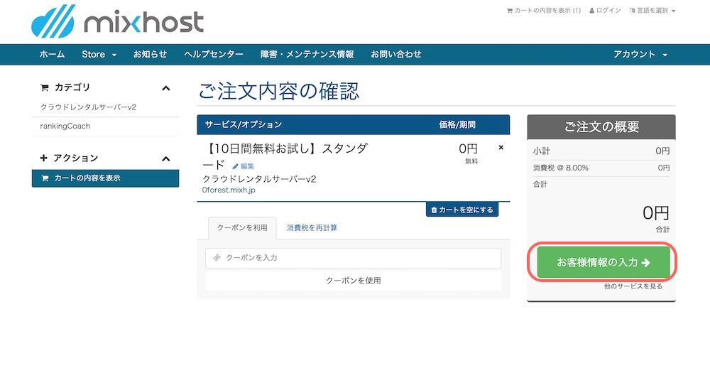
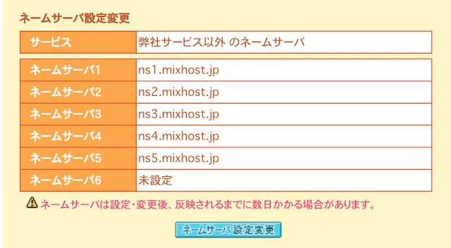
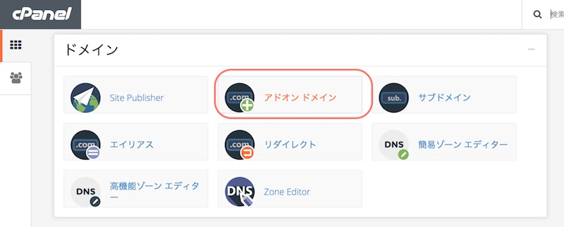
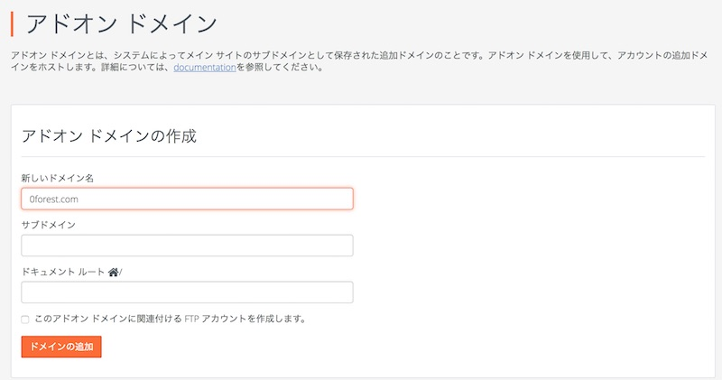
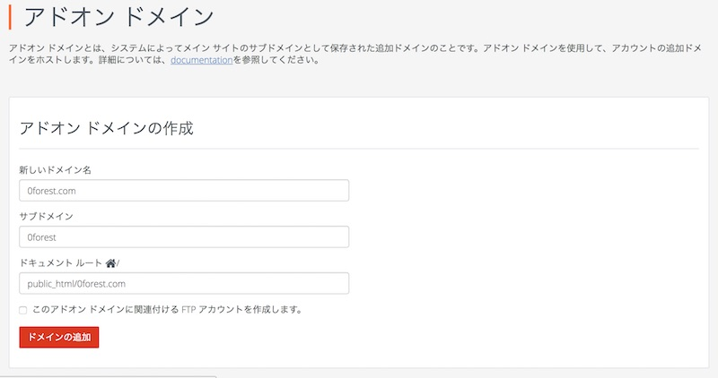
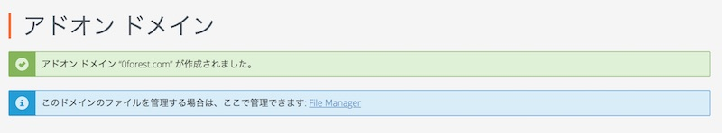
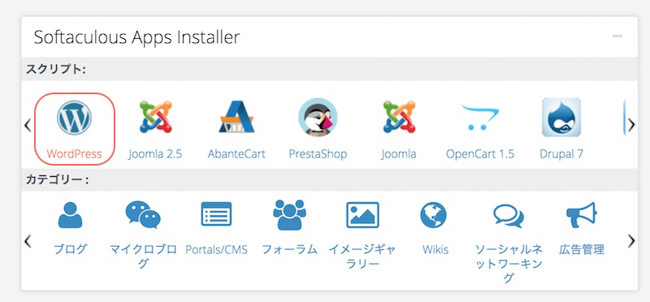
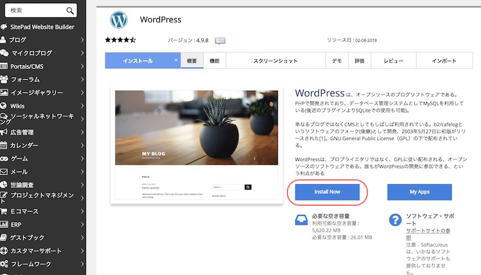
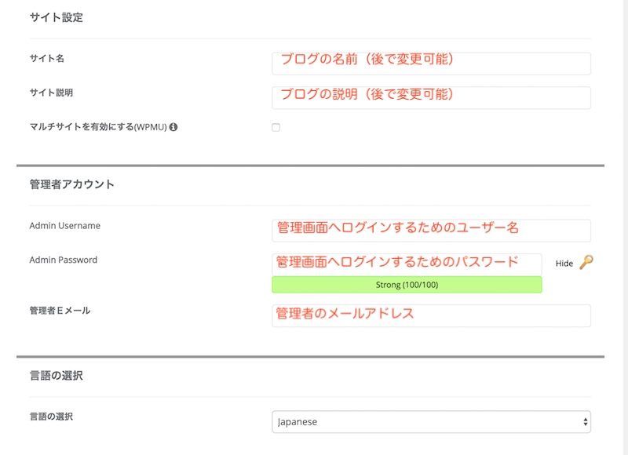
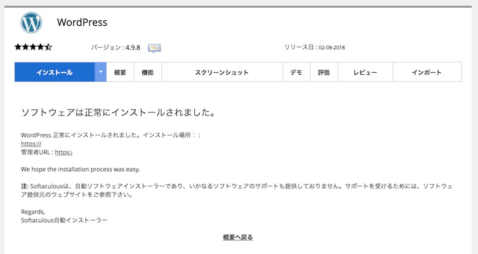

この記事では、MixhostでWordPressブログをはじめる手順を説明します。

【WordPressをインストールする手順】

1. サーバー（ホームページを置く場所）を借りる
2. ドメイン(URL)を取得する
3. ドメイン（URL）とサーバーを紐づける
4. サーバーにWordPressをインストールする

## サーバーを借りる（Mixhost）の契約

* [MixHost](https://px.a8.net/svt/ejp?a8mat=2ZLES6+5IUSTU+3JTE+5YJRM)

契約がまだの方は、まずはHPのお申し込みページからすすみましょう。

お客様情報を入力して、登録完了。

登録後、メールで「【mixhost】 お申込み受付完了のお知らせ」が届きます。
続いて、メールで「【mixhost】 サーバーアカウント設定完了のお知らせ」が届きます。 このメールにはサーバーへのログイン情報が書かれているので大切に保管しておいてくださいね。

メールの中にコントロールパネルのURLが書かれています。
アクセスして、メール内のユーザー名とパスワードでログインしてください。

## ドメイン（URL）を取得

あらかじめ、ホームページに使うドメイン（URL）を決めて取得してくださいね。

* [お名前.com](https://px.a8.net/svt/ejp?a8mat=2ZCY80+D1R12Q+50+2HHVNM)
* [ムームードメイン](https://px.a8.net/svt/ejp?a8mat=2ZTSGZ+DJM182+348+1BNBJM)

## ドメイン〜URLとサーバーを紐づける〜

### ドメイン側にMixhostを設定する

ドメインの管理画面にログインして、ネームサーバーの設定を行いましょう。 コントロールパネル＞ドメイン一覧＞ドメイン名からドメイン情報一覧に行くと、ネームサーバ設定変更ができます。

 このネームサーバの１〜５に設定を入れます。

> ネームサーバー1: ns1.mixhost.jp
> ネームサーバー2: ns2.mixhost.jp
> ネームサーバー3: ns3.mixhost.jp
> ネームサーバー4: ns4.mixhost.jp
> ネームサーバー5: ns5.mixhost.jp

### Mixhostにドメインを設定する

[Mixhostの管理画面](https://accounts.mixhost.jp/clientarea.php)にログインして、cPanelを開きます。

アドオンドメインをクリックします。

ドメイン名を入力します。

ドメイン名を入力すると、サブドメインとドキュメントルートが設定されます。ドメイン追加ボタンをクリックしましょう。

このようにアドオンドメインが作成されれば、設定完了です。

## サーバーにWordPressをインストールする

Mixhostの管理画面からcPanelに進みます。

cPanelの下の方にあるスクリプト一覧のなかから、「WordPress」をクリックしましょう。

ソフトの概要が表示されています。Install Nowボタンをクリックします。

以下の項目を設定します。
* サイト名
* サイト説明
* Admin Username
* Admin Password
* 管理者Eメール
他の部分はデフォルト設定でOKです。

入力できたら、「インストール」ボタンをクリックします。 インストール完了するとこのような画面にうつります。

【インストール完了画面】

ホームページのURL：`https://インストール時に設定したURL`

管理画面のURL：`https://インストール時に設定したURL/wp-admin/`

アドレスをクリックして、WordPressブログへアクセスしてみましょう。 ドメインの反映までに１〜２時間かかることがあります。 ページが表示できないときは、しばらく待ってみましょう。
