エックスサーバーでWordPressブログをはじめる手順を説明します。

1. サーバー（ホームページを置く場所）を借りる
2. ドメイン(URL)を取得する
3. ドメイン（URL）とサーバーを紐づける
4. サーバーにWordPressをインストールする

## サーバーを借りる

まずはHPのお申し込みページからすすみましょう。

* [レンタルサーバー Xserver](https://px.a8.net/svt/ejp?a8mat=2ZLES6+5OT4VM+CO4+61JSI)

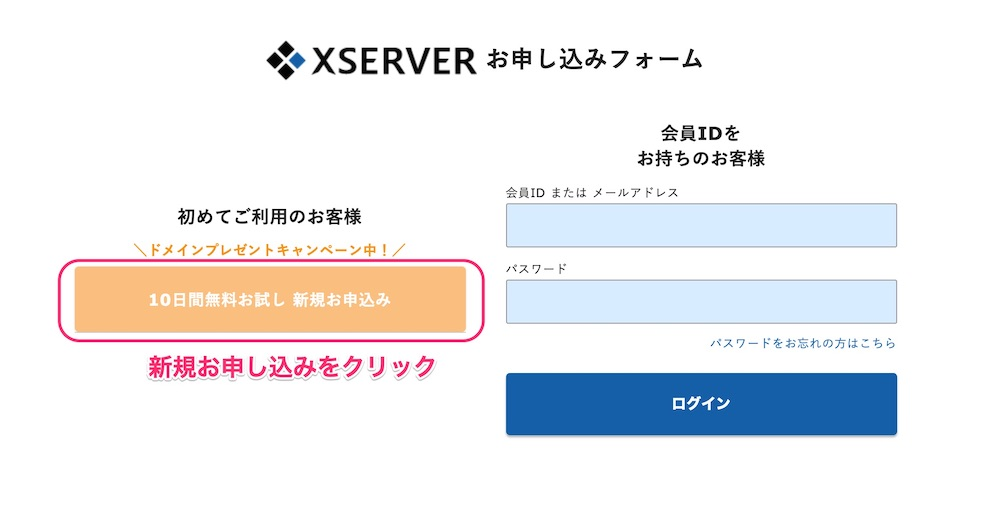

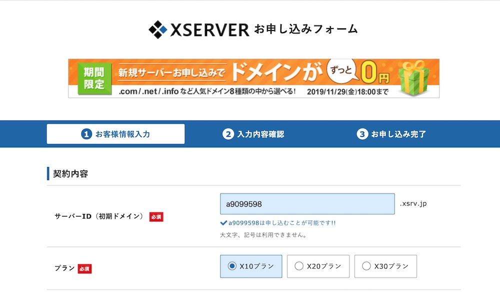

サーバーID：自分しか使わないID（外部には表示されない）です。お好きなIDでOK。
プラン：X10プランで。
その他：メールアドレスや、名前、住所などを入力します。

最後に利用規約の同意にチェックを入れて申し込みます。

申込後、メールで「サーバーアカウント設定完了のお知らせ」が届きます。
このメールにはサーバーへのログイン情報が書かれているので大切に保管しておいてくださいね。

メールの中にインフォパネルへのURLが書かれています。
アクセスして、メール内の会員IDとパスワードでログインしてください。

## ドメイン(URL)を取得

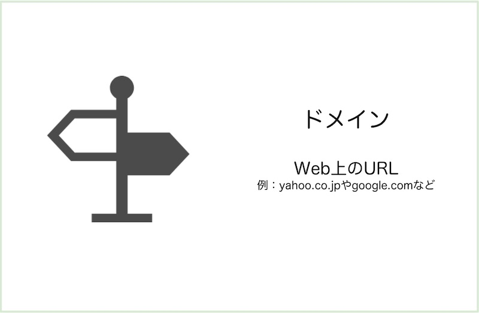

ホームページに使うドメイン（URL）を決めて取得します。

* [お名前.com](https://px.a8.net/svt/ejp?a8mat=2ZCY80+D1R12Q+50+2HHVNM)
* [ムームードメイン](https://px.a8.net/svt/ejp?a8mat=2ZTSGZ+DJM182+348+1BNBJM)

## ドメインとサーバーを紐づける

### ドメイン側にXサーバーを設定する

ドメインの管理画面にログインして、ネームサーバーの設定を行いましょう。

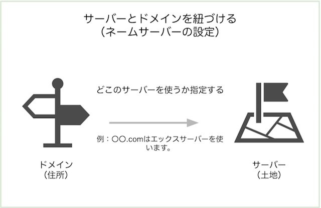

ムームードメインでは、コントロールパネル＞ドメイン一覧＞ドメイン名からドメイン情報一覧に行くと、ネームサーバ設定変更ができます。

このネームサーバの１〜５に下記の設定を入れます。

> ネームサーバー1 ns1.xserver.jp
>
> ネームサーバー2 ns2.xserver.jp
>
> ネームサーバー3 ns3.xserver.jp
>
> ネームサーバー4 ns4.xserver.jp
>
> ネームサーバー5 ns5.xserver.jp
>
> https://www.xserver.ne.jp/manual/man\_domain\_namesever\_setting.php
>

### サーバーにドメインを設定する

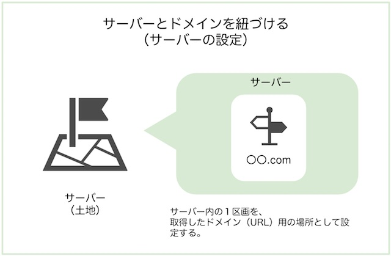

インフォパネルにログイン後、サーバーパネル＞ドメイン設定から、ドメイン設定画面に行きます。

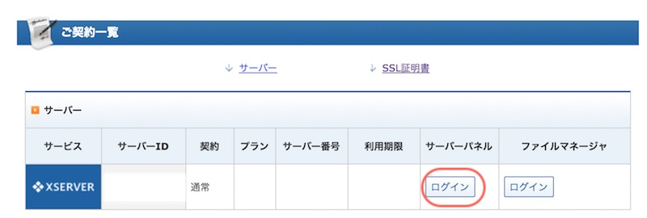

インフォパネル

該当サーバーのサーバーパネルにログインします。

【サーバーパネル】 ドメイン設定をクリックしましょう。

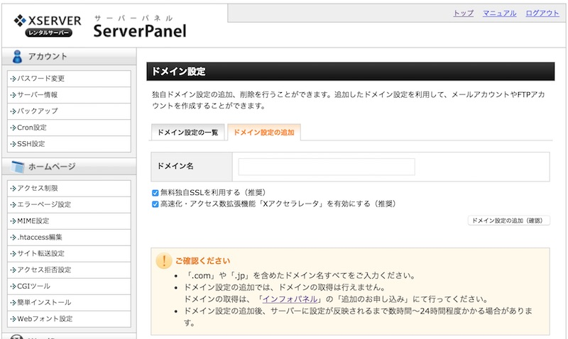

【ドメイン設定画面】
ドメイン設定追加タブを選んで、ドメイン名を入力します。

「無料独自SSLを利用する（推奨）」と、「高速化・アクセス拡張機能「Xアクセラレータを有効にする（推奨）」はチェックを入れたままで。

ドメイン設定の追加（確認）をクリックします。次の画面で内容を確認後、登録してください。SSLの設定

SSL は、ホームページでやりとりするデータを暗号化するときに使います。
URLが「https://」だとSSL対応済。「http://」だと、SSL未対応になります。

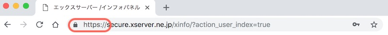

SSL対応済みだと、アドレスバーに鍵マークがつきます。

特にお客様のプライベート情報（名前やメールアドレスなど）を入力するページを作るなら、はSSL対応しておきましょう。ホームページを介してやりとりするデータが盗まれたり改ざんされないように防止できます。

SSL設定されている方がgoogle評価が上がります。最近ではどのサイトもhttpsになっていることが多いです。

Xサーバーはドメイン設定の時に「無料独自SSLを利用する（推奨）」をチェックすると設定できます。（忘れてしまったら、サーバーパネル＞ドメイン＞SSL設定から、利用できるようになります。）

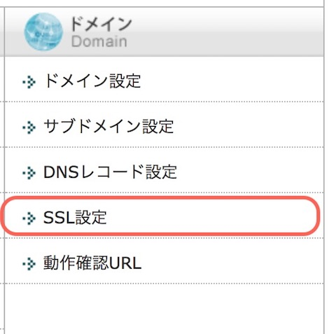

### 2.5 WordPressをインストールする

#### エックスサーバーでWordPressをインストール

サーバーパネル＞WordPress自動インストールをクリックします。

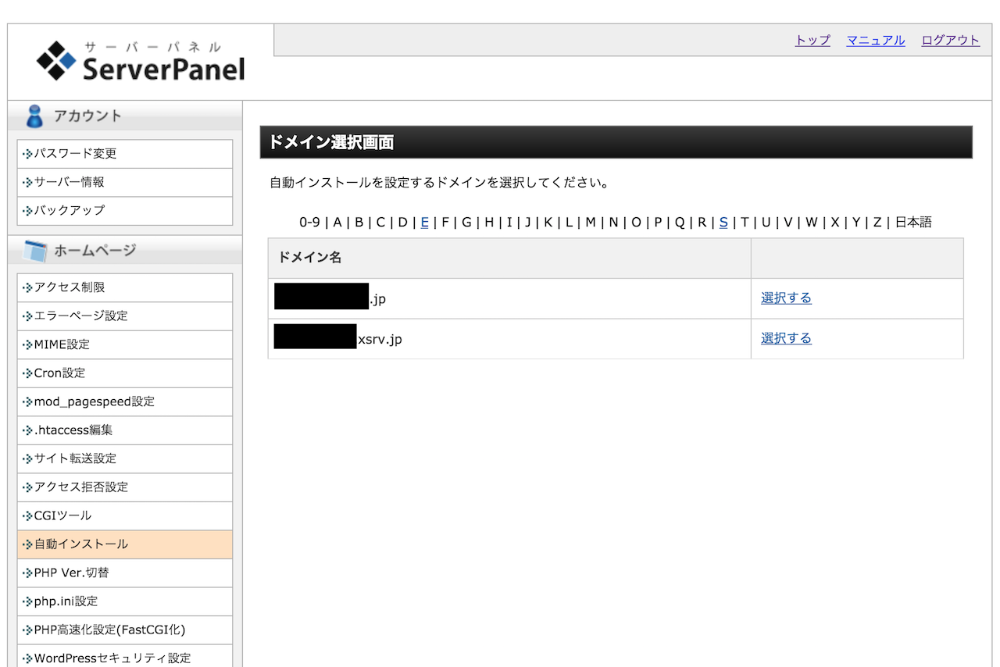

【ドメイン選択画面】
WordPressをインストールするドメインを選びます。「ドメイン選択」をクリックしてください。

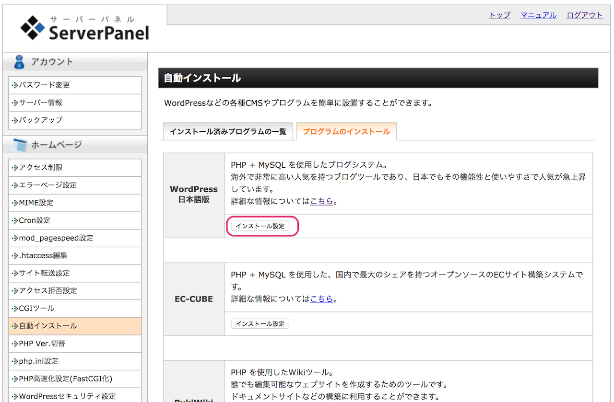

【WordPressのインストール】
WordPressインストールタブから項目を入れます。

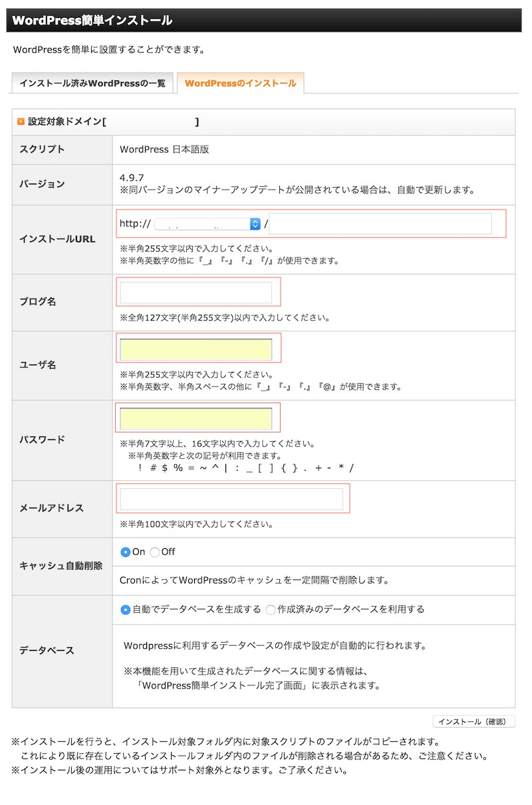

* インストールURL：ブログにアクセスするためのURL
基本は、プルダウンからドメイン名を選んで、「http://ドメイン/」でOK

* ブログ名：ブログの名前です（後から変更可能）
* ユーザー名：管理画面にログインするためのユーザー名
* パスワード：管理画面にログインするためのパスワード
* メールアドレス：アップデートなどのお知らせが届くメールアドレスになります。

他の項目は変更しなくてOKです。
入力したら「インストール（確認）」をクリックします。

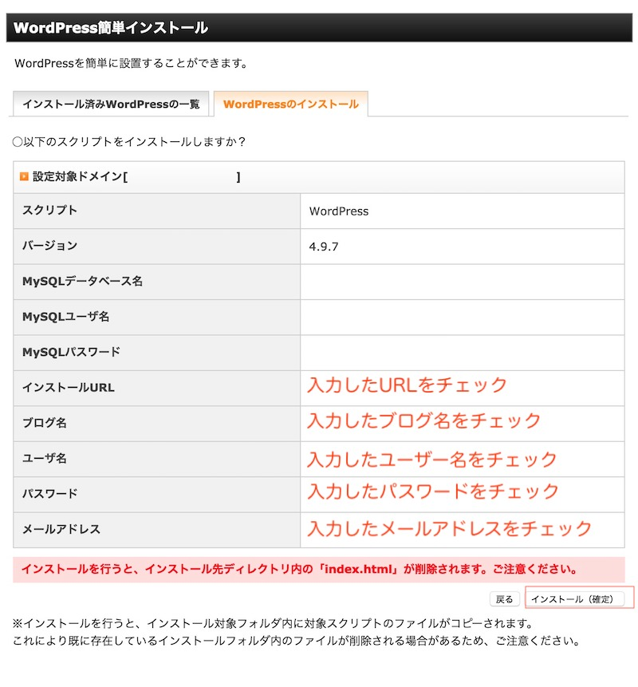

【入力内容を確認】
入力内容を確認して「インストール（確定）」をクリック。

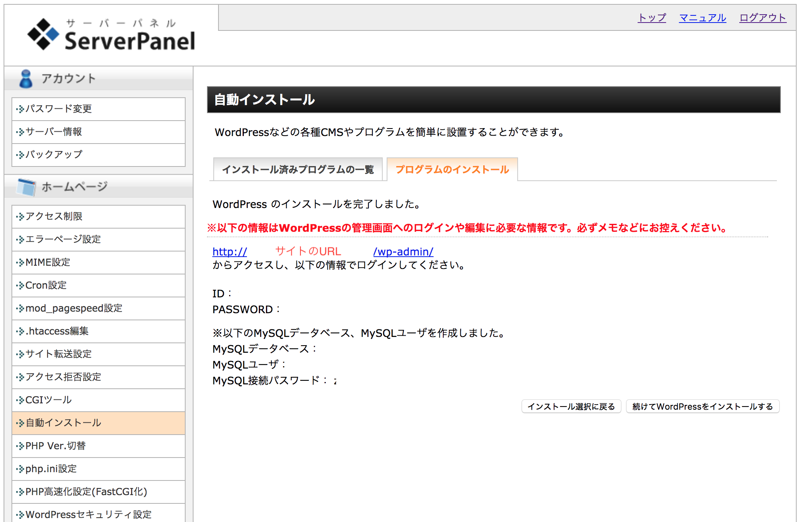

インストールが終わると、完了画面にうつり、ブログの情報や管理画面へのログイン情報が表示されます。

## WordPressのインストールが完了❤️

サーバーとドメインの設定が反映されるまでに、時間がかかります。
すぐにホームページにアクセスしてもできなくても、気にしないでください。
30分〜1時間程度おいたあとに、もう一度アクセスしてみてください。

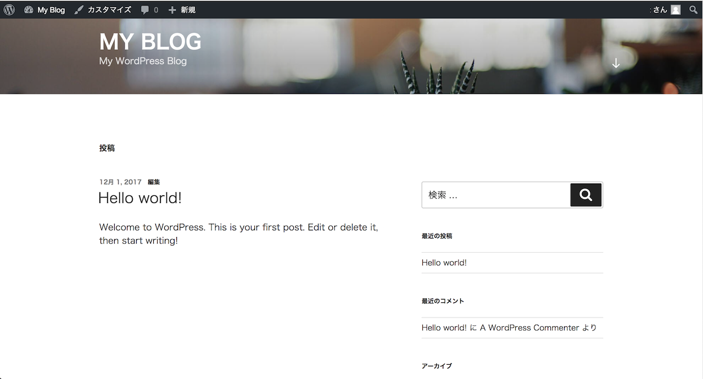 こんな画面が表示されれば完了です。

ホームページのURL：`https://インストール時に設定したURL`

管理画面のURL：`https://インストール時に設定したURL/wp-admin/`

