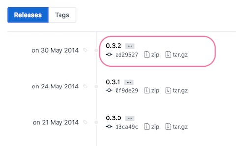
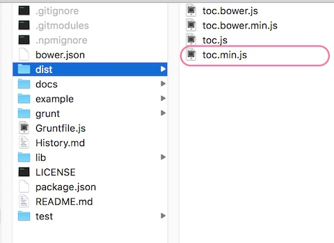

記事に目次があると、文章の構成がわかりやすくなり、必要なところにジャンプできて便利ですね。

WordPressで目次用のプラグインでは「Table of Contents Plus」が定番ですが、今回は、プラグインを使わずに、WordPressのテーマに組み込む方法を紹介します。

## toc.jsを設置する

### toc.jsをダウンロードする

今回はtoc.jsという公開されているjQueryファイルを使います。

[TOC | jQuery Table of Contents Plugin](http://projects.jga.me/toc/) [ダウンロードページ](https://github.com/jgallen23/toc)へ進み、releaseフォルダをクリックします。


0.3.2 verまで遡り、zipファイルをダウンロードします。



### jsフィアルをテーマ内に配置

フォルダ内にあるtoc.min.jsファイル内のjavascirptフォルダに配置します。



```
テーマフォルダ
┗functions.php
┗js
┗toc.min.js ← ダウンロードした
┗main.js ← 新しく作成したjsファイル
```


### toc.jsファイルを読み込む

functions.phpでtoc.jsの読み込むコードを書きます。

```php:title=functions.php
if ( !function_exists( 'add_scripts' ) ) {
        wp_enqueue_script(
            'toc',
            get_template_directory_uri().'/js/toc.min.js',
            array( 'jquery'),
            false,
            true
        );
        wp_enqueue_script(
            'main',
            get_template_directory_uri().'/js/main.js',
            array( 'jquery','toc'),
            false,
            true
        );
    }
}
add_action( 'wp_enqueue_scripts', 'add_scripts');
```

## 目次の表示設定を書く

用意したmain.jsに目次の表示内容を記載します。
```js:title=main.js
jQuery('#toc').toc({
    'container': 'article.post', /* 投稿のみ見出しを表示 */
    'selectors': 'h2, h3', /* h2,h3について見出しを表示 */
});
```


### 目次を表示するコードを書く

目次を表示したい場所に以下のコードを記載します。

`<div id="toc"></div>`

例：記事の本文前に目次を設置する
```php:title=single.php
<article>
    <!-- タイトル -->
    <h1><a href="<?php the_permalink(); ?>"><?php the_title(); ?></a></h1>
    <!-- 見出し -->
    <div id="toc"></div>
    <!-- 本文 -->
    <div class="post-content"></div>
</article>
```


### HTMLの表示

```markup
<h2>見出し２</h2>
<h3>見出し３</h3>
<h2>見出し２</h2>
<h3>見出し３</h3>
```
上記のような本文には、以下のような目次のHTMLコードが出力されます。


```markup
<div id="toc">
    <ul>
        <li class="toc-h2 toc-active"><a href="#toc--">見出し２</a></li>
        <li class="toc-h3"><a href="#toc---2">見出し３</a></li>
        <li class="toc-h2"><a href="#toc---2">見出し２</a></li>
        <li class="toc-h3"><a href="#toc---2">見出し３</a></li>
    </ul>
</div>
```

あとはCSSを自由に調整してください。


参考記事 [見出しから目次を自動生成してくれるjQueryライブラリ「TOC」のダウンロードと使い方！ | HPcode](https://haniwaman.com/toc/)
