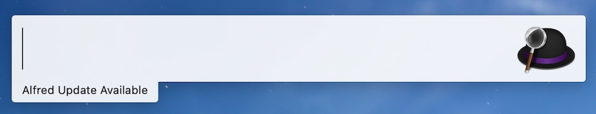
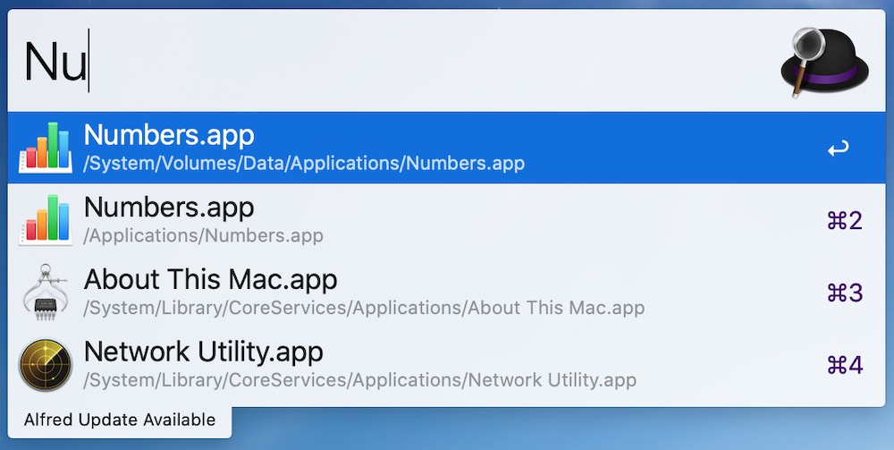
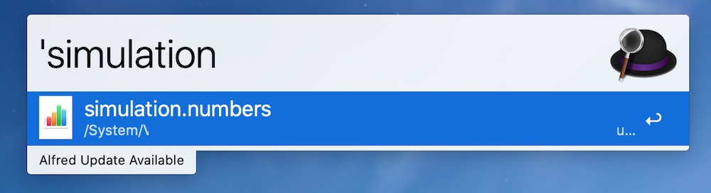
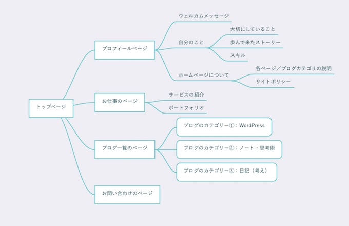
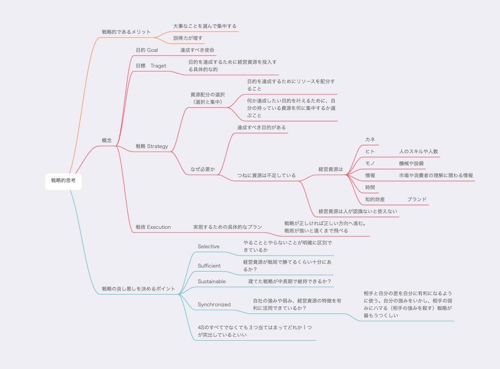
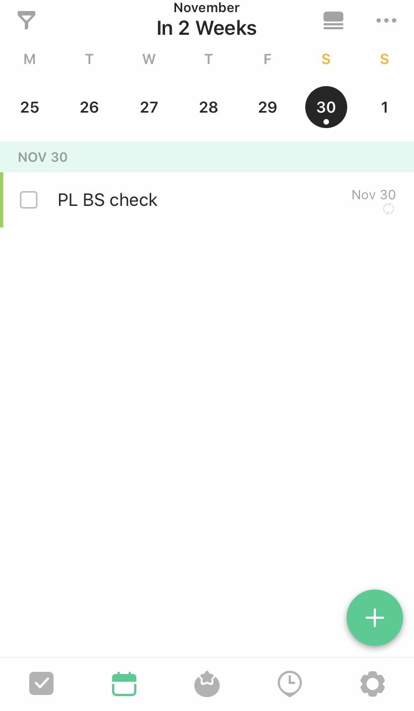
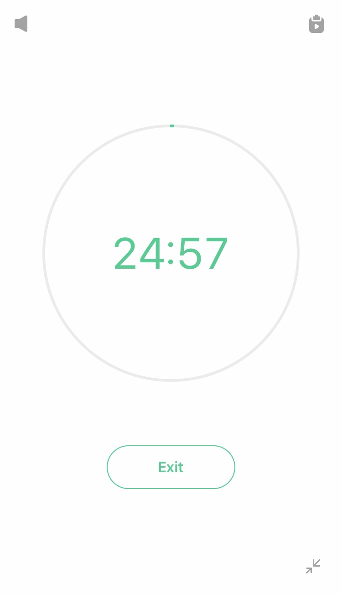
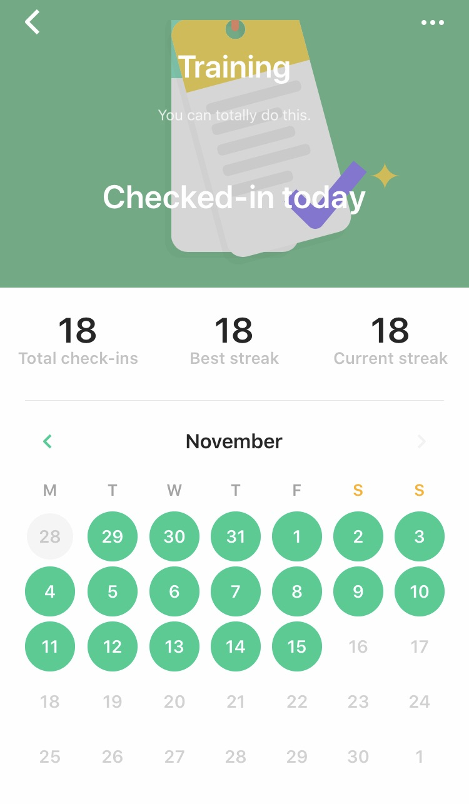
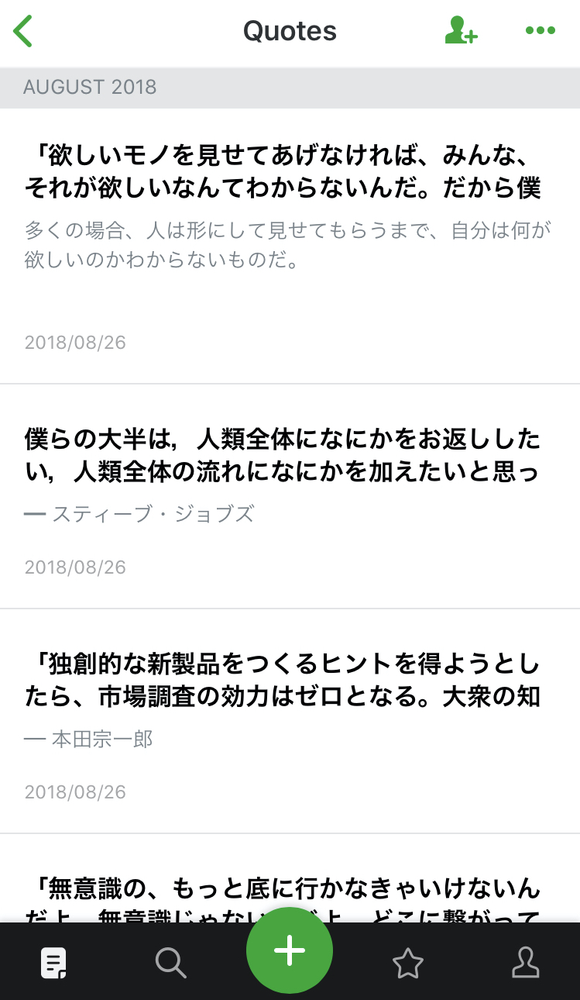

今回は、いつもお世話になっているアプリたちを紹介します。

## Macに入れているアプリ

私はMac愛用者です。
相棒は、Mac Book Pro (Retina 13inch Mid 2014)。メモリーは16GB。

### Alfred 3

これはMacを使っている人にはぜひ入れていただきたいです。

Ctrl +Spaceをおすと、検索バーが出てきます。
ここにソフト名を入れて、Enterを押すと、そのままソフトを開くことができるんです。

  「’」のあとに続けてファイル名を入れれば、ファイルを開くこともできます。

これがあるかないかで作業効率が全然違う😁

### MindNode

マインドマップ を作るためのアプリです。
有料ですが、マインドマップ のアプリはこれが最高です。
UIが素晴らしい。すごく使いやすい。iPadにも入れています。
情報を視覚的に整理できるので考え事をする時に開いています。

例えば、ホームページやブログのサイトマップに

本の内容整理に

MindNode – Mind Map

IdeasOnCanvas GmbH無料posted with<a href="https://mama-hack.com/app-reach/" title="アプリーチ" target="_blank" rel="nofollow">アプリーチ</a>

## iPadにいれてるもの

打ち合わせのために、毎回、Mac Book Proを持ち運ぶのは重い…。それで、去年、iPadを書いました♪

* Apple Pencilと合わせて、ノートとして使えること
* iPhoneよりも画面が大きいので、電子書籍が読みやすい
* 相手にも画面を見せやすい

買ってよかった＾＾

### Good Notes 5

手書きのノートアプリです。会議のメモに使っています。

GoodNotes 5

Time Base Technology Limited¥980posted with<a href="https://mama-hack.com/app-reach/" title="アプリーチ" target="_blank" rel="nofollow">アプリーチ</a>

### Documents by Readdle

端末上の書類を一括で管理できるアプリ。
Google DriveやiCloud Driveも、このアプリから開けます。
ZIPファイルを解凍したりもできるので便利。

Documents by Readdle

Readdle Inc.無料posted with<a href="https://mama-hack.com/app-reach/" title="アプリーチ" target="_blank" rel="nofollow">アプリーチ</a>

### Kindle

普通に漫画を読んだり。

Kindle

AMZN Mobile LLC無料posted with<a href="https://mama-hack.com/app-reach/" title="アプリーチ" target="_blank" rel="nofollow">アプリーチ</a>

IT系の本はサイズが大きいし、重いもの。
分厚い本を開いたり閉じたりするのも面倒だし。
iPadで複数の本を調べたり、付箋貼ったページを行き来できる。

横でiPadを見つつ、Macで操作できるのが助かってます。
ほんと、Web系の書類は全部電子化してほしい…。

## iPhoneにいれているもの

### Bear

Bear - プライベートメモ

Shiny Frog Ltd.無料posted with<a href="https://mama-hack.com/app-reach/" title="アプリーチ" target="_blank" rel="nofollow">アプリーチ</a>

ブログや文章を書くときのテキストエディタ。
もう使いやすくて、iPhoneだけでなく、MacやiPadにもいれています。

Markdownで文章をかけるのがありがたい！
[Markdownを知ってから、ブログ執筆がめっちゃスピードアップした](/markdown/)

### Tick Tick

todoや予定を管理するためのアプリです。
EventもTodoもここに入れています。

UIがすごい好きなんです。見やすい。
Todoを完了した時の音がマリオのコインをゲットしたときの音に似てて、やったぜ感があります😁

Pomoという２５分間のタイマー付きなので、集中して作業するときにも

毎日やる行動も登録できるので、習慣化にもおすすめ。

ticktick-シンプルなtodoリスト＆タスク管理アプリ

Appest Limited無料posted with<a href="https://mama-hack.com/app-reach/" title="アプリーチ" target="_blank" rel="nofollow">アプリーチ</a>

### Feedly

好きなブログを登録しておくと、新しい記事が投稿されると通知がきます。

Feedly - Smart News Reader

Feedly Inc.無料posted with<a href="https://mama-hack.com/app-reach/" title="アプリーチ" target="_blank" rel="nofollow">アプリーチ</a>

## データ共有編

Mac、iPad、iPhoneだとデバイス間で文章、画像などをコピー＆ペーストできます。（同じApple IDでサインインしているデバイス同士だとできるみたい）

私はこの機能、めっちゃ感動しました。
iPhoneで音声入力しといた文章をコピーして、Macにペーストして使っています。

### Air Drop

写真や書類を近くの人に送る時に使っています。
例えば、打ち合わせのときに、ホワイトボードにメモを書く→写真を撮る→同席者のiPhoneにその場で共有。
後からメール送信したりしなくていいので、すごく楽。

### Google Drive

チームでのプロジェクトなど、他の人とファイル共有するときに使っています。

付属のGoogle DocumentやGoogle SpreadsheetもWordやExcelの代わりに使っています。

### iCloud Drive

個人用のファイルはiCloud Driveに入れます。

Pages、NumbersなどMac専用の文書作成、表作成ツールも、Windowsとの互換性がイマイチなので、自分用の書類管理に使ってます。

### Evernote

有名な文書管理アプリですね。
手書きのノートを使い終わったときに、残したいページを写真で撮って保管しています。

Evernote

Evernote無料posted with<a href="https://mama-hack.com/app-reach/" title="アプリーチ" target="_blank" rel="nofollow">アプリーチ</a>

### Pocket
ブログやwebを読んでて、後でも読みたいなっと思う記事をPocketに入れています。

