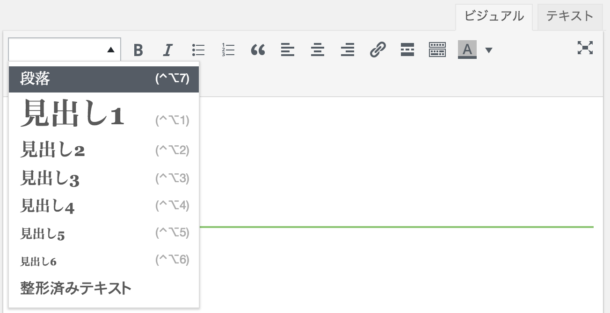
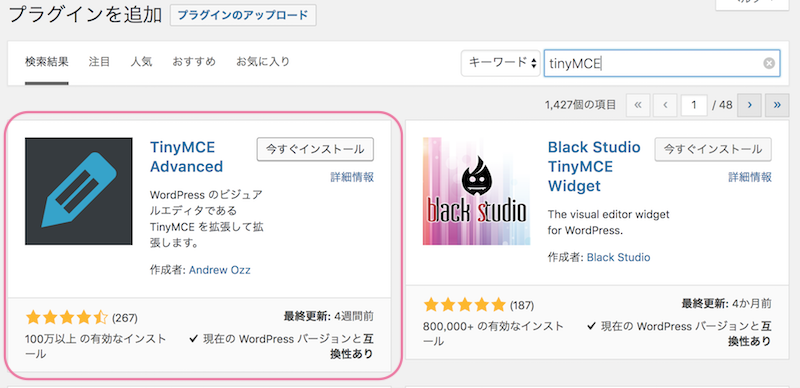
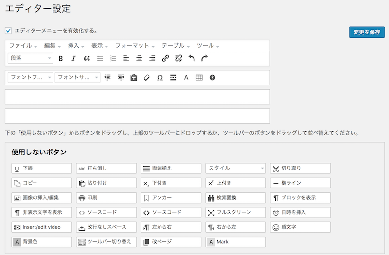
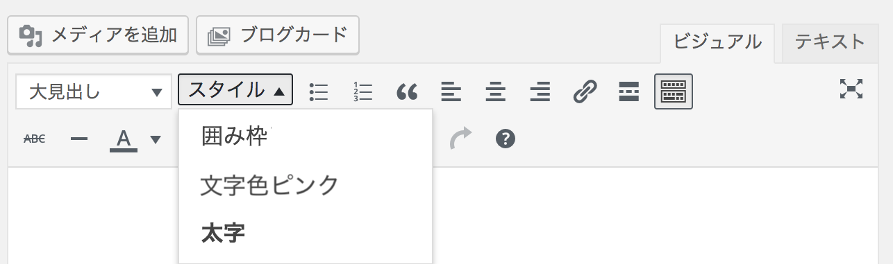
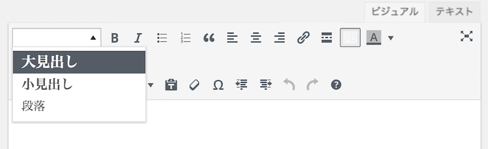

※この記事は2018年に書いたもので、Gutenberg版対応は未確認です。

私は記事に囲み枠をよく使うのですが、その際、毎回タグ入力するのはちょっと面倒。 WordPressビジュアルエディタにボタンを追加して、ブログの記事を効率化したいと思います。

## やり方①：プラグインを使う

「[TinyMCE Advanced](https://ja.wordpress.org/plugins/tinymce-advanced/)」というプラグインを使うと、簡単に入れ替えができます。




プラグインインストール後、設定→TinyMCE Advancedへ。



ドラッグ＆ドロップで入れ替えができます。




## やり方②：オリジナルボタンを追加する

 プラグインを使わなくても、ボタンを追加することができます。

### スタイルボタンを追加する

 よく使う文字色や、囲み枠などをスタイルボタンとして追加できます。 functions.phpに以下のコードを追記します。

```php:title=functions.php
 // スタイルボタンの設定
add_filter( 'tiny_mce_before_init', 'custom_styleselect_formats' );
function custom_styleselect_formats( $settings ) {
    $style_formats = array(
    array(
        'title' => '囲み枠',
        'block' => 'div',
        'classes' => 'box',
        'wrapper' => true,
    ),
    array(
        'title' => '文字色ピンク',
        'inline' => 'span',
        'classes' => 'font-pink',
        'wrapper' => true,
    ),
    array(
        'title' => '太字',
        'inline' => 'span',
        'classes' => 'font-bold',
        'wrapper' => true,
        ),
    );
    $settings[ 'style_formats' ] = json_encode( $style_formats );
    return $settings;
}
// スタイルボタンの追加
add_filter( 'mce_buttons', 'add_styleselect_button' );
function add_styleselect_button( $buttons ) {
    array_splice( $buttons, 1, 0, 'styleselect' );
    return $buttons;
}
```

【コードの説明】

* title：ボタンに表示する名前
* block/inline：div(ブロック要素)にはblock、span(インライン要素)にはinlineを使います。
* classes ：CSSで使用しているクラス名

ビジュアルエディタにスタイルボタンが追加されます。




### 段落ボタンの中身を必要なものに絞る



初期設定だと、段落の中にたくさん見出しがありますが、全部使う機会は少ないです。
例えば、見出し１は記事タイトルに使うものなので、記事内の文章では扱いません。
また文章階層も深くなければ、見出し２と見出し３だけで十分。

* [WordPressのビジュアルエディタの見た目を実際の記事にそろえる](/visual-editor-css/)