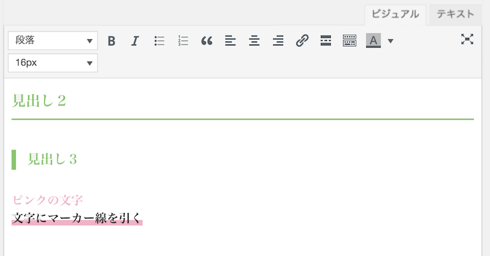
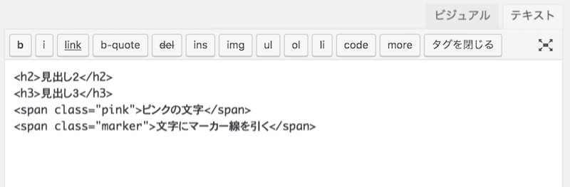

WordPressのビジュアルエディタのカスタマイズTIPSです。
※この記事は2018年に書いたもので、Gutenberg版対応は未確認です。

ビジュアルエディタは初期設定のままだと、公開ページの見た目とズレたりします。
そこで、ビジュアルエディタ用CSSを反映してあげると、公開したときと同じ見栄えのまま、記事を書くことができます。



## ビジュアルエディタ用のCSSファイルを作る

 投稿画面用に、editor-style.cssというスタイルシートを作ります。 ファイルの場所はテーマフォルダの直下に配置します。
 ```
 themes └ テーマフォルダ └ editor-style.css └ その他ファイル
 ```

 editor-style.cssには、記事内で使う装飾用CSSを記載します。

```css:title=editor-style.css
/* ----------------- 小見出し ------------------- */
h2 {
    position: relative;
    margin: 80px 0px 40px;
    padding: 10px 0px;
    color: #89C56D;
    font-size: 1.2rem;
    border-bottom: solid 2px #89C56D;
    border-left: none;
}
h3{
    margin-top: 30px;
    margin-bottom: 30px;
    padding:5px 15px;
    color: #89C56D; /* green */
    border-left: solid 6px #89C56D; /* green */
    border-bottom:none;
    line-height: 1;
    font-size: 1.1rem;
}
/* --------------- ハイライト ------------------- */
.accent {
    font-weight:bold;
    background: linear-gradient(transparent 60%, #F0B2C5 60%);/* Deep pink */
}
.pink{
    color:#F0B2C5; /* pink */
    font-weight:bold;
}
```

ポイントは、編集画面で使わないクラスは省いてあげること。
```css:title=style.css
/* ----------------- 小見出し ------------------- */
.entry-content h2 {
    position: relative;
    margin: 80px 0px 40px;
    padding: 10px 0px;
    color: #89C56D; /* green */
    font-size: 1.2rem;
    border-bottom: solid 2px #89C56D; /* green */
    border-left: none;
}
```

ホームページ全体用のCSS（style.css）には、他の装飾と被らないように、`.entry-content`を指定しています。

`.entry-content`は、記事の投稿画面内では使われていないクラスなので、editor-style.cssでは消します。

## functions.phpを更新する

functions.phpに以下のように１行追記します。

```php:title=functions.php
 add_editor_style();
```

このコードで、ditor-style.cssをビジュアルエディタ用のCSSとして使うようになります。


ちなみに、()内にCSSファイルの相対パスを入力することもできます。
```php:title=functions.php
add_editor_style( 'css/admin-style.css' );
```

デフォルトではテーマファイルの直下にあるeditor-style.cssを参照にいきます。
```
themes
└テーマフォルダ
└ css
└ admin-style.css ← ビジュアルエディタ用のCSS
└ style.css ← ホームページ全体のCSS
└ その他ファイル
```

記事投稿画面

テキストエディタ


ビジュアルエディタ


 * [WordPressのビジュアルエディタによく使うボタンを設定する](/visual-editor-button-customize/)
